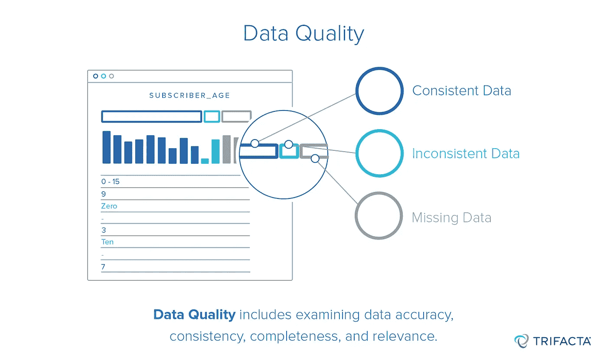
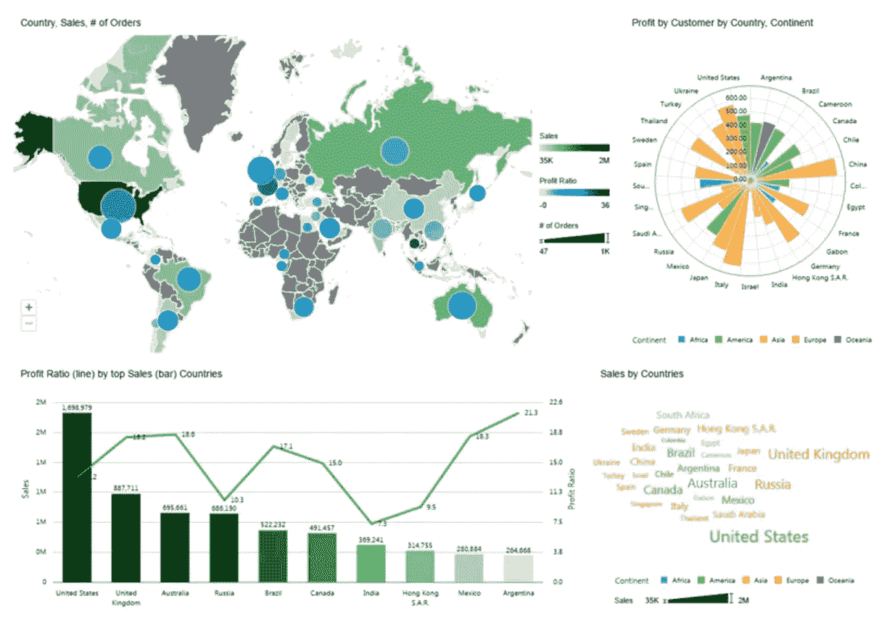

# 对数据质量的深入探究

> 原文：<https://towardsdatascience.com/a-deep-dive-into-data-quality-c1d1ee576046?source=collection_archive---------8----------------------->

# **简介:**

数据质量通常被视为处理数据的乏味组成部分。具有讽刺意味的是，通常是这个组件占据了我们大部分的时间。数据质量很可能是数据管道中最重要的组成部分，因为如果您的数据缺乏可信度和可靠性，从数据中生成的仪表板和分析将毫无用处。

数据质量面临的挑战是，没有清晰简单的公式来确定数据是否正确。就像一个没有淡水来源的池塘，数据会很快变得停滞不前。今天正确的数据，一个月后可能就不正确了。幸运的是，在验证数据质量时，有一些基本的技术和方法可以广泛应用。数据质量的一般主题是发现不满足特定需求的离群值和违反业务假设的记录集。

# **攻略:**

在处理移动数据时，可以将数据分为三个独立的层:ETL 层、业务层和报告层。ETL 层包含源系统和目标系统之间的数据接收和数据移动的代码(例如，从应用程序数据库到数据仓库)。业务层位于原始数据和最终数据模型之间。最后，报告层包含仪表板，业务用户可以从中查看和交互。在接下来的部分中，我们将介绍适用于每个数据层的技术。

下面的例子是用 Postgres SQL 做的。我将使用两个表，一个点击表和一个视图表。点击表表示关于点击网页上的链接的用户的数据。“视图”表表示访问过网页的用户的相关数据。

# ETL 层中的数据质量:

数据管道的第一层是 ETL 层。这一层的数据质量检查通常是相似的，与业务需求和不同的行业无关。这里的目标是检查以确保数据在从源系统移动到目标系统时不会丢失或降级。我们检查诸如行计数的差异(显示数据被错误地添加或丢失)、部分加载的数据集(通常有很高的空计数)和重复的记录。

# 使用 SQL 的示例:

**行数**

```
WITH
source_count as (Select count(*) as total_count from source) ,target_count as (Select count(*) as total_count from target)SELECT
   CASE WHEN 
     (select total_count from source_count) = (select total_count from target_count) 
    THEN True 
    ELSE False
END as valid_row_count
FROM 
  pipe_table_1
```

在上面的例子中，我们正在寻找一个场景，其中来自源和目标的计数不匹配。在大多数情况下，两个表中的行数应该保持一致。这是为了确保表之间发生的转换不会意外地更改行数。例如，应用程序上的用户数量应该与应用程序数据库和数据仓库相匹配。也存在行数预计会改变的情况。在这种情况下，目标应该是验证计数是否在预期范围内。另外，需要注意的是，这里使用了 [**通用表表达式**](https://www.essentialsql.com/introduction-common-table-expressions-ctes/) 来保持 SQL 语句的可读性。

**加入验证**

```
WITH join_count AS ( SELECT count(*) AS view_count FROM views LEFT JOIN clicks ON clicks.view_id = views.id)SELECTCASE 
     WHEN (SELECT view_count FROM join_count) = count(1) 
     THEN True
     ELSE False
END AS valid_joinFROMviews;
```

在上面的例子中，我们正在检查以确保左连接后的表的行数与原始表的行数相同。这是为了确保在任一表上都没有重复的键(这通常可以由数据库强制执行，但在使用派生表或视图时则不行)。同样，该约束并不总是正确的，因为某些连接预计会导致连接记录中的行增加或减少，在这种情况下，有必要了解值的预期范围。



Image from Trifacta

# 业务层的数据质量:

数据管道的下一层是业务逻辑层。通常，在将原始/部分转换的数据加载到数据仓库中的临时区域后，会应用该层中的数据质量检查。在通过这些检查并检查到无效行之前，您不希望将数据加载到最终目的地。这里的目标是确保不违反基本的业务理解，并且数据具有业务意义。

这些业务质量检查还充当辅助检查或安全措施，以确保数据已经从 ETL 层正确地引入到数据库中(因为在 ETL 层中验证每个数据质量度量可能是广泛的和不切实际的)。

业务层检查通常包括验证数值度量是否在业务需求定义的有效范围内。

```
SELECT 
   count(*), 
   yearFROM views aJOIN date b on a.date _id = b.date_idGROUP BY 1,2HAVING count(*) > [EXPECTED_RANGE];--------------------------------------------------------SELECT 
   count(*), 
   year, 
   monthFROM Views aJOIN date b on a.date _id = b.date_idGROUP BY 1 2,3HAVING count(*) > [EXPECTED_RANGE];
```

一种技术是观察给定度量或测量在不同时间段的变化。在本例中，我们查看不同年份以及不同月份的视图。

我们正试图识别用户浏览量的突然意外上升或下降。区分预期变化和意外变化也是必要的。在我们的例子中，我们关注的是电子商务网站的眼球，也称为用户视图。一个预期的趋势是，在假期期间，观看次数会增加。


—验证视图数量应始终大于点击数量

```
SELECT CASE WHEN count(a.num_view) >= count(b.num_clicks)
  THEN True 
  ELSE False
  END as click_validationFROMviews aLEFT JOIN clicks b ON b.click_id = a.click_id
```

另一种常见的业务验证是检查值是否遵循特定的边界或特定的业务规则。在我们的例子中，查看页面的用户数量应该总是大于或等于点击链接的用户数量(因为在首先查看页面之前不能点击链接)。由于这些检查严重依赖于业务约束，因此确保业务规则和假设在代码和/或元数据存储库中得到适当记录也很重要。

# 报告层的数据质量:

报告层是数据管道的最后一层。这是最终用户与您的数据进行交互的层。然而，仅仅因为这一层通常是管道的末端，并不意味着数据工程师和数据分析师不应该利用报告层来确保数据质量。

一个简单的技巧是绘制不同时间段(年、月、日)的数据点，并直观地检查异常值。直观地捕捉数据质量错误是很常见的，在验证检查中可能不容易捕捉到。



Sample Dashboard

报告层的另一个优秀用例是创建数据质量仪表板。您可以将多个数据质量检查结合在一起，并在将数据发送给主管/业务用户之前，每天将这些指标/图表发送给您。

# **结论:**

基本上，数据质量验证应该尽可能自动化。验证应该嵌入到数据管道代码中，但是要以一种允许毫不费力地改变它的方式。根据数据和验证的重要程度，您可能希望管道完全失败，或者标记问题，将记录移动到单独的拒绝区域，或者继续处理。

有一些工具，如 Trifacta，将有助于简化和自动化这些数据质量检查。现有的 ETL 工具，比如 Informatica，可能也已经内置了数据质量检查特性。然而，理解如何从头实现数据质量仍然很重要，以确保您实现的数据质量检查是有意义的。

在设计数据管道时，数据质量应该是一个对开发工作产生重大影响的驱动因素。数据工程师应该对他们的数据有一定的熟悉程度，以便能够改进和调试数据质量问题。值得注意的是，数据质量不应该是单个团队或个人的责任。在我看来，对工程师来说，像熟悉他们正在处理的数据一样熟悉代码是至关重要的。

本文概述了数据质量、监控数据质量的技术以及积极使用数据质量的策略。如前所述，数据质量是数据系统的重要组成部分。投入时间和资源来处理数据质量非常重要！数据质量应该和单元测试对于软件开发一样重要。