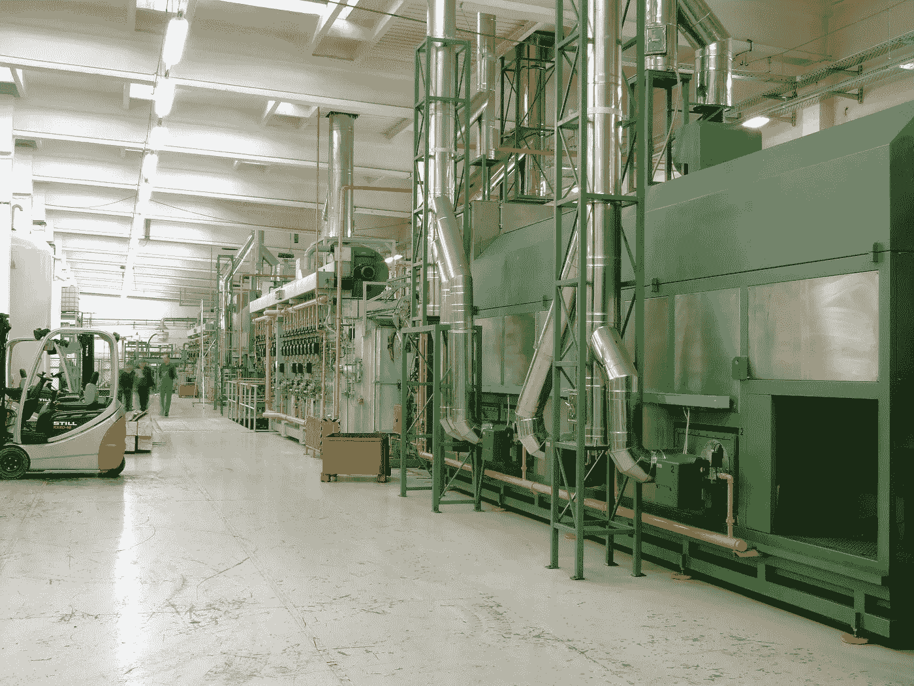
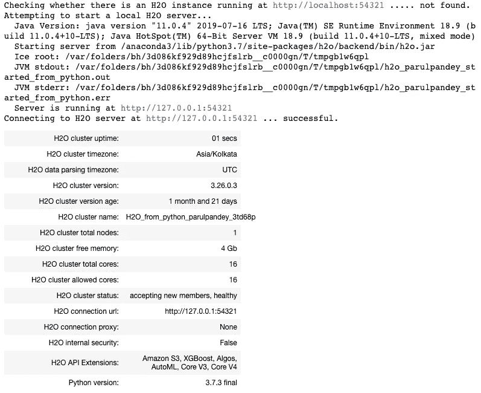

# 对 H2O 汽车的深入探究

> 原文：<https://towardsdatascience.com/a-deep-dive-into-h2os-automl-4b1fe51d3f3e?source=collection_archive---------6----------------------->

## H2O 汽车公司的自动机器学习概述


过去几年，对机器学习系统的需求激增。这主要是由于机器学习技术在广泛应用中的成功。AutoML 通过让来自不同背景的人使用机器学习模型来解决复杂的场景，从根本上改变了今天基于 ML 的解决方案的面貌。然而，即使有明确的迹象表明机器学习可以促进某些业务，今天许多公司仍在努力部署 ML 模型。

这是因为该行业缺乏经验丰富的数据科学家。在某种程度上，对机器学习专家的需求已经超过了供应。其次，大量的机器学习步骤需要的经验多于知识，尤其是在决定训练哪些模型以及如何评估它们的时候。如今，这种差距非常明显，人们正在努力解决这些问题。自动机器学习可能是这些障碍的答案，在本文中，我们将深入了解如何实现这一点。

# 自动机器学习:AutoML

**自动化机器学习** ( **AutoML** )是将机器学习应用于现实世界问题的端到端过程自动化的过程。AutoML 倾向于自动化 ML 管道中的最大数量的步骤——用最少的人力——而不损害模型的性能。


Aspects of Automated Machine Learning

自动化机器学习可以被认为是标准的机器学习过程，其中涉及一些步骤的自动化。AutoML 非常广泛地包括:

*   自动化数据准备的某些部分，如插补、标准化、特征选择等。
*   能够自动生成各种模型，如随机网格搜索、贝叶斯超参数优化等。
*   从所有生成的模型中获取最佳模型，这些模型大多数情况下是集成的，例如集成选择、堆叠等。

# H2O 的自动机器学习


[](https://www.h2o.ai/products/h2o/#overview)**是一个完全开源的、分布式内存中的机器学习平台，具有线性可扩展性。H2O 支持最广泛使用的统计&机器学习算法，包括梯度增强机器、广义线性模型、深度学习等等。**

****

**Features of H2O**

**H2O 还拥有业界领先的 AutoML 功能(在 H2O ≥3.14 版本中可用)，该功能可以自动构建大量模型，从而在数据科学家没有任何先验知识或工作的情况下找到“**最佳**”模型。H2O AutoML 可用于自动化机器学习工作流，包括在用户指定的时间限制内自动训练和调整许多模型。**

**H2O AutoML 的一些重要特征是:**

*   **尖端 ML 算法的开源、分布式(多核+多节点)实现。**
*   **高性能 Java 中核心算法的可用性。包括 R，Python，Scala，web GUI 中的 API。**

****

*   **将模型作为纯 Java 代码轻松部署到生产环境中。**
*   **无缝地在 Hadoop、Spark、AWS、您的笔记本电脑等上工作。**

## **是给谁的？**

**H2O 的 AutoML 对新手和高级用户来说都是有用的工具。它提供了一个简单的包装函数，可以执行大量与建模相关的任务，这些任务通常需要许多行代码。这实质上释放了时间来关注数据科学管道的其他方面，如数据预处理、特征工程和模型部署。**

****

## **AutoML 接口**

**H2O AutoML 有一个 R 和 Python 接口以及一个叫做 Flow 的 web GUI。H2O AutoML 界面设计为具有尽可能少的参数，因此用户所需要做的就是指向他们的数据集，识别响应列，并可选地指定时间约束或对训练的总模型数的限制。**

****

**H2O AutoML is available in R, Python, and a web GUI.**

## **[安装](http://docs.h2o.ai/h2o/latest-stable/h2o-docs/downloading.html#install-in-r)**

**H2O 提供了一个可以从 CRAN 安装的 **R 包**和一个可以从 PyPI 安装的 **Python 包**。在本文中，我们将只使用 Python 实现。此外，您可能想要查看[文档](http://docs.h2o.ai/h2o/latest-stable/h2o-docs/downloading.html)以了解完整的细节。**

****依赖关系:****

```
pip install requests
pip install tabulate
pip install "colorama>=0.3.8"
pip install future
```

*   **使用 pip 安装**

```
pip install h2o
```

**每个新的 python 会话都从初始化 Python 客户端和 H2O [集群](http://docs.h2o.ai/h2o/latest-stable/h2o-docs/glossary.html)之间的连接开始。**

# **H2O 汽车功能**

**H2O 的 AutoML 配备了以下功能:**

*   **必要的**数据预处理**功能(与所有 H2O 算法一样)。**
*   **训练一个 [**随机网格**](http://docs.h2o.ai/h2o/latest-stable/h2o-docs/grid-search.html) **的算法**如 GBMs、DNNs、GLMs 等。使用精心选择的超参数空间。**
*   **单个模型使用**交叉验证**进行调整。**
*   **两个 [**层叠合奏**](http://docs.h2o.ai/h2o/latest-stable/h2o-docs/data-science/stacked-ensembles.html) 受训。一个集成包含所有模型(针对模型性能进行优化)，另一个集成仅提供每个算法类/家族中性能最佳的模型(针对生产使用进行优化)。**
*   **返回所有型号的排序后的“**排行榜**”。**
*   **所有型号都可以轻松出口到**生产**。**

# **个案研究**

****使用机器学习预测库存管理中的材料延期交货****

****

**Image by [marcin049](https://pixabay.com/users/marcin049-46288/?utm_source=link-attribution&utm_medium=referral&utm_campaign=image&utm_content=186980) from [Pixabay](https://pixabay.com/?utm_source=link-attribution&utm_medium=referral&utm_campaign=image&utm_content=186980)**

**对于案例研究，我们将使用一个 [**产品延期交货**](https://www.researchgate.net/publication/319553365_Predicting_Material_Backorders_in_Inventory_Management_using_Machine_Learning) 数据集。这里的目标是在给定许多产品指标(如当前库存、运输时间、需求预测和以前的销售)的情况下，预测产品是否会处于延期交货状态。这是一个经典的二元分类问题。可以从这里访问数据集。**

****参考****

***R. B .森蒂斯峰、E. P .阿吉亚尔和 l .戈利亚特，“使用机器学习预测库存管理中的材料缺货”，第四届 IEEE 拉丁美洲计算智能大会，秘鲁阿雷基帕，2017 年。***

## **方法学**

**这个机器问题的基本概要如下。**

****

*   ****开始 H2O****

**我们从**导入**的 **h2o** Python 模块和`H2OAutoML`类开始。然后，初始化本地 H2O 集群。**

```
import h2o
from h2o.automl import H2OAutoML
h2o.init(max_mem_size='16G')
```

**这是一个本地的 H2O 集群。在执行单元时，一些信息将以表格的形式显示在屏幕上，其中包括节点数量、总内存、Python 版本等..此外，`h2o.init()`确保没有 H2O 的先前实例正在运行。**

****

**默认情况下，H2O 实例使用所有的内核和大约 25%的系统内存。但是，如果您希望为它分配固定的内存块，您可以在 init 函数中指定它。**

*   ****将数据加载到 H2O****

**让我们从本地 CSV 文件导入数据。该命令与`pandas.read_csv`非常相似，数据以[H2 of frame](http://docs.h2o.ai/h2o/latest-stable/h2o-py/docs/frame.html)的形式存储在内存中。**

```
data_path = "https://github.com/h2oai/h2o-tutorials/raw/master/h2o-world-2017/automl/data/product_backorders.csv"# Load data into H2O
df = h2o.import_file(data_path)
```

**让我们来看一部分数据。**

```
df.head()
```

****

**A sample of the dataset**

```
print(f'Size of training set: **{df.shape[0]}** rows and **{df.shape[1]}** columns')
-------------------------------------------------------------
Size of training set: 19053 rows and 23 columns
```

*   ****将数据集分为训练数据集和测试数据集****

```
splits = df.split_frame(ratios=[0.8],seed=1)
train = splits[0]
test = splits[1]
```

*   ****指定响应和预测变量****

**接下来，让我们确定**响应列** n，并将列名保存为 y。响应列名为“ **went_on_backorder** ，表示产品是否延期交货(二进制响应)。我们还将删除`sku`列，因为它是一个唯一的标识符，不应该包含在预测列集中，预测列存储在一个名为 x 的列表中。**

```
y = "went_on_backorder" 
x = df.columns 
x.remove(y) 
x.remove("sku")
```

*   ****运行 AutoML****

**运行 AutoML，120 秒后停止。`max_runtime_secs`参数提供了一种按时间限制 AutoML 运行的方法。**

```
aml = H2OAutoML(max_runtime_secs=120, seed=1)
aml.train(x=x,y=y, training_frame=train)
```

****所需停止参数****

**有两种停止策略(基于时间或模型数量)，必须指定其中一种。如果设置了这两个选项，AutoML 运行将在达到其中一个限制时立即停止。**

*   **[**max _ runtime _ secs**](http://docs.h2o.ai/h2o/latest-stable/h2o-docs/data-science/algo-params/max_runtime_secs.html):此参数控制 AutoML 在训练最终堆叠集合模型之前最多运行多长时间。默认为 3600 秒(1 小时)。**
*   **[**max_models**](http://docs.h2o.ai/h2o/latest-stable/h2o-docs/data-science/algo-params/max_models.html) :指定 AutoML 运行中要构建的模型的最大数量，不包括堆叠整体模型。默认为`NULL/None`。**

**还有几个可选参数可以设置，例如:**

**nfolds、balance_classes、class_sampling_factors、max_after_balance_size、max_runtime_secs_per_model、stopping_metric 等。你可以在[文档](http://docs.h2o.ai/h2o/latest-stable/h2o-docs/automl.html)中读到更多关于它们的内容。**

## **排行榜**

**接下来，我们可以查看 AutoML 排行榜。AutoML 对象包括在该过程中训练的模型的“排行榜”，包括 5 重交叉验证的模型性能(默认)。**

**每个机器学习任务的默认性能指标(二元分类、多类分类、回归)在内部指定，排行榜将按该指标排序。**

```
lb = aml.leaderboard
lb.head()
```

****

**排行榜显示了 AutoML 构建的前 10 个模型及其参数。最佳模型是一个堆叠集合(放置在顶部)，并存储为`aml.leader.`**

****系综探索****

**为了理解集合是如何工作的，让我们看一看堆叠集合“所有模型”模型的内部。“所有模型”集合是 AutoML 运行中所有单个模型的集合。这通常是排行榜上表现最好的型号。**

```
*# Get model ids for all models in the AutoML Leaderboard*
model_ids = list(aml.leaderboard['model_id'].as_data_frame().iloc[:,0])*# Get the "All Models" Stacked Ensemble model*
se = h2o.get_model([mid for mid **in** model_ids if "StackedEnsemble_AllModels" **in** mid][0])*# Get the Stacked Ensemble metalearner model*
metalearner = h2o.get_model(se.metalearner()['name'])
```

**检查集合中 metalearner(合并器)算法的可变重要性。这向我们展示了每个基础学习者对整体的贡献。**

```
%matplotlib inline
metalearner.std_coef_plot()
```

****

**Plotting the base learner contributions to the ensemble.**

****使用 Leader 模型预测****

```
pred = aml.predict(test)
pred.head()
```

****拯救领袖模式****

**您还可以保存并下载您的模型，并将其用于部署到生产环境中。**

```
h2o.save_model(aml.leader, path="./product_backorders_model_bin")
```

# **结论**

**从本质上来说，AutoML 的目的是自动化重复的任务，如管道创建和超参数调整，以便数据科学家可以将更多的时间花在手头的业务问题上。AutoML 还旨在让每一个人都能使用这项技术，而不是少数人。AutoML 和数据科学家可以协同工作来加速 ML 过程，以便可以利用机器学习的真正有效性。**

**[*原发表于 H2O.ai*](https://www.h2o.ai/blog/a-deep-dive-into-h2os-automl/)**