# 对深度学习的深刻直觉

> 原文：<https://towardsdatascience.com/a-deep-intuition-to-deep-learning-8f7220cd6579?source=collection_archive---------26----------------------->

想知道深度学习为什么有效？这是背后的直觉。

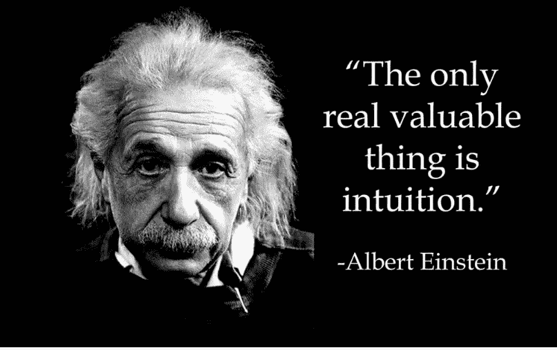

这个博客的灵感完全来自 IIT 马德拉斯的米特什·哈普拉教授的讲座。这是相当长的，如果你想浏览只是得到一个要点，请随意跳过感知器，并转移到乙状结肠神经元。

# 深度学习背后的动机

考虑一个预测用户是否会喜欢特定电影的例子。影响决定的一些因素有——类型、导演、剧本、收视率等等。一般来说，机器学习或深度学习问题的结构是，你有一个要预测的目标变量，以及一组影响目标的因素。因此，有了关于因素和目标的可用历史数据的知识，模型必须预测给定因素的未来目标。

**“深度学习是将目标变量作为影响输入特征/变量的函数进行学习的过程。”**

事实上，机器学习也做了与上述定义相同的事情。然而，当涉及到现实世界问题的复杂性时，机器学习(ML)的学习能力是有限的。不要责怪 ML，因为它本身并不是“精心制作”来学习这些复杂性的。

深度学习恰恰相反，它是为了从数据中学习复杂的功能而设计的。对于复函数，我的意思是在特征和目标之间的关系中存在的非线性。让我们看看为什么一个神经网络有足够的能力在我们进行的过程中学习这些复杂性。

# 感知器——神经网络的基本元素

神经网络由大量连接在一起作为网络的感知器组成。感知器是一种二进制分类算法，它学习分隔两个类的线。感知器的基本原理如下—

*   如果输入/特征的“加权”和大于 0，则预测类别 1，否则预测类别 0。下面显示的是一个感知器，它将连续值特征作为输入，并给出二进制输出。

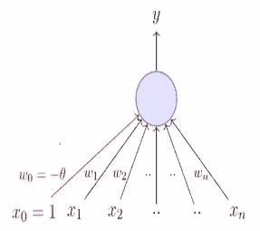

A perceptron where x denotes input features and w denotes weights

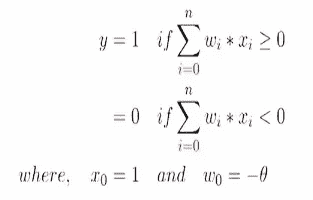

Definition of perceptron

*   请从上图中注意，我们的感知器在 x*w 方程中还包含了一个常数项(用红色标注)，叫做“偏差”。
*   使用训练数据，在我们知道类别标签的情况下，学习每个特征的“权重”。
*   权重通过构造目标函数来学习，例如-(y * x * w)。如果你观察，只有当 y 和 x*w 的符号相同时，这个函数才会> 0。即仅当函数 x*w 正确预测目标时。我们需要找到能给出最多正确预测的“w”向量。
*   现在应该很清楚，目标函数应该是所有点的 y*x*w 之和的负数，我们需要最小化它。既然我们有了目标函数，随机梯度下降将用于学习权重向量。

我将把感知器留在那里，如果你对此有粗略的想法，这很好。你需要知道，如果输入的加权和大于 0，那么感知器“触发”(预测类 1)，否则它“不触发”(预测类 0)。

现在，考虑引言中的电影例子。假设我们只有一个特征——评论家评分，来决定我们是否喜欢一部电影，还假设这个特征的权重是 1，偏差是-0.5。如果评论家评分是 0.49，感知器将预测 0，如果评论家评分是 0.51，感知器将预测 1。

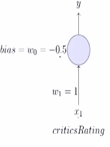

Example of a harsh judgment

现实世界中人的大脑是这样工作的吗？不。这就是为什么我们有“乙状结肠神经元”。

# 乙状结肠神经元

以下是感知器决策边界和 sigmoid 边界的可视化表示。

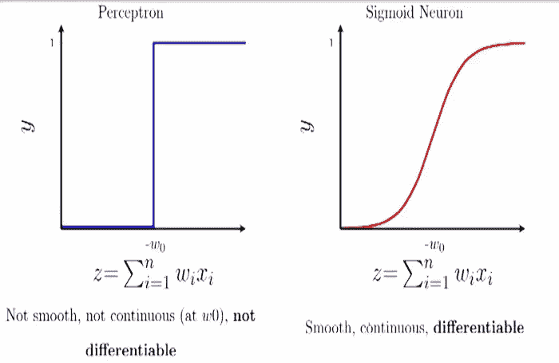

Sigmoid 比感知器更平滑，不那么刺耳，更自然。它由下面的等式给出。

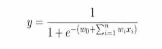

Sigmoid function

sigmoid 函数的输出范围在 0 和 1 之间。这是一种相当合理的分类方法，因为你可以把它看作概率值。现在，我们有足够的知识来深入研究深度学习为什么有效。

# 深度学习为什么有效？

回想一下，我们正试图将目标变量作为输入变量的函数来学习。我来介绍一些术语。

*   目标变量—“y”
*   输入特征向量“x”
*   “x”和“y”的真实关系——“f(x)”

1989 年，一个被称为“普遍逼近定理”的非常强大的定理被一位科学家发表并向世界证明。这个定理如下

**“具有单个隐藏层的多层神经元网络可用于以任何期望的精度逼近任何连续函数”**

换句话说，对于一个真实的函数 f(x)，有一个神经网络存在，它有一个任意数量神经元的隐藏层，其输出“g(x)”是这样的|f(x)-g(x)|

为什么我们会关心这个定理呢？因为我们的首要目标是知道一个神经元网络是否可以学习任意函数 f(x)。例如，让我们以下面的函数为例。

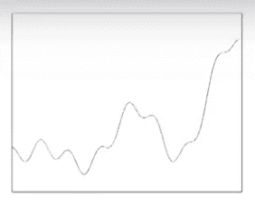

True function we want our network to learn

你能想出一个自然的方法来近似这个函数吗？可以说，它可以近似为一系列矩形塔状杆，如下所示。

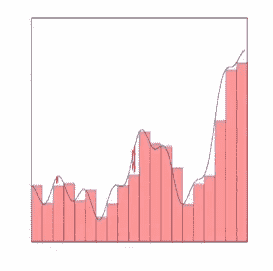

approximation of the true function

那么，如果我们可以学习这些矩形条中的每一个，并将它们全部相加，我们不就可以逼近真实函数了吗？每个条的高度不同，否则它们都是矩形条。视觉示例如下所示。

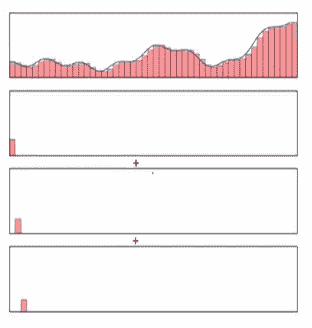

Sum of rectangular bars can approximate true function

所以，我们的工作现在缩小到学习每一个酒吧/塔。下面的图像代表了我们对这些塔的神经网络的想法。

Sum of towers = approximation of true function

关于神经网络的酷想法是，通过使用 sigmoid 神经元，可以学习如上所示的单个造塔者。怎么会？？？？在探索如何之前，我们需要知道 sigmoid 的两个性质。

*   sigmoid 函数中“S”曲线的斜率受“w”向量的影响，权重越高，斜率越陡。

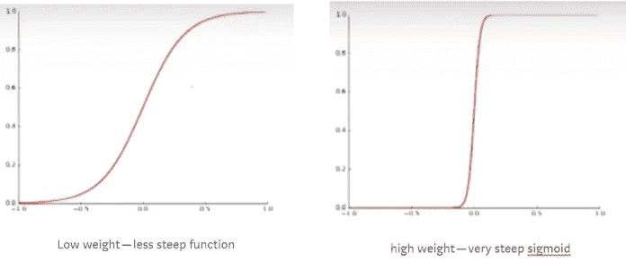

*   x 轴上 s 形曲线的位置受偏置项的影响。

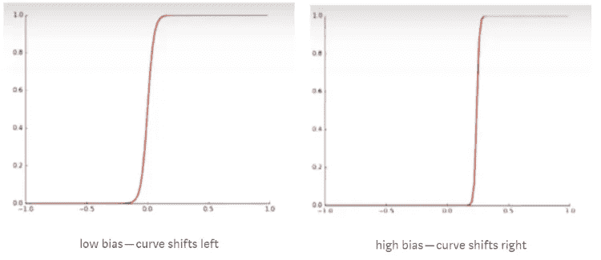

如果以上两个 sigmoids 相减会怎么样？是的，你猜对了——我们将得到矩形条别名塔函数。

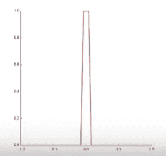

Tower function

万岁！！因此，现在证明了我们可以使用 sigmoid 神经元构建塔函数——塔函数的高度和形状受权重和偏差的影响。这个定理可以用数学方法投影到多个维度，尽管在上面的图表中，我们只可视化了一个输入维度。

# 神经网络体系结构的最后一瞥

根据上述定理和证明，我们看到许多层相连的乙状结肠神经元可以为我们带来神奇的效果。针对特定问题要调整的参数是层数和每层的神经元数量。最后，一个简单的前馈神经网络如下所示。

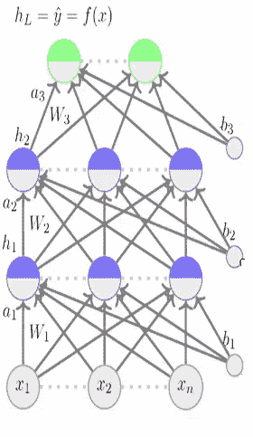

Feed forward neural network

*   前馈神经网络是如上所示的神经元的堆叠。
*   第一个红色图层是输入图层-x1、x2 和 x3 是构成单个数据点的三个要素。
*   所有蓝色神经元层称为隐藏层，绿色层称为输出层。
*   在每一个神经元中，计算是这样进行的—

> g(偏差+(权重*对神经元的输入))

*   “g”函数可以是任何函数——sigmoid、tanh、relu 等。这称为激活函数，它会在网络中引入非线性。
*   最终的绿色输出层由和类一样多的神经元组成。如果我有两个目标类，那么最后我会有两个神经元。
*   使用 sigmoid 函数作为最后一层中的激活函数是有意义的，因为它给出了范围从 0 到 1 的值，这些值可以被解释为概率。
*   一旦我们学会了正确的权重和偏好，我们就完成了。

学习正确的权重和偏差的动机是什么？你可能已经猜到了，这是目标函数。我们总是被目标函数所驱使，目标函数是我们需要最小化的损失函数，以便学习真实函数的近似。

最常用的损失函数是均方误差。

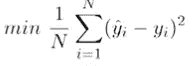

Loss function

因此，我们想要找到权重和偏差，使得上述损失函数最小化。我们知道真正的标签，我们也知道我们网络的结果是权重和偏差的函数。因此，我们应该能够通过使用上述公式来测量损失，并对我们的权重进行迭代修正。这个想法是，我们从随机权重和偏差开始，通过测量每一步的损失来迭代地修正它们。我们怎么做呢？对于这个问题，随机梯度下降很方便。我强烈推荐你阅读我之前关于 [SGD](/stochastic-gradient-descent-clearly-explained-53d239905d31) 的博客，以充分理解它在这里的作用。我们遍历损失函数，找到权重和偏差，使得损失函数最小化。这个过程在神经网络中被称为“反向传播”。是的，有了这个，我们就理解了神经网络为什么以及如何能够解决我们许多复杂的问题。

# 结论

虽然这是一篇冗长的博客，但我希望这有助于正确看待深度学习的某些奥秘。我仍然会建议你继续看你选择的大学的著名神经网络讲座。我个人推荐 Mitesh Khapra 教授的[讲座](https://nptel.ac.in/courses/106106184/)，他在讲座中讲述了神经网络中一切事物背后的直觉。我已经尽力从他的演讲中总结出基本的概念。如果有什么不太清楚的，请在评论中告诉我，我会继续编辑博客，直到它有凝聚力。