# 对剩余学习的深入探究

> 原文：<https://towardsdatascience.com/a-deeper-dive-into-residual-learning-d92e0aaa8b32?source=collection_archive---------21----------------------->

## 探索在剩余学习领域取得的最显著的进步

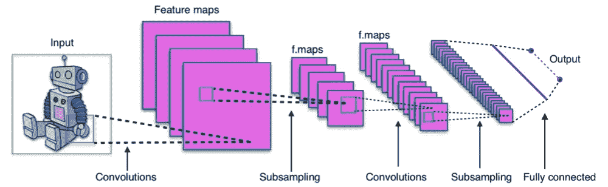

A traditional convolution network (Image: Courtesy of PACKT Publication)

在计算机视觉领域，深度学习随着 DCNNs 或深度卷积神经网络的引入而取得了长足的进步。随着强大 GPU 的出现，深度网络正在成为常态。但是，这些网络都存在 [***消失梯度***](https://en.wikipedia.org/wiki/Vanishing_gradient_problem) 的问题。为了克服这一点，何等人在 2015 年引入了 [***残差学习***](https://arxiv.org/abs/1512.03385) 的概念，其中作者使用 ***残差单元*** 作为网络的积木块。在这篇文章中，我们仔细研究了前面提到的剩余单元以及它到目前为止所经历的修改。

在他们的论文中，何等人讨论了用大量堆叠网络训练网络的问题，其中网络停止训练，并且随着网络深度的增加，其精度随着训练损失的增加而饱和。这种困境并不像许多人认为的那样是过度拟合的结果。相反，这是因为误差的梯度在 ***反向传播*** 期间变得几乎为零，从而在通过 SGD(随机梯度下降)过程训练网络时阻碍了训练。

让我们假设一个如上所示的传统卷积网络，两层之间的正向传播可以定义为:

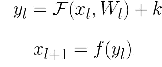

这里， *x(l)* 和 *x(l+1)* 是卷积层 *l* 的输入和输出特征。卷积运算由 *F* 定义，并且 *k* 是偏置项。最后，激活操作由 *f* 表示。现在，我们可以将项 *x(l+1)* 写成:

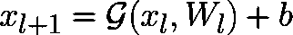

上面，我们认为 *G* 是函数 *F* 和 *f* 的组合。我们可以递归地将层 *L* 的输出定义为:

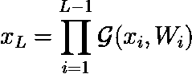

现在，在反向传播期间，较深层的误差梯度 *L* 被传播到较浅层，这样，在每个较浅层获得的梯度变得越来越小，直到它完全消失。对所述问题的解决方案由何等人提出，通过引入如下所示的*。*

*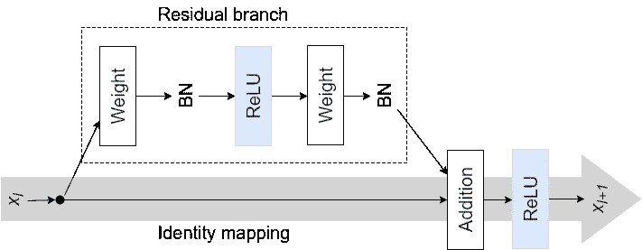*

*Fig. 1: Original residual unit proposed by K. He et al.*

*在何等人提出的网络的情况下，剩余单元 *l* 的输入和输出可以表示为:*

*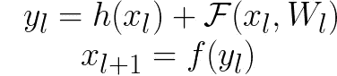*

*上式中 *h(x(l))* 表示恒等式映射， *F* 表示 ***剩余函数*** ，因此可以写成 *h(x(l)) = x(l)* 。这定义了 *ResNet* 架构的基础。下面给出了上述剩余单元的 **Keras** 实现:*

*在上面的实现中，我们没有给出 ResNet 架构中使用的剩余单元的精确实现。当处理非常深的架构时，使用这种类型的剩余架构的优点是错误有一条 ***捷径*** 可以通过。使用这些剩余单元构建的基本模型如下所示:*

*对此类剩余单元的改进由何等人于 2016 年在文章《深度剩余网络中的[恒等映射](https://arxiv.org/abs/1603.05027)中提出，作者认为 *f* 是一个 ***恒等函数，*** 则 *x(l+1) = y(l)* 。因此，上面的等式变成:*

*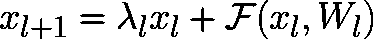*

*现在，如果我们考虑一个由剩余单元堆叠而成的深度网络，那么深度单元 *L* 的输出可以表示为深度单元 *l* :*

*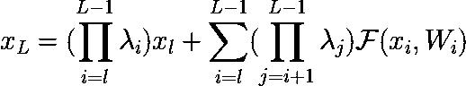*

*因此，对于任何较深的单元 *L，*，我们有在 *L* 之前的较浅单元的剩余函数加上较浅单元 *l* 本身缩放到特定级别，即某个标量λ的总和。这与 ***平面网络*** (其中不存在身份映射)相反，其中在层 L 的特征输出是如前所述的一系列矩阵向量乘积。上述等式可以简化为:*

*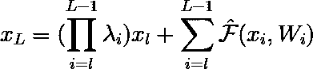*

*如前所述，在反向传播期间，在单元 *L* 获得的误差梯度被传递到单元 *L-1* 上，单元*L-1*又将其接收到的误差梯度传递到单元 *L-2* 上。残差单元的上述变化具有一些独特的反向传播特性，如下所示:*

*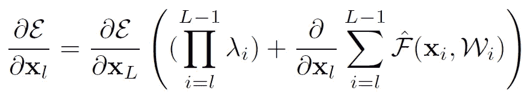*

*上面我们看到了从一个较浅的单元 *l* 获得的误差梯度。对于具有非常深的结构的网络，λ对于避免误差梯度的消失是至关重要的。正如我们在上面的等式中看到的，如果 *L* 非常大并且 *λ > 1* ，那么误差梯度变得指数级大，否则如果 *λ < 1* 那么误差变得无穷小。因此， *λ=1* 是最优选择。*

*现在，正如已经提到的，当且仅当在上面的等式中 *x(l+1) = y(l)* 时，这个等式才有效。因此，我们必须考虑剩余分支中的层是完全预激活的*。下面，我们看到作者提出的完全预激活。**

**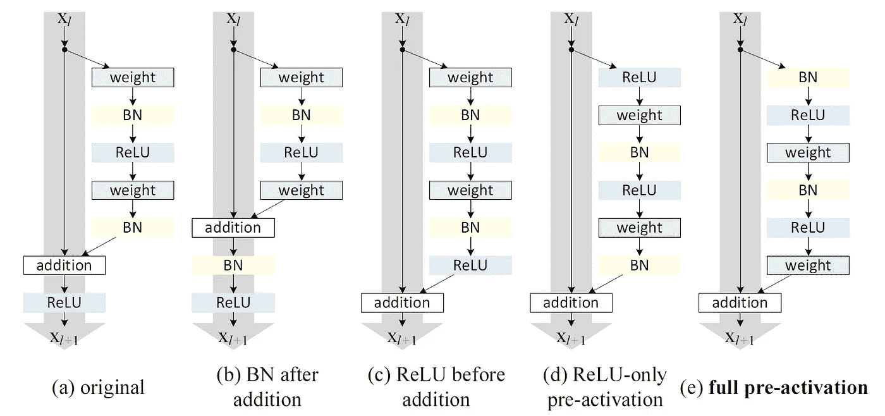**

**对于每个变体的性能的完整细节，我强烈建议跟进何等人的原始文章“**中的身份映射”。下面显示了所提出的剩余单元的完全预激活变体的一个 **Keras** 实现。****

****我强烈建议在处理更深层次的网络时使用剩余学习。一个好的做法是在训练时记录网络饱和时的损耗。如果在向现有网络添加新层时观察到损耗急剧增加和精度下降，这可能是由 ***消失梯度*** 现象引起的。****

****感谢您阅读这篇文章。请给出您的反馈，并随时跟进我的问题，我很乐意帮忙！****