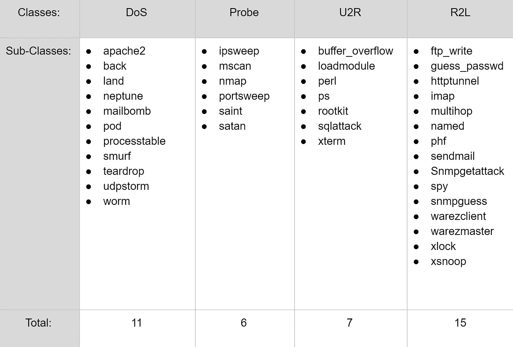
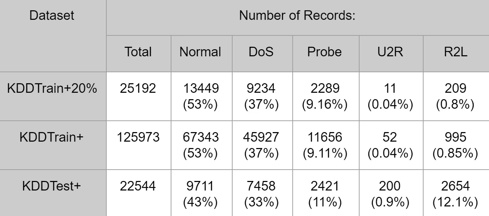
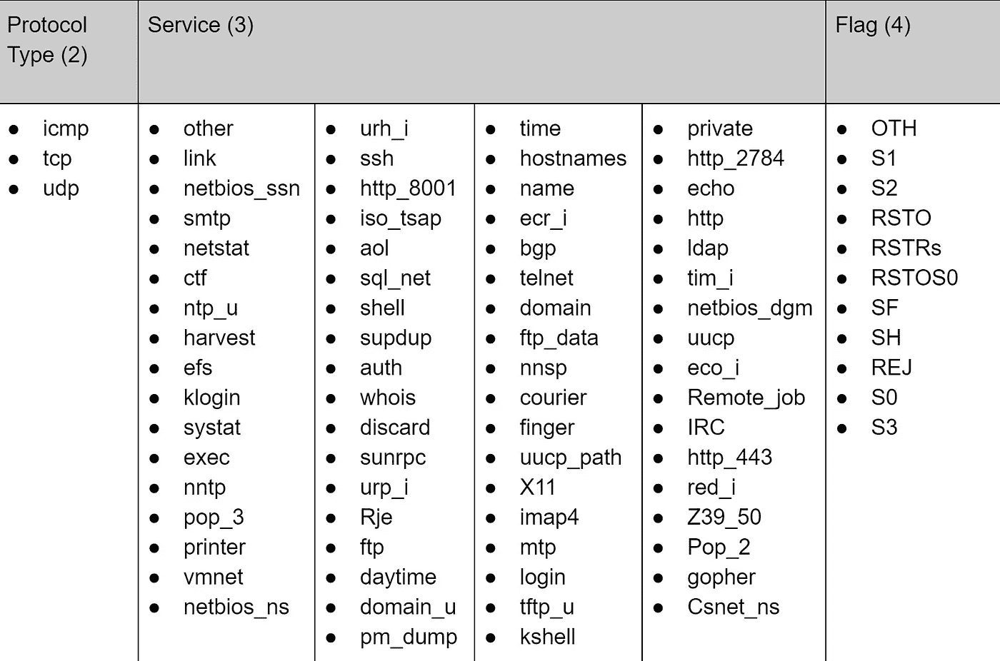
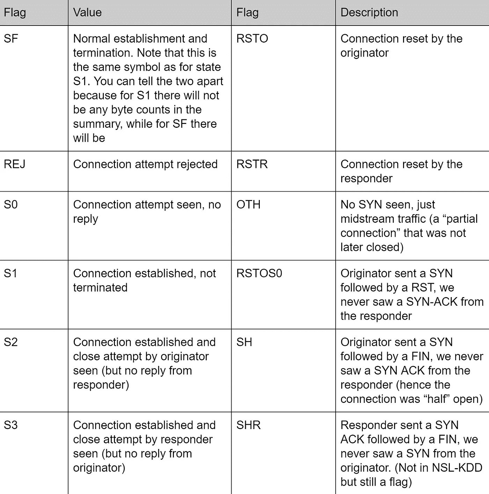

# 对 NSL-KDD 数据集的深入研究

> 原文：<https://towardsdatascience.com/a-deeper-dive-into-the-nsl-kdd-data-set-15c753364657?source=collection_archive---------3----------------------->

您是否曾经想过，您的计算机/网络如何能够避免感染来自互联网的恶意软件和不良流量输入？它之所以能检测得这么好，是因为有适当的系统来保护您的计算机或网络中保存的有价值的信息。这些检测恶意流量输入的系统被称为入侵检测系统(IDS)，并接受互联网流量记录数据的训练。最常见的数据集是 NSL-KDD，是现代互联网流量的基准。

NSL-KDD 的数据集并不是第一个。KDD 杯是一场国际性的知识发现和数据挖掘工具竞赛。1999 年，举办了这项比赛，目的是收集交通记录。竞赛任务是建立一个网络入侵检测器，一个能够区分“坏”连接(称为入侵或攻击)和“好”正常连接的预测模型。作为这场比赛的结果，大量的互联网流量记录被收集并捆绑到一个名为“KDD 99”的数据集，并由此产生了 NSL-KDD 数据集，作为新不伦瑞克大学 KDD 99 的修订和清理版本。

该数据集由四个子数据集组成:KDDTest+，KDDTest-21，KDDTrain+，KDDTrain+_ 20 %,尽管 KDDTest-21 和 KDD train+_ 20%是 KDD train+和 KDDTest+的子集。从现在开始，KDDTrain+将被称为 Train，KDDTest+将被称为 Test。KDDTest-21 是测试的子集，没有最困难的交通记录(得分为 21)，KDDTrain+_20Percent 是 Train 的子集，其记录数占整个训练数据集的 20%。也就是说，KDDTest-21 和 KDD train+_ 20%中存在的流量记录已经分别在测试和训练中，并且不是任何一个数据集中的新记录。

这些数据集包含简单入侵检测网络看到的互联网流量的记录，是真实入侵检测系统遇到的流量的幻影，只留下其存在的痕迹。数据集每条记录包含 43 个特征，其中 41 个特征指的是流量输入本身，最后两个是标签(是正常还是攻击)和分数(流量输入本身的严重性)。

在数据集内存在 4 种不同的攻击类别:拒绝服务(DoS)、探测、用户到根(U2R)和远程到本地(R2L)。每个攻击的简要描述如下:

*   DoS 是一种试图切断进出目标系统的流量的攻击。IDS 被异常流量淹没，系统无法处理，于是关闭以保护自己。这将阻止正常流量访问网络。这方面的一个例子可能是一家在线零售商在大减价的一天收到大量在线订单，由于网络无法处理所有请求，它将关闭，阻止付费客户购买任何东西。这是数据集中最常见的攻击。
*   探测或监视是一种试图从网络获取信息的攻击。这里的目标是像小偷一样窃取重要信息，无论是客户的个人信息还是银行信息。
*   U2R 是一种攻击，它从普通用户帐户开始，试图以超级用户(root)的身份访问系统或网络。攻击者试图利用系统中的漏洞来获得根用户权限/访问权。
*   R2L 是一种试图获得远程机器本地访问权限的攻击。攻击者无法在本地访问系统/网络，并试图“侵入”网络。

从上面的描述中可以注意到，DoS 的行为与其他三种攻击不同，在其他三种攻击中，DoS 试图关闭系统以完全阻止通信流，而其他三种攻击则试图悄悄渗透系统而不被发现。

下表显示了数据集中存在的每个攻击的不同子类的细分:

虽然这些攻击存在于数据集中，但分布严重倾斜。记录分布的细目见下表。从本质上讲，每个数据集中超过一半的记录都是正常流量，U2R 和 R2L 的分布非常低。虽然这一数字很低，但这是现代互联网流量攻击分布的准确表示，其中最常见的攻击是 DoS，U2R 和 R2L 很少出现。

流量记录中的特征提供了与 IDS 输入的流量相遇有关的信息，并且可以分为四类:内在的、内容的、基于主机的和基于时间的。以下是不同类别功能的描述:

*   内在特征可以从分组的报头中导出，而无需查看有效载荷本身，并且保存关于分组的基本信息。此类别包含功能 1–9。
*   内容特征保存关于原始分组的信息，因为它们是以多个片段而不是一个片段发送的。有了这些信息，系统就可以访问有效负载。此类别包含功能 10–22。
*   基于时间的功能保存对两秒钟窗口内的流量输入的分析，并包含诸如它尝试与同一主机建立多少连接之类的信息。这些特征主要是计数和速率，而不是关于流量输入内容的信息。此类别包含功能 23–31。
*   基于主机的功能类似于基于时间的功能，只是它不是在 2 秒的窗口内进行分析，而是在一系列连接上进行分析(在 x 数量的连接上向同一主机发出了多少请求)。这些功能旨在应对持续时间超过两秒钟的攻击。此类别包含功能 32–41。

该数据集中的特征类型可分为 4 种类型:

*   4 分类(特征:2，3，4，42)
*   6 二进制(功能:7，12，14，20，21，22)
*   23 个独立的(功能:8、9、15、23–41、43)
*   10 连续(功能:1，5，6，10，11，13，16，17，18，19)

下表列出了分类特征的可能值。有 3 个可能的*协议类型*值、60 个可能的*服务*值和 11 个可能的*标志*值。

不像*协议类型*和*服务*的值是自明的(这些值描述了连接)，*标志*不是很好理解。*标志*功能描述连接的状态，以及是否出现标志。*标志*中的每个值代表一个连接的状态，每个值的解释见下表。

在谷歌电子表格[这里](https://docs.google.com/spreadsheets/d/1oAx320Vo9Z6HrBrL6BcfLH6sh2zIk9EKCv2OlaMGmwY/edit?usp=sharing)可以看到每个功能的描述和数据集的分类。