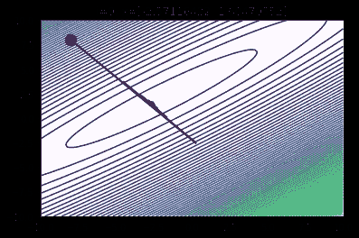
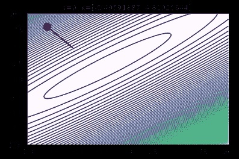
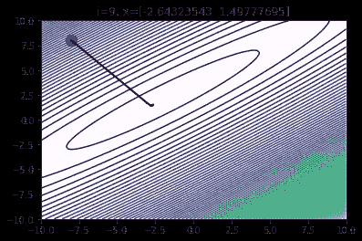
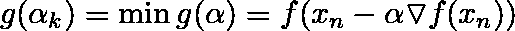
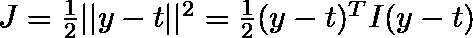
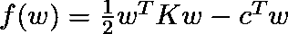
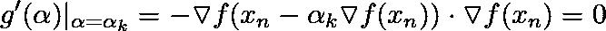
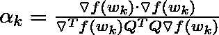
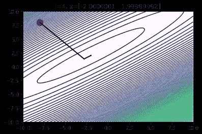

# 深入了解下降算法

> 原文：<https://towardsdatascience.com/a-deeper-look-at-descent-algorithms-13340b82db49?source=collection_archive---------21----------------------->

## 不同下降算法的概述和比较


Photo by [Katerina Kerdi](https://unsplash.com/@katekerdi?utm_source=medium&utm_medium=referral) on [Unsplash](https://unsplash.com?utm_source=medium&utm_medium=referral)

# 理解本文的核心要求

*   线性代数
*   多变量微积分
*   凸函数的基本思想

众所周知，优化是机器学习中最重要的因素之一。因此，我们感兴趣的是找到一种在合理的时间内优化函数的算法。今天最常用的算法之一是梯度下降。今天我们就来看看其他的优化算法，对它们有一个理论上的了解。
本文将讨论的核心算法有:

*   牛顿方法
*   最陡下降
*   梯度下降

你可以从教材[凸优化:第三部分](https://web.stanford.edu/~boyd/cvxbook/bv_cvxbook.pdf#page=469)中了解更多关于这些算法的知识。在本文中，我们将主要关注二次/多项式函数

# 对我们的功能所做的假设

我们总是假设我们所处理的函数及其导数是连续的(即 ***f ∈ C*** )。在牛顿法的情况下，我们还需要假设二阶导数是连续的。(即 ***f ∈ C*** )。我们做的最后一个假设是，我们试图最小化的函数是凸的。因此，如果我们的算法收敛到一个点(通常称为局部最小值)，那么我们保证它是一个全局优化器。

# 牛顿方法

## 单变量函数的算法

```
x_n = starting point
x_n1 = x_n - (f'(x_n)/f''(x_n))
while (f(x_n) != f(x_n1)):
  x_n = x_n1 
  x_n1 = x_n - (f'(x_n)/f''(x_n))
```

牛顿方法背后的思想是被最小化的函数 *f* 由二次函数局部逼近。然后我们找到那个二次函数的精确最小值，并把下一个点设为那个。然后我们重复这个过程。

# 多元函数的情况

到目前为止，看起来牛顿的方法是一个可靠的候选方法。但通常情况下，我们不会处理很多单变量函数。大多数时候，我们将需要优化有很多参数的函数(例如，ℝn).函数这是多变量情况下的算法:

假设 x∈ ℝn，我们有:

```
x_n = starting_point
x_n1 = x_n - inverse(hessian_matrix) (gradient(x_n))while (f(x_n) != f(x_n1)):
  x_n = x_n1
  x_n1 = x_n - inverse(hessian_matrix) (gradient(x_n))
```

其中`gradient(x_n)`是在`x_n`的梯度向量，`hessian_matrix`是一个 n×n hessian 对称矩阵，其元素由在`x_n`的二阶导数组成。
众所周知，求一个矩阵的逆矩阵代价很高(****O*(n)**)，因此这种方法并不常用。*

# *梯度下降*

*这是迄今为止机器学习和其他近似优化中使用的最流行的优化方法。这是一种算法，涉及到在每次迭代中在梯度方向上迈出一步。它还包括一个常数α，它决定了每次迭代中要采取的步长。算法是这样的:*

```
*alpha = small_constant
x_n = starting_point
x_n1 = x_n - alpha * gradient(x_n)while (f(x_n) != f(x_n1)): # May take a long time to converge
  x_n = x_n1
  x_n1 = x_n - alpha * gradient(x_n)*
```

*这里，alpha 是一个值，你必须在每次迭代中选择它来更新`x_n`(这被称为超参数)。我们将分析我们选择的α值*

*如果我们为 alpha 选择一个大的值，我们将会超出优化点。其实选的太大就可以发散。*

**

*Gradient Descent after 10 iterations with an alpha value that is too large.*

*另一方面，如果我们选择α很小，那么将需要很多次迭代才能收敛到最优值。随着越来越接近最佳值，梯度趋于零。因此，如果你的阿尔法值太小，那么它可能会永远收敛到最小点。*

**

*Gradient Descent after 10 iterations with an alpha value that is too small.*

*因此，如你所见，你有责任为α选择一个好的常数。然而，如果您选择了一个好的 alpha，那么您可以在每次迭代中节省很多时间*

**

*Gradient Descent after 10 iterations with an alpha value that is good enough.*

# *最陡下降*

*最速下降非常类似于梯度下降，只是它更严格，因为每次迭代中采取的步骤都保证是最佳步骤。算法是这样工作的:*

```
*x_n = starting_point
alpha_k = get_optimizer(f(x_n - alpha * gradient(x_n)))
x_n1 = x_n - alpha_n * gradient(x_n)while (f(x_n) != f(x_n1)):
  x_n = x_n1 
  alpha_k = get_optimizer(f(x_n - alpha * gradient(x_n)))
  x_n1 = x_n - alpha_n * gradient(x_n)*
```

*其中`x_n`和`x_n1`是ℝn 的输入向量，`gradient`是 ***f*** 在`x_n`处的梯度，`alpha_k`为:*

**

*因此，在优化我们的原始函数时，我们需要在每次迭代中优化一个内部函数。好消息是，这个函数是一个单变量函数，这意味着它并不复杂(例如，我们可以在这里使用牛顿法)。然而，在大多数情况下，在每一步都优化这样一个函数确实有点昂贵。*

## *二次函数的一个特例*

*考虑*平方误差损失函数*:*

**

*其中 ***I*** 为单位矩阵 ***y=Qw+b***
为简单起见，我们只考虑寻找权重 w 的最优值(假设 b 为常数)。通过代入 y 并简化一切，我们得到如下结果:*

**

*回头看一下 *g(α)* ，我们知道如果我们在 ***αk*** 取梯度，由于是极小值，所以应该是 0。利用这一点，我们有以下优势:*

**

*简化上面的混乱，代入两点处的 ***f*** 的梯度，我们得到αk 如下*

**

*现在，在二次函数的情况下，我们有了αk 的具体值。*

## *二次函数的收敛性分析*

*以ℝ的二次函数为例，最速下降通常会在不到十步的时间内非常接近最优值。*

**

*Steepest descent in 2 dimensions after 4 iterations.*

*在上图中，请注意方向的变化在每次迭代中都是垂直的。经过 3 到 4 次迭代后，我们注意到导数的变化几乎可以忽略不计。*

## *为什么不用最速下降法？*

*那么为什么这种算法不经常使用呢？很明显，它不再需要超参数来调整，并且保证收敛到局部最小值。这里的问题是，在每次迭代中，我们需要优化 alpha_k，考虑到我们必须在每一步都这样做，这有点昂贵。*

*例如，在二次函数的情况下，我们必须在每次迭代中计算多个矩阵乘法和向量点积。相比之下，梯度下降，在每一步，我们只需要计算导数，并更新新的价值，这是更便宜的方式。最速下降法在非二次函数的情况下也很难推广，在这种情况下，α_ k 可能没有具体值*

# *梯度下降法和最速下降法的比较*

*我们将对梯度下降和最速下降进行比较，并分析它们的时间复杂度。首先，我们将对两种算法的时间进行比较。我们将创建一个二次函数 ***f:ℝ ⁰⁰⁰→ℝ*** (涉及一个 2000×2000 的矩阵)。然后，我们将优化函数，并将迭代次数限制为 1000 次。然后，我们将比较两种算法所用的时间以及 x_n 值与优化器的接近程度。*

*让我们先来看看最速下降:*

```
*0   Diff: 117727672.56583363 alpha value: 8.032725864804974e-06 
100 Diff: 9264.791000127792 alpha value: 1.0176428564615889e-05 
200 Diff: 1641.154644548893 alpha value: 1.0236993350903281e-05 
300 Diff: 590.5089467763901 alpha value: 1.0254560482036439e-05 
400 Diff: 279.2355946302414 alpha value: 1.0263893422517941e-05 
500 Diff: 155.43169915676117 alpha value: 1.0270028681773919e-05 
600 Diff: 96.61812579631805 alpha value: 1.0274280663010468e-05 
700 Diff: 64.87719237804413 alpha value: 1.027728512597358e-05 
800 Diff: 46.03102707862854 alpha value: 1.0279461929697766e-05 
900 Diff: 34.00975978374481 alpha value: 1.0281092917213468e-05 
Optimizer found with x = [-1.68825261  5.31853629 -3.45322318 ...  1.59365232 -2.85114689   5.04026352] and f(x)=-511573479.5792374 in 1000 iterations
Total time taken: 1min 28s*
```

*这是渐变下降的输出，alpha = 0.000001*

```
*0   Diff: 26206321.312622845 alpha value: 1e-06 
100 Diff: 112613.38076114655 alpha value: 1e-06 
200 Diff: 21639.659786581993 alpha value: 1e-06 
300 Diff: 7891.810685873032 alpha value: 1e-06 
400 Diff: 3793.90934664011 alpha value: 1e-06 
500 Diff: 2143.767760157585 alpha value: 1e-06 
600 Diff: 1348.4947955012321 alpha value: 1e-06 
700 Diff: 914.9099299907684 alpha value: 1e-06 
800 Diff: 655.9336211681366 alpha value: 1e-06 
900 Diff: 490.05882585048676 alpha value: 1e-06 
Optimizer found with x = [-1.80862488  4.66644055 -3.08228401 ...  2.46891076 -2.57581774   5.34672724] and f(x)=-511336392.26658595 in 1000 iterations
Total time taken: 1min 16s*
```

*正如你所看到的，梯度下降往往更快，虽然不是很多(几秒或几分钟)。但更重要的是，虽然α的值没有被选为梯度下降中的最佳参数，但最速下降比梯度下降采取的步骤要好得多。在上例中，第 900 个梯度下降的 ***f(xprev)*** 和 ***f(xcurr)*** 之差为 450。这种差异在最陡下降中很早就过去了(大约在迭代 300 和 400 之间)。*

*因此，如果我们只考虑最速下降的 300 次迭代，我们得到如下结果:*

```
*0   Diff: 118618752.30065191 alpha value: 8.569151292666038e-06 
100 Diff: 8281.239207088947 alpha value: 1.1021416896567156e-05 
200 Diff: 1463.1741587519646 alpha value: 1.1087402059869253e-05 
300 Diff: 526.3014997839928 alpha value: 1.1106776689082503e-05 Optimizer found with x = [-1.33362899  5.89337889 -3.31827817 ...  1.77032789 -2.86779156   4.56444743] and f(x)=-511526291.3367646 in 400 iterations
Time taken: 35.8s*
```

*因此，最陡下降实际上更快。这只是表明，如果你想接近最优，你真的需要每次迭代更少的步骤。事实上，如果您的目标是逼近最优值，那么最速下降法只需 10 步就能生成更接近最优值的小维函数，而梯度下降法需要 1000 步！*

*这里有一个例子，我们有一个来自ℝ ⁰→ℝ.的二次函数 10 步，最陡下降产生`f(x) = -62434.18`。1000 步内，梯度下降生成`f(x) = -61596.84`。在短短 10 步中，最速下降降低到一个***f***-比 1000 步中的梯度下降值还低！*

*请记住，上面的工作真的很好，只是因为我们正在处理二次函数。一般来说，每次迭代都很难找到αk 的值。优化 g(α)并不总是让你找到αk 的具体值，通常我们倾向于使用迭代算法来最小化这样的函数。在这种情况下，事情变得繁琐，比梯度下降慢得多。这就是为什么最速下降不那么受欢迎。*

# *结论*

*总之，我们学习了三种算法:*

## *牛顿方法*

*牛顿的方法提供了一个函数的二次近似，并在每一步进行优化。最大的缺点是，它涉及到对多变量情况下的矩阵求逆(当处理具有许多特征的向量时，这可能是昂贵的)*

## *梯度下降*

*梯度下降是最常见的优化算法。它非常快，因为每一步最昂贵的事情就是计算导数。然而，它确实涉及到“猜测”或“调整”一个告诉你每一步应该走多远的超参数。*

## *最陡下降*

*最速下降算法是在给定函数梯度向量的情况下找到最佳步长的算法。唯一的问题是，它涉及到在每次迭代中优化一个函数，这通常是昂贵的。在二次函数的情况下，最速下降通常表现良好，尽管它确实涉及每步大量的矩阵计算。*

*这篇文章的笔记本版本可以在[这里](https://colab.research.google.com/gist/nasirhemed/0026e5e6994d546b4debed8f1ed543c0/a-deeper-look-into-descent-algorithms.ipynb)找到*