# 神经网络基于梯度学习的深入研究

> 原文：<https://towardsdatascience.com/a-deeper-look-into-gradient-based-learning-for-neural-networks-ad7a35b17b93?source=collection_archive---------13----------------------->

[http://ruder.io/content/images/2016/09/saddle_point_evaluation_optimizers.gif](http://ruder.io/content/images/2016/09/saddle_point_evaluation_optimizers.gif)

在深度学习中，我们试图逼近输入和输出之间的函数的方法是，首先随机初始化网络的参数，然后通过最小化损失函数来逐步更新它们以找到这些参数的正确配置，该损失函数在大多数情况下本质上是非凸的(许多局部最小值而不是单个全局最小值)，因此训练神经网络是一个不确定的组合优化问题，因为我们不能保证当达到时收敛点是全局最小值或误差表面上的鞍点。

一大堆算法被提出来处理这种情况，其中流行的有 SGD，momentum based，NAG，RMSprop 和 ADAM。它们都是经典梯度下降算法的一些变体，而结合了 RMSprop 和 momentum 的 ADAM 被认为是当前的技术水平。

# 1.梯度下降更新规则

考虑网络的所有权重和偏差被展开并堆叠到某个高维向量空间中的单个向量θ中，并且与之相关联的损失是ϑ(θ).θ的方向或大小的任何变化都会给我们一个新的ϑ(θ).值

在训练网络时，在每个时期，我们的目标是找到另一个向量∏θ，使得新的损失ϑ(θ+∏θ小于先前的损失ϑ(θ，因此在每个时期，目标是找到∏θ，使得以下不等式成立:

ϑ(θ + ∆θ) — ϑ(θ) < 0

在我们继续寻找∏θ之前，让我们快速回顾一下**泰勒级数**，它指出任何非多项式函数都可以精确地近似为多项式项的无穷和，

(x) = c0 + c1 x + c2 x + c3 x +。。。。

要满足的唯一条件是 LHS 和 RHS 的一阶、二阶和所有高阶导数应该完全匹配，并且(x)应该是一个无限可微的函数。

> cos(θ)在θ= 0°时，我们能否写成 cos(θ) = 1- 1/2 θ为二阶泰勒近似。因为我们只使用前三项(c1= 1，c2 = 0，c3 = 1/2)而不是所有的无限多项式项，所以这种近似只在θ接近 0°时才有效。

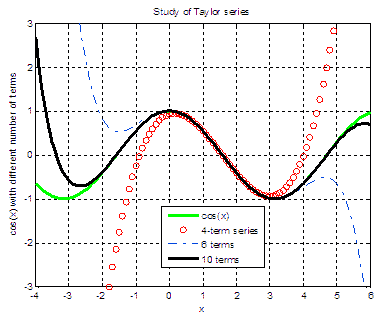

[https://bespokeblog.files.wordpress.com/2011/07/sintay.png](https://bespokeblog.files.wordpress.com/2011/07/sintay.png)

通常，x 处的泰勒级数是以下幂级数

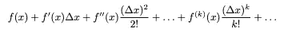

对于一个小的 x，λ(x)≈λ(x+∏x)。

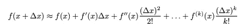

对于多元函数ф(x ),就像损耗ϑ(θ和ϑ(θ+∈θ),它依赖于向量θ和θ+∈θ，下面是一阶泰勒近似

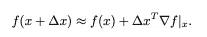

这是(x+∏x)的二阶泰勒近似

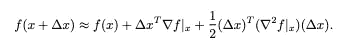

取损失函数的一阶泰勒近似

ϑ(θ+∏θ)=ϑ(θ)+∏θ∇ϑ(θ)
ϑ(θ+∏θ)—ϑ(θ)=∏θ∇ϑ(θ)

我们知道，为了使损失函数最小化，每一步的损失都应该小于前一步，并且这个不等式(ϑ(θ+∏θ)-ϑ(θ)< 0) should hold, and thus from the first order Taylor approximation implies that the dot product ∆θ ∇ϑ(θ) < 0\.
因为点 B (A B cos(ϕ))只能在它们之间的角度大于 90 度时为负，当∏θ与损失梯度的方向相反时，在任何时期损失的最大减少都是可能的

这给了我们众所周知的**梯度下降**更新规则

θ := θ — ∇ϑ(θ)

> 因为我们使用的是损失函数的一阶泰勒近似，它只在θ的邻近区域有效，所以∏θ必须小是一个必要条件。所以我们乘以η << 0 with ∆θ in our update rule.
> 
> θ := θ — η ∇ƒ(θ)
> 
> In practice, larger η also causes overshooting in machine learning and is termed as the learning rate and is a hyper parameter.

## Limitations

One of the limitations of Vanilla Gradient Descent is that in the region of gentle slopes, computed gradients are very small resulting in a very slow convergence. One may simply increase the value of η but it may violate the assumption of first order Taylor approximation of loss function, also larger learning rate may cause overshooting.

Another point to consider is that near the minima loss functions are slightly ellipsoidal and gradients in these regions from the first order Taylor approximation of loss function are almost orthogonal to the true direction of convergence, causing a zig-zag path and a slow convergence.

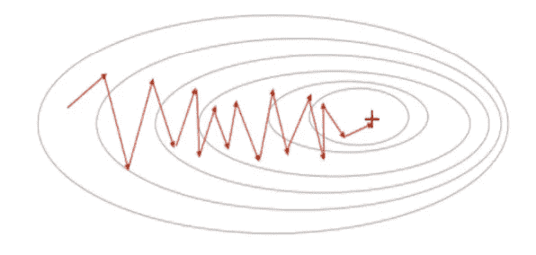

> Although it is not very clear, but second order Taylor approximation may solve this problem. but calculation of ∇ ²ƒ(θ) (Hessian) is computationally very expensive. There are some proposed implicit ways of using hessian by setting the learning rate η as 1/ β, where β is the dominant eigenvalue of the hessian. [点击此处](https://www.cs.princeton.edu/courses/archive/fall18/cos597G/lecnotes/lecture3.pdf)阅读更多关于这个提议的解决方案。

# 2.利用动力学习

为了解决梯度下降算法收敛速度慢的问题，一种方法是在前面步骤中计算的梯度的指数加权平均方向上更新θ。

动量 _t = γ *动量 _t -1 + η ∇ϑ(θ_t)
θ_t+1 := θ_t -动量 _t

其中∇ϑ(θ_t)表示在步骤 t 计算的梯度

momentum _ 0 = 0
momentum _ 1 = momentum _ 0+η∇ϑ(θ_1)= η∇ϑ(θ_1)
momentum _ 2 = momentum _ 1+η∇ϑ(θ_2)=γη∇ϑ(θ_1)+η∇ϑ(θ_2)
momentum _ 3 = momentum _ 2+η∇ϑ(θ_3)
=>γη∇ϑ(θ_1)+γη∇ϑ(θ_2)+η∏ϑ(θ_ 3)

设置γ << 1 insures that the higher power of γ causes decay in the gradients computed in previous steps and maximum weight is given to the last step.
动量会导致快速收敛，即使在梯度下降需要大量时间收敛的缓坡区域也是如此。

## 限制

虽然动量导致比梯度下降相对更快的收敛，但是它通常超过目标并导致在最小值附近振荡。

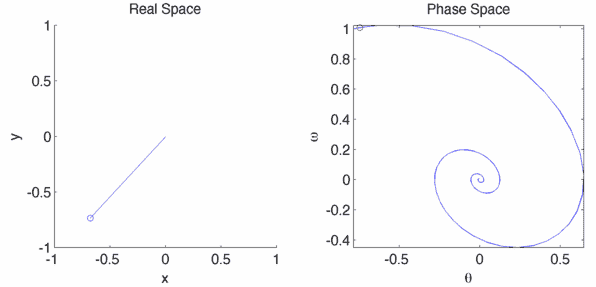

A pendulum oscillating around minima because of momentum

# 3.内斯特罗夫加速梯度下降法

NAG 是基于动量梯度下降算法的简单改进。正如我们已经讨论过的，在动量项中，我们也考虑了具有误差面梯度的更新规则中的历史动量向量。

*   初始化动量= 0
*   还包括动量项的更新步骤
    θ_t+1 = θ_t - {γ *动量+η * ∇ϑ(θ_t)}
*   将当前梯度加入动量
    动量=动量+ η * ∇ϑ(θ_t)

想象在步骤= t，我们在误差面上的点 A。在 A 点计算的梯度会把我们带到 B 点，动量会把我们带到 C 点，两者都会把我们带到 d 点。

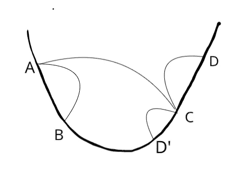

在这种情况下，动量本身是超调的，在 A 点计算的梯度甚至加入其中，导致更大的超调。

NAG 说，不是计算 A 点的梯度并把它们加到从 A 点到 D 点着陆的动量中，而是应该计算 C 点(前瞻点)的梯度并把它加到从 A 点到 D '点着陆的动量中，因此与动量相比减少了最小值附近的振荡。

*   初始化动量= 0
*   计算前瞻点
    look_ahead = θ_t +动量
*   用在 look_ahead 点计算的梯度更新 nag
    θ_ t+1 =θ_ t—{γ*动量+ η*∇ϑ(θ_look_ahead)}
*   将前瞻处的梯度加入动量
    动量=动量+ η*∇ϑ(θ_look_ahead)

# 4.Adagrad 和 RMSprop 用于自适应学习速率

到目前为止，我们一直在寻找更好的算法来更快地通过小梯度误差表面。训练大型神经网络的另一个问题是许多特征的不均匀稀疏性。想象与产生激活 h(w.x + b)的特征 x1 相关联的权重 w1，并且应用 L2 损失来训练网络。在大多数情况下，如果 x1 为零，则相对于 w1 的损耗梯度将非常小。

∂ϑ/∂w1 =(h(w . x+b)—y)* h’(w . x+b)* x1。(乘以 x1)

深度神经网络中不同特征的稀疏性的这种不平衡导致所计算的梯度值的显著变化，从而导致与稀疏特征相比，非稀疏特征的权重的更大更新。

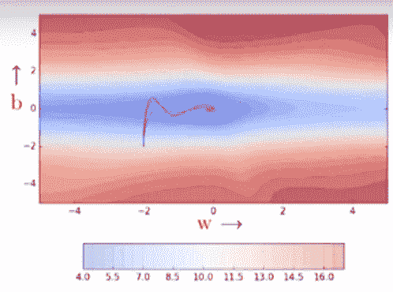

NPTEL NOC-IITM, Deep Learning CS7015

在上图中，与 w 相关的特征非常稀疏，这导致了上图中所示的收敛路径。

Adagrad 的主要思想是根据特征的稀疏性将自适应学习速率分配给不同的权重，与具有较小梯度的权重相比，具有较大梯度的权重被分配较小的学习速率。

这可以简单地通过累积先前的梯度并从中划分学习率来实现。

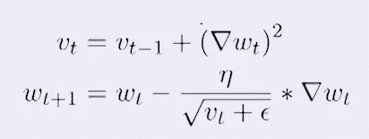

其中，ϵ是一个超参数，通常设置为 1e-6
，这是**自适应梯度更新规则(Adagrad)** ，由于某些原因，它在分母中没有平方根时将不起作用，对此没有明确的答案。
v 是累积梯度的更新向量，通过这种方式，我们可以根据特征的稀疏性调整学习率。

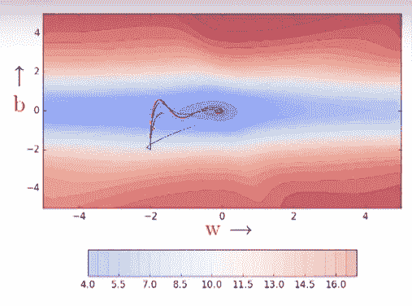

NPTEL NOC-IITM, Deep Learning CS7015

在上图中，绿色曲线代表阿达格拉德采取的收敛路径。它比 momentum 或 NAG 路径更短，在稀疏情况下速度更快，但可能不会收敛。
原因是如果 v_t 的值对于不稀疏的特征来说非常大，我们只是在多次迭代中杀死梯度。

## RMSprop

对于自适应学习速率，我们希望将η除以每个权重的累积梯度的平方根，但是我们不希望梯度的“过度累积”用于不太稀疏的特征，以防止步长的消失。

一个可能的解决方案是取梯度平方的指数加权平均值(就像动量一样)，而不是简单地相加。

v_t = β * v_t + (∇ w_t)并将β设置在 0 到 1 之间(β的默认设置是 0.9 或 0.95)

似乎累加梯度平方的加权平均的“分量”而不是整个梯度可以产生更好的结果。

v_t = β * v_t + (1 — β) * (∇ w_t)其中，通过乘以 1 — β，我们仅在 v_t 中累加梯度平方的一个分量作为加权平均值

如果我们用上面的等式代替 Adagrad 的累加步骤，那就变成 RMSprop(通过梯度的加权均方根的延拓来调整学习速率)。

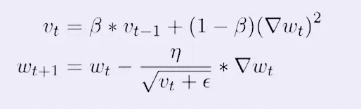

下图显示了 RMSprop 采用的收敛路径。

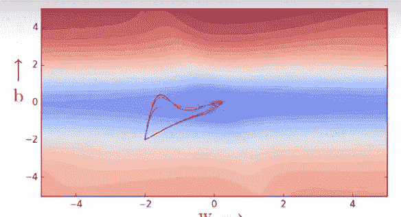

NPTEL NOC-IITM, Deep Learning CS7015

# 亚当·乐观主义者——结合一切，获得当前的艺术状态

*   Venilla 梯度下降
    重复直到收敛:
    。。。θ = θ — η * ∇θ .。。。。㈠
*   基于动量的梯度下降
    初始化 m = 0
    重复直到收敛:
    。。。m = γ * m + η * ∇θ。。。。。(二)
    。。。θ = θ — m。。。。㈣
*   具有自适应学习的 RMSprop 更新规则
    初始化 v = 0
    重复直到收敛:
    。。。v = β * v + (1 — β) * (∇θ)。。。。。
    (五)。。。θ = θ — {η / √(v + ϵ)} * ∇θ。。。。。㈥

在 ADAM 中，关键思想是结合动量和 RMSprop，即在没有η的情况下计算等式(ii)中的 m，并用等式(vi)中的∇θ代替 m。
这使它成为适应性的时刻

初始化 m = 0，v = 0
重复直到收敛:
。。。m = β1 * m + (1 — β1) * ∇θ。。。。。(七)
。。。v = β2 * v + (1 — β2) * (∇θ)。。。。。(八)
。。。θ = θ — {η / √(v + ϵ)} * m。。。。㈨

这是 ADAM 的更新规则。人们应该注意到等式(vii)与等式(ii)完全相同。γ被重命名为β1，并且我们通过对自适应学习速率应用 RMSprop 的相同逻辑，仅累积梯度(1-β1)的一部分。
亚当的一般设置为β1 = 0.9，β2 = 0.999，η = 0.01，ϵ = 1e — 6

## ADAM 中的偏差校正

Adam 的上述更新规则适用于批量梯度下降。但在小批量梯度和随机梯度下降中，上述更新规则是不正确的。背后的原因是，在小批量梯度下降和 SGD 中计算的梯度不是真正的梯度，因为我们没有使用整个训练数据来计算它们，因此在每个小批量中计算的梯度存在随机变化，并且可能指向冲突的方向。

为了解决这个问题，应该将小批量或 SGD 中计算的梯度视为具有某种概率分布的随机变量，因此矩(m 和 v)应该等于该概率分布的期望值。

要保持的条件是𝔼[m] = 𝔼[∇θ]
但是，
m0 = 0
m1 =β1 * m0+(1—β1)* ∇θ_1=(1—β1)∇θ_1

m2 =β1 * m1+(1—β1)* ∇θ_2 =
=>β1 {β1 * m0+(1—β1)* ∇θ_1}+(1—β1)* ∇θ_2
=>β1(1—β1)* ∇θ_1+(1—β1)* ∇θ_2

m3 =β1(1—β1)* ∇θ_1+β1(1—β1)* ∇θ_2+(1—β1)* ∇θ_3

一般情况下，
mt = ∑ β1^(t-i) * {( 1 — β1) * ∇θ_i}。。。。。I 从 1 开始到 t
=>mt =(1—β1)*∑β1^(t-i)* ∇θ_i

=>𝔼[mt]= 𝔼[(1—β1)*∑β1^(t-i)* ∇θ_i]
=>𝔼[mt]=𝔼[∇θ]{(1—β1)*∑β1^(t-i)}
=>𝔼[mt]=𝔼[∇θ]*(1—β1^t)

但是因为我们想让𝔼[m 等于梯度概率分布的期望值(𝔼[∇θ)，我们必须通过除以(1-β1^t).)来修正 m

m' = m / (1 — β1^t)
v' = v / (1 — β2^t)。。。。(相同逻辑适用于 v)

以下是带有偏差修正的 ADAM 更新规则

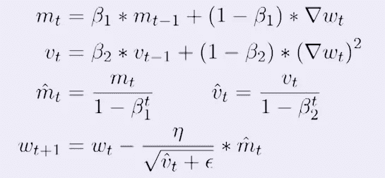

ADAM 是训练神经网络的当前技术状态，并且被认为是过去四年来训练深度神经网络的首选。虽然其他算法特别是带有一些权重衰减策略的 RMSprop 工作得和 ADAM 一样好。人们可以将 RMSprop 比喻为汽车中的手动变速器，而 ADAM 是自动变速器。
ADAM 广泛用于所有的计算机视觉工作，并在几乎所有流行的卷积神经网络架构上产生了非常好的结果，包括非常深的网络，如 Resent 50。

# 新发现

最近有一些研究论文表明，ADAM 在某些情况下不会产生好的结果。另外，在这个领域有一些有趣的新研究。

*   循环学习率:[https://arxiv.org/abs/1506.01186](https://arxiv.org/abs/1506.01186)
*   亚当·W(解耦重量衰减):[https://arxiv.org/abs/1711.05101](https://arxiv.org/abs/1711.05101)

最近在 2019 年，谷歌大脑的研究人员提出了分层自适应矩优化器(LAMB)算法来训练他们的流行语言模型 BERT。
早些时候，用亚当 W 训练伯特需要 3 天，但兰姆只用了 76 分钟。下面是[https://arxiv.org/pdf/1904.00962.pdf](https://arxiv.org/pdf/1904.00962.pdf)的论文，供进一步参考。:)