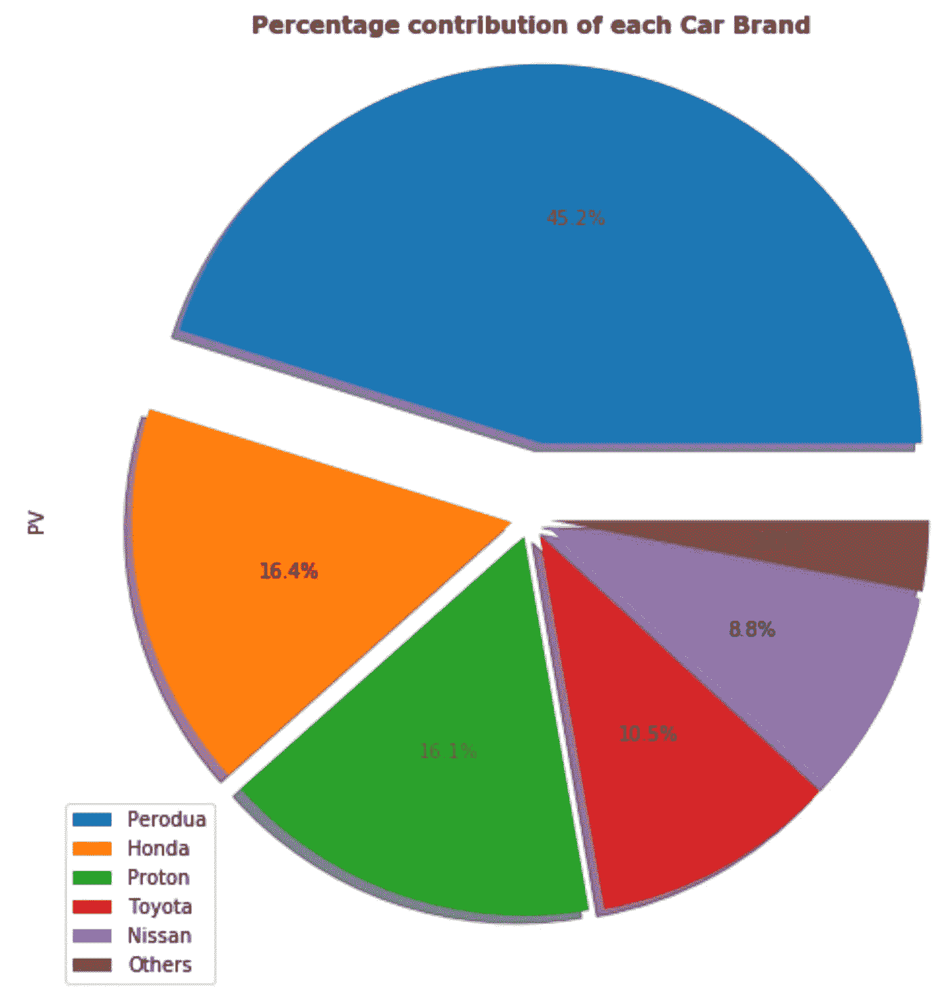
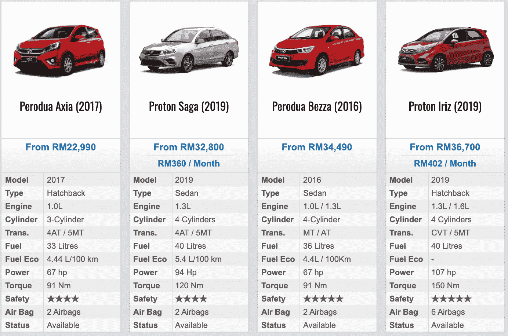
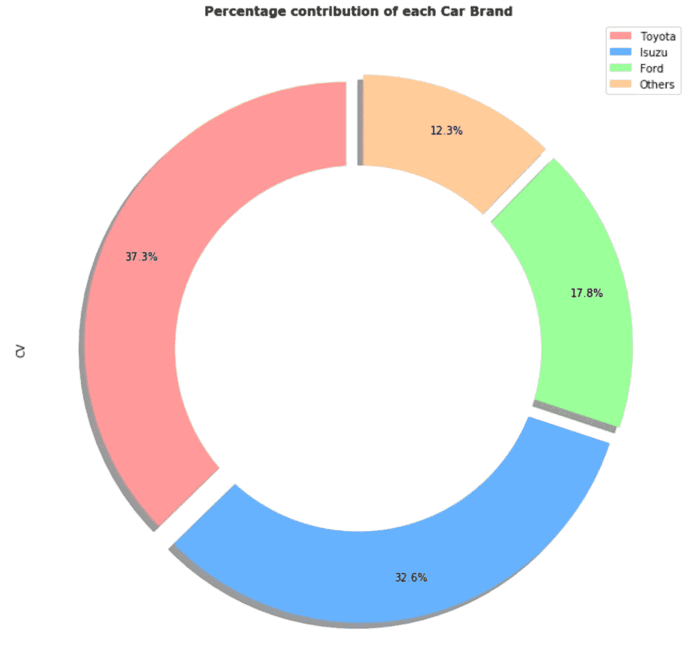
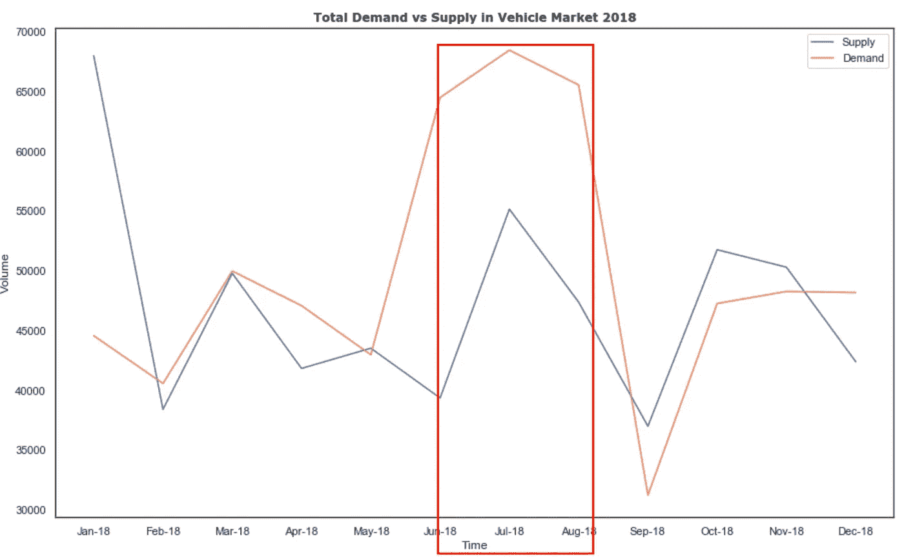

# 马来西亚汽车产业的深层透视

> 原文：<https://towardsdatascience.com/a-deeper-look-into-malaysia-vehicles-industry-c114fda97d36?source=collection_archive---------10----------------------->

## 用可视化数据讲故事

交通拥堵被认为是马来西亚的一个主要问题，尤其是在马来西亚首都吉隆坡。所以，我从小到大都有一个疑问，为什么吉隆坡经常发生堵车？

是因为路况吗？也许吧…但是我想可能有一个更大的因素导致了这个问题。正如我们所知，在解决任何问题之前，理解全局应该是首要任务。因此，今天我会给你一些汽车市场的概述，在接下来的文章中，我会更深入地寻找答案。

如果你喜欢我的故事，请跟我来，我会尽力制作更好的内容。

事不宜迟，我们开始吧！

# 乘用车

乘用车(PV)包括乘用车(PC)、厢式车(WV)、多用途车(MPV)以及四轮驱动/运动型多用途车(4x4/SUV)。

根据马来西亚汽车协会(MAA)2019 年上半年关于光伏汽车前 20 大品牌的报告，Perodua 约占行业总量(TIV)的 45.2%，而本田和宝腾各占 16%左右。因此，你可以注意到前三大品牌已经占据了 77.7%的市场份额。

[https://www.motomalaysia.com/category/best-car-under-rm50k-malaysia/?orderby=Price_Code&order=ASC](https://www.motomalaysia.com/category/best-car-under-rm50k-malaysia/?orderby=Price_Code&order=ASC)

上面的截图显示了你能在马来西亚找到的最便宜的 4 辆车。Perodua 拥有马来西亚光伏汽车最大市场份额的原因之一是它提供了最便宜的汽车。

根据马来西亚雇主联合会 2018 年的研究，如果你是持有荣誉学位的应届毕业生，平均工资只有每月 2169 令吉。

假设你的工资是平均水平，你想买一辆 Perodua Axia。你需要付 10%的定金。现在，假设你的汽车贷款的利率是 4%，还款年是 5 年。所以，你每月需要支付大约 413 令吉，这已经占你工资的 19%了。在这个场景中，你可以看到，作为一名应届毕业生，买得起最便宜的汽车确实是一个巨大的负担。

总之，马来西亚汽车行业最实惠的价格可能是抢占市场份额的重要因素之一。

# 商用车辆

而对于商用车(CV)，包括平板货车(PV)、皮卡(PU)、卡车、原动机(PM)和公共汽车。

根据马来西亚汽车协会(MAA)发布的报告，五十铃马来西亚有限公司连续第五年保持 2018 年全国首选 CV 品牌的首位。

尽管五十铃获得了全国最受欢迎的商用车徽章，但丰田仍有 Hilux 保持其在 CV 领域的最高市场份额地位，在排名前 20 的品牌中占 37.3%。

# 供求

上面的快照显示了马来西亚汽车市场的总销量和生产量。很明显，在 2018 年 6 月到 2018 年 8 月之间有一个峰值，我用红框突出显示了这个峰值。

如果你知道 MalaMalaysia 的 ss，这实际上是因为马来西亚总理 Tun Mahathir 重新引入销售和服务税(SST)并将商品和服务税(GST)标准税率设定为 0%的行动。

正如马来西亚人所知，12 月可以说是购买汽车的最佳月份之一，因为更多的公司提供年终销售，但从我在这里的观察来看，Tun Mahathir 的行动效果已经超过了季节性的影响。

# 最后的想法

我感谢你耐心阅读到最后，我希望这可以是你对马来西亚汽车市场的一个很好的介绍。

如果你对我收集的代码或数据集感兴趣，请在下面评论，我会清理代码并发送给你。

# 关于作者

[Low 魏宏](https://www.linkedin.com/in/lowweihong/?source=post_page---------------------------)是 Shopee 的数据科学家。他的经验更多地涉及抓取网站，创建数据管道，以及实施机器学习模型来解决业务问题。

他提供爬行服务，可以为你提供你需要的准确和干净的数据。你可以访问 [**这个网站**](https://www.thedataknight.com/) 查看他的作品集，也可以联系他获取**抓取服务**。

你可以在 [LinkedIn](https://www.linkedin.com/in/lowweihong/?source=post_page---------------------------) 和 [Medium](https://medium.com/@lowweihong?source=post_page---------------------------) 上和他联系。