# 携带数据分析的演示(丹佛 EDA 犯罪)

> 原文：<https://towardsdatascience.com/a-demonstration-of-carrying-data-analysis-crimes-in-denver-eda-5e852bc75bee?source=collection_archive---------13----------------------->

这是我第二次演示使用 Python 进行数据分析。我之前的文章是关于纽约市 Airbnb 开放数据的。请看看，并给我你的意见和想法，让我可以不断改进。

[](/a-demonstration-of-carrying-data-analysis-new-york-city-airbnb-open-data-a02d0ce8292d) [## 携带数据分析演示(纽约市 Airbnb 开放数据)

### 在本文中，我将使用 Pythons 进行数据分析，并记录下在此过程中的每一个发现和想法

towardsdatascience.com](/a-demonstration-of-carrying-data-analysis-new-york-city-airbnb-open-data-a02d0ce8292d) 

这次我将分析“丹佛 EDA 中的犯罪”。可以通过以下链接从 Kaggle 下载数据:

[](https://www.kaggle.com/paultimothymooney/denver-crime-data) [## 丹佛犯罪数据

### 下载数千个项目的开放数据集+在一个平台上共享项目。探索热门话题，如政府…

www.kaggle.com](https://www.kaggle.com/paultimothymooney/denver-crime-data) 

Photo by [Eric Donzella](https://unsplash.com/@ericdonzella?utm_source=unsplash&utm_medium=referral&utm_content=creditCopyText) on [Unsplash](https://unsplash.com/s/photos/denver?utm_source=unsplash&utm_medium=referral&utm_content=creditCopyText)

下载文件中有两个 csv 文件，一个是包含数据集的“crime . CSV”；另一个是“进攻 _ 代码. csv ”,它将进攻代码解码成各种描述。第一步，我将在 crime.csv 上工作。

同样，在导入数据集之后，我喜欢先打印一些记录，然后获取数据集的基本信息。

```
data = pd.read_csv('crime.csv')
data.head()
data.info()
```

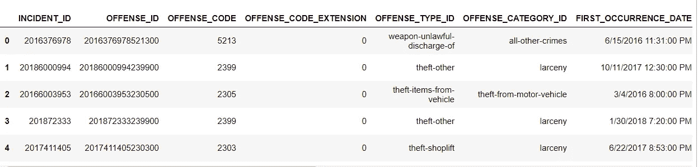

data.head()

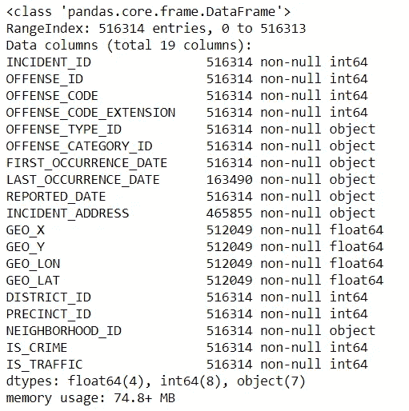

data.info()

如 info()所示，有些变量缺少一些值。

```
data.isnull.().sum()
```

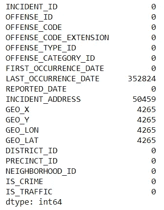

所以 LAST_OCCURRENCE_DATE 丢失了太多贵重物品。所以没必要留着。对于 INCIDENT_ADDRESS，由于有 GEO_LON 和 GEO_LAT，我将直接使用它们，因此我也将删除 INCIDENT_ADDRESS。我不知道 GEO_X 和 GEO_Y 是什么，但我相信它们也是用来定位的。所以我不会留着它们。对于 GEO_LON 和 GEO_LAT，我将保留那些丢失的记录，因为其他变量是有价值的。

```
data.drop(['INCIDENT_ID','INCIDENT_ADDRESS'],axis=1,inplace=True)
```

接下来是一些与进攻类型相关的栏目；“冒犯 _ 代码”、“冒犯 _ 代码 _ 扩展”、“冒犯 _ 类型 _ID”、“冒犯 _ 类别 _ID”。“冒犯 _ 代码”和“冒犯 _ 代码 _ 扩展”为数字格式；“进攻类型标识”和“进攻类别标识”是字符串格式。现在它可以导入另一个 csv 文件。

```
data_codes = pd.read_csv('offense_codes.csv')
data_codes.head()
data__codes.info()
```

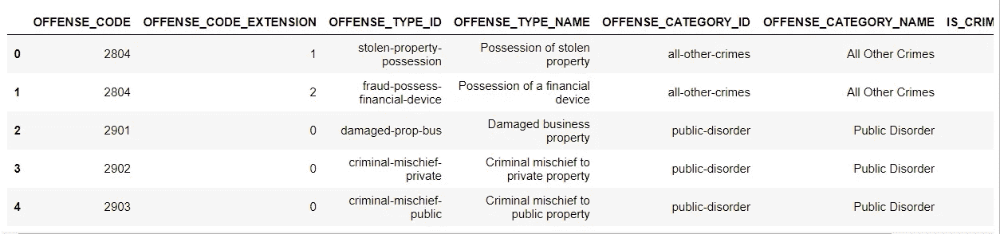

data_codes.head()

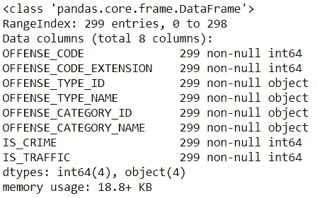

data_codes.info()

data_codes 中没有缺失值。

除了数据中的这四列，data_codes 中还有一些列。因此，最好先将它们结合起来，以获得更详细的信息。

但首先我会检查“crime.csv”中的现有信息是否与“offense _ codes.csv”相同

```
data_temp = data.merge(right=data_codes,how='left', left_on =['OFFENSE_CODE','OFFENSE_CODE_EXTENSION'],right_on=['OFFENSE_CODE','OFFENSE_CODE_EXTENSION'])(data_temp['OFFENSE_TYPE_ID_x']==data_temp['OFFENSE_TYPE_ID_y']).all()(data_temp['OFFENSE_CATEGORY_ID_x']==data_temp['OFFENSE_CATEGORY_ID_y']).all()(data_temp['IS_CRIME_x']==data_temp['IS_CRIME_y']).all()(data_temp['IS_TRAFFIC_x']==data_temp['IS_TRAFFIC_y']).all()
```

所以所有结果都是真的。这意味着“crime.csv”中的那些现有列在与“offense _ codes.csv”合并后是相同的。所以我们只需要保留从“进攻 _ 代码. csv”中获得的新列。

```
data = data_temp.loc[:,~data_temp.columns.str.endswith('_y')]
data.columns = data.columns.str.replace('_x', '')
```

由于只执行了左连接，因此有必要再次检查连接后是否有任何缺失值。

```
data.isnull().sum()
```

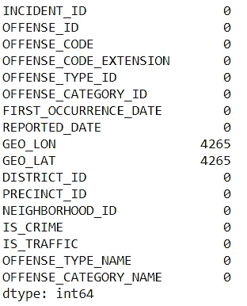

很好，连接后没有丢失值。所以不需要保留“进攻 _ 代码”和“进攻 _ 代码 _ 扩展”。让我们移除它们

```
data.drop(['OFFENSE_CODE','OFFENSE_CODE_EXTENSION'],axis=1,inplace=True)
```

现在进入下一步。

有两列存储日期信息，“首次发生日期”和“报告日期”。但是，回到 data.info()，它们只存储为字符串。所以最好把它们的格式改成 datetime 格式。

```
data['FIRST_OCCURRENCE_DATE'] = pd.to_datetime(data['FIRST_OCCURRENCE_DATE'], infer_datetime_format=True)
data['REPORTED_DATE'] = pd.to_datetime(data['REPORTED_DATE'], infer_datetime_format=True)
```

我们开始吧。

我正在处理的数据集涵盖了从 2004 年 1 月 2 日到 2019 年 9 月 26 日。显然，数据集在不断更新，所以如果你的结果与我的不同，不要担心。

第一次分析:最常见的犯罪

```
data.groupby('OFFENSE_CATEGORY_NAME').agg({'INCIDENT_ID':'count'}).sort_values(by='INCIDENT_ID',ascending=False)
```

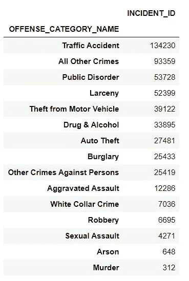

最常见的类别是“交通事故”。幸运的是,“谋杀”是最少发生的一个。

```
data[data['OFFENSE_CATEGORY_NAME']=='Traffic Accident'].groupby('OFFENSE_TYPE_NAME').agg({'INCIDENT_ID':'count'}).sort_values(by='INCIDENT_ID',ascending=False)
```

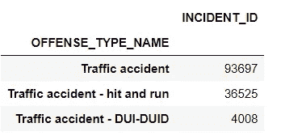

在“交通事故”中，普通交通事故最多，约占总“交通事故”的三分之二。第二种是肇事逃逸。

如果你想知道每个犯罪类别的前五种犯罪类型，你可以使用下面一行代码:

```
data.groupby(['OFFENSE_CATEGORY_NAME','OFFENSE_TYPE_NAME']).agg({'INCIDENT_ID':'count'}).groupby(['OFFENSE_CATEGORY_NAME']).head().sort_values(by=['OFFENSE_CATEGORY_NAME','INCIDENT_ID'],ascending = [True,False])
```

基本上，你首先执行一个分组，并得到每个进攻类别类型组合的计数。然后使用进攻类型执行另一个 groupby，并使用 head()获得前五种进攻类型。最后，通过排序呈现结果。

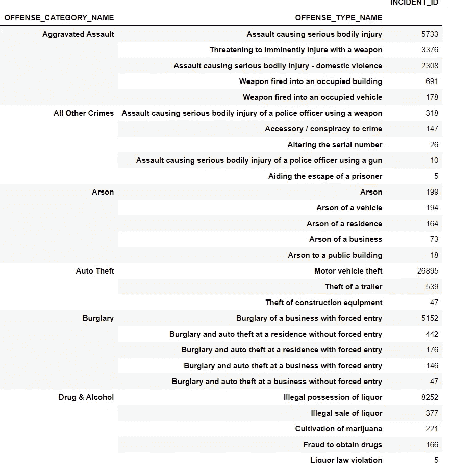

那么接下来的分析就是要找出每起犯罪哪个时间段报案比较常见。为此，第一步是创建一个新列来存储“FIRST_OCCURRENCE_DATE”的小时

```
data['FIRST_OCCURRENCE_HOUR'] = data['FIRST_OCCURRENCE_DATE'].dt.hour
```

然后绘制频率图。

```
sns.countplot(data=data,x='FIRST_OCCURRENCE_HOUR')
plt.title('Frequency of crime by hour')
plt.show()
```

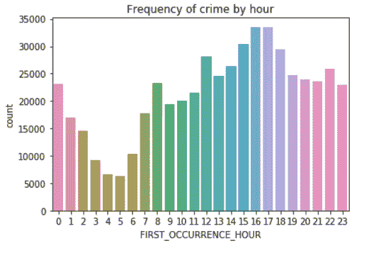

所以大多数报道的犯罪都发生在白天。我相信那些罪行只是小罪。

```
data[data['FIRST_OCCURRENCE_HOUR'].isin([15,16,17,18])].groupby(['FIRST_OCCURRENCE_HOUR','OFFENSE_CATEGORY_NAME']).agg({'INCIDENT_ID':'count'}).groupby(['FIRST_OCCURRENCE_HOUR']).head().sort_values(by=['FIRST_OCCURRENCE_HOUR','INCIDENT_ID'],ascending = [True,False])
```

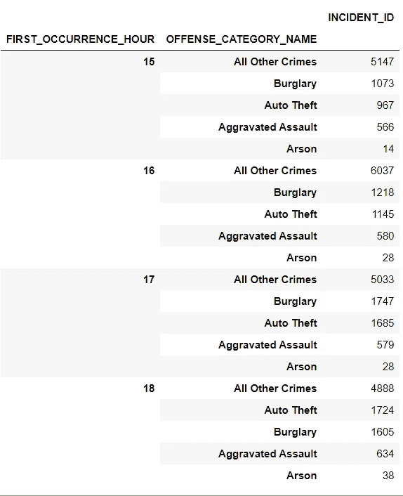

但是总的来说，轻罪比重罪多得多，仅仅比较绝对数字是没有意义的。因此，最好进行升力分析。

升力分析是一种常见但有用的分析。它首先用于数据挖掘，但现在它在许多领域都有应用。更多信息，维基百科和 kdnuggets 可以帮助你。

 [## Lift(数据挖掘)

### 在数据挖掘和关联规则学习中，提升是目标模型(关联规则)性能的度量

en.wikipedia.org](https://en.wikipedia.org/wiki/Lift_%28data_mining%29) [](https://www.kdnuggets.com/2016/03/lift-analysis-data-scientist-secret-weapon.html) [## 提升分析——数据科学家的秘密武器——KD nuggets

### 作者安迪·高施米特，阿卡努。每当我阅读关于数据科学的文章时，我都觉得有一些重要的方面…

www.kdnuggets.com](https://www.kdnuggets.com/2016/03/lift-analysis-data-scientist-secret-weapon.html) 

基本上，提升分析是计算某一事件在特定情况下发生的概率是高还是低。例如，电梯分析可以判断午夜谋杀是否更频繁。然后我们计算午夜发生谋杀的概率和全天的概率然后得到比率。

摘自维基百科，“如果某个规则的提升值为 1，这意味着前因和后果出现的概率是相互独立的”

在这里，前因是午夜，后果是谋杀。

所以我定义“午夜”是从晚上 10 点到凌晨 4 点。然后下一步是计算全天和午夜期间的谋杀概率。

```
murder_ttl_count = data[data['OFFENSE_CATEGORY_NAME']=='Murder']['INCIDENT_ID'].count()
ttl_count = data['INCIDENT_ID'].count()
murder_midnight_count = data[(data['OFFENSE_CATEGORY_NAME']=='Murder')&((data['FIRST_OCCURRENCE_HOUR']>=22)| (data['FIRST_OCCURRENCE_HOUR']<=4))]['INCIDENT_ID'].count()
midnight_count= data[(data['FIRST_OCCURRENCE_HOUR']>=22)| (data['FIRST_OCCURRENCE_HOUR']<=4)]['INCIDENT_ID'].count()lift = (murder_midnight_count / midnight_count) / (murder_ttl_count/ttl_count)
print("Average probability of having murder during the whole day : {:1.6f}".format((murder_ttl_count/ttl_count)))
print("Probability of having murder during the midnight : {:1.6f}".format((murder_midnight_count / midnight_count)))
print("The lift is : {:1.6f}".format(lift))Average probability of having murder during the whole day : 0.000604
Probability of having murder during the midnight : 0.001190
The lift is : 1.969831
```

由于电梯大于 1，谋杀在午夜比平均水平更频繁。您可以对其他类别进行类似的计算，找出每种犯罪类型的流行时间段。

下一步是查看任何报道谋杀的热门地点。和上次一样，我将使用 follow 来可视化数据。

```
data_murder = data[data['OFFENSE_CATEGORY_NAME']=='Murder']
denver_map = folium.Map(location=[39.7, -104.9],zoom_start =11)
data_loc= data_murder[['GEO_LAT','GEO_LON']].values
data_loc =data_loc.tolist()
hm = plugins.HeatMap(data_loc)
hm.add_to(denver_map)
denver_map
```

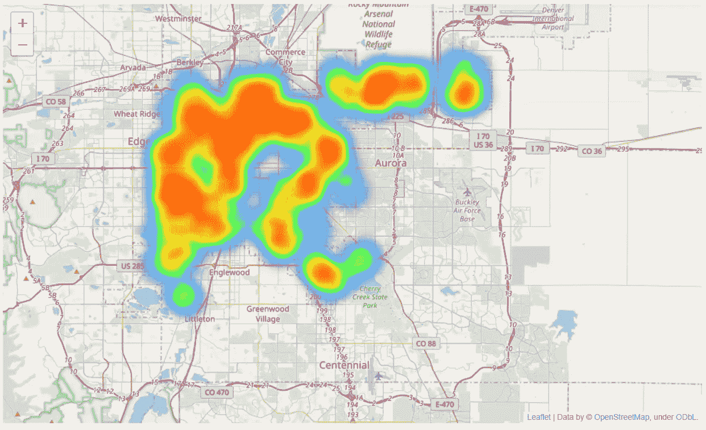

大多数谋杀发生在丹佛的北部和西北部。

本次分析到此为止。欢迎分享你的想法和评论，这样我可以继续改进。请随意分享并鼓掌支持我。

以下是 GitHub 上完整代码的链接:

[https://github.com/wyfok/Crimes_in_Denver_EDA](https://github.com/wyfok/Crimes_in_Denver_EDA)