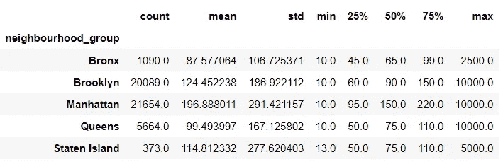
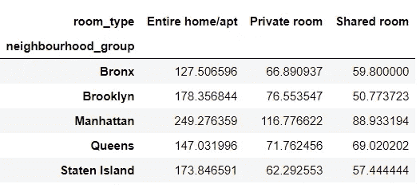
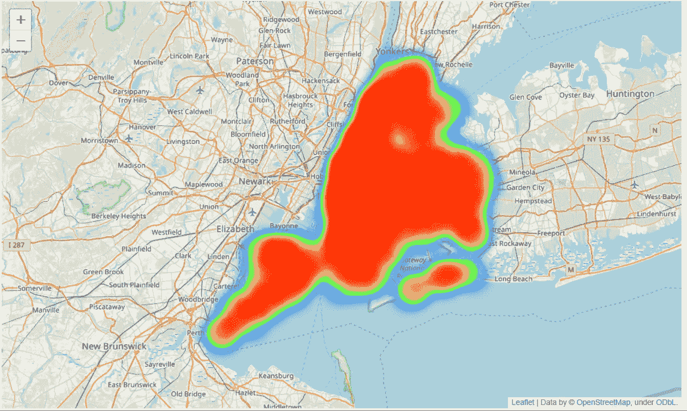
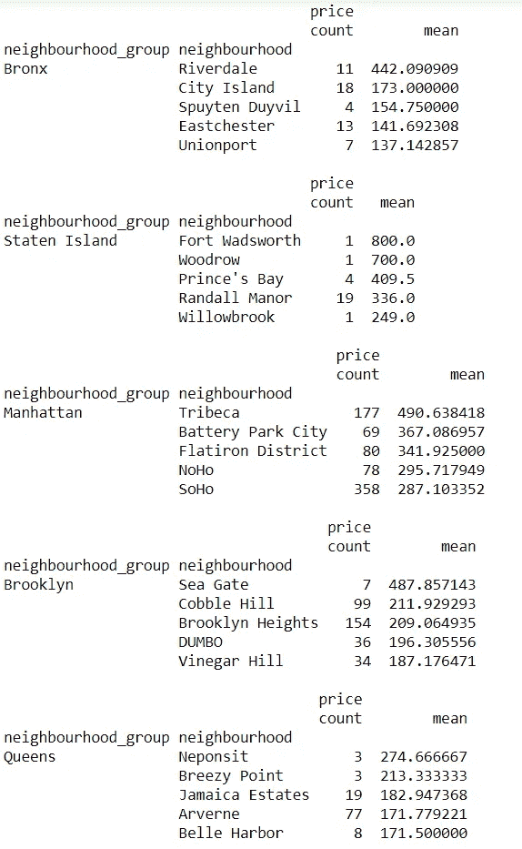
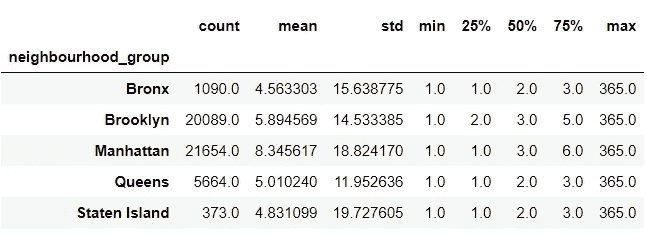
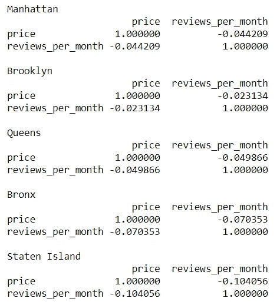
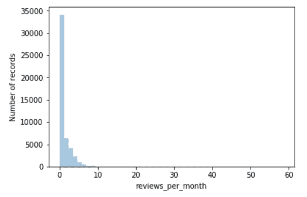

# 携带数据分析演示(纽约市 Airbnb 开放数据)

> 原文：<https://towardsdatascience.com/a-demonstration-of-carrying-data-analysis-new-york-city-airbnb-open-data-a02d0ce8292d?source=collection_archive---------15----------------------->

在本文中，我将使用 Python 执行数据分析，并记录分析过程中的每个发现和想法。用真实数据练习不仅可以帮助我在分析不同数据时有更多的经验，还可以帮助我在与他人的作品进行比较时发现更多的技术和技能。


Photo by [Oliver Niblett](https://unsplash.com/@ojnibl?utm_source=unsplash&utm_medium=referral&utm_content=creditCopyText) on [Unsplash](https://unsplash.com/s/photos/new-york?utm_source=unsplash&utm_medium=referral&utm_content=creditCopyText)

本文使用的数据集是来自 Kaggle 的“纽约市 Airbnb 开放数据”。下面是下载链接[https://www . ka ggle . com/dgomonov/new-York-city-Airbnb-open-data](https://www.kaggle.com/dgomonov/new-york-city-airbnb-open-data)

导入模块和 csv 文件后，通常我的第一步是浏览数据集。这一步包括研究整个数据集的格式、所有变量的类型、检查和清理数据集。

```
data = pd.read_csv('AB_NYC_2019.csv')
data.info()class 'pandas.core.frame.DataFrame'>
RangeIndex: 48895 entries, 0 to 48894
Data columns (total 16 columns):
id                                48895 non-null int64
name                              48879 non-null object
host_id                           48895 non-null int64
host_name                         48874 non-null object
neighbourhood_group               48895 non-null object
neighbourhood                     48895 non-null object
latitude                          48895 non-null float64
longitude                         48895 non-null float64
room_type                         48895 non-null object
price                             48895 non-null int64
minimum_nights                    48895 non-null int64
number_of_reviews                 48895 non-null int64
last_review                       38843 non-null object
reviews_per_month                 38843 non-null float64
calculated_host_listings_count    48895 non-null int64
availability_365                  48895 non-null int64
dtypes: float64(3), int64(7), object(6)
memory usage: 6.0+ MB
```

所以总共有 16 列，有些列有缺失值。

```
data.isnull().sum()id                                    0
name                                 16
host_id                               0
host_name                            21
neighbourhood_group                   0
neighbourhood                         0
latitude                              0
longitude                             0
room_type                             0
price                                 0
minimum_nights                        0
number_of_reviews                     0
last_review                       10052
reviews_per_month                 10052
calculated_host_listings_count        0
availability_365                      0
dtype: int64
```

在数据集中，last_review 和 reviews_per_month 都有超过 10k 的缺失值。它们也有相同数量的缺失值。根据缺失值的名称和数量，我怀疑这两列是相关的，因此缺失值的数量相同。

```
(data['last_review'].isnull()==data['reviews_per_month'].isnull()).all()True
```

所以应该一起处理。

此时，我不知道如何处理“last_review”列中缺少的值，因为这通常显示一个日期字符串，指示上次审查的日期。所以此时此刻，我会先把它放在一边。

但是，对于 reviews_per_month 中缺失的值，我会将它们赋为零。

```
data.loc[data['reviews_per_month'].isnull(),'reviews_per_month']=0
```

其余缺少值的列是 name 和 host_name。但是，我觉得无论从名字还是 host_name 都没有任何预测力。因此，我将直接从数据集中删除，而不是处理丢失的值。

有两列，id 和 host_id，表示 Airbnb 的房子和主人。检查后，id 在数据集中是唯一的，但 host_id 不是。因此，可以删除 id，但不能删除 host_id。此外，如果房源数量和价格之间存在任何关系，这也是有意义的。因此将保留 host_id。

下一步是使用

```
data.describe()
```

使用 describe()可以帮助我理解每个变量的可能值的范围。我可以知道值的分布。此外，从数据集中发现任何不现实的记录也是可能的。

例如在这个数据集中，有一些异常。第一个是存在“价格”= 0 的记录，这是不现实的，因为这意味着不需要支付住宿费用。所以这些记录应该被删除。

第二个是“minimum_nights”最高 1250 我认为不现实(这还是 Airbnb 还是只是另一个租房合同？).我把阈值定为 365 天。“minimum_nights”大于 365 的任何记录也将被删除。

清理后的数据集:

```
data.info()<class 'pandas.core.frame.DataFrame'>
RangeIndex: 48870 entries, 0 to 48869
Data columns (total 12 columns):
host_id                           48870 non-null int64
neighbourhood_group               48870 non-null object
neighbourhood                     48870 non-null object
latitude                          48870 non-null float64
longitude                         48870 non-null float64
room_type                         48870 non-null object
price                             48870 non-null int64
minimum_nights                    48870 non-null int64
number_of_reviews                 48870 non-null int64
reviews_per_month                 48870 non-null float64
calculated_host_listings_count    48870 non-null int64
availability_365                  48870 non-null int64
dtypes: float64(3), int64(6), object(3)
memory usage: 4.5+ MB
```

48870 行和 12 列

现在我可以看看数据集了。一次一列

第一个是邻里群体

```
set(data['neighbourhood_group']){'Bronx', 'Brooklyn', 'Manhattan', 'Queens', 'Staten Island'}data.groupby('neighbourhood_group')['price'].describe()
```



该表很容易显示每个邻域组和所有邻域组的价格分布。Airbnb 的数量不是偶数。大多数 Airbnb 的房子要么在曼哈顿，要么在布鲁克林。不过这两个区域也是五个区域中价格最高的。一个可能的原因是，因为这些地区的需求很高，导致更多的主人出租他们的房间或公寓。

为了更准确地显示价格，考虑到房型，我们进行了进一步的细分。

```
data.pivot_table(index='neighbourhood_group',columns='room_type',values='price',aggfunc='mean')
```



一般来说，你可以在布鲁克林租到一个单间，但在曼哈顿你甚至租不起一个合住的房间。

接下来是 Airbnb 的位置。众所周知，曼哈顿和布鲁克林有更多的 Airbnb。这里我用一张热图来呈现。

```
ny_map = folium.Map(location=[40.7, -74],zoom_start =10)
data_loc= data[['latitude','longitude']].values
data_loc =data_loc.tolist()
hm = plugins.HeatMap(data_loc)
hm.add_to(ny_map)
ny_map
```



曼哈顿和布鲁克林有一大片红色区域。

是时候进一步细分各个小区了。

```
for gp in set(data['neighbourhood_group']): print(data.loc[data['neighbourhood_group']==gp,].groupby(['neighbour   hood_group','neighbourhood']).agg({'price':['count','mean']}).sort_values(by=('price', 'mean'),ascending=False).head())
print()
```



上表显示了每组中前 5 名最昂贵的社区。除了 Staten Island 在某些邻居中只有 1 条记录是 top 5 neighbors 之外，其他邻居都有足够的记录来正确表示每个地区的平均价格。布朗克斯的河谷镇和曼哈顿一样贵。

下一个要研究的变量是“最低夜数”。第一个变量是按“邻居组”细分的

```
data.groupby('neighbourhood_group')['minimum_nights'].describe()
```



由于所有“minimum_nights”大于 365 的记录都已被删除，因此最大值仅为 365。如图所示，超过 25%的 Airbnb place 只需要 1 晚，超过一半的 Airbnb place 只需要 2 或 3 晚，这符合 Airbnb 服务的最初原则，即短期住宿。

现在我们可以转到下一个变量，视图。我会使用每月评论数而不是评论数，因为这样可以消除 Airbnb 上持续时间列表的影响。

```
for gp in set(data['neighbourhood_group']):
print(gp)
print(data[data['neighbourhood_group']==gp]    ['price','reviews_per_month']].corr())
print()
```



显然，价格和每月的评论数量之间没有关系。



相反，几乎所有的房子每个月都只有很少的评论。

分析到此结束。希望您喜欢，并请与我分享您的评论，以便我可以不断改进，并在未来使用 Python 演示更多的数据分析。下次见。

完整的代码可以在[https://github.com/wyfok/New_York_City_Airbnb_Open_Data](https://github.com/wyfok/New_York_City_Airbnb_Open_Data)找到