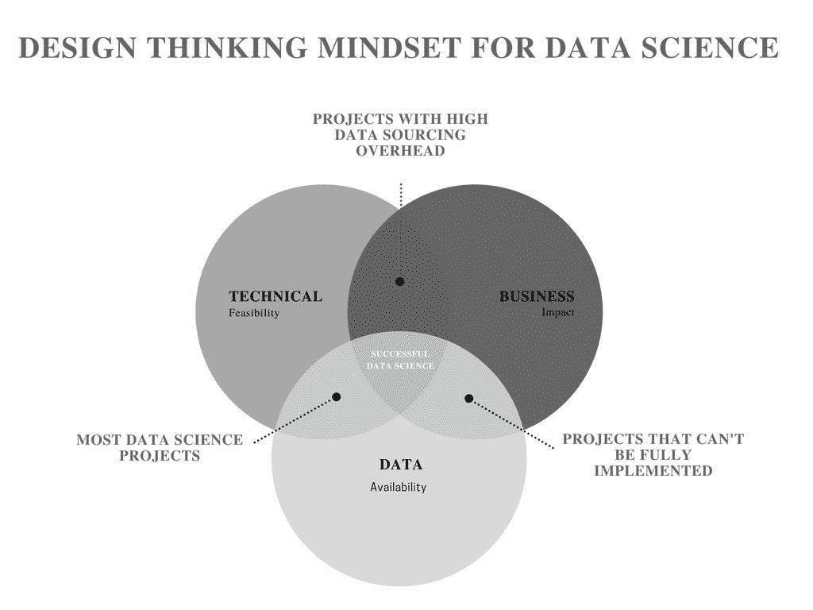

# 数据科学的设计思维模式

> 原文：<https://towardsdatascience.com/a-design-thinking-mindset-for-data-science-f94f1e27f90?source=collection_archive---------1----------------------->

## 改编自为德克萨斯大学 capstone 撰写的一篇研究论文。

## **摘要**

自年以来，数据科学在技术研究和商业战略中受到了关注；然而，数据科学研究过程本身有机会增加研究和改进。通过本文中描述的研究方法，我们相信有可能将设计思维应用到数据科学过程中，以努力形式化和改进研究项目过程。因此，本文将集中讨论这一理论的三个核心领域。首先是数据科学研究过程的背景，以及数据科学家面临的常见陷阱。第二篇文章解释了设计思维原则如何应用于数据科学。第三个是基于上述发现提出的数据科学研究项目的新流程。本文最后将分析对数据科学个人和团队的影响，并对未来研究提出建议，以验证提议的框架。

*关键词:*数据科学，研究过程，设计思维应用

# **简介**

数据科学可以说是本世纪最受欢迎的工作之一；然而，这份工作的特点仍然不确定( [HBR](https://hbr.org/2012/10/data-scientist-the-sexiest-job-of-the-21st-century) )。大学项目中缺乏正式培训，角色要求不明确，以及职位的广泛性导致了如何成为一名优秀的数据科学家的模糊性，以及对那些能够做所有事情的人的偶像崇拜——俗称“独角兽”。

数据科学领域的学术进步传统上集中在新的统计分析技术、机器学习模型和神经网络的开发上。对过程本身的研究很少，最突出的是 1997 年提出的 [KDD 过程](https://www.sciencedirect.com/science/article/pii/S0167739X97000150) —数据库中知识发现的框架。除了过时和缺乏对当今数据科学研究过程中常见挑战的答案之外，KDD 框架还主要关注过程中的数据挖掘步骤，而没有将其深度扩展到整个研究过程。

过程研究在其他领域相当流行；最值得注意的是在设计领域——这个职业已经发展出了大量关于如何用设计师的思维解决问题的文献。研究人员和杰出的设计师分享了设计工作中使用的[核心方法](https://www.sciencedirect.com/science/article/pii/S0142694X11000603)和推理模式，从而使术语“设计思维”及其相关实践在企业和机构中得以普及。此外，设计思维的许多方法和原则具有广泛的适用性，已经应用于[教育](https://www.researchgate.net/publication/264454908_Hands_On_Hearts_On_Minds_On_Design_Thinking_within_an_Education_Context)、[医疗](https://www.ncbi.nlm.nih.gov/pmc/articles/PMC2742394/)和[写作研究](https://www.jstor.org/stable/pdf/43490875.pdf)等领域。

数据科学家的角色缺乏正式性，缺乏现有的文献，以及与设计研究领域的跨学科重叠，这些都鼓励了对整个数据科学过程的进一步研究。因此，本文旨在确定数据科学研究过程中的常见陷阱，并通过强调与数据科学研究过程相关的设计思维的优势，提出一个使用设计思维的原则和过程解决数据科学问题的新框架。本文还将解释用于得出这些结论的方法，解释潜在的影响，并确定未来的研究机会。

## **方法论**

本文的数据是通过专业的第一手经验以及对行业研究和学术文献的全面回顾和分析收集的。以下提供了所用方法的总结，参考资料中列出了更详细的来源:

*   使用谷歌学术和搜索词(如设计思维过程、设计思维应用、数据科学过程、数据科学挑战、研究错误和数据科学研究)对设计思维和数据科学主题的已发表论文进行系统综述
*   对斯坦福 D 学院、IDEO、跳板和奥赖利等知名机构的主题专家发表的博客和内容进行评论
*   回顾热门书籍中的概念，主题包括*设计改变、数据分析风格的要素、*和*用数据讲故事*
*   在尝试解决数据科学研究过程的常见缺点时，考虑了设计思维之外的其他过程框架。其中考虑的是精益和敏捷框架。最终，设计思维被选中，因为它直接应用于一般的研究过程，而不是其他更类似于开发过程的框架。

# **数据科学研究过程概述**

对于本文来说，首先要区分数据科学问题和数据科学研究项目。前者被定义为一个定义明确的问题或一组问题，提供这些问题的目的是为了快速得出答案。相比之下，数据科学研究项目包含更大的努力，其中目标和答案是同时开发的。这两者可以根据完成所需的时间长短来分类——一个问题可以很快得到回答，而一个项目则需要一段较长的时间才能完成。另一个区别在于任务的模糊性:一个问题仅仅是；而一个项目通常开始时比较模糊，因此会导致许多挑战。以下部分详细介绍了完成数据科学项目的流程以及相关的常见缺陷。

## **陷害问题**

在任何研究过程中，通过提出问题，陈述自己的假设，并发展一种战略方法来回答所提出的问题是很常见的。按照这种思路，通常在进行研究时会考虑到可用数据的局限性，而不是从战略问题或方向入手；然而，大数据的兴起从根本上改变了人们进行此类研究的方式。随着可用的[数据数量、质量和种类](https://ieeexplore.ieee.org/document/6547630)的增加，有效地消除了利用数据的[限制开始研究过程的需要，构建数据科学项目的方法并没有发展。这在缺乏经验的数据科学家中变得最麻烦，他们通常从什么数据可用的心态开始，努力发现有意义的见解，而不是从什么问题最有战略价值来集中他们的研究。](https://www.researchgate.net/publication/272946686_Significance_and_Challenges_of_Big_Data_Research)

## **获取数据**

数据科学研究过程的后续步骤——收集、清理和准备数据——的重要性经常被忽视。[数据完整性](https://www.nap.edu/catalog/12615/ensuring-the-integrity-accessibility-and-stewardship-of-research-data-in-the-digital-age)是研究领域的一个大问题，它始于对数据来源的全面了解。如果没有对数据源的全面理解，就很难清楚地说明结果的可归纳性和准确性、任何发现的影响或为受众开发的模型的理论基础。

## **探索数据**

数据探索，也称为[数据挖掘](https://mitpress.mit.edu/books/principles-data-mining)，是从大型数据集中发现有价值见解的过程，通常借助于高级统计分析和可视化。除了表面水平的技术，如运行变量的描述性统计和检查相关性，过程中的这一点可能会难倒数据科学家，因为他们不知道对数据提出什么问题。要在这一步取得成功，需要对研究问题有丰富的知识，并有创造力从初步探索转向有价值的见解。

## **进行深入分析**

一旦研究完数据，流程通常会转向进一步的深入分析或模型构建，这取决于项目的范围。在这一点上，当数据科学家全神贯注于项目，以至于看不到最终目标，或者陷入兔子洞，或者产生对项目的利益相关者来说不是立即可操作的或有价值的结果时，就会出现常见的失败。

## **传达结果**

与任何研究一样，数据科学研究项目的最后一步是将研究结果传达给相关的利益相关方。在这一点上，数据科学家或研究团队需要传达基于他们的发现应该采取的行动，方法是将他们打包到报告或演示文稿中，并与能够实施相关见解的团队共享这些发现。理想情况下，所有的研究项目最终都会对一个企业有更深入的了解，如果不是直接的行动，以证明投入时间进行研究是值得的；然而，[这种情况并不常见](https://hbr.org/2016/12/why-youre-not-getting-value-from-your-data-science)。

总之，以上对数据科学流程的描述揭示了一个挑战的总体主题:构建和提出正确的数据问题，并为相关利益相关方产生可操作的结果。

# **提议的思维模式:数据科学研究过程的设计思维**

正确地构建问题，并确保过程产生可操作的结果，这一挑战也是设计思维过程所要解决的。一套核心原则的定义和一个高级流程的创建，使得如何在设计者中解决这些问题变得清晰。通过综合设计思维的优势和数据科学研究中发现的不足，以下部分提出了数据科学研究的原则和流程改进:

## **核心指导原则**

1.  **同理心:**在一开始就定义相关的利益相关者，并在整个过程中记住他们，包括进行主题专家访谈，经常收集非正式的反馈，以及创建一个专门包装的最终产品来满足利益相关者的需求。
2.  **通过原型进行理解:**研究人员对问题空间的理解可以受益于预先绘制假设的复杂分析或模型，以便在投入大量精力开发完整的解决方案之前掌握范围并测试可能的解决方案。此外，快速原型法被证明可以在更短的时间内获得与非约束原型法相似的结果。
3.  **积极而有目的的反馈:**经常有目的地从技术和非技术利益相关者那里收集信息，有助于加深对问题的理解，并集思广益找到解决方案。
4.  **描述之上的图表:**分析、模型和发现的交流可能会变得复杂。帮助非技术观众理解流程；让它可视化。
5.  **借鉴他人的想法:**从内部和外部寻找已经完成的工作，以及如何在此基础上再接再厉。由于缺乏知识共享，团队经常遭受重复工作的困扰，数据科学工作也不例外。
6.  **拥抱创造力和非线性之旅:**如果一个研究人员没有探索很多选项，他们就没有足够的发散。抱着数量胜于质量的心态进行头脑风暴，为以后的发现提供了更多的选择。

# **新流程**

## **构思**

如前所述，成功的数据科学项目始于战略问题和研究领域的选择。[设计思维将战略选择过程描述为平衡技术可行性、合意性和商业可行性。这种思维模式迫使设计解决方案结合业务和技术方面来考虑解决方案的人的因素，这是一个经常被忽视的领域。下面提出了一个类似的文氏图，用于选择数据科学研究领域，以帮助增加数据科学项目的成功机会:技术可行性、业务影响和数据可用性的交集。](https://onlinelibrary.wiley.com/doi/10.1111/caim.12153)

*Demonstrating the Three Aspects of Data Science*

构思阶段的另一个重要方面是问题的框架和范围，包括确定假设、重要问题和研究目标。在设计思维中，由于设计师通常不是主题专家，设计师几乎从项目被分配的第二秒钟就开始进行主要和次要的研究，以发展对问题空间的理解。通常在这些早期阶段，[设计师会惊喜地](http://web.mit.edu/jrankin/www/engin_as_lib_art/Design_thinking.pdf)收集到比预期更深入的见解。即使设计者或研究人员没有明确要求，一个简单的问题，要求被引导通过过程可能阐明痛苦和问题。

数据科学家可以应用相同的技术来帮助自己熟悉感兴趣的领域，了解利益相关者，并发现有助于构建其研究流程的见解。应用这种思维方式可能看起来像是数据科学研究项目的开始阶段，包括大量的前期研究。要执行的活动示例包括:

*   与其他业务单位和团队的信息访谈
*   用图表表示过程和概念来测试理解
*   在适用的情况下，访问用户证明和支持票证

## **探索性分析**

进入一个项目的探索阶段会显得杂乱无章，很难提出想法，并导致创意枯竭。[设计思维](https://www.amazon.com/Change-Design-Transforms-Organizations-Innovation/dp/0061766089)通过创建流程图和框架来组织关键知识，确定进一步关注的领域，并将决策传达给外部利益相关方，从而进入设计流程的这一阶段。设计思维中使用的探索性工具的例子包括 [*原样旅程图*和*客户旅程*](https://conversionxl.com/blog/customer-journey-mapping-examples/) 。类似的工具，或者简单地描绘出研究领域的概念，可以帮助数据科学家在探索阶段组织和策划他们的下一步。

分析技术中的头脑风暴和创造力也是探索阶段的关键部分。正如本文前面所述，当数据科学家无法想出新的分析问题来尝试发现一个有趣的领域进行进一步研究时，他们会感到沮丧。数据科学方法可以借鉴设计思维中的一个重要理论，即在项目的早期阶段，数量重于数量。不要从一开始就限制想法，而是从写出 100 个可以由数据构成的潜在问题或疑问开始，不管这些问题或疑问有多荒谬或无用，然后将这些想法捆绑到主题中，并根据容易程度和潜在影响对它们进行优先排序。

## **建模、原型制作和深入分析**

设计思维过程受益于快速迭代和来自相关利益相关者的有针对性的反馈，允许在选择过程中考虑更大范围的可能解决方案。这种策略旨在避免个人偏见，以及在更好的想法出现时选择第一个想法。数据科学过程可以从类似的策略中受益，以帮助增加创造力和考虑的选项，同时避免基于尝试的第一个想法来确定解决方案。

从相关利益相关者那里收集反馈也有利于沟通和认同。例如，设计师不仅将反馈作为收集潜在解决方案输入的方法，还用于学习如何最佳定位解决方案并与特定受众分享发现。类似地，数据科学家经常努力确保项目结果与利益相关者相关，如果相关，如何传达。因此，在建模和创建更深入的分析的整个过程中，频繁和有意的反馈可以改善这些弱点。

## **展示调查结果和模型**

大多数研究过程收集了大量的数据和见解，这些数据和见解通常不仅仅是与受众相关和有价值的。因此，结果往往需要提炼出真正重要的东西。设计思维通过在故事中构建见解和建议的解决方案来实现这一步，旨在带领观众了解为什么最终结果很重要，这些结果是如何实现的，以及如何解决这些问题。

数据科学研究通常不会以一个精心制作的故事结束，因此为观众创造引人入胜的材料可能具有挑战性。通过借用设计思维中的[讲故事原则，有以下几点建议:](http://www.storytellingwithdata.com/book)

*   **关注解释性分析而不是探索性分析:**解释性分析首先提出一个重要的发现或建议，然后解释实现这个发现或建议的过程。那些仅仅是有趣而没有用的发现会被保存下来用于项目的深入描述，或者根本不包含在内。
*   **有目的地使用想象:**开始想象，写下需要沟通的内容，然后准确地创造出来。通常更容易的是创建一组图表和图形，然后围绕所创建的内容获取见解和构思一个故事。这导致不太引人注目的可视化。而是从目的入手。
*   **将过程记录为一次旅程:**分享得出结论的步骤有助于听众对最终建议有更深的理解，并激发行动。利用研究之旅建立可信度，并获得重要利益相关者的认同。

## **潜在影响**

本文开头讨论了对“独角兽数据科学家”的期望和寻找，他们在数据科学的技术、业务战略和沟通方面表现出色。此外，对与数据科学相关的技术培训的关注使许多人缺乏战略和沟通技能。

提议的**数据科学设计思维模式**有可能在流程的其他方面帮助有技术头脑的人，包括框定问题，通过创造性方法扩展构思，在牢记最终目标的情况下执行探索性分析，收集关于原型的反馈以保持利益相关者的参与，以及将最终结果打包成令人信服的故事。此外，随着数据科学的技术组件随着 Watson 等基于人工智能的数据分析产品越来越多地走向自动化，数据科学工作的这些确定的方面将变得越来越重要，因为它们本质上是以人为中心的，更难以自动化。

## **结论**

现有文献展示了设计思维过程的好处，并强调了数据科学过程中面临的失败和挑战。通过综合两个学科的研究，人们可以得出结论，数据科学学科可以从应用成熟的设计思维方法中受益。数据科学流程受益最大的两个特定领域是对数据提出正确的问题，以及产生可操作的结果。

首先，数据科学家可以运用同理心和原型来确保他们有正确的框架，并对数据提出正确的问题。在整个构思阶段，数据科学家可以进行信息访谈，以更深入地了解他们试图解决的问题，同时培养对最终用户的同情心。数据科学家可以使用分析和模型的原型来加深对数据的理解，了解解决方案的可行性，并收集关于其结论对利益相关者的有用性的信息。

其次，数据科学家可以通过寻求对调查结果和调查结果的沟通方式的积极反馈来提高其结果的可操作性。通过收集项目中技术和非技术利益相关者的意见，数据科学家可以检查他们是否在项目中产生有用的结果，而不是等到最后才展示他们的发现。在项目结束时，当数据科学家正在评估传达其发现的最佳沟通方式时，反馈也是有益的。

随着数据分析和机器学习领域的不断发展，数据科学研究过程将变得越来越重要。正如在研究中所看到的，很明显，在已知的挑战和围绕该过程的支持研究之间存在差距。通过综合其他学科的知识，本文提出了一个框架，该框架可以改善上述挑战，并定义下一个数据科学研究流程范式。

## **未来研究**

本文旨在作为执行数据科学研究项目的新流程框架的起点。可以进行研究，以评估将设计思维原则应用于数据科学研究问题的有效性，并通过更正式的流程建议来构建基线想法。此外，研究可以侧重于衡量数据科学团队对业务的影响，以帮助量化流程改进的重要性，并帮助比较多个流程。这项研究的重点不是量化“快速和肮脏”分析与全面研究项目之间的权衡，因为它关系到决策和战略的质量。衡量研究类型之间的影响和权衡的挑战在于如何定义成功。因此，进一步研究的合适起点可能是定义一些关键性能指标，以帮助量化数据科学工作。

## 推荐进一步阅读和本文的主要启示

*   [因设计而改变](https://www.amazon.com/Change-Design-Transforms-Organizations-Innovation/dp/0061766089)，蒂姆·布朗
*   [用数据讲故事](http://www.storytellingwithdata.com/book)，科尔·克纳弗利克
*   [数据分析风格的要素](https://leanpub.com/datastyle)，杰弗里·韭菜