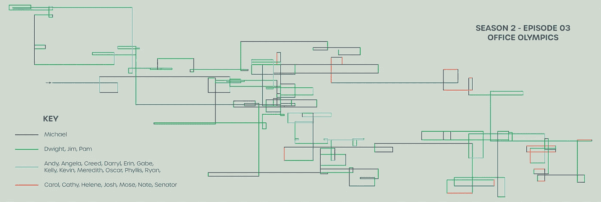

# 可视化文本数据集的设计者指南

> 原文：<https://towardsdatascience.com/a-designers-guide-to-visualize-a-text-dataset-1d534756e914?source=collection_archive---------12----------------------->

The Office — Season 5, Episode 17 — Golden Ticket

## [数据可视化](https://towardsdatascience.com/data-visualization/home)

## 用 Python 和 R 创建数据驱动的可视化

在本文中，我探索了一种使用 Python 和 R 代码可视化文本数据集的方法。作为一名用户体验和信息设计师，我想提高我的技术技能。我通过结合我的“兴趣”和挑选一个不寻常但有趣的数据集来实现这个目标。

经过一番寻找，我在布丁旁边的看到了这个精彩的互动 dataviz 项目 [**【办公室】五图对话。这个项目是一个很好的开始参考，它也给我指出了一个我可以想象的**](https://pudding.cool/2017/08/the-office/)**[可怕的数据集](http://www.officequotes.net/index.php)。这个数据集本质上是《办公室》每一集所有台词的集合。**

*太好了！我找到了数据，现在我终于可以开始了！*

# 第一步

首先，我决定根据我的技术能力和我希望学习的技能为这个项目设定一些目标和限制。

## 我需要知道我自己的项目的原因。

我当初为什么要启动这个项目？我希望学到什么？我想完成什么？

我这个项目的目标是:

*   使可视化代码足够简单，并且能够创建有趣的模式。
*   使用现有的 python 知识。
*   学习 R studio 中的图形渲染。
*   培养非数字数据的设计思维。
*   全职工作的同时管理兼职项目。

# 第二步

接下来，为了指导我的设计，我开始思考这个可视化的目标。我的方法是开始问一些可以探究的问题。

> 我们的目标不是回答所有的问题，而是用它们来集思广益可视化的概念和想法。

例如，一些问题是

*   每个角色的心路历程是怎样的？
*   每个角色的屏幕时间是多少？
*   所有的角色之间是如何互动的？
*   每一集都有哪些主角？

# 第三步

基于现有的数据和我的目标，我想出了一些想法和可行的解决方案。**我的想法围绕着表示从基于文本的数据集导出的数值。**

在开始编码之前，我决定勾勒出我的最终设计。这被证明是一个有用的工件，用于计算数学和逻辑。

在这里，我以非线性方式可视化了一个**线性对话。**

**一集中所说的每一段对话都被表示为一个线段。**为了传达对话的连续性，所有的线段都要相互连接。然而，它们以直角连接，即在一个线段的末端，下一个线段开始，但是具有 90°的枢轴。

如设计所示，我用以下方式编码数据-

*   对话(说出的单词数)→线段的长度
*   字符→颜色

非线性数据可视化的美妙之处在于，

## 真的真的真的真的(！)长文本可以包含在有限的空间内。

# 第四步

我需要将这个数据集转换成一个更加明确的结构，以便能够对它做一些有用的事情。现在，我的想法是使用 python 来清理数据，并使用 R 将其呈现为可视化形式。

> python 程序的**输出成为 R** 程序的**输入。**

## 那么，我期望 python 程序的输出是什么呢？

一个 CSV 文件，可以导入到 R studio 中，它包含关于每个线段的坐标及其颜色的信息。

我从一个随机的插曲开始- *办公室奥林匹克*！
(也恰好是我的最爱之一！)

我开始从网站上复制对话框并粘贴到一个**中。txt 文件**。我想也可以编写 python 代码来从网站上收集必要的数据。数据清理包括**删除不是对话框的文本**。在这个网站上，一集的故事情节，即每个角色的行为都被放在方括号中，并从整体文本中删除。

下一个任务是，计算数学。正如设计建议的那样，我**根据说对话的角色和它的长度，为每个线段**计算颜色和坐标。

# 步骤五

执行完这段 python 代码后，我有了必要的输入。我使用 python 程序生成的 CSV 文件，通过 R studio 绘制了基于线的数据可视化。尽管它是一小段相对简单的代码，但编写它是对`**ggplot2**`库的一次有用的学习经历。

瞧啊。就是这么做的。

# 最后的结果

在 Illustrator 中做了一些修改后，下面是这个项目的一些输出。我为不同的图案修补了颜色。

The Office — Season 2, Episode 3 — Office Olympics

The Office — Season 1

The Office — Some of my favorite cold opens

# 最终意见

我可以假设这可能不是你读过的最精彩或最复杂的东西。然而，我真的希望这是你今天遇到的最有趣的事情之一。

在这篇文章中，我想鼓励你，

*   **从小做起，然后迭代。你不必总是去追求一个“惊人”的想法。最好创建一些有多个微小失败循环的东西。**
*   思考盒子的外面和里面。
    你并不总是需要新的解决方案。通常，创新的解决方案是用新的方式做同样的事情。
*   **投身于你舒适区之外的项目。**
    接受挑战，以适应不舒服。

最后，如果您正在寻找与数据可视化相关的灵感，这里有一些项目可以帮助您开始:

 [## 少年派的艺术

### 探索隐藏在π中的艺术

www.visualcinnamon.com](https://www.visualcinnamon.com/portfolio/the-art-in-pi)  [## 文学星座

### 文学星座是一系列海报，旨在类似星座地图，但不是基于…

www.c82.net](https://www.c82.net/blog/?id=73) 

看看我的另一个项目，在那里我创建了手绘可视化来表示数据。

 [## 数据在艺术里！

### 利用颜色、形状和涂鸦来理解软数据和小数据

towardsdatascience.com](/the-data-is-in-the-art-b97cf2ceda7c)