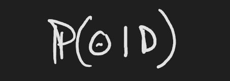
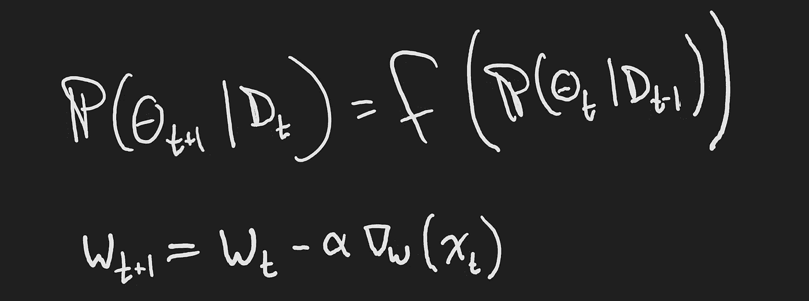

# 对贝叶斯规则的不同看法

> 原文：<https://towardsdatascience.com/a-different-take-on-bayes-rule-e303c1d7d5f6?source=collection_archive---------23----------------------->

## 从机器学习和增量学习的角度，对术语“后验”、“先验”和“可能性”有更多的直觉。

Bayes Rule — *θ* refers to the model, *D* refers to a data point

# 本文的目标

大多数阅读本文的人都看过贝叶斯规则中每个概率分布的演示。大多数阅读这篇文章的人已经正式了解了术语“后验”、“先验”和“可能性”。如果没有，那更好！

我认为将贝叶斯规则视为增量学习规则对许多人来说是一个新的视角。此外，我相信这个观点会给*更好的直觉，为什么*我们使用术语“后”和“前”。最后，我认为这个观点有助于解释为什么我不认为贝叶斯统计比频率主义统计导致任何更多的归纳偏差。

# 注释

在深入研究贝叶斯规则本身之前，首先重要的是就符号达成一致。 *θ* 指的是我们的模型。一个模型可以通过一个[类和一组参数](/foundations-of-ml-parameterized-functions-d2951a62272e)来识别。例如，我们的模型类可以是高斯分布。这个模型的参数是均值和方差。

另一个示例模型类是具有一个隐藏层和 256 个节点的神经网络。该模型的参数是与网络的每个节点相关联的权重。

*D* 指一组数据点。在上面的例子中 *D* 是一组标量值。

Theta is the set of parameters mu and sigma-squared referring to the mean and variance respectively.

# 术语

老实说，我讨厌行话。我知道当双方共享一个共同的词汇时，它允许更快和更精确的交流，但我发现过度依赖行话会导致忘记信息密集术语的含义。也就是说，让我们进入一些行话！

Posterior distribution

## 在后面的

给定数据的模型的概率。在贝叶斯世界中，我们不是在处理一个单一的实例化模型。我们处理模型上的概率分布。这个分布表示“根据我观察到的数据，我认为你的模型为 *θ* 的概率是 22%。”我们可以用许多不同的模型来查询这个分布，以询问每个模型给出观测数据的可能性有多大，或者我们可以询问这个分布最可能的模型是什么。

Prior distribution

## 在先的；在前的

一个模型的概率。贝叶斯概率最有争议的部分之一是包含先验分布。用机器学习的术语来说，你可以认为这是正则化的一种形式。先验允许你指定一个特定模型的概率，不管你观察的是什么数据。这让你可以说“我知道男性的平均身高不超过 8 英尺，给做出这种说法的模型分配零概率。”

Likelihood

## 可能性

如果这些数据是使用我的模型生成的，那么观察到这些数据的概率有多大？这种可能性让我们可以问，如果世界按照我们的模型运行，会发生什么。我们会看到这些特殊的样本吗？

想象一下，我们使用一个模型，这个模型说一个随机的人有 99%的可能性非常富有。然后，我从世界各地随机抽取一组人作为样本，问“根据我的世界模型，我画出这组人的概率是多少？”因为大多数人并不非常富有，在集合中，远少于 99%的人会非常富有。这种模式的可能性相当低。

# 增量学习

将贝叶斯规则视为增量学习规则的第一步是识别后验和先验之间的关系。通过天真地分析单词——忽略等式本身——人们可能会猜测先有先验，后有后验。让我们在等式中加入时间指数来使这一点更加清楚。

回忆条件概率的一个性质也很有用。当随机事件以非随机事件为条件时，随机事件的概率不变。

如果 *A* 是随机事件而 *B* 不是，那么当以 *B* 为条件时 *A* 发生的概率不变。

利用这个特性，我们可以对贝叶斯规则方程进行最后的修改。

The only thing that changed was the prior probability distribution.

我们的先验分布现在是以我们以前观察到的数据为条件的。这是对先验的合法更改，因为过去的数据不再是随机的。

为了理解为什么过去的数据不是随机的，想象你在时间步 *t-1* 上。你刚刚收到一个数据样本，你想知道你收到那个*特定*数据点的可能性有多大。这是因为你的数据是随机抽取的。你相应地改变你的模型，向前迈出一步。在时间步长 *t* 上，您在 *t-1* 上使用的样本会突然改变吗？没有。那个样本永远定格在历史里；它不再是一个随机变量。

Top — The posterior written as a function of the prior. Bottom — Stochastic Gradient Descent.

这样写贝叶斯规则，可以看出后验和先验的关系。在接收到一个数据点后，我们可以从模型的先前估计转向新的估计，即后验估计。我写的随机梯度下降更新规则是为了比较。在从之前的权重中减去一步后，我们计算出新的权重估计值 *W* 。

# 起点

贝叶斯统计的一个很有争议的点是先验分布的选择。当将贝叶斯规则视为增量学习规则时，我们可以很容易地看到，这并不是贝叶斯统计所独有的。任何增量学习规则*必须*选择一个起点，一组初始的权重或参数。贝叶斯法则也不例外。

我指出这一点只是因为在线学习社区似乎对贝叶斯统计有特殊的看法。有许多反对贝叶斯统计的论点(也有许多赞成！)，但我认为归纳偏差论点并不是一个有效的例子。

# 结论

采用贝叶斯规则的增量学习观点可以理解与之相关的术语的选择。理解这个观点也打开了更深入理解贝叶斯推断和贝叶斯优化的大门。