# 一种狗检测器和品种分类器

> 原文：<https://towardsdatascience.com/a-dog-detector-and-breed-classifier-4feb99e1f852?source=collection_archive---------6----------------------->

在像物理学这样的领域，事情变得越来越难，以至于除非用高度简化的术语，否则很难理解前沿发生了什么。然而，在计算机科学中，尤其是人工智能，世界各地的人们经过 70 多年慢慢积累起来的知识仍然是非常直观的。事实上，由于高级编程语言、框架和重视以易于访问的格式共享知识的社区，进入这个领域变得越来越容易了！

在这篇博文中，我们将做一些十年前不可能的事情，但像我这样的学生现在可以用几行 Python 代码完成；建立一个系统，可以识别照片中是人还是狗，并告诉我们它是什么品种(或者最像！).

你可以在我的 [Github](https://github.com/HenryDashwood/dog_breed_classifier) 找到代码。

# 探测人和狗

有几种方法可以解决图像分类问题。在这篇博文中，我们将使用卷积神经网络来确定狗的品种。在此之前，我们将使用 [Viola-Jones haar 级联分类器方法](https://www.cs.cmu.edu/~efros/courses/LBMV07/Papers/viola-cvpr-01.pdf)来检测照片中是否包含人脸。

CNN 现在得到了最多的关注，但是你以前肯定见过 Viola-Jones 方法。每当你打开相机，它就会在人脸周围画出方框。[诺丁汉大学的迈克·庞德做了一个很棒的视频讲解，可以在这里观看](https://www.youtube.com/watch?v=uEJ71VlUmMQ)。简而言之，我们找出哪些过滤器最擅长区分人脸和非人脸。最佳滤波器应用于图像的每个区域。如果一个区域通过，它将在下一个过滤器上被测试。对大约 6000 个其他过滤器重复这一过程，如果一个区域通过了所有这些过滤器，我们就断定它包含一张脸。

报纸上还有很多其他的东西。例如，作者开发了一种简单而聪明的方法来有效地计算图像中某个区域的像素值。我们所需要做的就是从一个名为 [OpenCV](https://opencv.org/) 的库中下载这些预先训练好的滤镜，并通过它们运行我们的照片。

```
import cv2def face_detector(img_path):
    img = cv2.imread(img_path)
    gray = cv2.cvtColor(img, cv2.COLOR_BGR2GRAY)
    faces = face_cascade.detectMultiScale(gray)
    return len(faces) > 0
```

就这样，它计算出图像中有多少张人脸！

不幸的是，OpenCV 的好人们没有为我们建立一些好的 haar 过滤器。相反，我们将使用 ImageNet，这是一个由 1400 万张图片组成的数据集，分为 2 万个类别。在过去十年中，它一直是领先的计算机视觉基准之一。我们将使用一个较小版本的 ImageNet，包含 1000 个类别，其中类别 151–268 是狗的品种。

我们可以使用一个名为 Resnet 的预训练 CNN，我们可以从 Keras 的网站上下载(稍后会有更多关于 Keras 的内容)。

```
from keras.applications.resnet50 import ResNet50ResNet50_model_ = ResNet50(weights='imagenet')
```

我们需要做一些预处理，以便模型可以对我们的图像做出预测:

```
from keras.preprocessing import image             
from tqdm import tqdmdef path_to_tensor(img_path):
    img = image.load_img(img_path, target_size=(224, 224))
    x = image.img_to_array(img)
    return np.expand_dims(x, axis=0)def paths_to_tensor(img_paths):
    list_of_tensors = [path_to_tensor(img_path) for img_path in tqdm(img_paths)]
    return np.vstack(list_of_tensors)
```

现在，我们可以看到模型做出的预测是否符合某个犬种类别:

```
from keras.applications.resnet50 import preprocess_input, decode_predictionsdef ResNet50_predict_labels(img_path):
    img = preprocess_input(path_to_tensor(img_path))
    return np.argmax(ResNet50_model_.predict(img))def dog_detector(img_path):
    prediction = ResNet50_predict_labels(img_path)
    return ((prediction <= 268) & (prediction >= 151))
```

最后，当我在 100 张样本图像上测试检测器时，人脸和狗的检测器没有任何假阴性。狗探测器也没有任何误报！

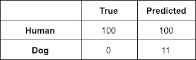

Our human face detector results

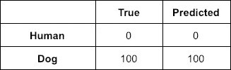

Our dog detector results

## 决定狗的品种

所以我们可以说在这幅画中有某种狗或人。但我本可以做到的。我能说出 117 个不同品种的区别吗？可能不能。让我们看看是否可以用机器学习来区分。

是时候破解 Keras 库了。像 Tensorflow、Pytorch、Theano 或 CNTK 这样的框架为我们执行机器学习操作。Keras 是一个建立在这些之上的库，所以我们可以用一种更简洁易读的方式编写代码。

以下是我们在 Keras 对 CNN 的定义:

```
model = Sequential()model.add(Conv2D(32, (3, 3), input_shape = (224, 224, 3), use_bias=False))
model.add(BatchNormalization())
model.add(Activation('relu'))
model.add(MaxPooling2D(pool_size = (2,2)))
model.add(Dropout(0.2))model.add(Conv2D(64, (2,2), use_bias=False))
model.add(BatchNormalization())
model.add(Activation('relu'))
model.add(MaxPooling2D(pool_size = (2,2)))
model.add(Dropout(0.2))model.add(Conv2D(128, (2,2), use_bias=False))
model.add(BatchNormalization())
model.add(Activation('relu'))
model.add(MaxPooling2D(pool_size=(2,2)))
model.add(Dropout(0.2))model.add(Flatten())model.add(Dense(512, use_bias=False))
model.add(BatchNormalization())
model.add(Activation('relu'))
model.add(Dropout(0.2))model.add(Dense(256, use_bias=False))
model.add(BatchNormalization())
model.add(Activation('relu'))
model.add(Dropout(0.2))model.add(Dense(len(dog_names), activation='softmax'))model.summary()
```

这是怎么回事？我们有 3 个卷积层，后面是 3 个全连接层。这最后一层有一个 softmax 激活函数，这意味着我们的输出将是一个有 1000 个值的概率分布，我们使用的 ImageNet-1000 数据库中的每个可能结果都有一个值。

接下来我们将定义优化器和损失函数。这一行有许多术语，所以我将试着解释一下。

*   *SGD* 或随机梯度下降是最好的比喻，滚下一座山。如果你找到了下去的路，继续走。如果没有，请尝试不同的方向。请记住，在多维数学世界中，不仅仅只有 3 个维度可供选择。当你在某个方向达到局部最小值时，你就会知道，因为你所在的曲线的梯度会变小。这些都是在引擎盖下为我们处理的。
*   *lr* 是我们的学习率。给定一条新信息，我们应该在多大程度上改变模型？小比率意味着缓慢的训练，但大比率意味着我们可能会跳过最佳解决方案到山谷的另一边。最佳解决方案是使用…
*   *衰减*意味着我们开始时学习率很高，当我们接近山/谷底部时，学习率随着每个时期而降低。
*   *clipnorm* 用于裁剪渐变，这样它们就不会变得过大或过浅，这会使渐变下降变得困难。 *clipnorm* 如果发生这种情况，剪辑值，但也缩放梯度，所以我们没有剪辑一些而不是其他的
*   *涅斯捷罗夫*动量是我们向前看了一步后计算的梯度。这有助于我们更快地训练。
*   *分类 _ 交叉熵*是损失函数。这意味着我们正在判断模型的性能，以及我们需要在多大程度上调整它，这取决于我们在检查结果后收到了多少新信息。如果我确定我见过一只金毛寻回犬，并且我是对的，那么就没有多少新的信息被创造出来。如果我不确定，那么已经创造了一些。如果我确定它不是金毛寻回犬，但它确实是，那么大量的信息就产生了。
*   *准确性*是我们将监控的指标。它就像罐头上说的那样。它*为多类分类问题*计算所有预测的平均准确率。换句话说，有多少狗被正确分类。

```
sgd = SGD(lr=0.01, clipnorm=1, decay=1e-6, 
          momentum = 0.9, nesterov=True)model.compile(optimizer=sgd, loss='categorical_crossentropy',   
              metrics=['accuracy'])
```

然后我们就好训练了！

```
checkpointer = ModelCheckpoint(     
             filepath='saved_models/weights.best.from_scratch.hdf5', 
             verbose=1, save_best_only=True)model.fit(train_tensors, train_targets, 
          validation_data=(valid_tensors, valid_targets), epochs=5,   
          batch_size=20, callbacks=[checkpointer], verbose=1)
```

如果我们运行 6 个时期，会发生以下情况:

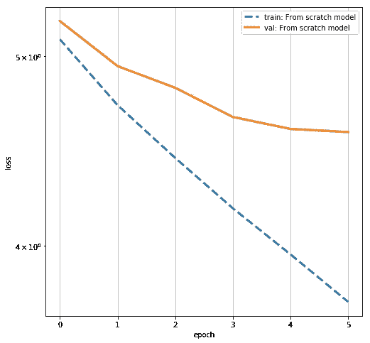

The training and validation losses as our model trained

培训损失随着我们的培训而改善，但验证损失看起来将趋于平缓。这意味着如果我们长时间训练它，我们的模型将开始过度拟合。

在测试集上，该模型正确预测了它看到的 3.7%的狗的品种。这比随机猜测要好 4 倍，但仍有相当大的改进空间。

## 迁移学习

进入迁移学习。我们可以采取一个预训练的模型，就像我们对探测器所做的那样，并在它的末端添加我们自己的层来为我们做出预测。我们将使用的模型是 Resnet50，已经由微软的研究人员在更大的机器上进行了训练，时间超过了我所能获得的时间。

我们可以下载权重，将它们存储在本地，然后像这样解包特性:

```
bottleneck_features = np.load(
                           'bottleneck_features/DogResnet50Data.npz'
                           )
train_Resnet50 = bottleneck_features['train']
valid_Resnet50 = bottleneck_features['valid']
test_Resnet50 = bottleneck_features['test']
```

使用 Keras 很容易获得 Resnet50 并在它的末尾添加我们自己的层。同样，我们希望我们的输出是每个品种的概率分布

```
Resnet50_model = Sequential()
Resnet50_model.add(
        GlobalAveragePooling2D(input_shape=train_Resnet50.shape[1:])
        )
Resnet50_model.add(Dense(133, activation='softmax'))
```

之后就和以前一样了

```
Resnet50_model.compile(
                       loss='categorical_crossentropy', 
                       optimizer=sgd, 
                       metrics=['accuracy']
                      )checkpointer = ModelCheckpoint(
                 filepath='saved_models/weights.best.Resnet50.hdf5', 
                 verbose=1, 
                 save_best_only=True
                 )resnet50_hist = Resnet50_model.fit(
                    train_Resnet50, 
                    train_targets, 
                    validation_data=(valid_Resnet50, valid_targets),
                    epochs=20, 
                    batch_size=56, 
                    callbacks=[checkpointer],    
                    verbose=1
                    )
```

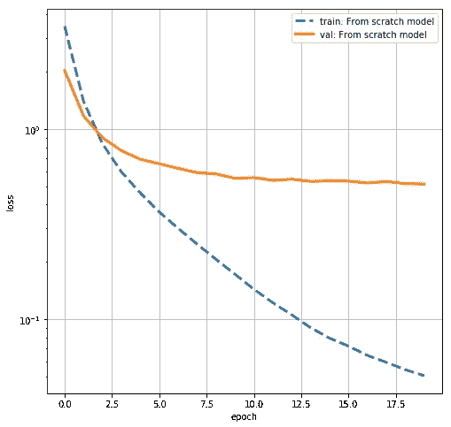

这种模式有多好？在测试集上，它正确预测了 84%的品种！这比我和我的疯狗家庭得到的要多得多。

## 尝试一下

将我们的人类和狗检测器与品种预测器结合起来，让我们在一些照片上尝试一下。

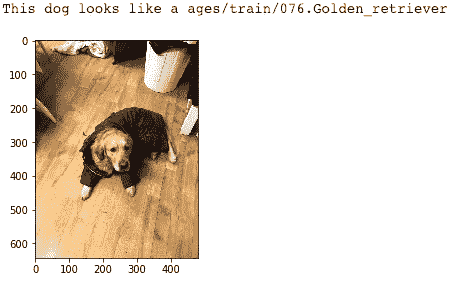

Correct! Not even the Barbour jacket confuses it

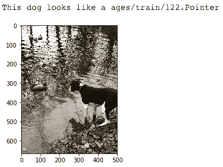

Correct! Ironically, my it’s my dog who is overfitting in this photo (those ducks are plastic!)

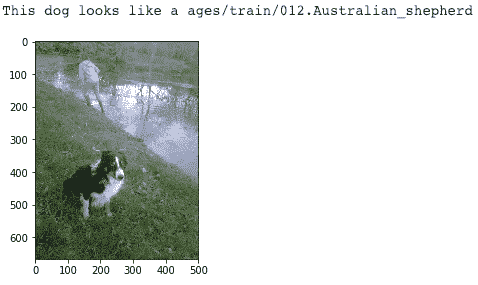

Wrong, this is actually a Border Collie.

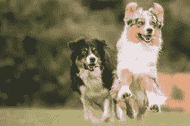

But he does look like an Australian Shepherd

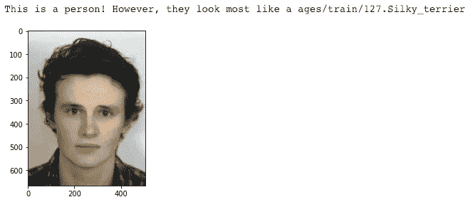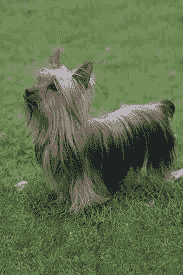

Silky Terrier, who knew?

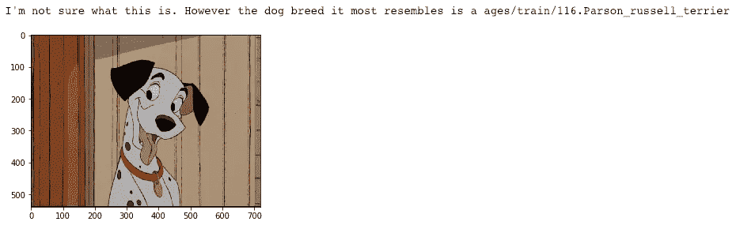

It’s got a bit confused by Pongo…

然而，如果我们仔细观察模型的预测，我们可以看到达尔马提是第二名，所以不算太坏。

```
bottleneck_feature = extract_Resnet50(path_to_tensor('images/pongo.png'))
predicted_vector = Resnet50_model.predict(bottleneck_feature)top_predictions = np.argpartition(predicted_vector.flatten(), -4)[-4:]
for i in top_predictions:
    print(dog_names[i])
```

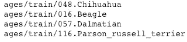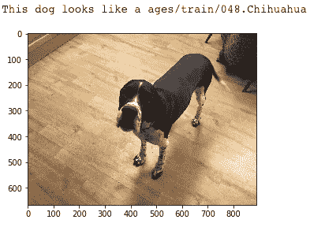

Well you can’t win them all!

## 潜在的改进

我们在这里可以做更多的事情。世界上最好的模型在有更多可能类别的 ImageNet 版本上获得了比我更好的测试精度。我们可以通过租用多个 GPU、获取更多带标签的图像等来获得一些改进，但这基本上归结为花钱，在概念上不是很有趣。

我们可以改进这个模型的一个方法是使用数据扩充。例如，通过翻转、移动、旋转、变暗、变亮、添加噪声和许多其他可能的操作，我们可以人为地增加模型可以暴露的图像的数量。我在这个项目中试验了数据扩充，结果令人失望。有可能通过一些参数调整和更长时间的训练，我会看到一些改善。

我们可以改变 CNN 本身。有可能更多的层，更多的特征，不同的损失函数，学习率和其他各种变化会使它表现得更好。深度学习的很大一部分是对模型进行修改，只有在它确实改善了事情的情况下才进行学习。如果我有更多的 GPU 时间，我可能会尝试使用网格搜索在一夜之间系统地实验不同的超参数。

## 结论

在本帖中，我们有:

*   从 ImageNet 加载并预处理图像。
*   加载了一些预训练的 haar 级联分类器，以便使用 Viola Jones 方法检测人脸。
*   加载了一个预先训练好的 CNN 来探测狗。
*   从头开始编写和训练了一个 CNN 来对狗的品种进行分类。这在测试集上成功了 3.7%，这听起来很低，但比机会好 4 倍。
*   使用迁移学习从根本上改善了 CNN 的性能，使其在测试集上的准确率达到 84%。
*   用我自己的几张照片测试了这个模型。
*   讨论了未来改进模型的方法。

也许你在这篇文章中学到了一些东西。我从写作中学到了很多。如果你发现了一个错误，或者认为有些东西可以更好地措辞，让我知道，我会更新它！

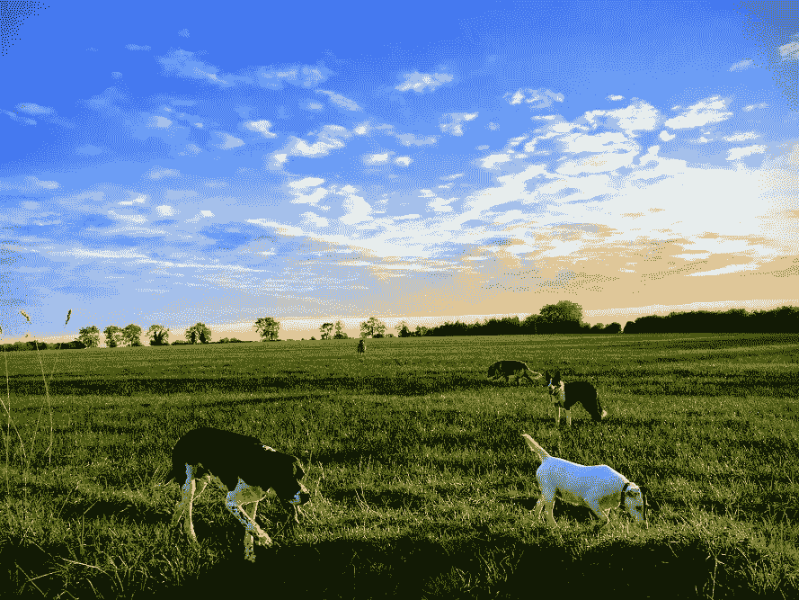

Happy Coding!