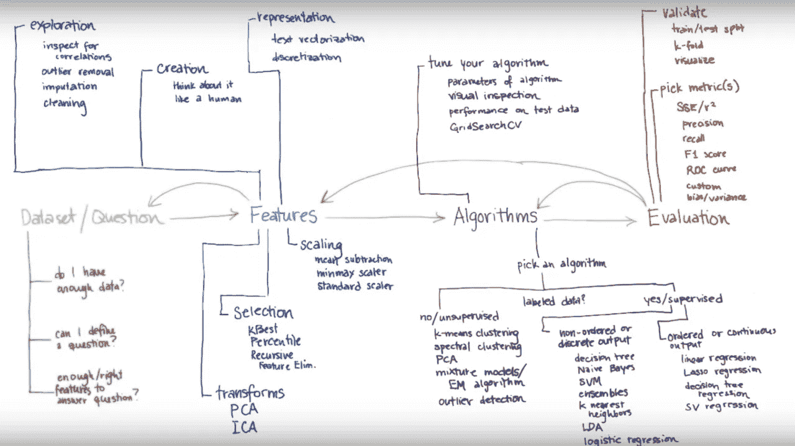

# ML 和敏捷注定的联姻

> 原文：<https://towardsdatascience.com/a-doomed-marriage-of-ml-and-agile-b91b95b37e35?source=collection_archive---------28----------------------->

## 如何不对 ML 项目应用敏捷

Photo by [photo-nic.co.uk nic](https://unsplash.com/@chiro?utm_source=unsplash&utm_medium=referral&utm_content=creditCopyText) on [Unsplash](https://unsplash.com/s/photos/falling?utm_source=unsplash&utm_medium=referral&utm_content=creditCopyText)

**TLDR** :在一个 ML 项目中过分使用敏捷和塞巴斯蒂安的话的三个错误。我认为在 ML 项目中什么是敏捷的，什么是不敏捷的。

***免责声明*** *:这篇文章没有得到我工作的任何公司或我提到的任何工具或服务的支持或赞助。我交替使用人工智能、数据科学和 ML 这三个术语。*

***喜欢读什么？*** *跟我上* [*中*](https://medium.com/@ianxiao)*[*LinkedIn*](https://www.linkedin.com/in/ianxiao/)*，或者*[*Twitter*](https://twitter.com/ian_xxiao)*。还有，作为一名数据科学家，要不要学习商业思维和沟通技巧？查看我的《* [*用机器学习影响*](https://www.bizanalyticsbootcamp.com/influence-with-ml-digital) *》指南。**

# *一份供词*

*现在是 2016 年 11 月 3 日晚上 11 点 35 分。我坐在多伦多市中心海湾街的一间会议室里。我盯着街道那头空荡荡的办公室的地板。我房间的灯暗了下来。我的手机亮了。我收到了三份通知。*

*//10 小时后的执行演示。*

*//打电话给杰斯。在 12 小时内发送最终的婚礼后勤细节。*

*//去机场。18 小时后飞往香港参加我们的婚礼。*

*“F*ck… F*ck。F*ck！”*

*我敲了敲键盘；笔记本电脑已打开；弹出了一个号码。还是不行。我该如何解释预期转化率下降 35%的原因？*

*我拿起电话打给西蒙，他是我的同事，会在演示中支持我:“让我们计划一下损失控制。”*

*“喂，你在想我们的婚礼吗？”我可爱的妻子杰斯问道。*

*我突然回到现在。现在是 2019 年 11 月 5 日。我坦白。不，我不是在想我们的婚礼，而是结婚纪念日快乐！我永远不会忘记这个日子。*

# *该死的，塞巴斯蒂安*

*我喜欢关于 ML 的成功故事。但是，让我们面对现实:大多数 ML 项目都失败了。很多项目失败是因为我们试图用 ML 解决错误的问题；有些失败是因为我们没有足够重视[最后一英里问题](/fixing-the-last-mile-problems-of-deploying-ai-systems-in-the-real-world-4f1aab0ea10)和[工程和组织问题](/the-last-defense-against-another-ai-winter-c589b48c561)。有几个失败了，因为我们觉得[数据科学很无聊](/data-science-is-boring-1d43473e353e)并且不再关心。剩下的和我告白里的那个一样，都是因为项目管理不善而失败的。*

*如果我要从这次经历中吸取一个教训，那就是:**不要过度敏捷。这一切都是从巴斯蒂安·特龙的一张图开始的。***

*这是我最喜欢的 ML 工作流程图，部分原因是 Sebastian 拥有最好的手写效果，是用电脑写字板写的(真的)。但是，这里有一个重要的细微差别。*

**

*Sebastian Thrun, [Udacity](https://www.udacity.com/) — Introduction to Data Science, the Best Online Course!*

# *我的无知，细微差别，以及发生了什么*

*首先，我必须承认我自己的无知。我是一个天真的敏捷方法论的拥护者，因为[瀑布](https://airbrake.io/blog/sdlc/waterfall-model)是如此的老派和无趣。像我一样，你们中的许多人可能听说过敏捷:迭代允许我们快速学习、测试和失败。(*此外，我们通过节省撰写技术规范的论文来减少砍伐树木，这些技术规范没有人阅读，而且在早期项目中可能是错误的)。**

***细微差别。**不应有箭头指向问题和评估(绿色和红色文本)阶段。敏捷的迭代原则**不应该应用**到我们定义核心问题和评估度量的阶段。*

*核心问题必须尽早清楚地阐明。然后，必须立即想出子问题(参见[假设驱动的问题解决](http://www.consultantsmind.com/2012/09/26/hypothesis-based-consulting/)方法)。他们帮助 1)识别好的特性想法并推动探索性分析，2)计划时间表，以及 3)决定每个敏捷 Sprint 应该关注什么。必须根据核心问题仔细选择评估指标。我在我的[指南](https://www.bizanalyticsbootcamp.com/influence-with-ml-digital)中详细讨论了这个过程。*

***那么，发生了什么？**未能认识到自己的无知和 ML 工作流程中的细微差别导致了 3 个致命错误。*

****错误#1:*** 我们中途更改了[目标变量](https://www.datarobot.com/wiki/target/)，因为对核心业务问题的定义有误。这导致了[数据泄露](https://machinelearningmastery.com/data-leakage-machine-learning/)破坏了我们的模型性能。我们不得不对大约 35%的代码库进行重新编码，并花费大约 2 周的时间重新尝试不同的数据转换和模型架构。那是一场噩梦。*

****错误#2:*** 我们优先考虑低影响特征，因为我们的子问题没有经过深思熟虑。嗯，其中一些功能是创新的，但回想起来并没有用。这浪费了宝贵的开发时间，而这在有时间限制的咨询环境中是极其重要的。*

****错误#3* :** 我们改变了评估指标。我们必须重新设计我们的模型架构，并重新运行[超参数搜索](https://en.wikipedia.org/wiki/Hyperparameter_optimization)。这需要新的测试用例。我们不得不手动运行许多回归测试。*

*所有这些错误都反映在客户体验、团队士气和时间表上。最终，他们导致了我婚礼前的一个非常紧张的夜晚。*

# *变得更聪明*

*好吧。说句公道话。我确实断章取义了塞巴斯蒂安的建议。他是曼梯·里最好的老师(对不起，[吴恩达](https://medium.com/u/592ce2a67248?source=post_page-----b91b95b37e35--------------------------------))。*

*Sebastian 的工作流程主要是为以实验为中心的 ML 项目而设计的(例如 BI 或洞察发现)。对于像我们这样的以工程为重点的 ML 项目(例如，全栈 ML 系统)，工作流程应该基于软件工程和产品管理的最佳实践进行优化。*

*以下是我对什么是敏捷或者不是敏捷的看法。这对于有时间限制的咨询或内部原型项目尤为重要。没有十全十美的方法，所以不要走得太远，要聪明地运用。*

***敏捷能力:***

*   *数据特征的发展*
*   *模型架构的开发*
*   *面向用户的用户界面的设计和开发(例如仪表板、网络用户界面等)。)*
*   *设计开发 [CICD](https://semaphoreci.com/blog/cicd-pipeline) 测试用例*

***不灵活:***

*   *如果最终消费者是人，用户体验；如果最终消费者是系统，集成模式和协议*
*   *核心、子问题和主要功能想法列表的定义*
*   *目标变量的定义(不惜一切代价避免改变。但是如果业务需求发生变化，锁定 CICD 管道非常有助于捕捉数据或软件错误。)*
*   *评估指标*
*   *管道:数据到模型和 [CICD](https://semaphoreci.com/blog/cicd-pipeline) 与 [DVC](https://dvc.org/)*
*   *基础设施:集成模式、服务层、关键数据库和硬件平台*

*到目前为止效果还不错。一如既往地欢迎任何反馈。*

*根据对这篇文章的反应，我可能会跟进**如何使用瀑布和敏捷来计划一个 ML 项目**的工作计划图和需求示例。*

*请在 [Medium](https://medium.com/@ianxiao) 、 [LinkedIn](https://www.linkedin.com/in/ianxiao/) 或 [Twitter](https://twitter.com/ian_xxiao) 上关注我。如果你喜欢这篇文章，**请分享**，这样其他人就可以加入对话。*

*正如你所看到的，能够清晰地表达核心问题并得出分析、特征想法和模型选择对项目的成功至关重要。我整合了我在 [**影响力与 ML**](https://www.bizanalyticsbootcamp.com/influence-with-ml-digital) 迷你课程中提供给学生和从业者的研讨会材料。希望你觉得有用。*

*喜欢你读的书吗？你可能也会喜欢我这些受欢迎的文章:*

* [## 最有用的 ML 工具 2020

### 每个懒惰的全栈数据科学家都应该使用的 5 套工具

towardsdatascience.com](/the-most-useful-ml-tools-2020-e41b54061c58)  [## 被遗忘的算法

### 用 Streamlit 探索蒙特卡罗模拟

towardsdatascience.com](/how-to-design-monte-carlo-simulation-138e9214910a)  [## 越狱

### 我们应该如何设计推荐系统

towardsdatascience.com](/how-to-design-search-engines-24e9e2e7b7d0)  [## 12 小时 ML 挑战

### 如何使用 Streamlit 和 DevOps 工具构建和部署 ML 应用程序

towardsdatascience.com](/build-full-stack-ml-12-hours-50c310fedd51)  [## 数据科学很无聊

### 我如何应对部署机器学习的无聊日子

towardsdatascience.com](/data-science-is-boring-1d43473e353e)  [## 抵御另一个人工智能冬天的最后一道防线

### 数字，五个战术解决方案，和一个快速调查

towardsdatascience.com](/the-last-defense-against-another-ai-winter-c589b48c561)  [## 人工智能的最后一英里问题

### 许多数据科学家没有充分考虑的一件事是

towardsdatascience.com](/fixing-the-last-mile-problems-of-deploying-ai-systems-in-the-real-world-4f1aab0ea10)  [## 我们创造了一个懒惰的人工智能

### 如何为现实世界设计和实现强化学习

towardsdatascience.com](/we-created-a-lazy-ai-5cea59a2a749)*