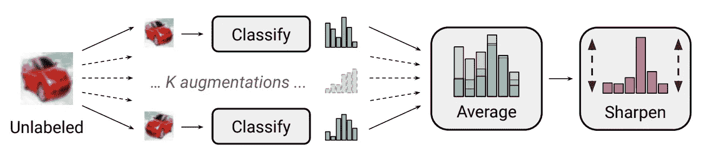
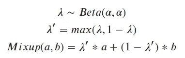
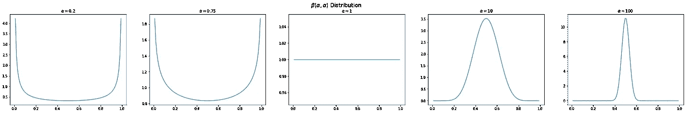
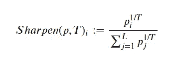
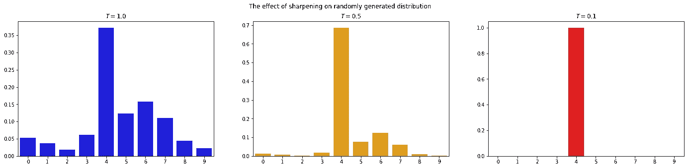
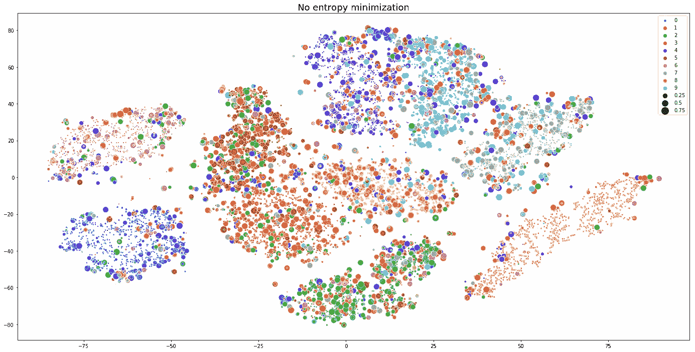
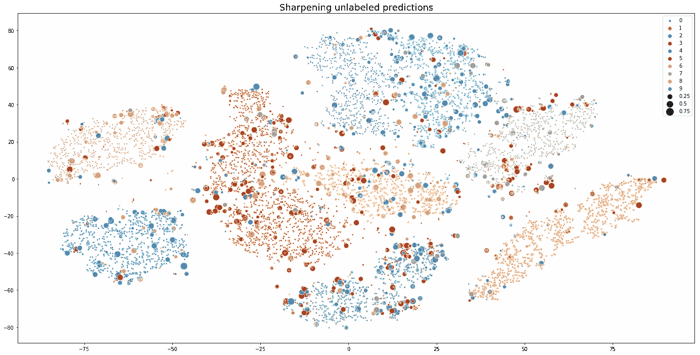
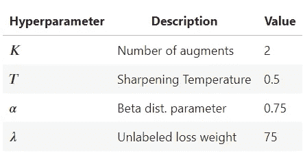
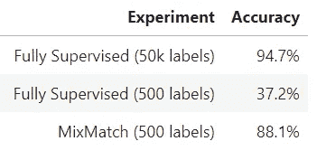

# MixMatch 的 fastai/Pytorch 实现

> 原文：<https://towardsdatascience.com/a-fastai-pytorch-implementation-of-mixmatch-314bb30d0f99?source=collection_archive---------20----------------------->

在这篇文章中，我将讨论和实现“MixMatch:半监督学习的整体方法；由贝特洛，卡利尼，古德菲勒，奥立佛，帕伯诺和拉斐尔[1]。MixMatch 于 2019 年 5 月发布，是一种半监督学习算法，其性能明显优于以前的方法。这篇博客来自加州州立大学东湾分校 Ehsan Kamalinejad 博士的机器学习研究小组的讨论。

MixMatch 的改进有多大？当在具有 250 个标记图像的 CIFAR10 上训练时，MixMatch 在错误率(11.08%对 36.03%；作为比较，在所有 50k 个图像上完全监督的情况具有 4.13%的误差率)。[1]这些远远不是增量结果，该技术显示出显著改善半监督学习状态的潜力。

半监督学习在很大程度上是一场反对过度适应的战斗；当标记集很小时，不需要非常大的神经网络来记忆整个训练集。几乎所有半监督方法背后的一般思想是利用未标记数据作为有标记数据训练的正则化器。对于各种半监督学习方法的概述，请参见 Sebastian Ruder 的这篇博客文章。不同的技术采用不同形式的正则化，MixMatch 论文将它们分为三组:熵最小化、一致性正则化和一般正则化。由于所有三种形式的正则化都被证明是有效的，MixMatch 算法包含了每种形式的特征。

MixMatch 是对近年来出现的几种技术的组合和改进，包括:刻薄老师[2]、虚拟对抗训练[3]和 Mixup [4]。在高层次上，MixMatch 的思想是使用来自模型的预测来标记未标记的数据，然后以多种形式应用大量正则化。第一种是执行几次数据扩充，并对标签预测取平均值。这些预测然后被“锐化”以减少它们的熵。最后，在标记和未标记的集合上执行混合。

Diagram of MixMatch — Image taken from original paper [1]

我这篇文章的目标是那些熟悉 Pytorch 的人，但不一定是 fastai。这篇文章的 Jupyter 笔记本版本包含了重现所有结果所需的全部代码，参见[这个资源库。](https://github.com/noachr/MixMatch-fastai)

## 法斯泰

在进入本文之前，我将简要介绍一下 [fastai](https://github.com/fastai/fastai) 。Fastai 是一个基于 Pytorch 的库，它使得编写机器学习应用程序变得更加容易和简单。Fast.ai 还提供了一个[非常棒的在线课程](https://course.fast.ai/)，涵盖了 fastai 和深度学习。与纯 Pytorch 相比，fastai 大大减少了生成最先进的神经网络所需的样板代码的数量。这里我们将使用 fastai 的数据管道和训练循环特性。

Imports

# 成分

让我们首先描述组装 MixMatch 所需的各个部分，然后在最后将它们放在一起形成完整的算法。根据本文，我们将使用 CIFAR10 并随机选择 500 张图像作为标记的训练集。标准的 10000 图像测试装置用于所有精度测量。

## 数据扩充

数据增强是一种广泛使用的一致性正则化技术，其最大的成功(到目前为止)是在计算机视觉领域。这个想法是在保留语义标签的同时改变输入数据。对于图像，常见的放大包括旋转、裁剪、缩放、增亮等。—不改变图像基本内容的所有变换。MixMatch 通过多次执行增强来产生多个新图像，从而更进一步。然后对这些图像上的模型预测进行平均，以产生未标记数据的目标。这使得预测比使用单一图像更加稳健。作者发现仅仅两次增加就足以看到这种好处。

Fastai 有一个高效的转换系统，我们将在数据上加以利用。然而，由于它被设计为每个图像只产生一个增强，而我们需要几个，我们将从修改默认的 LabelList 开始，以发出多个增强。

Multiple Augmentation

Fastai 的[数据块 api](https://docs.fast.ai/data_block.html) 允许灵活地加载、标记和整理几乎任何形式的数据。然而，它没有一种方法来获取一个文件夹的子集和另一个文件夹的整体，而这是这里所需要的。因此，我们将对 ImageList 类进行子类化，并添加一个自定义方法。我们将使用不带参数的 fastai 的`get_transforms`方法来使用默认的图像转换；它们是围绕中心 y 轴翻转、旋转 10 度、缩放、光照变化和扭曲。Fastai 的变换系统在应用时会自动随机化每个变换的确切参数。

## 混合

Mixup

Mixup 首先由张、西塞、多芬和洛佩兹-帕兹[4]在 2018 年提出，属于一般或传统正则化的范畴。Mixup 不是将单个图像传递给模型，而是在两个独立的训练图像之间执行线性插值，然后将其传递给模型。使用与图像相同的λ系数，图像的一个热编码标签也被内插。该系数是从贝塔分布中随机抽取的，由阿尔法参数化。通常，α需要根据数据集进行调整。当α值较小时，贝塔分布的大部分权重在尾部，接近 0 或 1。随着α的增加，分布变得均匀，然后在 0.5 左右逐渐达到峰值。因此，α可以被视为控制混合的强度；较小的值只会导致少量的混合，而较大的值偏向于最大混合(50/50)。在极端情况下，α=0 导致完全没有混合，当α→∞，β接近以 0.5 为中心的狄拉克δ分布。作者建议从 0.75 开始，如下图所示，大部分重量仍然在尾部。本文对原方法做了一处修改，即把λ设为 max(λ，1-λ)；这使混音偏向原始图像。

Beta Distribution

Mixup

## 磨刀

Sharpen

作者使用上述方程作为熵最小化的一种形式，增强了模型对未标记数据的预测。如果温度 **T** 这个相对简单的步骤，不涉及任何学习参数，对算法来说非常重要。在一项烧蚀研究中，该论文报告称，当移除锐化步骤(将 **T** 设置为 1)时，精度降低了 16%以上。

Sharpening random distribution

半监督学习中熵最小化背后的思想是分类器的决策边界不应穿过数据空间的高密度区域。如果是这种情况，边界会将非常接近的数据分开。此外，微小的扰动会导致预测的巨大变化。由于决策边界附近的预测更不确定，熵最小化寻求使模型对其预测更有信心，从而使边界远离数据。虽然其他方法[3]将熵项添加到损失中，但是 MixMatch 通过上面的等式直接降低了未标记目标的熵。

作为这种技术的一个例子，让我们尝试一个比 CIFAR-MNIST 更简单、更容易可视化的分类问题。我们仍然将 500 个随机样本作为带标签的训练集，而将其余的样本作为无标签的训练集。完整的图像用于训练，但我们也将使用 tSNE 将每个图像缩减为二维图像进行可视化。按照 MixMatch 关于未标记数据的相同方法，以半监督方式进行训练，我们将使用模型本身来生成伪标签。该模型仅由两个卷积层和一个线性头部组成。没有使用混淆或数据扩充，所以我们可以隔离熵最小化的影响。损失函数在很大程度上也与 MixMatch 相同，对标记数据使用交叉熵，对未标记数据使用均方误差(有关其背后的原理，请参见下面的损失部分)。上面的图像是在没有使用锐化的情况下训练的，而在下面的图像中，伪标签是用 **T** =0.5 锐化的。分别对十个时期进行训练，非锐化模型的测试准确率为 80.1%，锐化模型的准确率为 90.7%。在下图中，颜色对应于预测的类，标记大小与预测置信度成反比(标记越小越有把握)。如标记大小所示，非锐化模型有很多不确定性，尤其是在聚类的边缘周围，而锐化模型在其预测中更有信心。

*The effect of sharpening on the semi-supervised training of MNIST. Images in MNIST were reduced to two dimensions using tSNE. Colors correspond to predicted class, and marker size is inversely proportional to prediction confidence (smaller markers are more confident). The upper image depicts training with T=1, and the lower image with T=0.5.*

# MixMatch 算法

现在所有的部分都准备好了，完整的算法就可以实现了。下面是单个训练迭代的步骤:

1.  提供一批带标签的数据和一批无标签的数据
2.  扩充标记的批次以产生新的训练批次。
3.  将未标记批次中的每个图像放大 K 倍，以产生总共批次大小* K 个新的未标记样本。
4.  对于未标记批次中的每个原始图像，将 K 个扩充版本传递给模型。对增强的模型预测进行平均，以产生增强图像的单个伪标签。
5.  锐化伪标签。
6.  扩充的标记数据集及其标签形成集合 x。扩充的未标记数据及其(预测的)标签形成集合 u。
7.  将集合 U 和 X 连接成集合 w。
8.  通过对集合 X 和|X|应用混合来形成集合 X。
9.  通过对集合 U 和步骤 8 中未使用的 W 中的示例应用混合来形成集合 U′。

然后将集合 X '(标记的混合)和 U '(未标记的混合)传递给模型，并使用相应的混合标签计算损失。

## 模型

我们将使用 28 层的宽 resnet 模型，生长因子为 2，以匹配纸张。我们将使用 fastai 包含的 WRN 实现，并与本文中使用的架构相匹配。

## 失败

有了数据和模型，我们现在将实现训练所需的最后一部分——损失函数。损失函数是两项的总和，即标记损失和未标记损失。标记损失使用标准交叉熵；然而，未标记的损失函数是 l2 损失。这是因为 l2 损失对非常不正确的预测不太敏感。交叉熵损失是无界的，并且随着模型的正确类别的预测概率趋向于零，交叉熵趋向于无穷大。然而，对于 l2 损失，由于我们正在处理概率，最坏的情况是当目标为 1 时模型预测为 0，反之亦然；这导致损失 1。由于未标记的目标来自模型本身，该算法不想过于严厉地惩罚不正确的预测。参数λ ( `l`在代码中，因为λ是保留的)控制这两项之间的平衡。

我们将通过在第一个 3000 次迭代(大约 10 个时期)中线性增加未标记损失的权重来稍微偏离本文。在应用这个 rampup 之前，训练模型有困难；我们发现，在早期，精确度增长非常缓慢。由于训练开始时预测的标签本质上是随机的，所以延迟未标记损失的应用是有意义的。当未标记损失的权重变得显著时，模型应该做出相当好的预测。

# 培养

在培训之前，让我们回顾一下已经介绍过的超参数。

Hyperparameters

该论文的作者声称，T 和 K 应该在大多数数据集上相对恒定，而α和λ需要在每个数据集上进行调整。我们将使用与论文的[官方实现](https://github.com/google-research/mixmatch)相同的超参数值。

一个实现细节:该论文提到，它不是学习速率退火，而是用训练模型参数的指数移动平均值来更新第二个模型。这是另一种形式的正则化，但对算法来说并不重要。对于那些感兴趣的人来说，存储库中有使用 EMA 模型进行培训的代码。然而，在学习速率调度上没有明显的好处，为了简单起见，我们将放弃 EMA，使用 fastai 的[单周期策略](https://docs.fast.ai/callbacks.one_cycle.html#What-is-1cycle?)的实现来调度学习和动量速率。

我们将使用 fastai 的回调系统来编写一个处理大多数 MixMatch 步骤的方法。这个方法从有标签和无标签的集合中分批获取，得到预测的标签，然后执行混合。

fastai `Learner`对象包含数据加载器和模型，负责执行训练循环。它也有很多效用函数，如学习率发现和预测解释。该实现中的时期是通过整个未标记数据集的一次。

Learner

# 结果

作为参考，这些测试是在一个有 16 个 CPU 和一个 P100 GPU 的谷歌计算引擎虚拟机上运行的。第一步是建立一些基线，以便可以比较 MixMatch 的性能。首先，我们将使用所有 50k 训练图像尝试完全监督的情况。接下来，我们将只对 500 个带标签的图像进行训练，没有非监督的组件。最后，我们将使用上一节定义的学习器，用 MixMatch 进行训练。这些跑步的全部细节可以在[邮报的资料库](https://github.com/noachr/MixMatch-fastai)的笔记本中找到。

Results

# 结论

MixMatch 显然拥有令人印象深刻的性能，但缺点是额外的培训时间成本。与完全监督的情况相比，训练 MixMatch 需要大约 2.5 倍的时间。其中一些可能是由于实现中的低效率，但是生成多个增强然后获得标签的模型预测具有显著的成本，尤其是在一个 GPU 的情况下。我们使用官方的 Tensorflow 实现进行比较，并验证 MixMatch 需要很长时间才能完全收敛；超过 12 个小时的训练导致的错误率比论文中报道的要高几个百分点。在 P100 装置上需要将近 36 个小时的训练才能完全匹配他们的结果。然而，几个小时的训练将实现绝大多数的准确度提高，最后的百分之几花费了总训练时间的大部分。

虽然增强和锐化非常有益，但这篇论文的烧蚀研究表明，从误差角度来看，最重要的一个因素是混淆。这也是为什么它如此有效的最神秘的部分——为什么在图像之间的预测中实施线性会有助于模型？当然，它减少了训练数据的记忆，但数据扩充也是如此，在这种情况下效果不尽相同。甚至最初的 MixUp 论文也只提供了关于其功效的非正式论证；根据该论文:

> *“我们认为，这种线性行为减少了在训练样本之外进行预测时不必要的振荡。此外，从奥卡姆剃刀的角度来看，线性是一个很好的归纳偏差，因为它是最简单的可能行为之一”[4]*

其他研究扩展了这一思想，例如通过混合中间状态而不是输入[6]，或者使用神经网络而不是β函数来产生混合系数[5]。然而，我无法找到一个坚实的理论依据；这是另一种属于“它只是工作”类别的技术。很难进行生物学类比——人类很难通过将一个概念与一个不相关的概念混合来学习它。

MixMatch 是一种非常有前途的方法，适用于计算机视觉以外的领域。看到它被进一步理解和应用将会很有趣。

# 参考

[1]:贝特洛、大卫、尼古拉斯·卡里尼、伊恩·古德菲勒、尼古拉斯·帕伯诺、阿维塔尔·奥利弗和科林·拉斐尔。" MixMatch:半监督学习的整体方法."ArXiv:1905.02249 [Cs，Stat]，2019 年 5 月 6 日。[http://arxiv.org/abs/1905.02249](http://arxiv.org/abs/1905.02249)。

[2]:塔尔瓦伊宁、安蒂、哈里瓦尔波拉。"平均教师是更好的榜样:加权平均一致性目标提高了半监督深度学习的结果."ArXiv:1703.01780 [Cs，Stat]，2017 年 3 月 6 日。http://arxiv.org/abs/1703.01780[。](http://arxiv.org/abs/1703.01780)

[3]:宫藤，Takeru，前田信一，小山正德，石井信。"虚拟对抗训练:监督和半监督学习的正则化方法."ArXiv:1704.03976 [Cs，Stat]，2017 年 4 月 12 日。【http://arxiv.org/abs/1704.03976】T4。

[4]:张、、穆斯塔法·西塞、扬恩·多芬和·帕斯。"混淆:超越经验风险最小化."ArXiv:1710.09412 [Cs，Stat]，2017 年 10 月 25 日。[http://arxiv.org/abs/1710.09412](http://arxiv.org/abs/1710.09412)。

[5]:郭、洪宇、毛永义、张日冲。“混合作为局部线性流形外正则化，”未注明，9。

[6]:维尔马、维卡斯、阿历克斯·兰姆、克里斯多夫·贝克汉姆、阿米尔·纳杰菲、约安尼斯·米特利亚格卡斯、亚伦·库维尔、戴维·洛佩斯-帕兹、约舒阿·本吉奥。“流形混合:通过插值隐藏状态实现更好的表示”，2018 年 6 月 13 日。[https://arxiv.org/abs/1806.05236v7](https://arxiv.org/abs/1806.05236v7)。