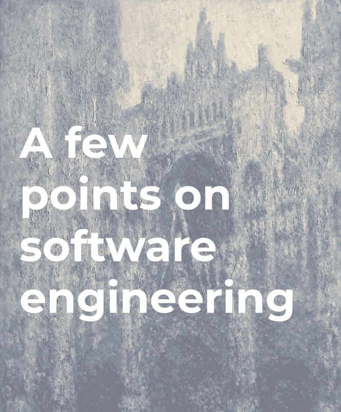

# 关于软件工程现状的几点看法

> 原文：<https://towardsdatascience.com/a-few-points-on-the-state-of-software-engineering-9256c98fac4b?source=collection_archive---------14----------------------->

在这篇短文中，我对当代软件工程实践的挑战进行了简短的讨论，确定了其当前状态的一些潜在原因。在随后的文章中，我将介绍和讨论主流范例用来最小化软件复杂性的策略。这里的观察主要来自我自己的实地经验。因此，这里进行的审查不能说是详尽无遗的。强烈建议被激发进一步研究这个主题的读者去研究参考文献中提到的作品。

Monet’s [Rouen Cathedral](https://en.wikipedia.org/wiki/Rouen_Cathedral_(Monet_series)) (cropped). It reminds me of [Concepts, Techniques, and Model of Computer Programming](http://citeseerx.ist.psu.edu/viewdoc/download?doi=10.1.1.102.7366&rep=rep1&type=pdf).

毫不奇怪，软件工程包含大量的认知努力。要获得软件的所有方面并拿出一个成品，需要跨学科的努力:从需求分析到规范，到设计，到编码，到测试，到评估，以及维护。软件工程使用计算机科学来设计和分析算法，使用工程工具来构建基础设施，使用管理技术来定义权衡、风险、监督人员和监控进度。E. E .小大卫指出[1]:

> 很少有人认识到今天如此著名的高科技本质上是一种数学技术。

与一些人愿意相信的相反，软件工程不仅仅是写代码。然而，学习软件工程的一种方法是学习编程，这是本文的主要兴趣所在。根据 Brooks 的说法，编程的本质是连锁概念的构建和表示:算法、数据结构、功能以及它们之间的关系[2]，而对 Dijkstra 来说，它是*“组织复杂性的艺术”*【3】。这两种观点相互补充，因为在大多数情况下，软件系统的元素以非线性方式相互作用，整体的复杂性增加得更快。正因为如此，在大多数情况下，对程序正确性的推理，无论是正式的还是非正式的，从非平凡到几乎不可能。尽管如此，证明程序具有所需属性的能力是程序员的基本职责之一。

在这种情况下，一个大型软件系统的复杂性经常超出任何一个人的理解和控制。由此而来的是对高效沟通的需求。为了能够协调许多专业人员的项目开发，不仅要掌握复杂社会系统的内部运作，还要组织个人之间的有效知识转移，因为缺乏这种能力可能会导致对需求的误解和丧失远见。Dijkstra 指出:*“磨练你自己的智力是不够的(那将和你一起进入坟墓)，你必须教别人如何磨练他们的智力”* [4]。不幸的是，目前的教育体系似乎不能满足对熟练软件开发人员的极高需求。J. C. Adams 注意到*“需要高级计算技能的公司发现对稀缺资源——拥有这些技能的人——的激烈竞争”* [5]。软件工程的短缺不仅仅是缺乏任何个人，而是缺乏有经验的专业人员。

然而，我们必须记住，编程只是在 20 世纪 80 年代初才作为一种职业出现的。因此，它相对较新且不成熟，许多软件公司和从业者缺乏对该技术的深刻理解。用 Dijkstra 的话来说，许多急需的工具都需要打磨。现有技术的优势、局限性和需求是可疑的。这同样适用于软件范例、技术，特别是设计用来代表计算机编程当前趋势的语言。在过去的 20 年里，数十种不同的语言被引进和抛弃。根据我的经验，许多主流工具，比如 JavaScript，几乎都有严重缺陷的名声。

这门学科的年轻也反映在它的科学研究上。尽管研究团体很活跃，但是到目前为止，他们还不能准确地整理出许多关于软件工程的基本概念。例如，Baragry 指出，尽管从 20 世纪 50 年代就开始讨论软件体系结构，但是只有 Shaw 1989 年*的大型系统需要更高层次的抽象*【6】，以及 Perry 和 Wolf 随后的论文*软件体系结构研究的基础*【7】，为软件体系结构作为一个主要研究领域的出现奠定了基础。即使是 Garlan 和 Shaw 给出的最广泛使用的定义，也没有被社区普遍接受[8]。

人们必须记住，尽管编程的技术和科学取得了令人难以置信的成果，但它们都非常年轻，并且在这种特性和所生产的软件质量之间存在着明显的相关性。要了解这一点，可以考察一下编程劳动的成果。

# 行业状况

软件业的兴起时期是一个艰难的时期。尽管它带来了二十世纪最伟大的工程成就之一——阿波罗制导系统，但它却被臭名昭著的质量问题所困扰[9]。许多预算超支(如 OS/360)、财产损失(跨西伯利亚天然气管道爆炸)甚至重伤和死亡(臭名昭著的 Therac-25 事件)导致了 1968/1969 年软件危机的认定。许多软件问题导致北约科学会议确定软件不可靠、不可维护、交付延迟且超出预算[10]。1972 年，Dijkstra 指出了同样的问题[11]。

# 最近的失败

虽然自 20 世纪 60 年代以来，软件工程已经走过了漫长的道路，但尚不清楚这场危机是否已经完全消退。不幸的是，近代史上不乏悲惨的软件故障。1991 年，一枚弹道导弹袭击了美国驻沙特阿拉伯的军营，造成 28 人死亡，96 人受伤。1997 年，一个车载地面高度预警系统是造成 228 人死亡的韩国空难的部分原因[13]。2018 年，优步的一辆自动驾驶汽车的软件计算错误导致一名行人死亡[14]。最后，在狮航波音 737 Max 8 喷气式飞机于 2018 年坠入爪哇海，造成 189 名乘客和机组人员死亡后，联邦航空管理局向波音 737 Max 8 和 9 飞机的运营商发出紧急通知，警告说有故障的“迎角”传感器读数*“可能导致机组人员难以控制飞机。”坠机事件的调查人员将飞机飞行控制系统的故障描述为小故障。132 天后，埃塞俄比亚航空公司的波音 737 飞机在亚的斯亚贝巴郊外坠毁，157 人遇难。*

鉴于航空航天事故数量惊人，N. G. Leveson 警告说，紧密耦合的系统极其复杂，它们之间的相互作用失调[16]:

> 本文调查的所有事故都显示了系统事故的某些方面。交互的复杂性和紧耦合导致系统事故。软件允许我们构建复杂程度和耦合度超出我们控制能力的系统；事实上，我们正在构建的系统中，组件之间的交互(通常由软件控制)无法全部被计划、理解、预期或防范。

# 斯坦迪什报告及其批评

1994 年，独立的国际 IT 研究组织 Standish Group 发表了臭名昭著的 Chaos 报告，报告显示了令人震惊的 16%的软件项目成功率。2004 年，29%的项目成功，53%受到质疑，18%失败。在两个最初的报告中，项目的成功是基于它是否“在合理的估计时间内，保持在预算内，并且包含大量估计的特性和功能”完成的在 2015 年，结果是相似的，29%的项目成功，52%被认为有挑战，19%失败，其中项目的成功是基于它是否“在合理的估计时间内解决，保持在预算内，并交付客户和用户满意，而不管最初的范围”[17]。

Standish 最初和最近的数据经常被认为是软件业失败的证据。然而，多年来，提出了许多反对意见，质疑斯坦迪什的方法。许多人认为斯坦迪什的数字是*“不可靠，不一定反映现实”*【18】【19】【20】。

埃尔·埃马姆等人指出[21]:

> 尽管有各种关于软件项目失败率的行业报告，但实际数字仍然不确定。研究人员在 2005 年和 2007 年对全球 IT 部门进行了网络调查。结果表明，软件危机可能被夸大了，大多数软件项目都交付了。然而，对于一个应用学科来说，总的项目失败率，包括被取消的和已完成的但表现不佳的项目，仍然是很高的。

# 软件工艺

不管实际情况如何，随着技术的进步，新的劳动力进入市场，关于危机的争论逐渐平息。从作者的个人经验来看，软件产品的质量似乎在整个行业中分布得很不均匀，在具体的努力领域之间有显著的差异。这与没有既定做法的新兴市场的不同质量标准、不同水平的期望和所生产软件的重要性以及财务利润优先于责任有关。毫不奇怪，在工艺不被关注的市场上，软件的低质量更容易被忽视。

为了应对对行业未来日益增长的担忧，《敏捷宣言》(Agile manifesto)的合著者、《坚实的原则》(SOLID principles)以及工匠精神运动的支持者罗伯特·c·马丁(Robert C. Martin)向程序员们提出了一个誓言(类似于《日内瓦宣言》(Declaration of Geneva)，要求*“捍卫和维护职业的荣誉”*。那些宣誓成为程序员的人，除了其他人之外，还应该发誓*“无所畏惧，坚持不懈地抓住每一个机会改进代码”*【22】。

# 行业人口统计

当讨论这个行业的弊病时，人们必须记住当前的行业劳动力是多么年轻。自 20 世纪 80 年代以来，软件工程才成为一个普遍的职业。罗伯特·c·马丁推测，到 1980 年，以前来自工程、科学或数学等领域的高技能个人(通常在三四十岁)被数百万刚刚毕业的年轻人所取代[23]。在那之前，程序员是训练有素的专业人士，他们受雇于其他工作职能部门，通常更老更成熟，不需要太多的管理。在某种程度上，这场革命是由家庭和商业计算的出现促成的。Martin 接着说，粗略地说，程序员人数每五年翻一番(或者说过去是这样)，这意味着，在任何时候，一半的程序员只有不到五年的经验。不管这个观察多么正确，一个不可否认的事实是，现在，一般的程序员都很年轻。

2018 年，致力于编程的热门问答网站 StackOverflow 进行了一项 30 分钟的调查，覆盖了全球超过 10 万名开发者[24]。调查的主题从人工智能到编码伦理。结果显示，在专业开发人员中:

*   30.1%的人参加 0-2 年的专业课程，27.4%的人参加 3-5 年的专业课程，14.6%的人参加 6-8 年的专业课程。换句话说，72.1%的职业受访者拥有 0 至 8 年的经验；
*   46.1%拥有学士学位，22.6%拥有硕士学位，在本科专业中，只有 63.7%的学位是计算机科学、计算机工程或软件工程；
*   26.1%小于 25 岁，49.2%在 25 至 34 岁之间。

总之，StackOverflow 的发现似乎支持马丁关于计算机编程行业永远缺乏经验的说法。马丁还指出，由于教育系统无法弥补行业的高速增长，年轻人注定会一次又一次地重复同样的错误。一些程序员将这种现象称为业界的*十年失忆*【26】。

# 摘要

正在进行的辩论似乎难以解决，而且可能永远如此。无论如何，重要的是不要自满。Moseley 和 Marks 认为复杂性是当今软件绝大多数问题的根源[25]:

> 不可靠性、延迟交付、缺乏安全性——通常甚至是大规模系统中的低性能都可以被认为是源于不可管理的复杂性。复杂性作为这些其他问题的主要原因的主要地位仅仅来自于这样一个事实，即能够理解一个系统是避免所有这些问题的先决条件，当然，复杂性摧毁的正是这一点。

在他的经典论文 *No Silver Bullet* 中，Brooks 指出软件的复杂性是一个基本属性[2]。由此，我们可以得出结论，软件系统中的大部分复杂性是必不可少的。Moseley 和 Marks 不同意这种观点，他们指出软件系统中的大部分复杂性实际上是偶然的，并且是可以消除的[25]。具体来说，他们认为复杂性的主要来源是对主流语言中状态的错误处理。

我们将在以后的文章中研究这个想法。在此之前，敬请关注，感谢您的阅读。

如果您有任何反馈(尤其是批评性的),请评论或给我发电子邮件至 iwoherka@gmail.com**。**

# **参考**

1.  **W.洛杉矶.弗里德曼。解决现实世界问题的课程。工业和应用数学学会，第一版，1987 年。**
2.  **F.软件工程的无银弹本质和事故。计算机，20(4):10–19，1987 年 4 月。**
3.  **E.迪克斯特拉，奥达尔和 c .霍尔。结构化程序设计笔记。数据处理中的 APIC 研究，8，1972。**
4.  **E.w .迪杰斯特拉。我对计算科学的希望(ewd709)。《第四届国际软件工程会议论文集》, ICSE '79，第 442-448 页，美国新泽西州皮斯卡塔韦，1979 年。IEEE 出版社。**
5.  **计算机是当今最安全的职业选择。https://cacm.acm.org/blogs/blog-cacm/ 180053-计算机是最安全的职业选择-今天/全文。访问时间:2019–03–30。**
6.  **米（meter 的缩写））肖。更大规模的系统需要更高层次的抽象。《第五届软件规范和设计国际研讨会论文集》, IWSSD '89，第 143-146 页，美国纽约州纽约市，1989 年。ACM。**
7.  **D.e .佩里和 A. L .沃尔夫。软件体系结构研究基础。SIGSOFT Softw。英语。注释，17(4):40–52，1992 年 10 月。**
8.  **J.巴拉格雷和 k .里德。为什么定义软件架构如此困难？《第五届亚太软件工程会议论文集》, APSEC '98，第 28 页，美国 DC 华盛顿州，1998 年。IEEE 计算机学会。**
9.  **页（page 的缩写）诺尔和 b .兰德尔，编辑。软件工程:由北约科学委员会主办的会议报告，德国加米施，1968 年 10 月 7-11 日，布鲁塞尔，北约科学事务处。1969.**
10.  **页（page 的缩写）诺尔和 b .兰德尔，编辑。软件工程:由北约科学委员会主办的会议报告，德国加米施，1968 年 10 月 7-11 日，布鲁塞尔，北约科学事务处。1969.**
11.  **E.w .迪杰斯特拉。谦逊的程序员。Commun。美国计算机学会，15(10):859–866，1972 年 10 月。**
12.  **R-17 vs 爱国者:四舍五入的问题。[https://www.viva64.com/en/b/0445/.](https://www.viva64.com/en/b/0445/.)访问时间:2019–03–30。**
13.  **疲劳和失误被指在关岛坠机。[https://www.nytimes.com/1999/11/03/us/](https://www.nytimes.com/1999/11/03/us/)疲劳和错误被引用于关岛坠机事件. html .访问时间:2019–03–30。**
14.  **报道:软件 bug 导致优步自动驾驶撞车死亡。【https://arstechnica.com/tech-policy/】T22018/05/report-软件-bug-导致死亡-无人驾驶-撞车/。访问时间:2019–03-30。**
15.  **当一个软件故障导致一架客机坠毁时，一些棘手的问题被提了出来。https://www.viva64.com/en/b/0445/[。访问时间:2019–03–30。](https://www.viva64.com/en/b/)**
16.  **名词（noun 的缩写）g .莱韦森。软件在航天器事故中的作用。宇宙飞船和火箭杂志，41(4):564–575，2004。**
17.  **南团体。混沌报告:2015，2015**
18.  **R.格拉斯。斯坦迪什报告:它真的描述了一场软件危机吗？Commun。美国计算机学会，2006 年 8 月，49:15–16。**
19.  **米（meter 的缩写））乔根森和 k .莫洛肯-奥斯特瓦尔德。软件成本超支有多大？对 1994 年混沌报告的评论。Inf。Softw。技术。，48(4):297–301，2006 年 4 月**
20.  **C.伊夫琳斯。混沌报告数字的起伏。IEEE 软件，27(1):30–36，2010 年 1 月。**
21.  **K.埃马姆和克鲁。it 软件项目失败的重复调查。IEEE Softw。，25(5):84–90，2008 年 9 月。**
22.  **程序员的誓言。[https://blog . clean coder . com/uncle-bob/2015/11/18/the programmerswear。](https://blog.cleancoder.com/uncle-bob/2015/11/18/TheProgrammersOath.) html。访问时间:2019–03–30。**
23.  **编程的未来。[https://www.youtube.com/watch?v=ecIWPzGEbFc.](https://www.youtube.com/watch?v=ecIWPzGEbFc.)访问时间:2019–03–30。**
24.  **堆栈溢出—开发者调查结果:2018 年。[https://insights.stackoverflow.com/survey/2018/.](https://insights.stackoverflow.com/survey/2018/.)访问时间:2019–03–30。**
25.  **B.莫斯利和 p .马克斯。从沥青坑里出来。2006 年软件实践进步(SPA)课程。**
26.  **功能极客——第一集——罗伯特·c·马丁。[https://www . functional geekery . com/episode-1-Robert-c-Martin/](https://www.functionalgeekery.com/episode-1-robert-c-martin/)**