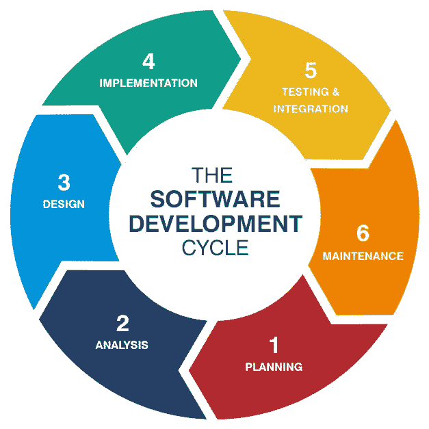

# 构建闪亮应用程序时需要注意的几件事

> 原文：<https://towardsdatascience.com/a-few-things-to-take-care-of-while-building-shiny-apps-888e4676090b?source=collection_archive---------24----------------------->

**构建 RShiny 应用程序时克服障碍和节省时间的简化技术**

自从 2011 年末 ***RStudio*** 的发展以来，Rshiny 已经被广泛用于构建仪表板和应用程序，这些仪表板和应用程序具有 web 上的后端 R 支持和部署。现在，通过专用的包将 *CSS* 和*JavaScript*功能嵌入 Rshiny 应用程序是可能的，其目的是提高交互性并提供动态界面。我已经开发和部署 Rshiny 应用程序 3 年多了，所以通过这篇博客，我将分享一些障碍以及如何在开发产品时用简单的技巧克服它们。

首先，让我简单介绍一下初级/中级优秀程序员在设计应用程序时可能会遇到的障碍。

## 1.花在设计上的时间

> 美学是最重要的，正如人们所说的那样——“许多难以设计的东西证明很容易实现”——塞缪尔·约翰逊。

虽然 *ShinyDashboard* 和 *ShinyDashboardPlus* 提供了设计 Dashboard 的模板，但在提供动态 UI 方面，它们往往有所欠缺。例如，*引导模式*在使用 *shinydashboard* 页面时失败。为了克服这个问题，需要使用*引导页面*设计一个仪表板，但是这样你就失去了设计的机会，因为你需要从头开始重新构建它，而且这需要大量的研究，这几乎占用了总时间的 30- 40 %。对于一个刚刚开始使用 RShiny 设计应用程序的初学者来说，可能会觉得它很慢。

## 2.没有时间进行测试——再次构建和测试

虽然看起来应用程序运行良好，但在演示中你的应用程序突然下毛毛雨，这表明控制台上有一个错误。此错误可能是由于不合逻辑的数据操作或子集操作导致的，这些操作返回了零个条目，并且有时它没有指出错误发生的位置。当您修复代码并使工具再次运行时，您会看到一些之前没有注意到的错误。这也发生在我身上。

原因是我们过多地参与了逻辑与设计的集成，以至于我们几乎没有足够的带宽来适当地处理错误。

## **3。随机应变…适应…克服挑战**

假设您为仪表板中的一个页面编写了一个逻辑，并将其展示给客户。突然，你的客户要求对它进行细微的改变，这可能需要你改变现有工具的反应，你发现自己很痛苦。当你正在设计的工具有多个模块，而你/你的客户从来没有想到这个即将到来的逻辑会被证明是有价值的时候，这种情况经常发生。它为你的工作增加了价值，但是要花费大量的时间重新回到前面。

解释完挑战后，现在让我们来关注如何应对它们。

## 1.始终遵循 SDLC { **软件开发生命周期** }

构建 RShiny 应用程序是一个项目，每个项目都有阶段。虽然我们大多数人都知道 SDLC，但是我们很少打算实现它。大部分时间花在设计上，没有时间测试和集成。

[Easy way to understand SDLC | Dignitas Digital](https://www.google.co.in/url?sa=i&rct=j&q=&esrc=s&source=images&cd=&ved=2ahUKEwiI08n6jNrmAhWxwjgGHd40AAEQjhx6BAgBEAI&url=https%3A%2F%2Fwww.dignitasdigital.com%2Fblog%2Feasy-way-to-understand-sdlc%2F&psig=AOvVaw3h7YLqOm60GnM0DCL7hmtF&ust=1577682899009868)

拥有预定义的 SDLC 不仅有助于软件开发，还有助于跟踪我们在每个阶段投入了多少时间。

这是我在开始这个项目之前使用的一种方法:

*   **设计线框**:总是设计一个**线框，它只不过是一个网页的布局，展示什么样的界面元素将存在于关键页面上。你可以使用任何工具，甚至可以在普通纸上设计。手里有线框将帮助你确定需要什么成分来开发页面，因此反过来，在实现美学方面将节省大量时间。**

## ****2。截止日期和工作量分配****

**虽然构建闪亮的应用程序在开始时似乎很容易，但将后端与前端集成起来需要付出很多努力。如果您正在设置部署的截止日期，请确保:**

**—牢记要解决的测试案例。**

**—设计时，确保检查元素以调整浏览器本身的宽度和高度。 ***示例*** :通过手动微调，确定合适的框宽或高度。**

**Changing Aesthetics on the fly in Rshiny app.**

**—将代码分离到模块中，并在页面数量增加时相应地分配带宽。例如，一个页面的前端代码和后端代码将作为单独的 R 脚本保存，这些脚本将在服务器中使用 source 命令导入。所以，如果你有一个团队在开发这个应用程序，每个人都可以用来创建一个单独的模块，这个模块可以在以后集成。关于它的更多信息在这里 提到**

***—如果有大量数据需要与后端集成，尝试将代码分成三个部分，即。全球。r，服务器。r 和 UI。r，这里是全局。r 将只包含初始数据获取和数据清理操作。***

***—如果您的数据导入和清理需要很长时间，请尝试在运行 global 后存储初始工作空间环境。r 作为工作空间图像(. ***RData*** )，这样以后导入它所花的时间就会减少，节省下来的时间可以用来增强 UI。***

## ***3.快速获取有用的资源***

***在设计闪亮的应用程序时，许多概念将成为新的搅拌机。因此，在短时间内找到合适的资源将证明是有益的。除了寻找解决*堆栈溢出*的方法，这里还有一些我在 RShiny 上工作时期待的资源***

*   ***https://www.showmeshiny.com 的[是一个很棒的网站，有一个闪亮的应用程序库，提供源代码和现场演示供参考。如果你是一个希望在设计线框之前看一些模板的人，这是你探索的正确地方。](https://www.showmeshiny.com)***
*   ***【https://deanattali.com/blog/advanced-shiny-tips/ ***
*   ***[https://github.com/grabear/awesome-rshiny](https://github.com/grabear/awesome-rshiny)***
*   ***[https://github.com/FrissAnalytics/shinyJsTutorials](https://github.com/FrissAnalytics/shinyJsTutorials)***
*   *****探索**[**CRAN**](https://cran.r-project.org/web/packages/available_packages_by_name.html)——在 shiny 中，有许多正在开发的包可以简化 UI 的开发，您可以找到许多为此做出贡献的包。***
*   ***在 GitHub 上询问****——**如果你没有得到你想要的，试着在 GitHub 上找到这个问题，如果没有的话，把它贴在相关的库问题里，这样作者可以试着解决它。例如，与*JavaScript*相关的问题可以放在 *shinyjs* 存储库问题中。*****

*****Asking Questions on GitHub*****

# *****结束注释*****

*****因此，在了解了建议的漏洞并将其应用到您的 RShiny 项目之后，我希望它能帮助您节省大量的时间。*****

*****接下来，我将分享一些 R 技巧和 Rshiny 功能，它们将帮助你平稳高效地构建 RShiny 应用。*****