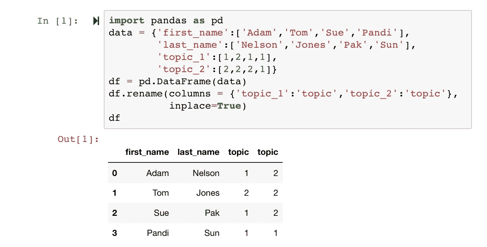
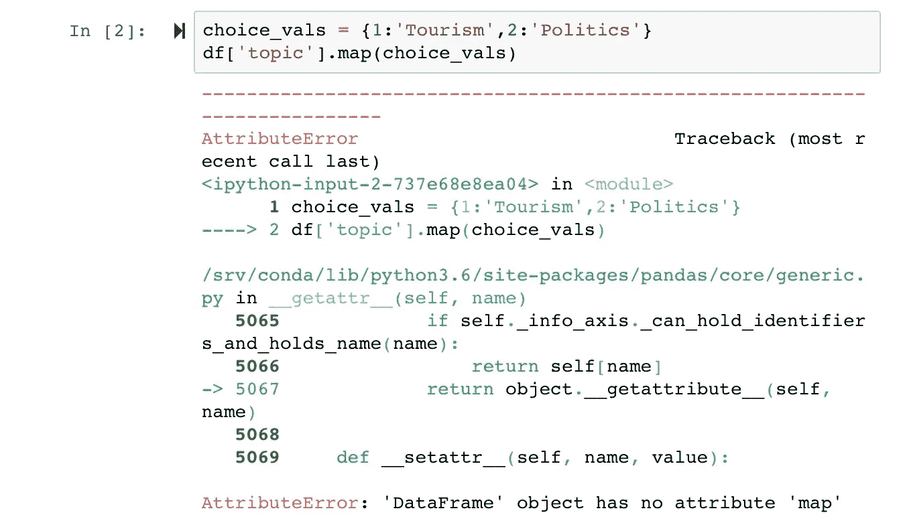
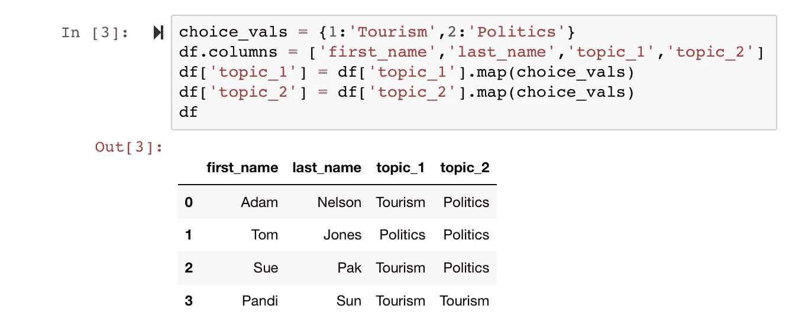

# 有几次，我打碎了熊猫

> 原文：<https://towardsdatascience.com/a-few-times-i-managed-to-broke-pandas-d3604d43708c?source=collection_archive---------26----------------------->

## 这里有一个场景。我希望其他人能从我这里的错误中受益。

W 当我将大部分工作从 Stata 转移到熊猫时，我遇到了一些障碍。好吧，我承认。我写了一些糟糕的代码。这是我做错的一个例子。

Image credit: Author. “Broken Pandas.” Image Credit: “Via Design Pickle” — [More on attributions](https://adamrossnelson.medium.com/image-credit-attributions-a24efcc730ad).

# 重复的列名

其他统计语言更严格地防止重复的列名。然而，熊猫可以被欺骗允许重复的列名。

如果您计划将数据集转换为另一种统计语言，重复的列名是一个问题。它们也是一个问题，因为它会在 Python 中导致意想不到的、有时难以调试的问题。

公平地说，复制这一点并不容易，下面的代码展示了如何复制:

How I broke Pandas. Image Credit: “Author’s Screen Capture” — [More on attributions](https://adamrossnelson.medium.com/image-credit-attributions-a24efcc730ad).

上述数据框的用例是一个作者列表，他们被分配写两个主题中的一个。因此，主题列是分类变量或因子变量。

所以，到目前为止，没有错误。直到您尝试将选项标签映射到`'topic'`下的选项值，这是操作分类或因子变量时的常见操作。

Error that occurs when a Pandas data frame has more than one identically named columns. Image Credit: “Author’s Screen Capture” — [More on attributions](https://adamrossnelson.medium.com/image-credit-attributions-a24efcc730ad).

检查列名唯一性的一个快速方法是评估`'len(df.columns) == len(set(df.columns))`。如果语句评估为`False`，这表明您可能有重复的列名。

愚蠢的错误。很容易解决。

How I fixed the data frame that I managed to break above. Image Credit: “Author’s Screen Capture” — [More on attributions](https://adamrossnelson.medium.com/image-credit-attributions-a24efcc730ad).

 [## 加入我的介绍链接媒体-亚当罗斯纳尔逊

### 作为一个媒体会员，你的会员费的一部分会给你阅读的作家，你可以完全接触到每一个故事…

adamrossnelson.medium.com](https://adamrossnelson.medium.com/membership) 

# 感谢阅读

把你的想法和主意发给我。你可以写信只是为了说声嗨。如果你真的需要告诉我是怎么错的，我期待着尽快和你聊天。推特:[@ adamrossnelson](https://twitter.com/adamrossnelson)| LinkedIn:[亚当·罗斯·纳尔逊](http://www.linkedin.com/in/arnelson) |脸书:[亚当·罗斯·纳尔逊](http://www.facebook.com/adamrossnelson)。