# 手腕轻轻一弹:定义下一代人机交互

> 原文：<https://towardsdatascience.com/a-flick-of-the-wrist-defining-the-next-generation-of-human-computer-interaction-7c8f962bd014?source=collection_archive---------13----------------------->

## 以下是我在 2019 年 1 月在 [TedX Goldey Beacom](https://www.ted.com/tedx/events/32155) 上的一次演讲的书面版本。他们拍了下来，你可以在这里观看！

多年来，我们一直被魔法的概念所迷惑。有人认为，只要挥一挥魔杖，打个响指，或者说一些特殊的话，就可以在瞬间彻底改变他们周围的世界，这种想法在历史上一直占据着人们的头脑。

> 任何足够先进的技术都和魔法没什么区别。
> —亚瑟·C·克拉克爵士

现在，我们生活在一个在屏幕上操控人类全部知识的世界里，屏幕仅仅比信用卡大一点。我敢打赌，这个房间里的每个人口袋里都有一个设备，它的计算能力比我们用来把人送上太空的技术还要强。相对于人类历史的其余部分，这一切都发生在眨眼之间。即使在我的有生之年，也很难夸大我们已经走了多远。

St. Peter’s Square in 2005 via [NBC](http://photoblog.nbcnews.com/_news/2013/03/14/17312316-witnessing-papal-history-changes-with-digital-age)

St. Peter’s Square in 2013 via [NBC](http://photoblog.nbcnews.com/_news/2013/03/14/17312316-witnessing-papal-history-changes-with-digital-age)

随着扩展现实、机器学习和其他新兴技术的出现，我们与计算机以及彼此之间的工作方式将在未来几年内发生巨大变化。我们越来越能够不仅感知三维的数字世界，还能与它们互动并被它们看到。这本质上就是人机交互领域正在发展的东西。

今天，我将向您展示一些正在推动技术边界的 HCI 研究项目。我邀请你展望未来，看看它们将如何从根本上改变我们与计算机、信息以及彼此之间的互动方式。

但首先，花点时间和我一起做梦。今天是 20XX 年，星期二。

想象一下，一个孩子第一次上化学课。还记得学分子几何吗？原子排列成各种三维形状，像四面体和三棱锥？你必须把它们画在纸上，只用一支铅笔和一把尺子来想象这些构成我们世界基本组成部分的抽象形状。

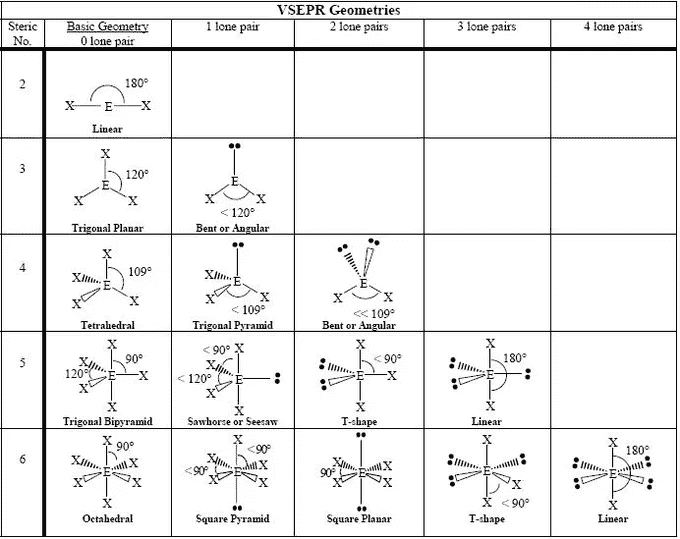

或者，也许你更幸运一点，参加了一个活动，像我在高中时那样安排橡皮泥和牙签。他们真的很悲伤，萎靡不振。

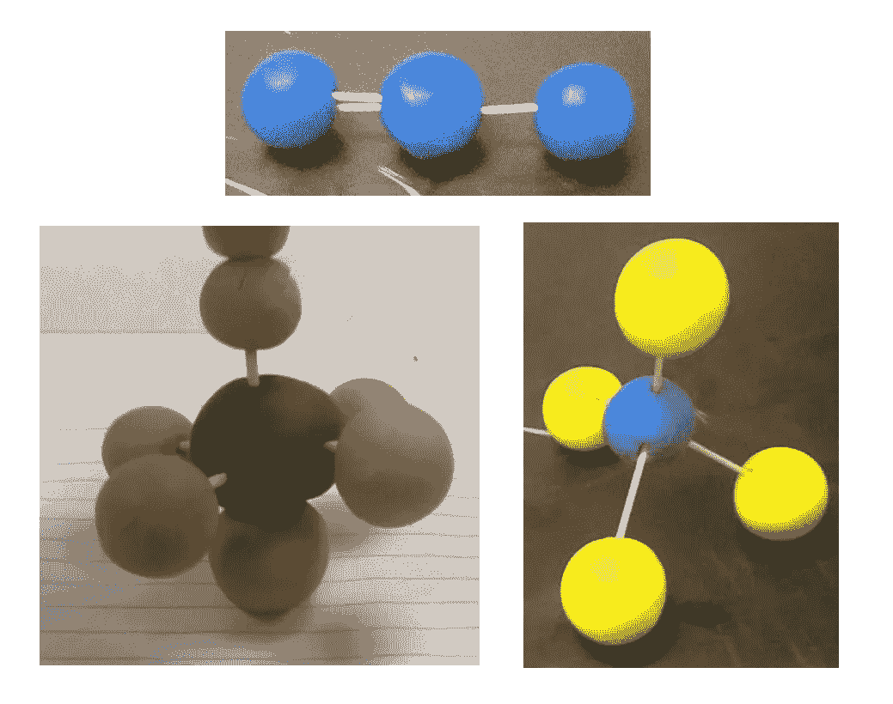

相反，20XX 的孩子们玩全息图，在太空中徒手构建八面体和跷跷板。他们可以直观地操纵原子键，玩数字表示，就像我们在原子水平上理解事物一样。

想象一下，你正在远足，看到了壮丽的山景。受到它们的美丽的启发，你拿出了你的素描本，但你并没有自己身上所有的颜料。但这没关系，当你画出细细的摇摆不定的线条时，它就在你眼前变成了一幅如画的风景画。

你下班回到家，投入到一个游戏中，这个游戏基本上把你带入了母体。作为孤胆英雄，你独自站在一个充满敌意的世界里。你被特工包围，用整个身体慢动作躲避子弹。

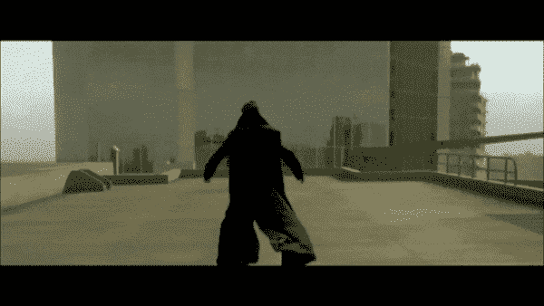

现在，你想告诉我所有这些听起来很疯狂，需要我们没有的技术，对吗？但事实证明，“20XX”其实是 2018 年。这些是我们去年做的一些事情。

化学申请是卡内基梅隆大学的[项目学生](https://www.etc.cmu.edu/blog/projects/pupil/)。

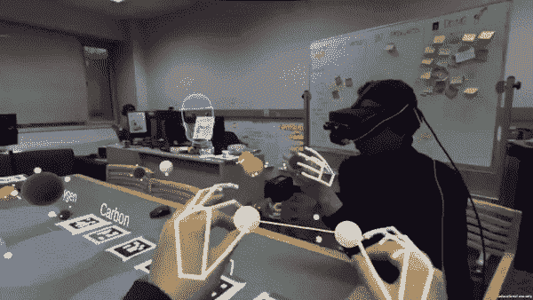

Project Pupil Chemistry Demo via [Yujin Ariza](https://twitter.com/YujinAriza/status/1068619034827083783)

那幅画？由[备忘录 Akten](https://www.memo.tv/portfolio/learning-to-see/) 提出的申请。

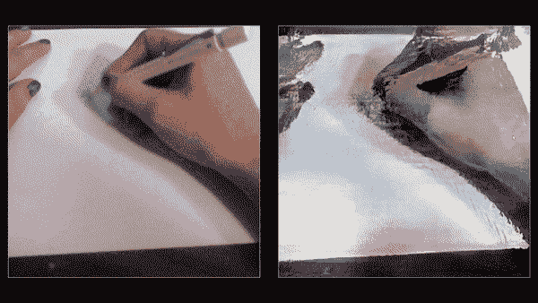

[Learning to See](https://vimeo.com/302624466) via Memo Akten

慢镜头射手？[超级热门的](https://superhotgame.com/vr/)，你现在就可以去虚拟现实街机玩。

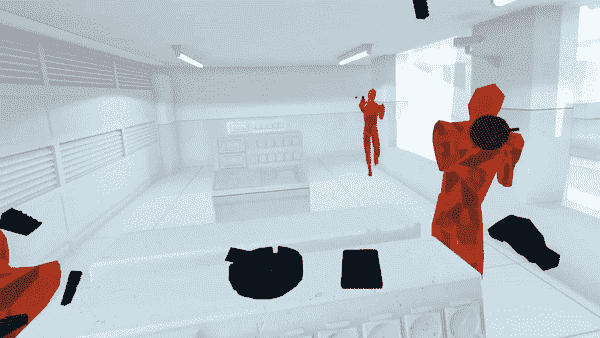

via [Super Hot VR](http://www.youtube.com/watch?v=pzG7Wc6mbwE) Trailer

那么，这些东西到底是什么？我们如何做到这一点？

对于外行人来说，XR 是一个总括术语，用来描述真实和虚拟对象协同交互的连续统一体。这包括像虚拟现实这样的技术，在虚拟现实中，你的整个环境是数字的，增强现实中，你将平面图像叠加到现实世界中，以及两者之间的任何维度。

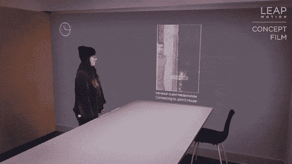

[Leap Motion Mirrorworlds Concept Video](https://www.youtube.com/watch?v=kTv7aQx09XI)

也许你玩过原始的增强现实系统，比如[口袋妖怪 Go](http://pokemongo.com) …

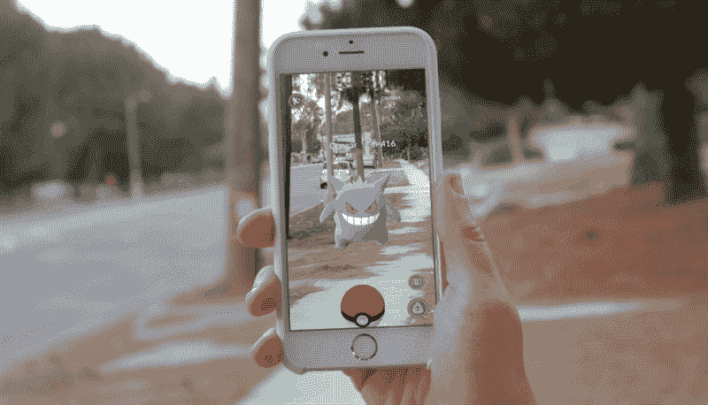

或者有幸尝试过像 [Beat Saber](http://beatsaber.com) 这样的虚拟现实系统卖家。

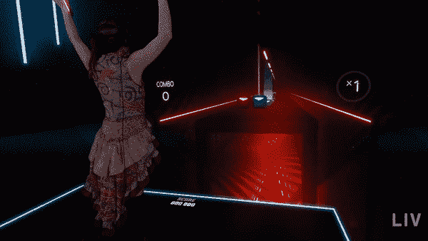

[Beat Saber](https://youtu.be/gV1sw4lfwFw) via [LIV](https://liv.tv/) and [SwanVR](https://twitter.com/swanvrart)

XR 技术的一个共同点是它们使用计算机来塑造你的感知。XR 作为一个光谱可以把你放在一个全新的和不同的环境中，或者简单地给现实世界添加信息。

机器学习本质上是使用特定的算法来教计算机如何解决问题。它被用于各种应用，从[掌握围棋](https://deepmind.com/research/alphago/) …

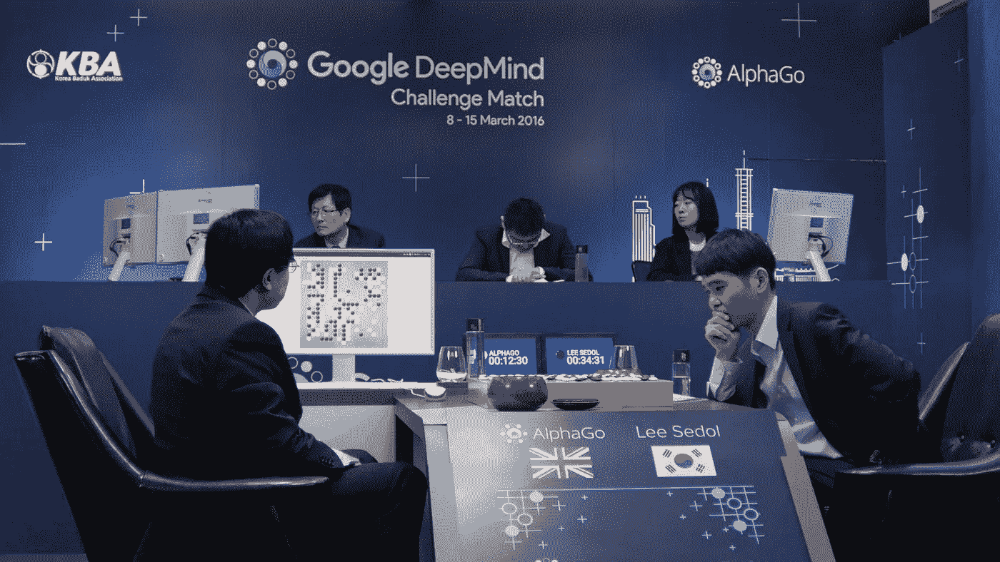

…到[为自动驾驶汽车的大脑提供动力](http://waymo.com)，

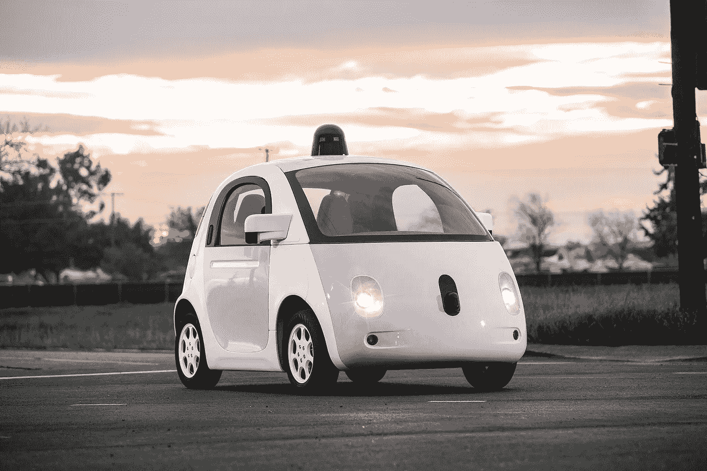

…以[从少量线条中生成猫](https://affinelayer.com/pixsrv/)。

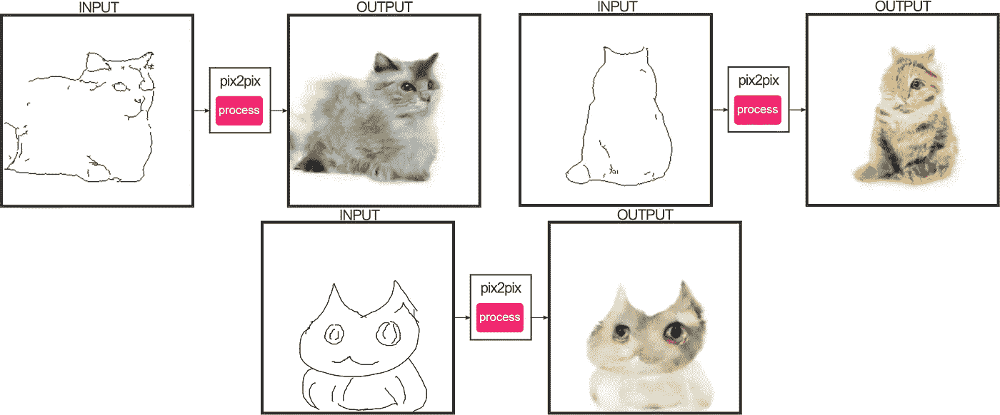

via [pix2cats](https://affinelayer.com/pixsrv/)

我画了最后一个，他大概是。

使用机器学习通过计算机的眼睛看世界有很多令人兴奋的工作。

我们能够让人工智能展示世界的一部分。我们可以向他们展示我们的身体，我们的绘画，[物体如何相互作用](https://www.youtube.com/watch?v=keffWSqi67w)，[看他们想出什么](http://youtu.be/FlgLxSLsYWQ)，并利用这些来塑造我们的感知。机器学习能够理解现实中的大量信息，而 XR 将帮助我们更清楚地看到这些信息。

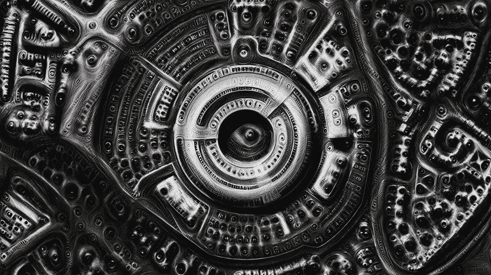

[All watched over by machines of loving grace: Deep-dream edition (2015) via Memo Akten](https://medium.com/artists-and-machine-intelligence/a-digital-god-for-a-digital-culture-resonate-2016-15ea413432d1)

我觉得一些最令人兴奋的发展是通过开源和公共资助的研究项目实现的。

[OpenPose](https://github.com/CMU-Perceptual-Computing-Lab/openpose) 是卡耐基梅隆大学的一个研究项目，它使用机器学习来检测单个图像中的身体。

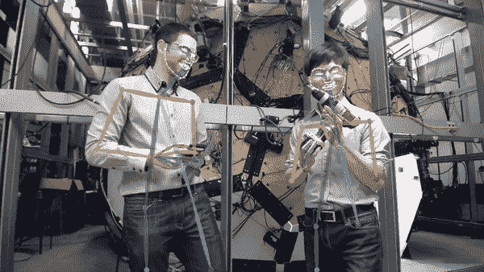

它已经被用作其他工作的主干，包括帮助你将整个身体放入虚拟现实的研究项目

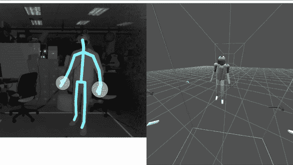

[Deep Learning for VR/AR: Body Tracking with Intel RealSense Technology](http://youtu.be/VSHDyUXSNqY?t=1069)

…帮助你(或者至少是你的视频)表演复杂的芭蕾舞。

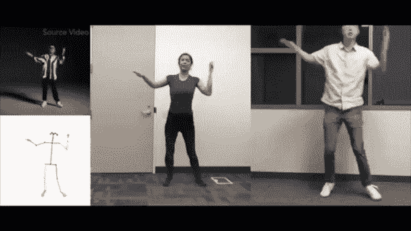

[Everybody Dance Now via Caroline Chan](https://www.youtube.com/watch?v=PCBTZh41Ris)

[Pix2Pix](https://github.com/phillipi/pix2pix) 是伯克利的一个项目，它使用神经网络根据训练数据生成图像。

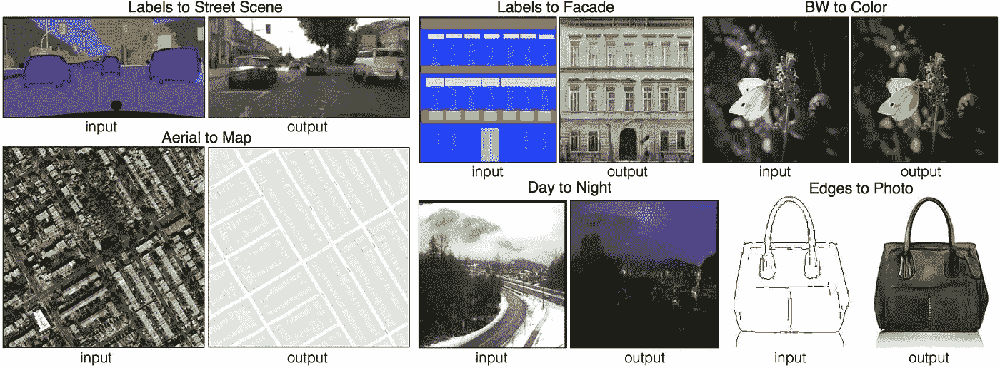

[Pix2Pix via a Affinelayer](https://affinelayer.com/pix2pix/)

它被进一步混合到应用程序中，使你的网络摄像头变成鲜花

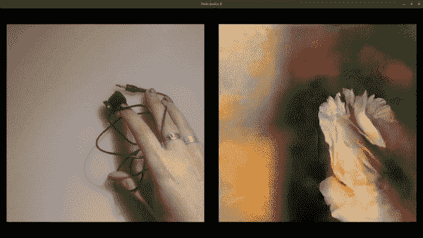

[Learning to See: Gloomy Sunday](http://vimeo.com/260612034)

…或者将威尔明顿天际线的照片变成模仿范·高的华丽画作。

via [Deep Dream Generator](https://deepdreamgenerator.com)

[Project North Star](https://developer.leapmotion.com/northstar) 是一款增强现实耳机，你可以在世界任何地方进行 3D 打印。有一个[社区](https://discord.gg/fSEcBMe)正在围绕这些耳机的采购和制造成长，我认为随着它变得更容易获得，我们将会看到一些有趣的应用。

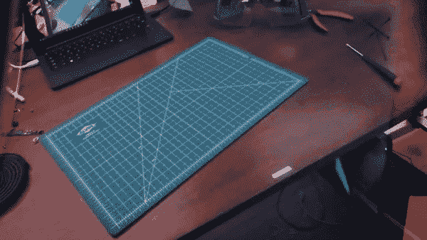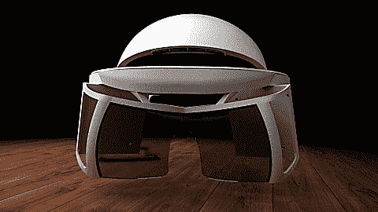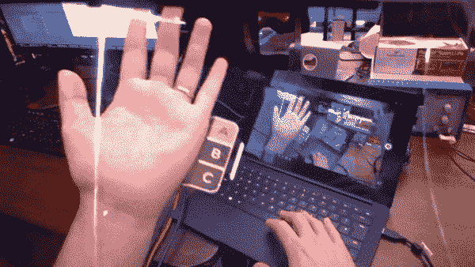

这些都是开源的，所以任何人都可以利用他们的成果，在此基础上开发各种应用程序。

“他们”包括我。

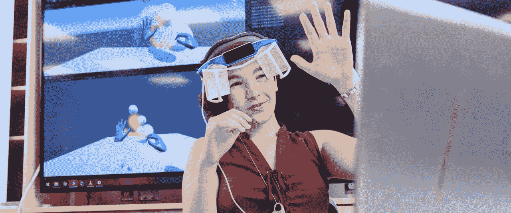

Me in my North Star via [UDaily](https://www.udel.edu/udaily/2018/august/alina-christenbury-virtual-reality-summer-research/)

我目前正在建造自己的北极星。我在特拉华大学能够 3D 打印的一些部分，其他部分来自项目周围突然出现的社区成员。这大部分发生在 UD 的夏季学者计划中，在那里我花了 10 周时间学习 XR 开发的基础知识。学期开始后，我将这一经历转化为一个本科生研究项目，专注于让跨学科的学生一起开发 XR 应用程序。

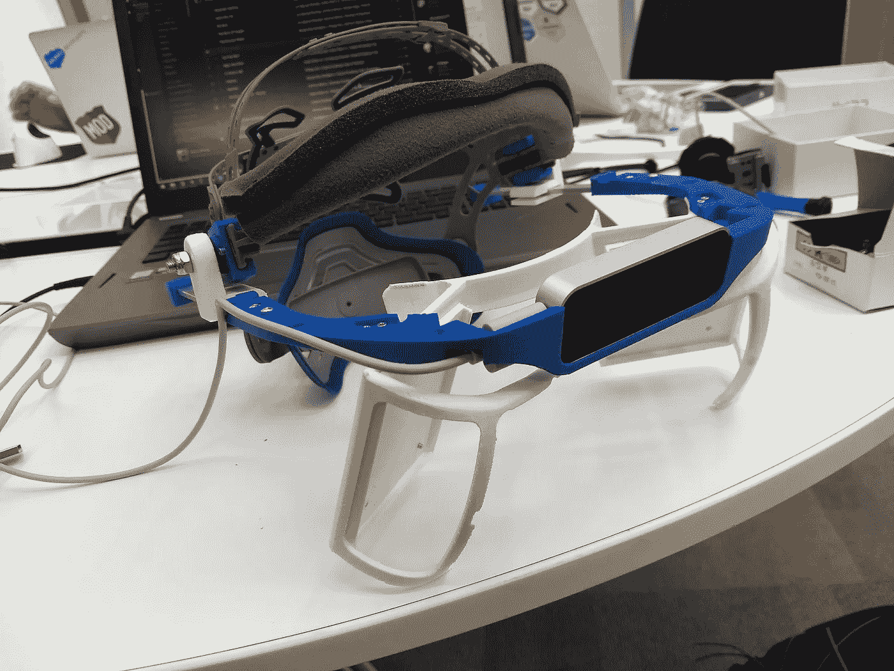

就在上周，我去了麻省理工学院媒体实验室的黑客马拉松 [Reality Virtually](https://realityvirtuallyhack.com/) 。我和其他 400 多名开发人员、艺术家、设计师和程序员一起开发 XR 应用程序。

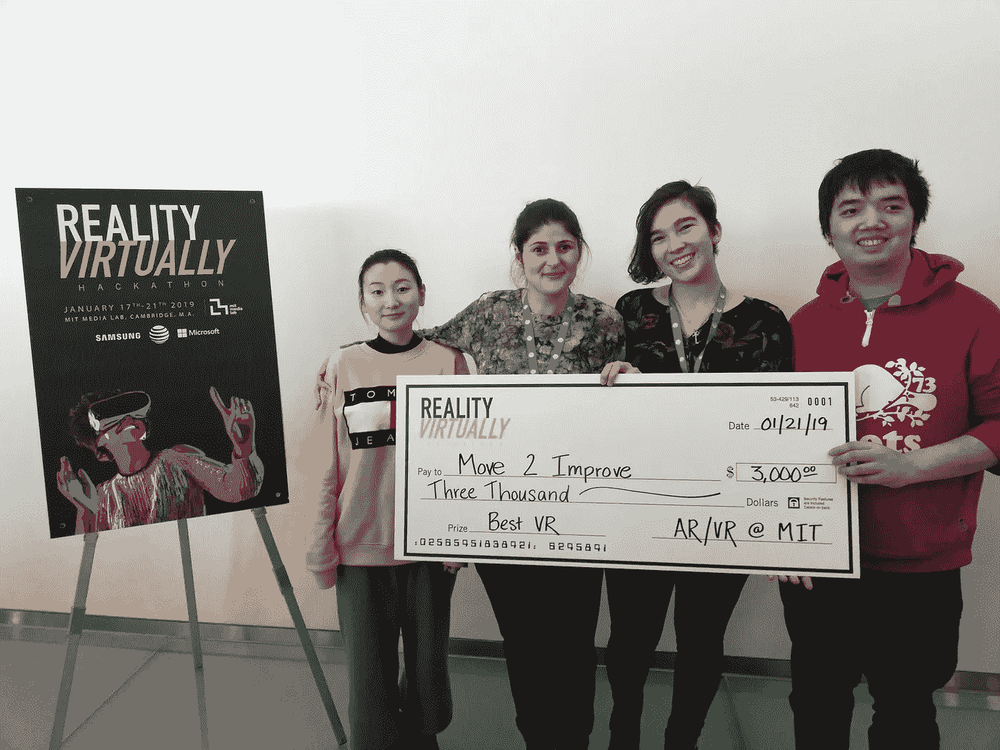

The University of Delaware Human-Computer Interaction at Reality Virtually. Right to left: Zhang Guo, Dr. Roghayeh Barmaki, Alina Christenbury, Yan-Ming Chiou

黑客马拉松所有项目的一个规则是，它们必须是开源的，这样世界上的任何人都可以利用它们创造出新的有趣的应用程序。我们一起制作了不到 100 个 XR 项目，包括物理治疗和无障碍工具，还有游戏和互动艺术。我的团队在不到 5 天的时间里制作了一个[虚拟现实逃生室](https://devpost.com/software/virtual-escape-room-bj9lwv)，我的顾问[巴马基博士的物理治疗项目](https://devpost.com/software/move2improve)获得了“最佳虚拟现实应用”。

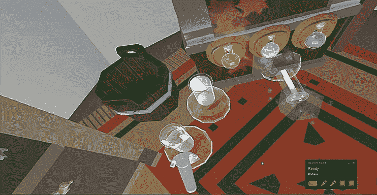

[Escape the Witch’s Grotto](https://www.youtube.com/watch?v=j4SkaYllHz4)

在我看来，这项技术真正融合在了[镜像世界](http://blog.leapmotion.com/mirrorworlds/)的概念中。

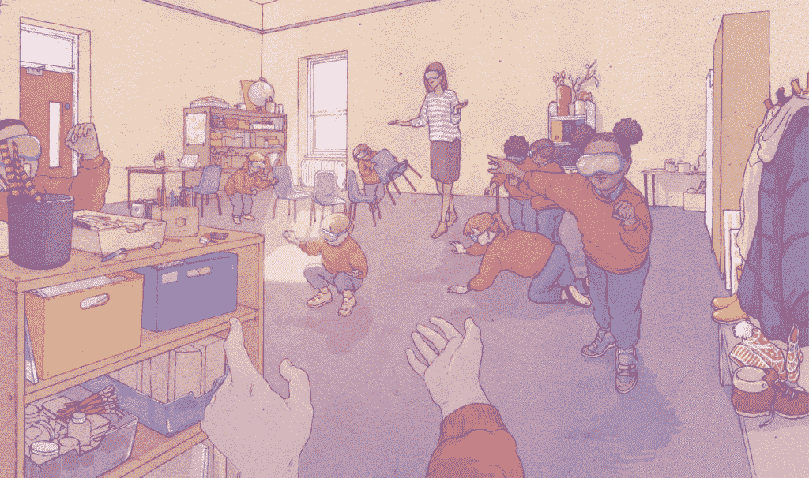

Illustration by [Anna Mill](http://annamill.com/)

这项技术将帮助[将你周围的物理空间转换到另一个平行维度](https://cloud.google.com/maps-platform/gaming/)，而不是离开你的物理空间。椅子变成了山，墙壁变成了日落，“地板是熔岩”从一个简单的儿童游戏变成了一种发自内心的体验。您可以像与物理对象交互一样与数字对象交互，并且与物理对象的交互效果更好。你的环境可以向你展示它是如何工作的，就像物品向你展示如何使用它们一样。一把吉他可以教你如何弹奏它自己，告诉你如何最好地握住它来弹奏特定的和弦。或者物体可以完全改变，比如桌子变成触摸屏，铅笔变成魔杖。

> 是时候将话题从 AR 系统应该是什么样子转移到 AR 体验应该是什么感觉上了。大卫·霍尔茨

问题不再是“我们如何让这个工作？”而是“这应该是什么感觉？”我们正处在历史的某个点上，被认为是“魔法”的东西是真实的。就在这里，就是现在。所以，我留给你们这个:

你会用它做什么？

为了准备这个，我读了很多很多的东西，以便为这个演讲创造一个稍微有点像叙事的东西。我尽了最大努力保存来源，其中大部分都链接到 throughout，但请随意查看[来源](https://github.com/AlinaWithAFace/alinawithaface.github.io/blob/master/_posts/2019-04-29-a-flick-of-the-wrist-defining-the-next-generation-of-human-computer-interaction.md)以获得完整列表。这篇文章也可以在我的网站 [alinac.me](http://alinac.me) 上找到。

我也有邮件列表！如果你想偶尔收到我在 alinac.me/subscribe[的邮件，请注册](http://alinac.me/subscribe)