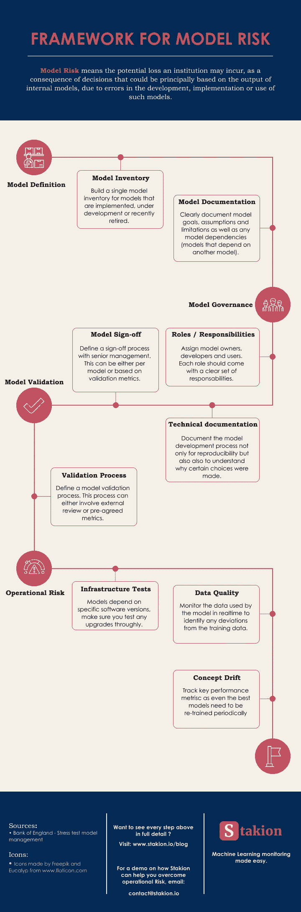
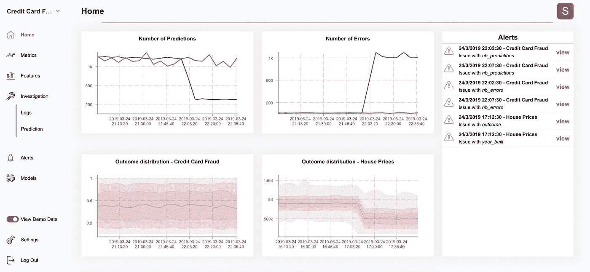

# 管理模型风险的框架

> 原文：<https://towardsdatascience.com/a-framework-for-model-risk-5953dedbe112?source=collection_archive---------31----------------------->

Photo by Dakota Roos on [Unsplash](https://unsplash.com)

近年来，银行在使用定量分析和模型方面面临监管压力。因此，法规正在到位，以确保模型得到有效管理，从而降低模型风险。

美联储将模型风险定义为[1]:

> 基于不正确或误用的模型输出和报告的决策的潜在不利后果。模型风险可能导致财务损失、糟糕的业务和战略决策，或者损害银行组织的声誉

以银行监管为起点，我们将定义一个可用于任何机器学习部署的框架，以量化和最小化模型风险。

我们的模型风险可以分解为 4 个关键轴[2，3]:

*   模型定义
*   模型治理
*   模型验证
*   模型监控

Model Risk Framework

# 模型定义

> 建立一个拥有明确所有者的模型清单，定义组织内运行的每个机器学习模型的目标、假设和限制

第一步是建立一个在生产中运行的机器学习模型的清单，以及它们如何相互交互。通过创建模型清单，您将能够找出哪些模型由于潜在的级联故障而具有最大的内在风险。

您的清单的目标不应该是创建技术文档，而是给涉众一个模型做什么和它的限制是什么的高层次概述

它应包括:

1.  **型号名称和描述**
2.  **开发阶段**(已实施使用、开发中或近期退役)
3.  **高等级风险评估**
4.  **模型目标**
5.  **模型假设**
6.  **型号限制**

评估模型重要性有助于定义与每个模型相关的高级风险。通过根据容量、使用环境和财务影响分解每个模型，您可以为每个模型分配一个风险分数[4]。例如，很少使用的模型不会像影响关键业务决策的模型那样带来很大的风险。

其中一个风险是，随着时间的推移，该模型清单会过时，为了避免这种情况，您应该指定一个人明确负责确保该文档保持最新。这并不意味着这个人应该编写所有的文档，而是他们应该跟进模型所有者，以确保他们的模型文档是最新的。

# 模型治理

> 指定负责开发、实施和使用模型的模型所有者。他们的部分职责是与高级管理层合作，为新模型的部署制定签署政策。

考虑模型治理的良好开端是定义:

*   **模型所有者**:模型所有者负责确保模型得到适当的开发、实现和使用。
*   **模型开发人员**:模型开发人员在模型所有者的领导下创建并实现机器学习模型。
*   **模型用户**:模型用户可以是企业内部的，也可以是外部的。对于这两种情况，清楚地确定他们的需求和期望是很重要的。他们还应该参与模型开发，并可以帮助验证模型的假设。

明确地定义不同的涉众将会使分配角色和职责变得更加容易，这在模型发展和团队变化的时候尤其重要。

良好的模型治理也是关于跟踪模型的初始开发以及它如何随着时间的推移而变化。通过记录模型开发过程，即使所有者发生变化，您也能够更快地迭代。

> 再现性很重要，但还不够，你的文档还应该解释为什么选择一种方法而不是另一种方法，以及探索的死胡同。

在开发模型治理策略时，最后一个好的实践是定义在部署新模型之前需要什么样的管理签署。鉴于机器学习模型可能产生的影响，定义谁负责签署新模型的部署非常重要。管理层签核可以基于每个模型，也可以基于验证指标自动进行。

# 模型验证

> 定义一个外部或内部的验证过程，以确保模型按预期执行，并在部署之前进行记录。

一旦开发了模型，就需要在部署之前对其进行验证。可以通过两种方式进行验证:

1.外部验证:由外部审计师或独立方
2 执行。内部验证:验证由同一个团队或部门执行

虽然一些监管机构要求外部验证，但对于大多数不受监管的行业，您可能会在内部验证您的模型。为了最小化确认偏差，验证过程应该在模型开发人员很少或没有输入的情况下进行。这也将有助于识别模型开发过程的文档中的潜在差距。

为了使内部验证有效，应该根据模型用户的输入提前定义验证指标和阈值。验证不应仅限于简单地评估性能指标，还应包括对方法的审查，以确定尚未考虑的模型偏差或边缘情况。验证者还应该检查用于构建模型的代码，并确保它的版本是正确的。

# 模型监控

> 使用与传统 IT 系统类似的流程，定义流程来检测和解决潜在问题。

在前面的章节中，我们已经定义了流程，以确保关键的利益相关者意识到正在开发的模型中的内在风险，并确保它们是可重复的和可迭代的。

即使有好模型治理，使用机器学习模型也有风险。这些风险可以细分为:

1.  依赖关系的变化
2.  数据质量问题
3.  您正在建模的过程中的变化——通常被称为概念漂移

处理模型风险意味着制定一个计划来检测和修复这些潜在的问题。做到这一点的一种方法是实施与传统 IT 系统类似的监控策略，但使用针对机器学习系统的指标。

我以前写过一些您应该监控的核心指标:[部署后的模型生命周期](/life-of-a-model-after-deployment-bae52eb83b75)

Example Monitoring Dashboard — [Stakion](https://stakion.io)

# 结论

模型风险对于任何部署机器学习模型的组织来说都是一个现实，但也是经常被忽视的东西。

建立具有明确定义的模型目标、假设和限制的准确模型清单是最小化模型风险的第一步。定义模型开发、验证和签署的过程也将确保只有你满意的模型才开始被使用。最后，一旦部署了模型，您应该有一个监控策略来跟踪模型依赖性、数据质量和概念漂移。

**参考:**

*   [1] [欧洲议会和理事会指令 2013/36/EU](https://eur-lex.europa.eu/legal-content/EN/TXT/PDF/?uri=CELEX:02013L0036-20180709&from=EN)
*   [2] [压力测试模型管理](https://www.bankofengland.co.uk/-/media/boe/files/prudential-regulation/letter/2017/stress-test-model-management.pdf?la=en&hash=0B16C05C121B299D8FC3ACB600D52FF9D8A3154A) —英格兰银行
*   [3] [PRA 的模型风险管理的 4 个关键原则](https://www.sas.com/content/dam/SAS/en_gb/doc/whitepaper1/4-key-principles-model-risk-management.pdf)