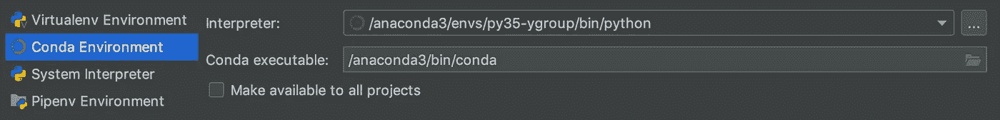

# 跨团队分发数据项目的框架

> 原文：<https://towardsdatascience.com/a-framework-to-distribute-data-projects-across-teams-15e2b9f9662?source=collection_archive---------21----------------------->


Photo by [Ansgar Scheffold](https://unsplash.com/@ansgarscheffold?utm_source=unsplash&utm_medium=referral&utm_content=creditCopyText) on [Unsplash](https://unsplash.com/s/photos/berlin?utm_source=unsplash&utm_medium=referral&utm_content=creditCopyText)

# 介绍

当您开始一个新项目或加入一个新团队时，您将经历一系列步骤来设置您的本地环境，并准备好共享您的项目。在这篇文章中，我总结了我实现这个目标的步骤。这是我一直遵循的框架，也是我在团队中实施的框架。这是我多年经验中最有效的方法。希望能对你以后的项目有所帮助。

我假设您的团队选择的开发工具如下:

*   源代码是用 Python 写的。
*   Pycharm 是构建项目的 IDE。
*   探索性分析在 Jupyter 笔记本上完成。
*   Gitlab 是你的 Git 库平台。

在这篇文章中，我将简要介绍 python 虚拟环境以及如何创建它们。然后，我将解释如何将它们添加为本地 Jupyter 安装的内核。之后，我将定义启动一个项目或使用 Pycharm 从 GitLab 克隆它的步骤。最后，我将描述编写项目依赖项并将其打包的最佳方式。

# Python 虚拟环境

python 的虚拟环境是 Python 应用、机器学习和数据科学项目的关键。

> 虚拟环境是一种工具，它通过使用特定版本的库接口为项目和系统中的其他安装创建一个隔离的环境，来帮助将项目的依赖项与它们分开。

关于详细的介绍和说明，你可以阅读 python 官方文档中的[虚拟环境和包](https://docs.python.org/3/tutorial/venv.html#virtual-environments-and-packages)的介绍。

因此，我们采取的第一步是用指定版本的 Python 创建一个虚拟环境，并将其作为项目的解释器。

## 如何创建虚拟环境？

我使用“ [conda](https://docs.conda.io/projects/conda/en/latest/user-guide/concepts/environments.html#conda-environments) ”，但是你也可以使用 python 的模块“ [venv](https://docs.python.org/3/library/venv.html#module-venv) ”，这两个工具都会创建一个“环境”来隔离软件包安装。

要使用 conda 创建一个新的虚拟 env，请确保您的计算机中已经安装了它，并且 Conda 可执行文件的路径已经添加到您的系统路径中，这样您就可以从命令行访问命令- **conda** 。

```
$ conda -V
conda 4.7.12
```

如果您可以运行前面的命令并看到安装的版本，那么您可以继续。现在我将用 Python 3.5 创建一个名为“py35-ygroup”的虚拟环境。

```
$ conda create --no-default-packages -n py35-ygroup python=3.5
...
Proceed ([y]/n)? y
...
Preparing transaction: done
Verifying transaction: done
Executing transaction: done
#
# To activate this environment, use
#
#     $ conda activate py35-ygroup
#
# To deactivate an active environment, use
#
#     $ conda deactivate
```

就这样，您已经有了一个干净的 python 安装，可以使用了。我将把它作为一个内核添加到一个现有的本地 Jupyter 服务器上，以防你使用 Jupyter 笔记本，然后我将在我们的 IDE 中把它设置为项目的解释器。

## 将环境添加到 Jupyter 笔记本中

Jupyter 笔记本自动从您的系统中提供 IPython 内核。然而，我想在新环境中使用内核，所以我需要手动注册它。

```
$ source activate py35-ygroup
# you will see the name of the venv
(py35-ygroup) $ conda install ipykernel
(py35-ygroup) $ python -m ipykernel install --user --name py35-ygroup --display-name "Python3.5 (YGroup)"
```

如果你有一个 Jupyter 服务器运行，你可以刷新用户界面，当你创建一个新的笔记本时，你应该可以看到环境。

下一步是在 **PyCharm** 中设置项目和环境。有两种可能的情况:

1.  开始一个新项目
2.  从 Gitlab 克隆项目

# 开始一个新项目

在 PyCharm 中，使用现有环境创建新项目非常简单，一旦打开初始窗口，您将看到选项:

*   **+新建项目→项目解释器→现有解释器。**

现在，您可以从之前创建的 env 中选择 Python 可执行文件，默认情况下，它应该位于 conda env 的文件夹中(或者 Anaconda，如果您通过它安装了 conda)，对于我:*"/Anaconda 3/envs/py35-ygroup/bin/Python "*



adding a virtual environment as the project’s interpreter — PyCharm

现在，您可以开始在您已经创建的环境中工作了。在环境中安装软件包可以通过 conda 或 pip 使用 IDE 中的终端或您系统中的终端(Windows 的 CMD 或 macOS 用户的终端)来完成。**确保在安装库之前已经激活了虚拟环境**，否则你会将它们安装在你的根或系统 python 中。

> 注意:不幸的是，当 conda 和 pip 一起使用来创建环境时，可能会出现问题…在 conda 环境中通过 pip 执行安装之前，请确保您阅读了本指南:[在 Conda 环境中使用 Pip](https://www.anaconda.com/using-pip-in-a-conda-environment/\)，如果您在运行代码时遇到任何问题，这将有助于您了解/修复您已安装的库。

## 总结和共享您的项目

将库添加到项目中之后，您可以创建包含在另一台机器(比如您同事的计算机)中重新创建环境的信息的 **requirements.txt** 或 **requirements.yaml** 文件。您必须将此文件添加到项目的根目录中；从终端导航到根目录，并运行以下命令:

```
(py35-ygroup) $ conda env export > requirements.yml
```

现在您可以保存项目并通过 Git 共享它。我将在下一节讨论在虚拟环境中安装库。

# 从 Gitlab 克隆项目

在这一部分中，我假设您在 Gitlab 中有一个存储库来托管您的项目，在这种情况下，您可以使用 SSH 或通过 Gitlab.com 的用户/密码验证来克隆项目。我将讨论前一个，但是出于安全原因，最好还是选择第一个选项。这是一个相当快的步骤，作为一个附加说明，你可以随意命名项目，它不一定需要与你的项目在回购中的名称相同，但要使路径不被使用

您需要获得 PyCharm 连接到 Gitlab 所需的插件。转到 IDE 插件并下载以下插件:

*   [GitLab 集成](https://plugins.jetbrains.com/plugin/7319-gitlab-integration/)
*   [GitLab 项目](https://plugins.jetbrains.com/plugin/7975-gitlab-projects/)

安装了它们之后，你应该能够从 IDE 的启动窗口中检查 VS 的项目，点击“git”并提供你的用户名和密码。


Check out from Version Control — PyCharm

您克隆的默认分支应该是主分支。此时，您可以从 IDE 的左下角(或通过终端)更改、签出或创建新的分支，这里重要的部分是现在在本地运行项目。为此，您需要从安装在虚拟环境中的 requirements.txt 或 YAML 文件中获取所有需求，让我们将新创建的虚拟环境定义为项目解释器，然后获取需求。

按照“ ***开始一个新项目*** 的初始指令，得到虚拟 env 作为项目的解释器。完成后，您可以从 IDE 中打开终端并开始安装依赖项。

## 安装需求

要重新创建虚拟环境，请导航到项目的根目录，需求文件就在那里，然后运行:

```
(py35-ygroup) $ conda env update --file requirements.yml
```

在这种情况下，存储库有一个 requirements.txt 文件，您可以使用 pip 安装依赖项，而不是运行您可以运行的前面的命令:

```
(py35-ygroup) $ pip install -r requirements.txt
```

此时，您已经准备好继续开发，直到项目准备好被共享，一旦完成，您应该更新需求文件并将变更推送到存储库。

# 结论

这篇文章中描述的基本步骤将使您和您的团队更容易共享项目，并且在处理分析或数据项目时也是一个很好的实践。至此，您已经学习了如何创建一个新的虚拟环境，如何使用 PyCharm 从 GitLab 克隆一个现有的项目，以及如何通过安装需求文件中包含的库来重新创建虚拟环境。

我希望这篇文章能帮助你下次进入一个新的项目，如果你有任何问题或意见，请在评论区分享，反馈总是受到欢迎:)