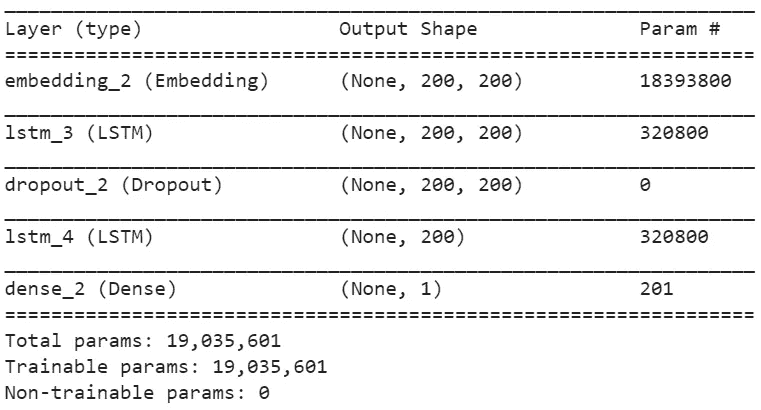

# 全栈数据科学项目

> 原文：<https://towardsdatascience.com/a-full-stack-data-science-project-part-1-9f73a997dc4d?source=collection_archive---------5----------------------->


Photo by [Chris Ried](https://unsplash.com/@cdr6934) on Unsplash

我涉足数据科学已经有一段时间了——我会从 [Kaggle](https://www.kaggle.com/) 下载一个数据集，启动一个内核，进行探索性分析，数据清理，使用 sklearn 或 fast.ai 建立一个基线机器学习模型或神经网络，结果只是被工作分散了注意力，暂时失去了兴趣，后来又对不同的比赛或数据集重复相同的过程。

在与一些从业的数据专业人士交谈后，我逐渐意识到，虽然 Kaggle 极具竞争力，并为世界上一些顶级数据科学家的同行提供了无与伦比的学习机会，但 Kaggle 数据集始于数据科学生命周期的中间某个地方——数据收集、解释、清理、屏蔽([去标识](https://en.wikipedia.org/wiki/De-identification))这些平凡但最重要的步骤都已经完成。我想建立一个数据科学项目，整合生命周期的所有方面——数据收集、清理、分析和模型构建。我还希望它能成为我学习数据科学和神经网络不同方面的平台。从而开始寻找一个“好”的数据集。

在一次与工作相关的旅行中，我在机场的一家书店浏览，我想知道是否可以围绕与书籍相关的数据建立一个数据科学项目。从一本书的导语中可以收集到什么信息？还是它的封面？当我仔细考虑这个想法时，我意识到关于一本书的其他信息，如评分、评论、描述等。进行一些实验可能也是有价值的。目标是获得从头构建模型的经验。

我将尝试遵循数据科学项目的标准工作流程，如下图所示。


经过一番研究后，我决定使用 Goodreads 作为我的数据集的来源，因为他们的书籍页面上的信息量非常全面，而且基本上是标准格式。我决定“收集”以下信息:

*   标题
*   描述
*   作者
*   版本
*   格式
*   国际标准图书编号
*   页数
*   评级
*   评级数量
*   评论数量
*   体裁
*   书籍封面图像

我举了一个 Goodreads 的书籍网页的例子，下面标注了各种信息。


An annotated image of a Goodreads page, highlighting the fields that will be extracted

在下一节中，我们将详细了解数据收集中涉及的步骤。

# 1.数据收集

因为我们的目标是为大量的书籍建立一个数据集合，所以我从查看这里的可用书籍列表[开始。“](https://www.goodreads.com/list)[有史以来最好的书](https://www.goodreads.com/list/show/1.Best_Books_Ever)”列表中有超过 50000 本书，我决定用它作为我的培训数据来源。为了使数据收集更容易，我将这个过程分为三个部分:


## 1.1 URL 集合

第一步是通过抓取图书列表来收集单个图书页面的 URL:


An example of a book “list” to be scraped.

Python 中用来从网页中收集静态数据的最流行和易用的包之一是 [BeautifulSoup](https://www.crummy.com/software/BeautifulSoup/bs4/doc/) 。它以 Pythonic 的方式提供了对页面中各种 HTML 元素的访问。如果页面内容是使用 JavaScript 动态生成的，那么 [Selenium](https://selenium-python.readthedocs.io/) 将是更好的选择，尽管速度较慢。幸运的是，我们分析所需的所有内容在 Goodreads 网页上都是静态的。

BeautifulSoup 包中最流行和最强大的两个方法是 find 和 find_all。只要我们可以使用标签和类来识别元素，我们就可以使用这两种方法从网页中提取几乎任何信息。我从 web 页面收集数据的方法是开始“检查”包含数据的元素，找出它在 HTML 格式中的结构。例如，在上面显示的列表中，右键单击“动物庄园”标题，然后单击“检查”，显示页面上的图书数据以表格的形式排列，并且在表格数据标签中可用，< td >:

```
<td width=”100%” valign=”top”>
 <a class=”bookTitle” itemprop=”url” href=”/book/show/7613.Animal_Farm”>
 <span itemprop=”name”>Animal Farm</span>
</a>
```

因此，通过访问表的每一个行中的标记，我们可以使用几行代码提取 URL:

## 1.2 数据收集

现在我们已经在 books.csv 文件中收集了 URL，下一步是收集文件中每本书的数据。这将是一个漫长的过程，因为抓取每本书的网页数据会耗费大量时间。我们还应该记住，服务器不应该因为我们的请求而过载，所以我们应该在请求 web 服务器之间留出足够的时间。

与 URL 收集不同，数据收集过程中的每个数据元素在 HTML 网页中都有不同的声明方式。因此，对于每个元素，我们需要弄清楚它是如何构造的，要访问哪个标签和类，以及如何提取数据用于我们的分析。我没有一个一个地遍历这些元素，而是在下表中给出了用于访问它们的 HTML 元素和一个例子。

Data attributes from the book web page and their corresponding HTML tags

用于提取这些数据的代码可在[这里](https://github.com/meetnaren/Goodreads-book-analysis/blob/master/Data%20Collection/Goodreads%20data%20collector.py)获得。

## 1.3 图像收集

下一步是收集书皮。这相对容易，因为我们已经收集了图书封面的图片 URLs 所需要的只是简单地下载它们。下面是我用 wget 包做同样事情的代码:

我也按照这些步骤收集了 2018 年最佳书籍的数据，这些数据可以在这里的[列表中找到。我用这个作为我的测试数据集，来评估我在有史以来最好的书籍上收集的数据上训练的任何模型。](https://www.goodreads.com/list/best_of_year/2018?id=119307.Best_books_of_2018&page=1)

需要注意的一些最佳实践:

1.  始终确保在向服务器请求之间留出足够的时间，以避免过载和被踢出局
2.  每隔几次迭代就保存您的工作
3.  并非所有数据元素在所有网页上都可用，因此在代码中包含检查以解决相同的问题

为了便于加载和使用这两个数据集，我已经将它们上传到 Kaggle。你可以在这里找到他们[这里](https://www.kaggle.com/meetnaren/goodreads-best-books)和[这里](https://www.kaggle.com/meetnaren/goodreads-best-books-of-2018)。另外，用于数据收集的代码在 GitHub [上，这里是](https://github.com/meetnaren/Goodreads-book-analysis/tree/master/Data%20Collection)。

在下一节中，我们可以在开始进行特定的分类或预测任务之前，研究数据以了解不同的特征。

# 2.数据探索

探索这些数据的笔记本可以在 GitHub [这里](https://github.com/meetnaren/Goodreads-book-analysis/blob/master/Goodreads_Data_exploration.ipynb)找到。

不管您正在执行的数据分析是什么，也不管您认为自己对数据的了解程度如何，在开始进行特定的预测或分类任务之前，查看数据并了解各种特征始终是一个好主意。让我们先来看看我们收集的数据:

The first 10 rows of the training dataset (Best books ever, from Goodreads)

从数据集的初始视图来看，有几件事很突出:

*   英语不是唯一的语言——数据集中还有其他语言，这需要探索
*   一本书可以属于多个流派

让我们先来看看流派。

## 2.1 流派

我们应该记住，Goodreads 网站上的体裁是由用户提供的，而不是作者或出版商给出的该书的“官方”体裁。这可能导致多种类型的重复或琐碎。让我们先来看看每本书的流派数量分布。

我们可以看到，书籍的平均数量在 5 到 6 本左右，分布有点右偏。下一个问题:有多少独特的流派，哪些是最常出现的？

数据集中有多达 866 个独特的流派！我认为这是因为它们是由用户提供的，并且许多流派可能会重复拼写错误。不管怎样，让我们看看数据集中的热门流派:

即使在前 50 名的榜单中，似乎也有相当长的流派尾巴。有趣的是，与小说(约 26K)相比，非小说类书籍的数量相当低(约 7.5K)。这些类型中的大多数都属于小说类(幻想、浪漫、青少年和不同类型的小说，如科学、历史、女性、现实等)。书的封面反映了一本书被标记的类型吗？让我们检查一下。

## 2.2 书籍封面

我随机抽取了一些书籍封面样本，并检查了它们所标注的类型:


据我所知，仅仅从书的封面来分类一本书的类型是很困难的。当然，在某些情况下，我们可能知道作者以前的作品(例如斯蒂芬·金的《恐怖片》),并且可以猜测其类型，但是孤立的书籍封面似乎不能提供足够的信息来确定类型。

经过进一步的研究，我发现这是一篇研究论文的主题，题为“通过封面来判断一本书”，可在此处获得。该论文的作者在他们的任务中确实取得了一些成功，但是指出:

> 许多书的封面图像具有很少的视觉特征或模糊的特征，导致许多不正确的预测。在揭示 CNN 发现的一些设计规则时，我们发现书籍也可能有误导性的封面。此外，因为书籍可以是多种体裁的一部分，CNN 在榜首的表现很差。

了解到目前为止我们收集的关于书籍封面的信息，它们可能不会成为我们分析的一部分。让我们继续讨论下一个参数:语言。

## 2.3 语言

我们对数据集的初步了解告诉我们，我们的列表中包含了一些非英语书籍。让我们看看数据集中所有可用的不同语言。

langdetect 包帮助找出一段给定文本的语言。这对于通过使用图书的描述(代码如下)来确定数据集中可用的图书的不同语言非常有用:

绘制每种语言的图书数量，我们可以看到几乎 90%的图书是英文的:

出于我们的分析目的，我们可以删除对应于非英语书的记录。然而，出于好奇，让我们检查一下数据集中非英语书籍的数量:

相当多的欧洲语言出现在这个列表中。我也对这里有相当多的印度语言这一事实感兴趣。来自印度钦奈，我想知道哪些泰米尔书籍是有史以来最好的书籍的一部分:

[Ponniyin Selvan](https://en.wikipedia.org/wiki/Ponniyin_Selvan) ，被认为是有史以来最伟大的泰米尔小说，出现在这个名单上！很高兴知道:)

## 后续步骤

探索这些数据帮助我们认识到，试图从书籍封面预测流派可能不是一个很有成效的练习(我也可能是错的！).我会试着用这本书的描述来预测流派。这可能是一个相当琐碎的任务，但它肯定会有助于理解如何从头构建一个递归神经网络，并为其准备数据。关于流派另一个需要注意的点是，独特流派的大量存在使得它成为一个非常难以预测的目标参数。通过对数据进行相应的预处理，将一本书分类为小说或非小说是有意义的。我将在接下来的小节中介绍这些步骤。

# 3.数据清理

尽管 Goodreads 上可用的数据在很大程度上是结构化和格式化的，但数据集仍有一些问题需要解决。因为我们分析的感兴趣的数据是书的描述和相关的类型，这些是我遇到的问题:

*   有些唱片没有任何流派
*   一些记录没有有效的描述
*   一些唱片的标签类型列表中既没有“小说”也没有“非小说”
*   正如我们前面看到的，一些记录有非英语的描述
*   一些图书描述有不可打印的字符和格式问题

发现这些问题需要反复试验，尤其是格式问题，需要仔细检查描述本身。尽管如此，我还是为上面提到的每个步骤编写了助手函数，并通过训练和测试数据集运行它们:

似乎有相当数量的唱片被丢弃了，因为它们被贴上了既非小说也非非小说的标签。当我检查这些记录时，我发现要么是因为用户没有给它们加标签，标签就不见了，要么是因为它们属于中性类别，比如诗歌等等。

# 4.数据预处理

既然我们已经处理了数据中尽可能多的问题，我们应该准备好将数据输入到模型中。实现这一点的第一步是确保所有输入模型的数据都是相同的格式和长度。自然，所有书籍的描述都有不同的长度。我们如何确定输入神经网络模型的描述的最佳长度？

## 4.1 剪辑和填充

我将假设，如果我们能够在一定长度(即字数)内容纳至少 80%的图书描述，那么我们的模型应该表现得相当好。为了确定这个长度，让我们绘制一个训练数据集中描述长度的[累积直方图](https://en.wikipedia.org/wiki/Histogram#Cumulative_histogram):

如果你将鼠标悬停在上图中的条柱上，你可以观察到大约 80%的记录字数在 207 字以下。让我们把最大阈值字数定为 200。这是什么意思？这意味着对于描述少于 200 个单词的记录，我们将用空值填充它们，而对于描述多于 200 个单词的记录，我们将对它们进行裁剪，只包含前 200 个单词。除了最大阈值，我们还需要一个最小阈值来确保描述至少有几个词来实际预测流派。

## 4.2 标记化

与递归神经网络相关的标记化是指将事物序列(无论是字符还是单词)转换为整数序列的过程。这仅仅意味着，对于我们跨训练和测试数据集的描述语料库中的每个单词，我们分配一个整数，我们将称之为“令牌”。因此，神经网络的输入将是代表形成描述的单词的符号序列。

[Keras](https://keras.io/) ，由[Fran ois Chollet](https://medium.com/u/7462d2319de7?source=post_page-----9f73a997dc4d--------------------------------)开发的令人敬畏的深度学习库，有一个预定义的方法来标记序列。然而，我想自己构建标记化器只是为了好玩。标记化的第一步是建立描述中所有可用单词的词汇表。一旦这个词汇表可用，分配标记就是一个简单的任务，即引用词汇表中单词的索引。在标记化的过程中，我们还可以进行之前看到的裁剪和填充。关于填充，有几点需要注意:

*   因为我们将使用整数零进行填充，所以在词汇表中不要给这个令牌分配任何单词是很重要的。
*   递归神经网络将从左到右阅读令牌序列，并输出一个预测，判断该书是小说还是非小说。这些标记的内存被一个接一个地传递给最终的标记，因此，对序列进行预填充而不是后填充是很重要的。这意味着零添加在令牌序列之前，而不是之后。存在后填充可能更有效的情况，例如在双向网络中。

下面给出了我用来将描述标记成固定长度的整数序列的代码。

## 4.3 训练和验证数据集

虽然创建训练和验证集是一个相当标准的过程，但当数据集不平衡时，即目标变量的分布不均匀时，我们应该确保训练-验证分裂是分层的。这确保了目标变量的分布在训练和验证数据集中得到保留。

# 5.模型开发

下一步是建立一个递归神经网络来处理符号化的描述，并将它们分类为小说或非小说。为此，我使用 Keras 库构建了一个顺序模型。Keras 是目前可用于神经网络开发的最佳 API 之一，尤其以其用户友好性和易于理解的结构而闻名。

我在顺序模型中使用的层如下(按此顺序):

## 5.1 嵌入

在我们进入嵌入层的细节之前，让我们看看为什么它在这种情况下是有用的。我们前面看到，我们构建了描述中所有可用单词的词汇表，并将描述转换为标记序列(整数)。现在，这些整数不能以原始形式传递给神经网络，因为这些整数的大小实际上没有任何意义。例如，对应于令牌 1 的单词是“gremlin ”,而令牌 2 的单词是“collaborated”。这并不意味着“合作”是“小淘气”的两倍。那么，我们该怎么处理呢？

这种变量称为分类变量，通常通过[一键编码](https://hackernoon.com/what-is-one-hot-encoding-why-and-when-do-you-have-to-use-it-e3c6186d008f)传递到机器学习模型中。例如，如果我们的词汇表中有 5 个单词，我们将它们标记如下:

```
[outbound, hearse, select, dogged, rowboats][1, 2, 3, 4, 5]
```

其中出站对应 1，灵车对应 2，以此类推。这种标记化表示的独热编码版本应该是:

```
outbound: [1, 0, 0, 0, 0]hearse: [0, 1, 0, 0, 0]select: [0, 0, 1, 0, 0]dogged: [0, 0, 0, 1, 0]rowboats: [0, 0, 0, 0, 1]
```

因此，每个单词都由一个向量来表示，向量的长度是词汇表中单词的总数。如果类别的数量很少，这种分类变量的表示很有效。在我们的例子中，类别的数量实际上是我们的词汇中独特单词的数量，超过 90000 个。如果我在数据集中的每条记录中有 200 个单词，这意味着我的数据集变成了一个 n*90000*200 张量，其中 n 是记录的总数。当有太多类别时，独热编码的另一个问题是表示变得太稀疏，即，与矩阵中的 1 相比，有太多的 0。一些算法可能不能很好地处理稀疏表示。因此，我们需要一种替代的方式来表示我们的输入。这就是嵌入的用武之地。

简单地说，嵌入层“学习”每个输入类别的固定长度数字表示。嵌入向量的长度可以由用户决定。一般来说，更长的嵌入能够学习更复杂的表示。在我们上面看到的例子中，假设我们训练长度为 10 的嵌入层，训练后得到的嵌入向量可能如下所示:


因此，如果我们训练一个长度为 200 的嵌入层来表示我们的词汇，该层有效地将输入的维数从 n*90000*200 减少到 n*200*200。这使得计算变得容易得多，我们的表现也更加密集。

## *5.2 叠 LSTM*

我们模型的下一层是递归神经网络的核心——LSTM(长短期记忆)层。简而言之，无论序列有多长，LSTM 层通常都会保留记忆。它能记住多少是基于输入序列和目标变量之间的关系来学习的。在我们的例子中，我们将长度为 200 的序列传递给 LSTM 层。在序列中的每个字处，LSTM 层产生一个输出状态，该输出状态被传递到下一个字，并且如果需要的话，可选地产生一个隐藏状态，该隐藏状态被传递到另一个 LSTM 层。起初我发现 LSTM 的概念非常复杂，但是克里斯多夫·奥拉的这篇文章很好地解释了这个概念:

 [## 了解 LSTM 网络——colah 的博客

### 这些循环使得循环神经网络看起来有点神秘。然而，如果你想得更多一点，事实证明…

colah.github.io](http://colah.github.io/posts/2015-08-Understanding-LSTMs/) 

在我们的例子中，我使用了一个两层 LSTM，其中第一层产生一个隐藏状态序列，该序列被传递到第二层。

## *5.3 完全连接*

全连接(也称为“密集”)层获取 LSTM 层的输出，并通过 sigmoid 激活将输入压缩为 0 到 1 之间的数字，将其映射到单个目标变量。

为了更好地理解，下面给出了网络架构的直观表示:


下面给出了创建顺序模型的代码。

Keras 给出的模型摘要:



# 6.模型评估

最后一步是训练我们的模型，根据验证集进行评估，并用我们的测试数据集进行测试。该模式能够在具有 2 个时期的训练的验证集上实现超过 90%的准确度，并且在测试数据集上实现大约 95%的准确度。

```
Train on 23393 samples, validate on 5848 samples 
Epoch 1/2 23393/23393 [==============================] — 162s 7ms/step — loss: 0.3532 — acc: 0.8542 — val_loss: 0.3033 — val_acc: 0.9020 
Epoch 2/2 23393/23393 [==============================] — 160s 7ms/step — loss: 0.1660 — acc: 0.9393 — val_loss: 0.2347 — val_acc: 0.9152 
657/657 [==============================] — 13s 19ms/step
[0.14756220990516913, 0.9482496194824962]
```

# 结论

所有用于数据收集、探索和模型开发的代码都可以在 GitHub 上找到，网址是:

[](https://github.com/meetnaren/Goodreads-book-analysis) [## meet naren/Goodreads-图书-分析

### 根据简介或描述将一本书分类为小说或非小说的数据科学项目…

github.com](https://github.com/meetnaren/Goodreads-book-analysis) 

我还尝试在 PyTorch [这里](https://github.com/meetnaren/Goodreads-book-analysis/blob/master/Goodreads_PyTorch_RNN_classifier.ipynb)复制模型开发。PyTorch 可以更好地控制数据如何进入网络，并允许我们定义构成网络转发的操作。对于像本文中描述的简单序列模型，Keras 是一个很好的选择。