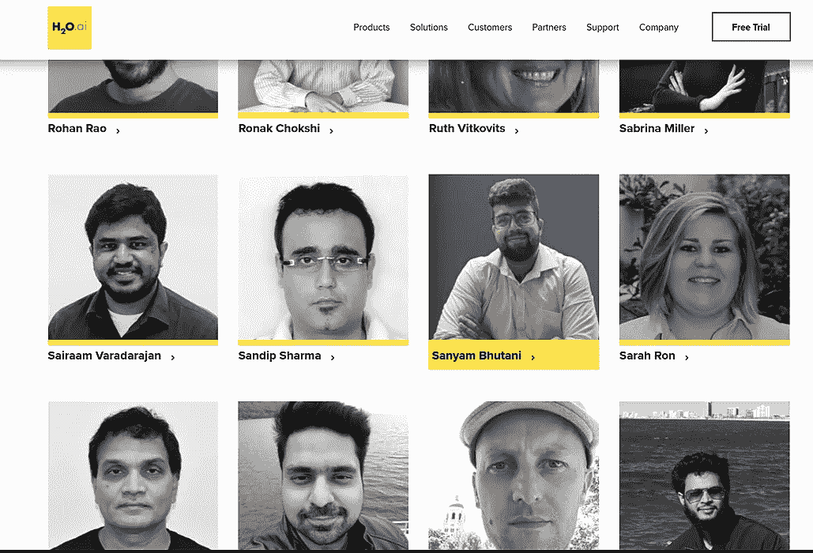
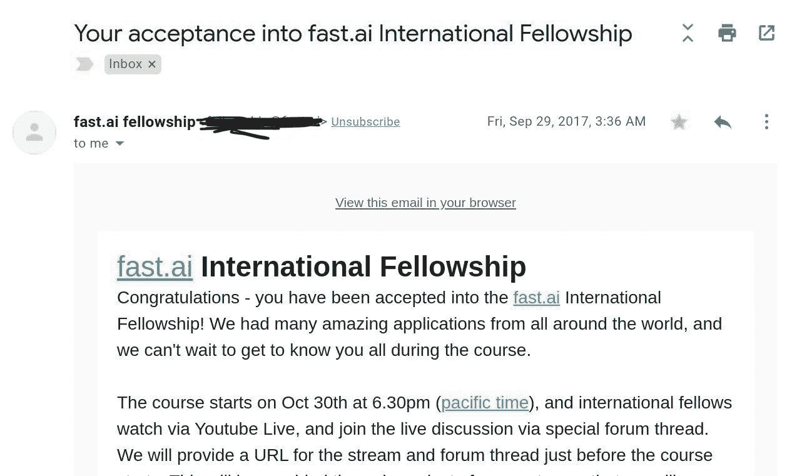
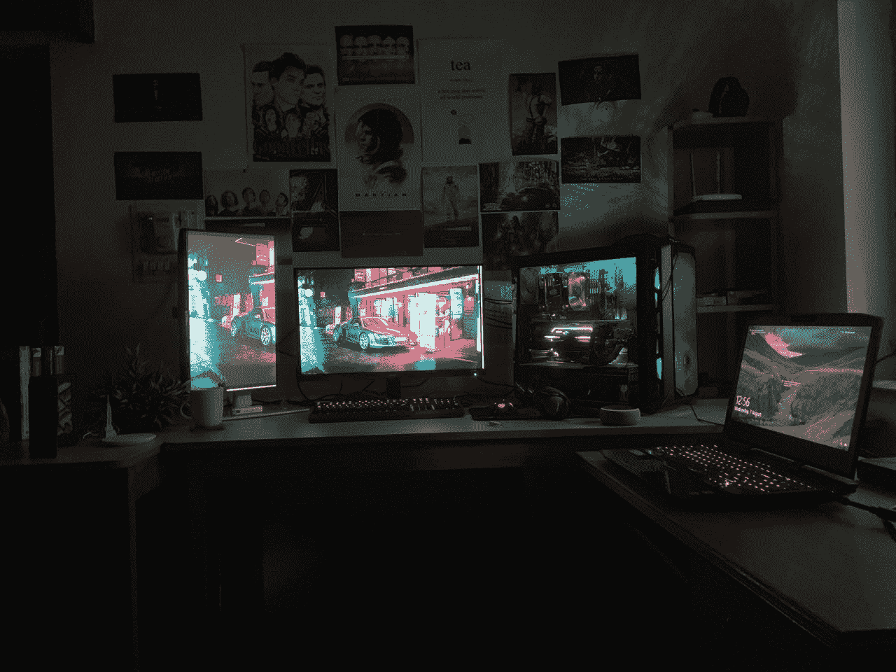
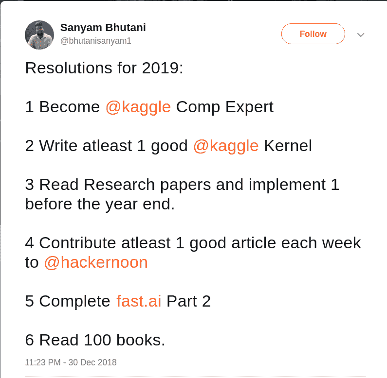
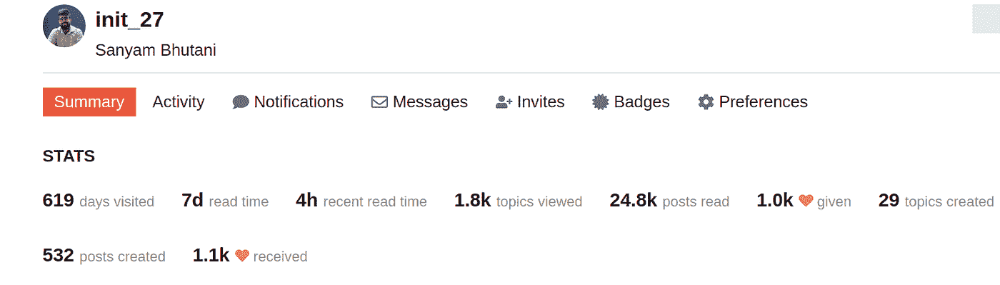
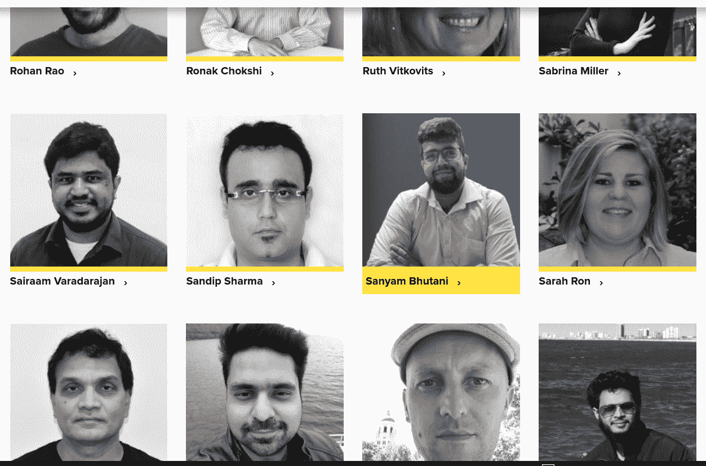

# 一个全职 ML 角色，100 万博客浏览量，10k 播客下载量:一个社区教授 ML 工程师

> 原文：<https://towardsdatascience.com/a-full-time-ml-role-1-million-blog-views-10k-podcast-downloads-a-community-taught-ml-engineer-96f99b91c5ee?source=collection_archive---------14----------------------->

## 快速回顾一个社区教授 ML 工程师的旅程。

# 里程碑和全职工作

2019 年 10 月 15 日标志着一个特殊的里程碑，实际上是相当多的里程碑。所以我考虑以博客的形式分享它，在一个出版物上，这是我所有帖子的家:)(注意:这最初是在 HackerNoon 上发布的)

网络社区对我太好了，这些博客帖子成了我和那些我通过 slack 小组认识的了不起的人庆祝任何或大或小的成就的一种方式:KaggleNoobs，ODS。AI、TWiMLAI、数据科学网、fast.ai 论坛甚至 Twitter 以及[分享我的失败](/interviewing-for-google-ai-residency-a-kaggle-gold-finish-dsnet-launch-c621930b043d)，未经过滤，尽管用手挠我的后脑勺，但这个令人惊叹的社区仍然对我太好了，即使在我失败了我最大的一次梦想面试时。

因此，如果我不分享我最终在“人工智能”领域的领导者之一获得了一个惊人的全职机会，这将是很不礼貌的。公司肯定不需要介绍了，这里就略过赞了。

在我写这篇文章的时候，我将开始在 **H2O.ai** 做一名全职的**机器学习工程师和 AI 内容创作者**。尽管全职工作是我一直向往的，但我还是很难接受这个事实。另外，鉴于我的博客帖子以及[柴时间播客](https://chaitimedatascience.com/)所取得的一些其他里程碑式的成就，我真的很兴奋，也非常感谢 ML 在线社区，它一直对我非常热情和友好。

我想这篇文章也可以让我快速回顾一下我的旅程，正如你可能知道的，我一直乐于通过这篇博客公开记录我的失败和成功，目的是留下一个公开的旅程记录，这样任何和我处于类似情况的人都可以从这些文章中受益，不会重复我的错误。

里程碑之前的旅程:)

# 旅程

在我的前一篇标志着几个里程碑的帖子中，我已经与谷歌人工智能驻地的[分享了我的拒绝，但甚至在那之前，当我去互联网上寻找更多有趣的想法和“最新”的大学学习主题时，我的旅程才真正开始。我想，要么我可以抱怨大学教学大纲太过时，与行业不同步，要么我可以出去搞清楚这个行业实际上是什么，什么是“机器学习”，什么是“模型”。你可以想象这个列表。](/interviewing-for-google-ai-residency-a-kaggle-gold-finish-dsnet-launch-c621930b043d)

我参加了网上课程，在我还在上大学的时候就参加了相当多的网上课程。然后在 9 月 29 日。我从地球的另一边收到了这封邮件，我记得我在凌晨 4 点读了它(是的，我醒得很早，然后我做的第一件事就是有时读邮件)

这一直是我最亲爱的“证书”有趣的事实，在“柴时间数据科学”工作室:

这是现存的唯一一份装裱好的打印件。虽然我不确定它是否会出现在那里的 RGB 娱乐中。

这让我进入了另一个探索周期，因为杰里米是我遇到的最好的教授。我结束了花大量时间“观看”课程的生活。回想起来，这些钱应该花在编码和“训练大量模型”上(杰里米的顶级建议，来自 Lex Fridman 的《神奇的人工智能》播客)

与此同时，我鼓起勇气访问了 kaggle dot com(我想强调一下 dot，听起来更好，不是吗？)有一两次，我确信我应该投资一台“DL 笔记本电脑”(因为我还在上大学，所以不可能买盒子)。[这本身就导致了论坛上一长串的讨论](https://forums.fast.ai/t/advice-for-purchasing-laptop/6838?page=2)和[我终于在 2018 年底](https://hackernoon.com/first-kaggle-competition-experience-591fbbc751a0)开始使用 Kaggle。此外，我需要一大笔钱来买笔记本电脑，所以我又开始上网，因为我还有一年的大学时间，我不能在大学期间做“工作”。我的“自由职业者”/合同工就是这样开始的。

新年伊始，我收到了一封来自谷歌的邮件，让我大吃一惊。我进入了人工智能住院医师面试的最后一轮，然后被拒绝了。当这封信送达时，我已经勾掉了我的几个“2019 年决心”。

*   成为 Kaggle 专家
*   创建一个好的 Kaggle 内核
*   每周写一篇博客:)
*   实现一些文件。

所以我决定花些时间在社区里，心中没有最终目标。我真的想回馈社区，因为我已经大学毕业，我有时间和许多了不起的人交谈，并通过 slack 提供帮助，主持学习小组甚至研讨会。

# 第一份“远程工作”，社区活动

到了四月底，我有了一次惊人的求职面试经历。

我通过他们的社区工作认识了一个了不起的人: [Aakash N S](https://medium.com/u/ca6fe690e934?source=post_page-----96f99b91c5ee--------------------------------) 发布了他们公司的一个职位。于是我 pinged 了他们，有了最酷的面试体验。一个 45 分钟的视频电话，而不是一个关于责任和我的长期目标的友好讨论。下一个电话是入职电话。

等等，让我理解一下。

我提到那个 fast.ai 社区就是这个意思，真的很神奇。由两位 fast.ai 研究员( [Aakash N S](https://medium.com/u/ca6fe690e934?source=post_page-----96f99b91c5ee--------------------------------) 和 [Siddhant Ujjain](https://medium.com/u/51c7e4293aaa?source=post_page-----96f99b91c5ee--------------------------------) )创建的一家公司在另一个城市遇到了另一位 fast.ai 研究员，经过一场小讨论后，他们邀请他在同一个团队工作。多牛逼啊！

该公司名为 Jovian.ml，真正建立在几个 fast.ai 哲学之上，这确实是一个天然的契合点，但创始团队的社区努力和 kaggle 的目标确实与我和整个董事会相呼应。因此，团队让我远程兼职工作，这样我也可以在 Kaggle 和社区工作上分配时间。

我最自豪的时刻之一是为印度最大的社区之一:数据科学网络做出了贡献，并组织了印度最大的 KaggleDaysMeetup 之一。

# 博客

fast.ai 最令人惊讶的一个方面是强调将博客作为投资组合或项目建设练习。整个社区甚至杰瑞米·霍华德本人都非常强调博客，这就是我开始写博客的原因。

有一次，我邀请了我的几个朋友: [Dominic Monn](https://medium.com/u/677f03e54270?source=post_page-----96f99b91c5ee--------------------------------) 和 [Tuatini GODARD](https://medium.com/u/7f6d3d997fdd?source=post_page-----96f99b91c5ee--------------------------------) 采访他们的旅程，因为他们两人在回答我的愚蠢问题时给了我很大的帮助，他们的旅程对我很有启发。这些采访很受社区欢迎，所以接下来我来到了一个十字路口:

要么我继续尝试技术文章，解释 CNN、LSTM、Transformer 等概念。或者真正专注于分享这些采访，因为我觉得这是社区中真正缺失的。所以我选择把创建教程和帖子的工作留给比我更聪明更有智慧的人，比如[“4 分钟 PyTorch 基础知识”](https://hackernoon.com/pytorch-basics-9c1c627cd0d2)，并接触了大量我真正钦佩的“机器学习英雄”。

[我仍然不相信是怎么回事，但这导致了 25 次博客采访。](https://hackernoon.com/interview-with-machine-learning-heroes-0ifi3yyg)

尽管这很可怕，因为我正稍微远离分享工程和代码遍历，这是对我的期望，对于我渴望的数据科学和 ML 的角色，但我仍然坚持采访系列。

现在我已经毕业，找到了更多的带宽，我决定重新开始这个系列，但这次是以播客的形式:视频、音频和博客格式。

我想澄清一点，我从来没有将这些帖子货币化，我也从来没有打算这样做，我也没有期望柴时间数据科学播客是一个“商业”，它对我来说是一个新的媒介，作为一个媒介(太元了，不是吗？)通过 3 种不同的格式分享这些故事，以真正允许社区所有选项来消费这些“我的机器学习英雄”的惊人故事

# 柴时间数据科学播客

再次与[播客](https://chaitimedatascience.com/)，我在一个有趣的十字路口，我选择发布视频，音频采访，处理编辑(最费力的任务)，采访和发布。

因为我真的很喜欢这些面试，所以我选择通过终止一些自由职业者的合同/协议来腾出时间，并决定在几个月内放弃 90%的收入，专注于让这些令人惊叹的旅程变得更容易实现。我真的很感谢木星的团队，让我继续播客，同时也在为“木星”工作。事实上，Aakash 还好心地设置了一个 Zoom 账户，通过这个账户进行采访。没有这一点，就不会有第一批采访或电话。

我真的很享受这个过程，现在能够和我的 ML 英雄们聊上一两个小时。播客电话真的是我做过的最好的活动之一。尽管这也让我在 Kaggle 竞赛和练习更多编码之间做了一个权衡，但我还是设法每天挤出几个小时来练习编码。我想我真的坚持了蒂姆·德特默给应届毕业生的建议:“你有时间。放轻松，享受过程，享受学习。总有一天，你的任务会变得重复，所以慢慢来，理解你的激情。我真的很高兴我做到了:)

# 里程碑

我真的想分享三个里程碑，几个我从未真正期望会发生的点:

# 我的博客点击量达到了 100 万次。

对，100 万！想象一下，开始一个在线课程建议的活动，一个在线社区教你的活动，然后能够与这么多人分享！

我非常感谢 Hackernoon 热情地接受了我的所有采访和所有帖子，也感谢 David(Hackernoon 的首席执行官)在我试验性帖子的最初几天给了我很多反馈。

[我不会分享任何写博客的建议，而是分享我用过的最好的一个。](https://medium.com/@racheltho/why-you-yes-you-should-blog-7d2544ac1045)

这是我每篇文章的指导方针。

我也非常感谢每一个阅读我的帖子的人，特别是那些“机器学习英雄”，他们友好地与一个刚刚开始旅程的新手分享了他们的旅程。

# 10k 播客下载

[柴时间数据科学](https://chaitimedatascience.com/)上线 1.5 个月后下载量达到 10k！我不是一个播客，也不是一个好的统计人员，但这对我来说是一个巨大的数字，我真的很高兴播客作为一种媒体达到了很多观众，并分享了这些伟大的故事，建议。我希望继续保持我带来的疯狂的发布时间表。

另一个疯狂的事实，柴时间数据科学，在写作的时候，已经流过 80 个国家。什么！？

我真的很喜欢互联网(或者只是它上面的 ML 社区:)

# Fast.ai

我把旅途中最精彩的部分留到了最后一节。:)

在我上面提到的所有统计数据中，这可能是我最自豪的一个，甚至可能超过我的 Kaggle 等级(也许)(尽管我想完全指出，所有的 Kaggle“奖牌”或“等级”都是由于我在一个团队中有机会遇到和工作令人惊讶的 kagglers，所以如果没有我有机会与之合作的令人惊讶的人，我完全不可能实现它们。我不是一个聪明的 kaggler，我也不会假装聪明，但我绝对相信 Kaggle 是一个很好的学习平台，也是数据科学的真正家园，我认为我不能再强调这一点了)

亲爱的 fast.ai 团队:[杰瑞米·霍华德](https://medium.com/u/34ab754f8c5e?source=post_page-----96f99b91c5ee--------------------------------)、[瑞秋·托马斯](https://medium.com/u/ee56d0bac1b7?source=post_page-----96f99b91c5ee--------------------------------)和西尔万·古格，还有 fast.ai 一家，(这是一个我喜欢称之为家庭的在线社区)。自学或社区教育的一个方面是，我的教育只能和社区的资源和建议一样好。

在我之前的帖子中，我并没有很不幸地真正感谢 fast.ai 团队，但最终得到了一份梦寐以求的工作，这是我做梦都不敢想的(又太元了？)我想我终于可以把我的成就归功于 fast.ai 课程、图书馆和社区了。

我学到的很多东西:在 kaggle 上竞争、博客、软件工程和深度学习，甚至是一些小事情，比如如何阅读论文、如何筛选数学方程，不要迷失在希腊语中，而是找出代码。我能够做的这些事情，在某种程度上或者更大程度上，都要归功于我通过 fast.ai 体验获得的曝光率。我承认我可能不是最好的学生，因为我还没有完成 swift for TF 课程，尽管我已经在 swift 上写了几篇博文，我还没有观看 V2 演练，所以我可能不是 fast.ai 全球课堂上最真诚的学生。然而，我真的真的很感谢杰瑞米·霍华德、瑞秋·托马斯、西尔万·古格和所有我在论坛上认识的了不起的人。

我还想指出的是，像 Kaggle 这样的东西在课程中被轻描淡写地强调了，所以它不是我提到的所有上述要点的必经之路，你可能还需要做功课。但正如他们所说，核能是由铀产生的，而不是发生的副产品，我认为 fast.ai 是这种连锁反应的铀，如果你正确地遵循，你可能会获得惊人的结果！:)

然而，如果我没有加入 KaggleNoobs 社区、DSNet、ODS，这对我来说是不可能的。AI 和 TWiMLAI 也是。所有这些对我来说都是一个惊人的学习点，尽管我没有参与太多的对话或最新的论文讨论，因为我已经承诺了播客的发布时间表。然而，我真的很感激这些社区和他们中的每个人对我的欢迎。(同样，我是通过 fast.ai 论坛发现这些的:)

最后，我要提到，当我说“在线或社区或自学”(我更喜欢这三个词之外的社区教育)时，我确实遵循并追求了传统的 CS 本科学位，我所有的在线学习都是从那里开始的。但是，我对机器学习世界的了解(非常少)真正归功于在线资源。我只从事我真正喜欢教学大纲的大学课程，并真正浏览了其他课程，我不知道为什么，但我确实获得了“IET 奖”，正如他们所说，“这是由大学提供给他们最优秀的学生的”。我给大学里任何人的唯一建议是，追随你的激情，不要害怕寻求帮助，无论是在线还是离线。

# 我在机器学习旅程中的下一个角色和下一部分

从页面[https://www.h2o.ai/team](https://www.h2o.ai/team)

我非常幸运，也非常兴奋能够在 H2O.AI 开始全职担任“机器学习工程师和人工智能内容创作者”。

这绝不是将我归类为专家，该公司本身就是许多令人惊叹的 kagglers 和世界顶级数据科学家的家园，我对我旅程的下一部分感到非常兴奋，并准备了解更多。

多亏了互联网， fast.ai 和在线 ML 社区定义了我的道路，并特别感谢我的父母，他们同意了这个完全疯狂的计划，甚至在播客最初增长缓慢时支持了我，或帮助我开始使用我的第一个 GPU，甚至在我选择退出大学校园实习时更早，因为他们大多数人都是全栈角色，我真的想转而 Kaggle(对任何竞争数据都没有经验 科学竞赛)并花时间学习在线课程，尽管这个计划听起来很疯狂(我的父母支付了我的大学费用，甚至是我追求的在线课程)，但我的父母一直是最支持的。 我的母亲更是如此，她总是忍受着一个儿子，他经常在一个房间里呆上几天，在一个产生高电气噪音的 GPU 环境中喝下数不尽的茶。

我将继续通过 Hackernoon(和 Medium)的博客分享我的旅程，不加过滤，定期发布。感谢所有和我一起经历这个奇妙旅程的人。

> [*你可以在推特上找到我@ bhutanisanyam 1*](http://twitter.com/bhutanisanyam1)
> 
> [*订阅我的时事通讯，获取深度学习和计算机视觉阅读的每周精选列表*](http://tinyletter.com/sanyambhutani/)