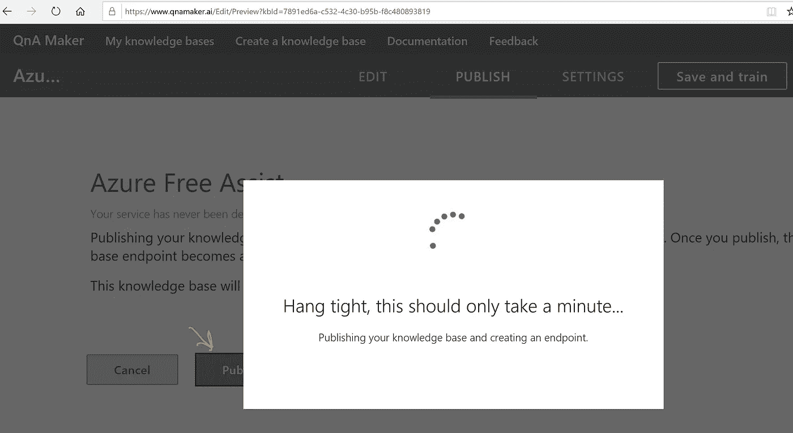
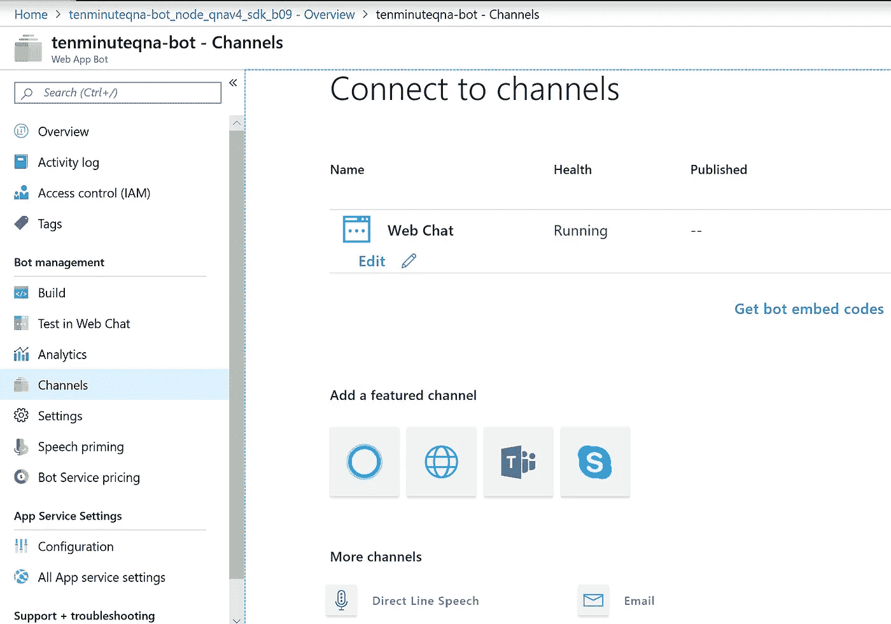

# 10 分钟内一个功能齐全的聊天机器人

> 原文：<https://towardsdatascience.com/a-fully-functional-chatbot-in-10-mins-8ecd69dff789?source=collection_archive---------23----------------------->

聊天机器人很酷，没有什么比在 10 分钟内制作一个聊天机器人更令人满意的了。我们也对最佳实践感到非常兴奋。因此，尽管这篇文章是针对第一次构建聊天机器人的人，但即使是有经验的开发人员也会带回家一些好东西。就这样，让我们以菜谱的方式进行构建…

Sanbot King Kong for hospitality By QIHAN Technology — Own, CC0, [https://en.wikipedia.org/w/index.php?curid=55094935](https://en.wikipedia.org/w/index.php?curid=55094935)

— — — — ***如何制作聊天机器人*** — — —

**先决条件:**

你肯定需要一个烤箱，在这种情况下，这是你的 Azure 订阅([https://azure.microsoft.com/en-us/free/](https://azure.microsoft.com/en-us/free/))

**配料:**

1.  写 Python 代码的地方。我正在使用 Visual Studio 代码([https://code.visualstudio.com/](https://code.visualstudio.com/))看看 Visual Studio 安装和入门的评论部分。

2.Azure 中的 QnA Maker 服务

3.Azure Bot 服务版本 4

**说明:**

**步骤 1:** 让我们**为 python 设置虚拟环境**。python 虚拟环境只是一个自包含目录，其中包含特定版本的 python 安装和项目/程序/模块所需的相关库。

Python Virtual Env set up in VS Code

#命令:

#来自项目根文件夹

mkdir 虚拟 _ 环境

光盘。\虚拟环境\

python -m venv 聊天机器人 _env

set-execution policy-Scope Process-execution policy Bypass(特定于 Windows 的命令)

。\ chatbot _ env \脚本\激活

**第二步:**接下来，我们需要**建立 QnA Maker 服务**。QnA Maker 是一个基于云的 API 服务，在您的数据上创建一个对话、问答层[1]。

QnA Maker 使您能够根据半结构化内容(如常见问题解答(FAQ)URL、产品手册、支持文档和自定义问答)创建知识库(KB)。QnA Maker 服务通过将用户的自然语言问题与知识库中 QnA 的最佳答案进行匹配，来回答用户的自然语言问题。**逐步指南**可参考以下文件:

 [## 设置 QnA Maker 服务— QnA Maker — Azure 认知服务

### 在创建任何 QnA Maker 知识库之前，您必须首先在 Azure 中设置 QnA Maker 服务。任何人有…

docs.microsoft.com](https://docs.microsoft.com/en-us/azure/cognitive-services/QnAMaker/how-to/set-up-qnamaker-service-azure) 

create a QnA Maker service from Azure Portal

提示:为这个项目创建一个资源组[2],并将与本练习相关的所有内容放入其中，这样您就可以从资源组管理与这个项目相关的所有内容。

您还可以使用 azure 资源管理器模板(JSON 格式的)[3]来自动化部署。

部署完成后，您将能够看到 Azure 为您创建所需的资源。平台即服务不是很有魅力吗？

QnA Maker Deployment Summary from Azure Portal

第三步:现在我们需要**建立知识库**。QnA Maker 知识库[4]由一组问题/答案(QnA)对和与每个 QnA 对相关联的可选元数据组成。

关键知识库概念:

问题:问题包含最能代表用户查询的文本。

答案:答案是当用户查询与相关问题匹配时返回的响应。

元数据:元数据是与 QnA 对相关联的标记，表示为键值对。元数据标签用于过滤 QnA 对，并限制执行查询匹配的集合。

您可以根据自己的内容(如常见问题解答或产品手册)创建 QnA Maker 知识库(KB)。

在这里，我将使用 https://azure.microsoft.com/en-us/free/free-account-faq/的[来构建一个聊天机器人。](https://azure.microsoft.com/en-us/free/free-account-faq/)

**使用您的 Azure 凭据登录**[**qnamaker . ai**](http://QnAMaker.ai)**门户，然后按照下面文档中的逐步指导进行操作:**

 [## 创建、培训和发布知识库— QnA Maker — Azure 认知服务

### 您可以根据自己的内容(如常见问题解答或产品手册)创建 QnA Maker 知识库(KB)。QnA 制造商…

docs.microsoft.com](https://docs.microsoft.com/en-us/azure/cognitive-services/QnAMaker/quickstarts/create-publish-knowledge-base) 

[**QnAMaker.ai**](http://QnAMaker.ai) **portal**

[**QnAMaker.ai**](http://QnAMaker.ai) **portal create knowledge base step 1**

[**QnAMaker.ai**](http://QnAMaker.ai) **portal create knowledge base step 1_1**

[**QnAMaker.ai**](http://QnAMaker.ai) **portal create knowledge base step 1_2**

[**QnAMaker.ai**](http://QnAMaker.ai) **portal create knowledge base step 1_3**

我们有一个包含 101 个 QnA 对的初始知识库，需要保存和训练。当然，我们可以修改和调整它，使它更酷。

[**QnAMaker.ai**](http://QnAMaker.ai) **portal create knowledge base step 2**

[**QnAMaker.ai**](http://QnAMaker.ai) **portal create knowledge base step 2_1-> Save and Train**

一旦我们完成了**培训**，就该**测试**QnA 制造商了。

[**QnAMaker.ai**](http://QnAMaker.ai) **portal create knowledge base step 3_1-> Test**

我们还可以检查测试响应，选择最佳答案或添加备选措辞进行微调。

[**QnAMaker.ai**](http://QnAMaker.ai) **portal create knowledge base step 3_2-> Inspect Test results**

现在是时候发布知识库了。您需要从门户网站中点击“发布”选项卡。

当您发布知识库时，知识库的问题和答案内容会从测试索引移动到 Azure search 中的生产索引。

[**QnAMaker.ai**](http://QnAMaker.ai) **portal create knowledge base step 4_1-> Publish**

[**QnAMaker.ai**](http://QnAMaker.ai) **portal create knowledge base step 4_2-> Publish wait for completion**

[**QnAMaker.ai**](http://QnAMaker.ai) **portal create knowledge base step 4_3-> Service deployed/published**

在我们继续创建聊天机器人之前，让我们接下来以编程方式调用 qnamaker。

**Python 程序调用并测试 qnamaker。**代码出现在这里:[https://github.com/RajdeepBiswas/Ten_Minute_ChatBot_Python](https://github.com/RajdeepBiswas/Ten_Minute_ChatBot_Python)，解释和设置过程起草如下，作为主要文章步骤的一部分。

**第 4 步:**密钥、密码和秘密不能在众目睽睽之下…让我们**建立一个配置文件**来保存我们的 python 项目的秘密和密钥。

我们将从 [qnamaker.ai](http://qnamaker.ai) 服务发布页面的 curl 部分获取值。

**Get the config values from** [**QnAMaker.ai**](http://qnamaker.ai/) **portal**

根据上面的值设置 config.py 文件。不要忘记放置 __init__。py 使配置文件可调用😊

**config.py file to store the secrets**

**__init__.py file to make the config referable**

现在，我们已经做好了配置准备。

提示:不要忘记将 config.py 包含到。gitignore 如果你想把代码放到 github 里。

文件可在以下位置找到:

 [## RajdeepBiswas/Ten _ Minute _ ChatBot _ Python

### 在 GitHub 上创建一个账号，为 RajdeepBiswas/Ten _ Minute _ ChatBot _ Python 开发做贡献。

github.com](https://github.com/RajdeepBiswas/Ten_Minute_ChatBot_Python/tree/master/secret_keys) 

**第五步:**现在我们需要**编写客户端 python 程序**。这里用到的程序可以在 github 中找到:[https://github . com/RajdeepBiswas/Ten _ Minute _ ChatBot _ Python/blob/master/call _ qna . py](https://github.com/RajdeepBiswas/Ten_Minute_ChatBot_Python/blob/master/call_qna.py)

**Call QnA maker from python code**

第六步:终于到了**创建聊天机器人**的时候了……哇呜！！！

在 [QnAMaker.ai](http://qnamaker.ai/) 门户的服务部署页面点击创建聊天机器人。这一步将把您重定向到 Azure 门户，您需要在那里创建 Bot 服务。

**Create bot from** [**QnAMaker.ai**](http://qnamaker.ai/) **portal**

**Azure portal create bot service**

如果存在资源提供者注册错误，可以通过多种方式解决。

这里，我在 Azure cli 中使用了以下命令:

az 提供者注册—微软命名空间。僵尸服务

create bot error resolution

有关更多信息，请参考:[https://docs . Microsoft . com/en-us/azure/azure-resource-manager/resource-manager-register-provider-errors](https://docs.microsoft.com/en-us/azure/azure-resource-manager/resource-manager-register-provider-errors)

然后刷新 Azure 门户页面以创建聊天机器人:

**Azure portal create bot service**

点击“创建”后，将会有一个自动验证步骤，然后将会部署您的资源。

Bot service deployment

Bot service deployed

部署完成后，转到 azure portal 中的 webapp bot。

Web App Bot

现在，让我们在网络聊天中测试我们的机器人:

Test in Web Chat

**奖励环节:**你可以把你的机器人连接到不同的频道。

通道是机器人和通信应用程序之间的连接。您可以配置一个 bot 来连接到您希望它可用的频道。通过 Azure 门户配置的 bot 框架服务将您的 bot 连接到这些通道，并促进您的 Bot 和用户之间的通信。你可以连接到许多流行的服务，如 Cortana，Facebook Messenger，Kik，Skype，脸书，Telegram，Twilio，Slack 以及其他一些服务。网络聊天频道是为您预先配置的。更多信息可以在这里找到:[https://docs . Microsoft . com/en-us/azure/bot-service/bot-service-manage-channels？view=azure-bot-service-4.0](https://docs.microsoft.com/en-us/azure/bot-service/bot-service-manage-channels?view=azure-bot-service-4.0)

**Connect bot to channels**

如果你已经成功地做到了这一步，我肯定会认为你未来探索人工智能机器人开发的旅程将会更有收获，更顺利。请让我知道你的任何问题或意见。

**参考文献**

[1]

“QnAMaker”，2019 年 4 月 4 日。【在线】。可用:[https://docs . Microsoft . com/en-us/azure/cognitive-services/qna maker/overview/overview。](https://docs.microsoft.com/en-us/azure/cognitive-services/QnAMaker/overview/overview.)

[2]

“资源组”，[在线]。可用:[https://docs . Microsoft . com/en-us/azure/azure-resource-manager/resource-group-overview # resource-groups。](https://docs.microsoft.com/en-us/azure/azure-resource-manager/resource-group-overview#resource-groups.)

[3]

“模板-部署”，[在线]。可用:[https://docs . Microsoft . com/en-us/azure/azure-resource-manager/resource-group-overview # template-deployment。](https://docs.microsoft.com/en-us/azure/azure-resource-manager/resource-group-overview#template-deployment.)

[4]

“知识库”，2019 年 6 月 4 日。【在线】。可用:[https://docs . Microsoft . com/en-us/azure/cognitive-services/qna maker/concepts/knowledge-base。](https://docs.microsoft.com/en-us/azure/cognitive-services/QnAMaker/concepts/knowledge-base.)