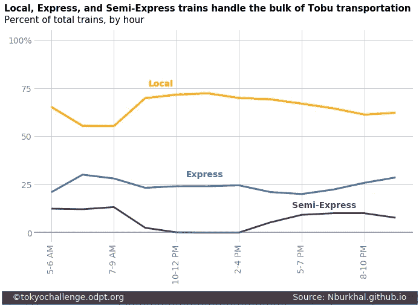
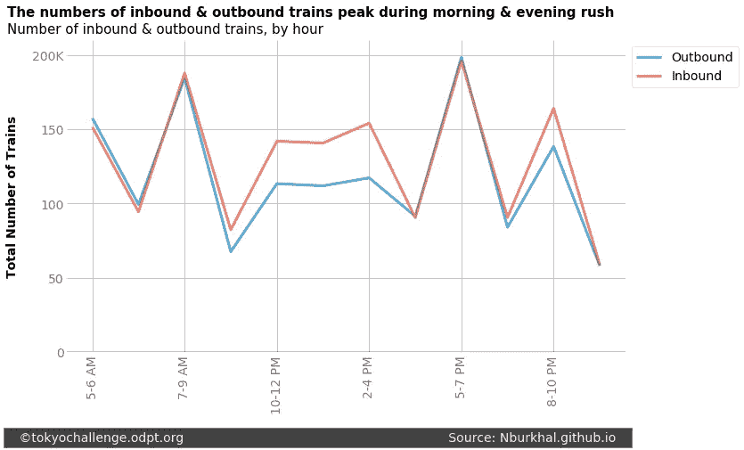
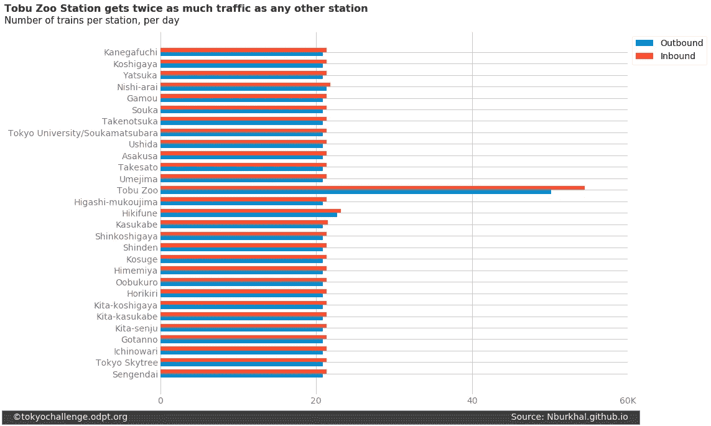
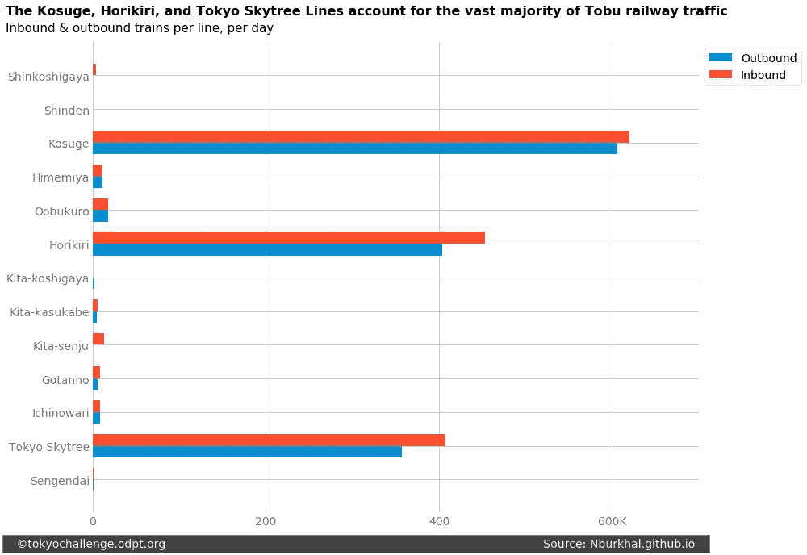

# 东京铁路系统外国人指南

> 原文：<https://towardsdatascience.com/a-gaijins-guide-to-the-tokyo-train-system-ce64fe0d1148?source=collection_archive---------13----------------------->

Every day, millions of Japanese use public trains to commute in and around Tokyo. With the 2020 Olympics right around the corner, this number is expected to increase significantly with the sudden influx of millions of international spectators. What can data about Tokyo’s public transportation tell us about the world’s most efficient and complex system? And can we find ways to improve the system such that it can operate just as efficiently at much higher capacities?

东京地铁系统是一个物流奇迹。东京这座城市大约有 1400 万人口，是一个繁忙的国际商业中心，是许多年轻日本工人的目的地，也是 2020 年奥运会的举办地，因此它很少睡觉。有这么多的人试图在城市里移动，一个高效的公共交通系统是至关重要的。东京创造了，可以说是世界上最好的(也是最广泛的)。以铁路为主要交通工具，东京发展了一个庞大的系统，由独立拥有和运营的铁路线和汽车组成的互联网络组成，能够[每天运送大约 2000 万乘客](https://en.wikipedia.org/wiki/Transport_in_Greater_Tokyo#Rail)。

面对如此惊人的庞大数字，我认为分析东京最受欢迎的运营商之一东武铁路公司会很有意思。数据是通过东京公共交通 API 的[开放数据挑战获得的，这篇文章的全面分析可以在我的](https://tokyochallenge.odpt.org/en/index.html) [GitHub](https://github.com/Nburkhal/Tokyo-Train-Data) 页面找到。虽然分析的数据只是整体运营的一小部分，但它确实揭示了日本铁路行业的真实规模，以及我们外国人如何更有效地利用火车为我们的旅游服务。

## 列车容积

最初，数据被清理是为了显示一天中有多少列车在东武线上运行。重要的是要记住，不是所有的列车都是一样的，所以列车的类型是作为一个额外的维度添加到分析中的。下图显示了日本铁路每天运行的数百万辆列车，不仅强调了总数，还强调了*类*列车的数量。

这张图表告诉我们的是，在早上 7-9 点和下午 5-7 点之间，火车的总数达到了每天的最高水平。这是有道理的，因为这些窗口是在早晚高峰期间，数百万日本上班族和女性上下班的时候。此外，半特快列车只在早高峰运行，直到晚高峰前才再次启动。这表明它们的目的是在高峰时段帮助人们涌入东京附近的车站。

晚上 8 点到 10 点的高峰也很有趣，因为它凸显了一种日本文化现象。日本员工应该在老板离开后离开，一旦他们离开办公室，同事们应该聚在一起喝酒和吃饭。典型的日本工薪族通常要到晚上 10 点以后才回家(关于日本的工作文化是否与该国不断下降的出生率有任何关联，有很多猜测，但那是另一个时间的讨论)。

上图还显示了三种火车构成了日常运输的主体:慢车、快车和半快车。就百分比而言，这 3 个系列可以细分如下:

在这里，我们可以清楚地看到，慢车和快车处理大约 85%的全天交通，而半快车主要用于高峰时间。作为一个外国人，如果你想在这个城市四处走走，你最好的选择是乘坐慢车或快车。

另一个有趣的点是进站和出站列车之间的差异。虽然火车在东京只有两种移动方式(进或出)，但一天中的时间和火车移动的方向之间可能有关系。按照一天中的时间绘制进站和出站列车的数量，以产生以下视觉效果:

同样，我们在图中看到峰值出现在上午 7–9 点和下午 5–7 点。但是，如果仔细观察，您会发现早高峰期间进站列车略多于出站列车。晚高峰的情况正好相反。这实际上是非常直观的，因为大多数人从其他地方来到东京工作，工作一结束就离开。晚上 8-10 点的峰值也说明了上述文化点。然而，这种涌入在一定程度上也是因为年轻人来到这个城市享受东京的夜生活。

就百分比而言，上图可以表示如下:

这个图表的有趣之处在于，它澄清了一个事实，由于上面提到的原因，一天中进站的列车比出站的列车多。

## 车站音量

既然对列车容量有了概念，下一个合乎逻辑的步骤就是看看这些列车到底要去哪里。东武铁路连接 158 个车站；然而，只有那些接收 20，000 或更多进站列车的列车才包括在分析中。这个数字被选为阈值，因为接收较少的站的数量变化如此之大，以至于我们无法洞察哪些站是最繁忙的(因为图表会变得过于混乱)。

我们可以清楚地看到，东武动物园站是网络中最繁忙的。然而，这并不意味着所有的乘客都对看到奇异的动物感到兴奋。事实上，造成这种差异的原因是东武动物园实际上是东武铁路线上的最后一站。这意味着东武站用于换乘其他铁路，本质上充当了经由东武线进出东京的枢纽。

## 线路音量

最后的分析是为了确定哪些铁路线是最繁忙的。进站和出站列车是根据特定的东武铁路线计算的。

这张图说明了大江线、堀里线和东京晴空塔线构成了东武铁路系统的绝大部分。所有其他线路都是东京内更具体地点的分支。作为一名游客，你去任何地方的最佳选择就是使用这三条线路中的一条。

## 结论

东京公共铁路运营庞大而复杂。在这篇文章中，我只概述了一条具体的铁路。实际上，还有 29 家运营商运营着总共 108 条独立线路，连接东京境内总共 882 个火车站。由于网络的设计，实际上不可能获得所有城市的列车数据用于分析目的；然而，我们仍然可以从整个画面的一小部分中收集一些重要的见解。作为游客，我们应该预料到早晚高峰时车站会非常拥挤。我们还应该预料到，如果我们决定在晚上进入东京而不是离开(早上正好相反)，我们的旅行将不会那么拥挤。此外，帕累托法则适用于铁路线——你的大部分运输可以在运营商的一小部分线路上完成。最后，火车路线上的最后一站通常是最繁忙的，因为许多人正在换乘火车在全国各地旅行。