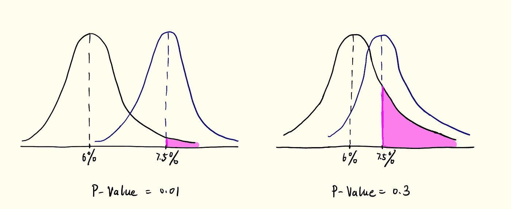
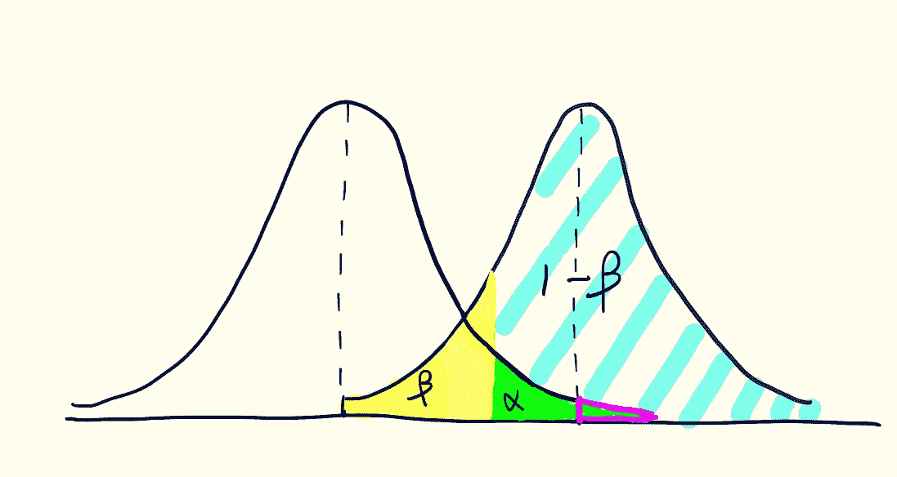
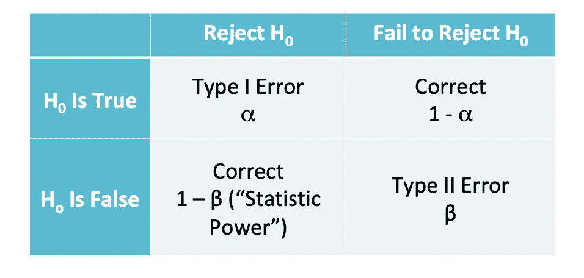
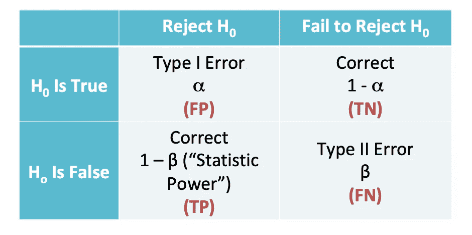

# 假设检验的一般指南

> 原文：<https://towardsdatascience.com/a-general-guidance-of-hypothesis-testing-7cab119ca999?source=collection_archive---------17----------------------->

## 对 P 值、I 型误差、II 型误差、统计功效的温和解释

假设检验作为一种重要的统计技术，广泛应用于各种商业案例的 A/B 检验中，同时也给许多人带来了困惑。本文旨在总结假设检验的几个关键要素的概念，以及它们如何影响检验结果。

故事从假设开始。当我们想知道一个总体的任何特征，如分布形式、感兴趣的参数(均值、方差等)时。)，我们对它做一个假设，叫做人口假设。然后，我们从总体中抽取样本，并测试样本结果在给定的假设下是否有意义。

例如，您的经理不知何故知道公司网站上所有用户的平均点击率为 0.06(总体点击率的平均值)，而您对此表示怀疑，并认为点击率应该更高。如何检验你或你的经理是否会赢？假设检验所做的是首先提出一个假设，即假设 CTR μ = 6%，然后随机抽取大量用户的样本数据，并从中计算 CTR 的均值(样本的 CTR 均值)。根据对样本的观察，决定是否拒绝你的假设。于是就出现了**零假设**和**替代假设**。

零假设:μ = 6%

替代假设:μ > 6%

假设样本量足够大是有效的，你发现 CTR 的均值是 7.5%。你能不能直接告诉你老板，真实的 CTR 是 7.5%？基于样本的 1.5%的差异是否足以让你做出这个决定？概率总能帮助解决不确定性。希望您能提供这样的答案:如果零假设为真，即 CTR 的均值等于 6%，那么从样本中看到 CTR 的均值等于或大于 7.5%的概率为 1%。百分之一的概率是很少发生的。因此，拒绝零假设是合理的。这正是 **P 值**所解释的。

> " P 值是在零假设下获得与观察到的结果一样或更极端的结果的概率."

P 值= P(μ ≥ 7.5% |零假设成立)

让我们看看下面两种情况下 P 值的可视化。

黑线代表零假设的分布，蓝线代表样本均值的分布。粉色区域是如上所述的 P 值。第一种情况是这两种分布彼此远离，P 值很低，为 0.01。表示看到样本均值分布均值等于或大于 7.5%的概率为 1%，假设总体真实均值等于 6%的零假设为真。这是非常罕见的，但这是我们观察到的，所以我们声明假设是不正确的。类似地，第二种情况，P 值等于 30%，意味着有 30%的概率看到样本分布的均值等于或大于 7.5%，这是一个相当高的概率，所以我们不能拒绝零假设。这就是为什么当 P 值很小时，拒绝零假设。

另一方面，不管零假设是否为真，也不管你是否应该拒绝零假设，它们的组合都可以表示为概率。这就是假设检验的美妙之处。查看可视化的更多细节:

假设在这种情况下，P 值(近似粉色三角形包含的区域)足够小，等于 0.05。那么α，β和 1- β的意义是什么呢？

α是**I 型误差**，是假设假设为真，错误拒绝零假设的概率。也算是你能容忍的 P 值的最大值。设置好α的值后，你会有一个相应的显著性水平。例如，当α = 5%时，显著性水平为 95%。

α = P(拒绝零假设|零假设为真)

β是**第二类错误**，是假设无效，拒绝无效假设失败的概率。

β = P(拒绝零假设失败|零假设为假)

1-β是**统计功效，**是在假设无效的情况下，正确拒绝无效假设的概率。

1-β = P(拒绝零假设|零假设为假)

下表总结了四种情况:

这让我想起了我们通常用于分类问题的混淆矩阵。α其实是假阳性，β是假阴性，1-β是真阳性，1-α是真阴性。见下图。

显然，我们希望最小化 FP 和 FN，最大化 TP，但正如上面所示的分布图，随着α减小，β增大，统计功效减小。所以它们之间总是有一个权衡，我们不能只优化一个单一的指标。当你试图平衡召回率和精确度时，这与混淆矩阵的逻辑完全相同。影响α和β的因素有几个，如样本大小、分布范围、假设和观察之间的差异等。统计功效的标准选择是 80%，α是 5%。

本文从概念上提供了假设检验的顶级摘要以及一些重要的度量标准。在分布和要测量的度量标准的选择方面，还有许多其他的计算细节和要求。继续潜水！