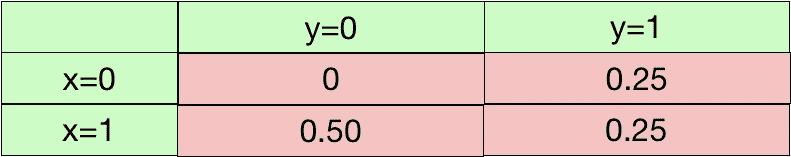
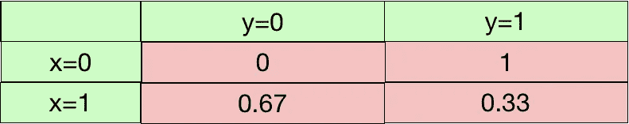
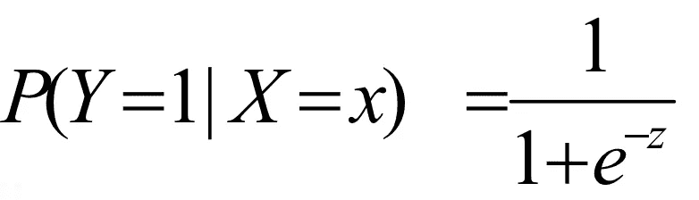
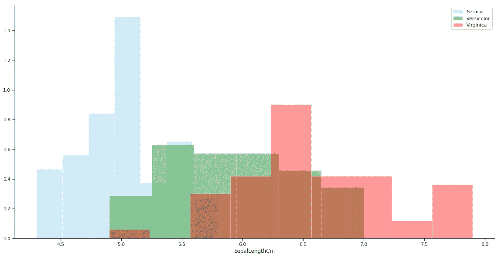
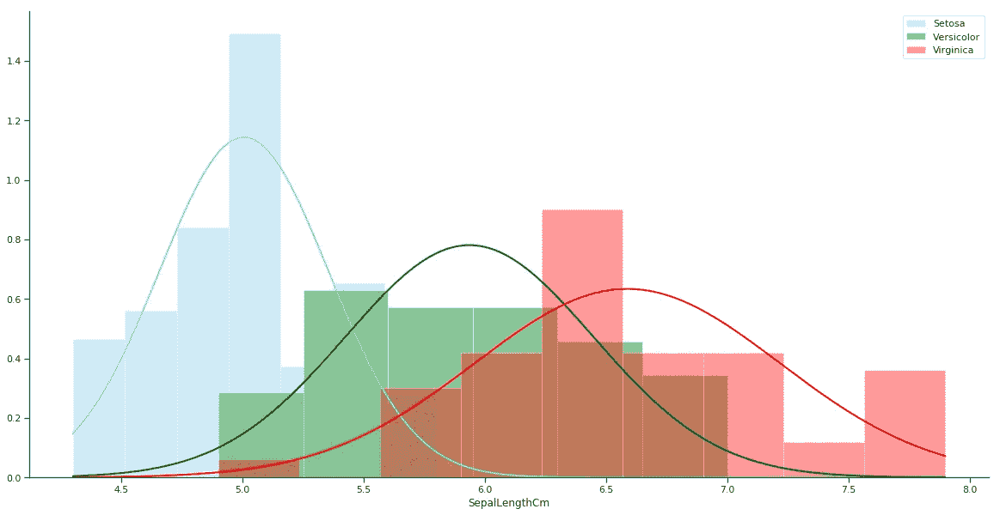
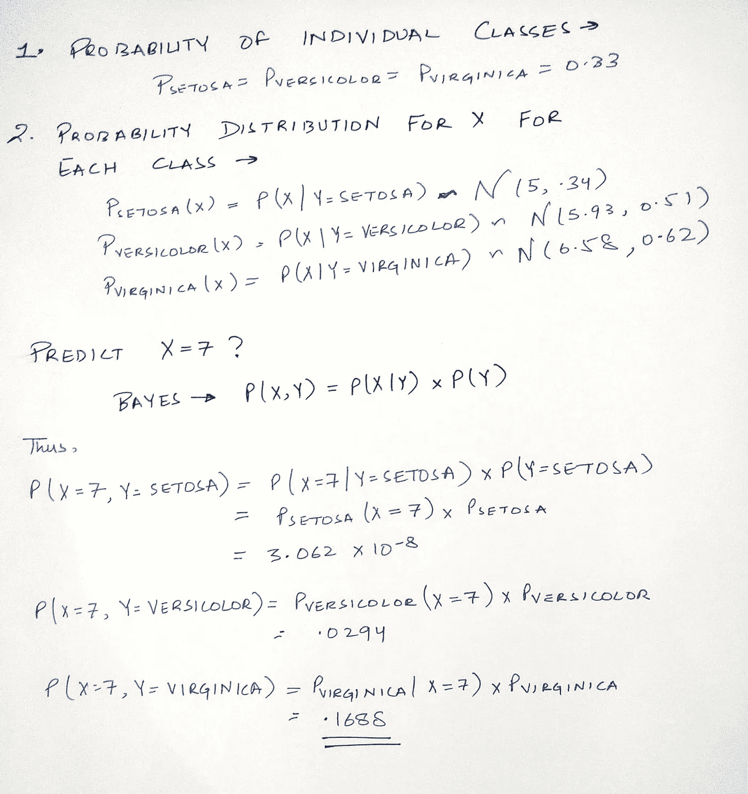
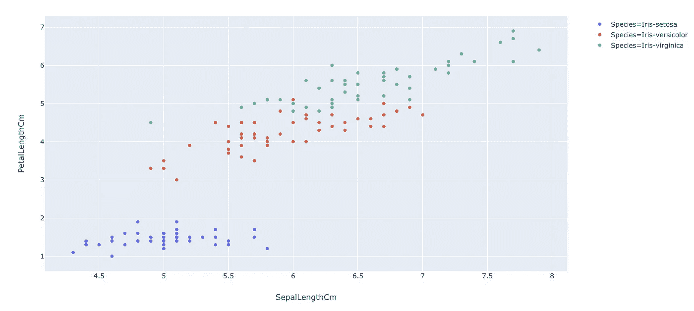
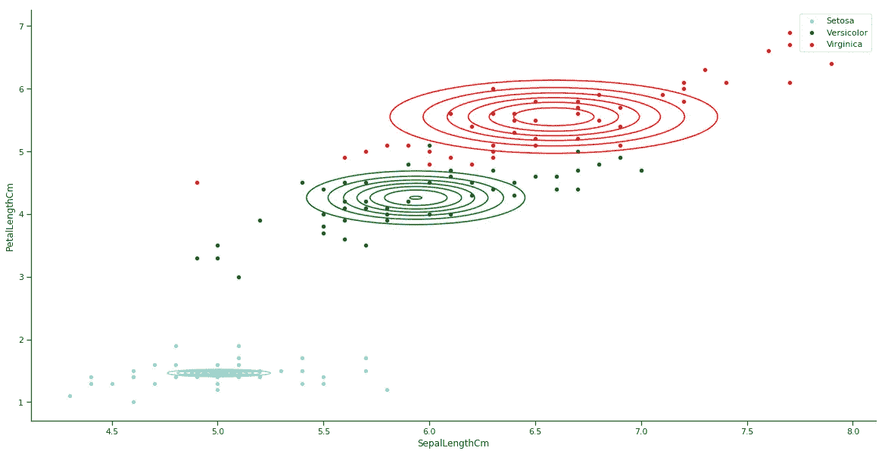

# 分类的生成方法

> 原文：<https://towardsdatascience.com/a-generative-approach-to-classification-17a0b5876729?source=collection_archive---------7----------------------->

## 简单的解释


Image by Prashant Sharma from Pixabay

每当有人谈到生成性分类模型和区分性分类模型时，我总是感到困惑。

我读了一遍又一遍，但不知何故，它避开了我。

所以我想到了写一篇关于它的帖子来提高我的理解。

***这篇文章是关于理解生成模型以及它们与判别模型的区别。***

*最后，我们将自己创建一个简单的生成模型。*

# 区别性与生成性分类器

***问题陈述:*** 有了一些输入数据，`X`我们要把数据分类到标签里`y`。

生成模型学习**联合**概率分布`p(x,y)`，而判别模型学习**条件**概率分布`p(y|x)`

***那么真的，有什么区别？他们看起来几乎一样。***

假设我们有一个小样本数据:

`(x,y) : [(0,1), (1,0), (1,0), (1, 1)]`

那么`p(x,y)`就是



而`p(y|x)`是



如你所见，他们模拟了不同的概率。

判别分布`p(y|x)`可以直接用于将示例`x`分类到类别`y`。判别分类模型的一个例子是逻辑回归，其中我们尝试对 P(y|X)建模。



Logistic Regression

生成算法模型`p(x,y)`。一个例子是朴素贝叶斯模型，在该模型中，我们尝试对 P(X，y)建模，然后使用贝叶斯方程进行预测。

# 生成分类背后的中心思想

*   用概率分布分别拟合每个类别。
*   对一个新的点进行分类，找出它最有可能来自哪个分布。

***还不明白的也不要着急。你一定会在这篇文章结束时得到它。***

# 一个小例子


让我们使用虹膜数据集。

对于我们的简单示例，我们将使用单个 x 变量 SepalLength 和我们的目标变量 Species。

让我们看看不同物种的萼片长度的分布。为此我使用了 [plotly_express](/pythons-one-liner-graph-creation-library-with-animations-hans-rosling-style-f2cb50490396) 。

```
import plotly_express as px
px.histogram(iris, x = 'SepalLengthCm',color = 'Species',nbins=20)
```



要创建创成式模型，我们需要找出两组值:

## 1.个别类别的概率:

获得单个类的概率是相当简单的——例如，我们的数据集中的实例数，即 seta 除以数据集中的案例总数。

```
0.3333333333333333 0.3333333333333333 0.3333333333333333
```

虹膜数据集非常平衡。

## 2.每类 x 的概率分布:

这里我们拟合了 X 上的概率分布。我们假设 X 数据是正态分布的。因此，我们可以找到这三个分布的样本均值和方差(因为我们有三个类别)



在上图中，我用三个物种的样本均值和方差为每个物种拟合了三个正态分布。

***那么，我们如何用这个来预测呢？***

假设我们得到一个新的例子，SepalLength = 7 cm。



因为我们看到最大概率出现在 virginica，我们预测 x=7 的 Virginica，也是基于该图；这看起来是非常正确的选择。

您也可以使用代码获取值。

```
Setosa 3.062104211904799e-08
Versicolor 0.029478757465669376
**Virginica 0.16881724812694823**
```

这一切都很好。但是我们什么时候处理过单一变量呢？

让我们把例子扩展到两个变量。这一次让我们也使用 PetalLength。

```
px.scatter(iris, 'SepalLengthCm', 'PetalLengthCm',color = 'Species')
```



***那么在这种情况下我们该如何进行呢？***

第一次我们在单个 x 上拟合正态分布，这次我们将拟合双变量正态分布。

这是它的样子:



现在，其余的计算保持不变。

在上面的方程中，只有法线被二元法线代替。如你所见，通过使用二元正态分布，我们得到了更好的分类分离。

*作为对多变量(多于 2 个)这种情况的扩展，我们可以使用多元正态分布。*

# 结论

生成型模型擅长生成数据。但与此同时，创建这样的模型来捕捉数据的底层分布是极其困难的。

生成建模涉及许多假设，因此，这些模型在分类设置中的表现不如判别模型。在上面的例子中，我们还假设分布是正态的，这可能是不正确的，因此可能会引起偏差。

但是理解它们是如何工作的仍然是有帮助的。一类这样的模型被称为[生成对抗网络](/an-end-to-end-introduction-to-gans-bf253f1fa52f)，它对于生成新图像非常有用，也非常有趣。

[这里的](https://www.kaggle.com/mlwhiz/generative-modeling)是包含所有代码和可视化效果的内核。

如果你想了解更多关于生成模型和机器学习的知识，我推荐圣地亚哥大学的这门[机器学习基础](https://www.awin1.com/cread.php?awinmid=6798&awinaffid=633074&clickref=&p=%5B%5Bhttps%3A%2F%2Fwww.edx.org%2Fcourse%2Fmachine-learning-fundamentals-4%5D%5D)课程。上面的帖子大体上是从来自 SanDiego 的 [MicroMasters 课程的内容中得到启发的，我目前正在努力构建我的数据科学学习。](https://www.awin1.com/cread.php?awinmid=6798&awinaffid=633074&clickref=&p=%5B%5Bhttps%3A%2F%2Fwww.edx.org%2Fmicromasters%2Fuc-san-diegox-data-science%5D%5D)

谢谢你的阅读。将来我也会写更多初学者友好的帖子。在 [**媒体**](https://medium.com/@rahul_agarwal?source=post_page---------------------------) 关注我，或者订阅我的 [**博客**](http://eepurl.com/dbQnuX?source=post_page---------------------------) 了解他们。一如既往，我欢迎反馈和建设性的批评，可以通过 Twitter [@mlwhiz](https://twitter.com/MLWhiz?source=post_page---------------------------) 联系到我。