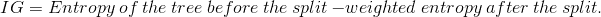

# Python 决策树的简明指南

> 原文：<https://towardsdatascience.com/a-gentle-guide-into-decision-trees-with-python-cbfc76deb748?source=collection_archive---------14----------------------->


决策树算法是一种监督学习模型，用于用一系列训练变量预测因变量。决策树算法可用于分类和回归目的。

在这个特别的项目中，我将用一个离散随机变量的分类来说明它。

## 决策树可以回答的一些问题。

1.  贷款申请人是否应该被接受？这是基于他/她的历史和其他措施。
2.  哪种药物最适合特定的病人。
3.  癌细胞是良性的还是恶性的？
4.  电子邮件是否是垃圾邮件？

以及现实生活中更多的场景。

## 理解决策树算法。

决策树是使用递归分区将数据分为两组或更多组来构建的。

## 现实生活的例子。

假设我们有随着时间的推移进行癌症筛查的患者的数据。基于来自筛选练习的测试，筛选的细胞被分类为良性和恶性。基于该数据，可以建立决策树模型，以比医生更好地为未来的患者以最高的准确度预测这些病例。
决策树从具有最高预测能力、较少杂质和较低熵的变量开始，逐个变量分割数据变量。

该方法的主要目的是最小化杂质和每个节点。节点的杂质通过节点中数据的的**熵来计算。**

**熵**

熵是信息量的无序或简单地说是数据的随机性或不确定性。

数据集的熵取决于节点的随机性。应当注意，熵越低，分布越不均匀，节点越纯。如果样本完全同质，则熵完全为零，如果样本被等分，则熵为 1。

参考上述数据，假设一个节点具有 7 个恶性和 1 个良性，而另一个节点具有 3 个恶性和 5 个良性，前者与后者相比具有低熵。

这是熵的数学计算方法:


最佳树的选择取决于分裂后具有最高**信息增益**的节点。

**信息增益**

这是拆分后可以增加确定性水平的信息。计算如下。



这个过程继续构建一个基本的决策树。下面是 python 中的一步一步的过程。

## 用 Python 实现。

## 导入库

```
import pandas as pd
import matplotlib.pyplot as plt
import numpy as np
import seaborn as sns
```

## **数据摄取**

```
loan_data = pd.read_csv(“loan_data.csv”)
loan_data.info()
loan_data.describe()
loan_data.sample(5)
```

## 探索性数据分析。

这是一个简短的 EDA，因为该项目旨在决策树插图。

```
plt.figure(figsize=(10,6))
loan_data[loan_data[‘credit.policy’]==1][‘fico’].hist(alpha=0.5,color=’blue’,
 bins=30,label=’Credit.Policy=1')
loan_data[loan_data[‘credit.policy’]==0][‘fico’].hist(alpha=0.5,color=’red’,
 bins=30,label=’Credit.Policy=0')
plt.legend()
plt.xlabel(‘FICO’)
```

# 设置数据。

我这里的数据有一些我必须驯服的分类变量，因为如果格式不正确，模型算法可能无法很好地处理这些数据。

```
categorical_var = [‘purpose’]
loan_data2 = pd.get_dummies(data= loan_data,columns=categorical_var,drop_first=True)
loan_data2.columns
```

# 列车测试分离

```
from sklearn.model_selection import train_test_split
X = loan_data2.drop('not.fully.paid',axis = 1)
y = loan_data2['not.fully.paid']
X_trainset, X_testset, y_trainset, y_testset = train_test_split(X, y, test_size=0.30, random_state=2)
```

# 训练决策树模型

```
from sklearn.tree import DecisionTreeClassifier
loanTree = DecisionTreeClassifier(criterion="entropy", max_depth = 4)
loanTree
loanTree.fit(X_trainset,y_trainset)
```

# 模型评估

```
predLoan = loanTree.predict(X_testset)
from sklearn.metrics import confusion_matrix,classification_report,precision_score
print(classification_report(y_testset,predLoan))
```

这产生了 78%的准确度水平

## 让我们来看看混淆矩阵的可视化

```
sns.heatmap(confusion_matrix(y_testset,predLoan),cmap=”viridis”,lw = 2,annot=True,cbar=False)
```

决策树模型产生了 78%的准确性，这是令人印象深刻的，因为没有进行任何功能工程，甚至没有调整参数来改进模型。

通过应用随机森林分类器算法也可以提高精度，该算法比简单决策树更好。在另一个内核上有更多的内容。

# 决策树的可视化

```
from IPython.display import Image  
from sklearn.externals.six import StringIO  
from sklearn.tree import export_graphviz
import pydotfeatures = list(X.columns)
# features
dot_data = StringIO()  
export_graphviz(loanTree, out_file=dot_data,feature_names=features,filled=True,rounded=True)graph = pydot.graph_from_dot_data(dot_data.getvalue())  
Image(graph[0].create_png())
```


欢迎所有意见、建议和任何改进！

请在此处查看上面的代码。在我的 Github 库中。

干杯！