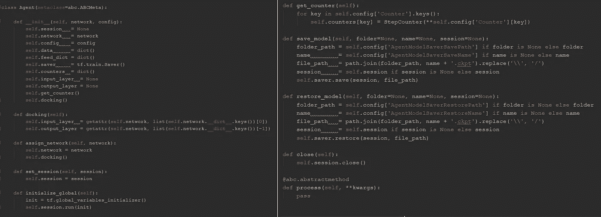

# 配对交易中强化学习的温和实现

> 原文：<https://towardsdatascience.com/a-gentle-implementation-of-reinforcement-learning-in-pairs-trading-6cdf8533bced?source=collection_archive---------3----------------------->

## **tensor flow 中结构化编程的一个例子**


Source: Pexels

这涵盖了基于 1 分钟股市数据的协整配对交易中从概念到 RL 实现的主题。对于这里的强化学习，我们使用 N 臂 bandit 方法。代码是可扩展的，因此如果你遵循这种风格，你可以将任何策略、数据 API 或机器学习算法插入到工具中。


Left-to-Right: Code Structure, Sample Price Relationship, Testing Profits

**外卖** :
1。具有数据获取实用程序
2 的可扩展基础设施。python 代码构造的组合技术
3。跨越编码、计量经济学和强化学习主题的一般概念和理论

[](https://github.com/wai-i/Pair-Trading-Reinforcement-Learning) [## wai-I/Pair-交易-强化-学习

### 在 GitHub 上创建一个帐户，为 wai-I/Pair-Trading-Reinforcement-Learning 的发展做出贡献。

github.com](https://github.com/wai-i/Pair-Trading-Reinforcement-Learning) 

# 第 1 部分:理论之前的数据

## 1.1 数据来源— Tiingo

[**ti Ingo**](https://www.tiingo.com/)*是一个金融研究平台，提供包括新闻、基本面、价格等数据。我们可以通过其 [REST IEX API](https://api.tiingo.com/documentation/iex) 提取当天的股票市场数据，该 API 从 IEX 交易所检索 TOPS 数据(书籍顶部、最后销售数据和顶部买价和卖价报价)。*

*例如，只需在浏览器中粘贴以下链接:*

```
*https://api.tiingo.com/iex/aapl/prices?startDate=2019-01-02&endDate=2019-01-02&resampleFreq=5min&token=ef79e455ba9b04c3df719407e34f05e1b051b4d6*
```

*您将获得一份 JSON 格式的 AAPL 截至 2019 年 1 月 2 日的历史 5 分钟盘中价格列表:*

```
*[{"date":"2019-01-02T14:30:00.000Z","open":154.74,"high":155.52,"low":154.58,"close":154.76},{"date":"2019-01-02T14:35:00.000Z","open":154.8,"high":155.0,"low":154.31,"close":154.645},{"date":"2019-01-02T14:40:00.000Z","open":154.67,"high":154.94,"low":154.25,"close":1...*
```

*为了自动完成这项任务，我们需要能够在特定的历史窗口内获得一系列股票的标准化日内数据的函数。*

***限制***

*   *历史数据频率高达 1 分钟*
*   *对于每种股票的每个请求，检索的样本的最大数量是不一致的，也就是说，即使您指定了 365 天的窗口，您也只能获得几天的数据*
*   *每天的样品数量并不一致(例如，它也可能在市场开放时间后给你价格)*
*   *不够快(可能只是我的问题)*

***解决方案***

*   *一次获取 1 个日期的 1 只股票*
*   *通过固定数量的观察值截断样本，即假设每个日期有 391 个 1 分钟的价格*
*   ***异步输入输出***

*Pandas 还提供[相关工具](https://pandas-datareader.readthedocs.io/en/latest/readers/tiingo.html)不仅从 Tiingo 提取数据，也从其他数据提供商提取数据，但似乎他们只提取日常数据。*

*请注意，根据您的[订阅](https://api.tiingo.com/account/billing/pricing)和相应的请求限制，API 数据是免费的。但是，在使用代码时，您应该注意用法，避免挑战限制。*

## *1.2 实施*

*首先，你需要一个 Tiingo API 令牌。只需注册一个账户，你就会在[这里](https://api.tiingo.com/account/api/token)找到你的代币。*

*这些是位于代码内**数据/API.py** 中的主要函数:*

1.  *我们需要一个函数，它可以为我们提供检索特定股票[**股票代码**、日期[**目标日期**、频率[**频率**]的当天数据的 url，假定您的令牌[**令牌 T13 是有效的。您可以想象我们可以动态地调用这个函数来逐个日期地检索数据，这样我们就可以在一系列读取中轻松地标准化格式。***

*2.Pandas [read_json](https://pandas.pydata.org/pandas-docs/stable/reference/api/pandas.read_json.html) 允许我们将获取的 json 数据读入一个系列或数据帧。我们可以在类中包装它:*

*3.上述函数在 **Data/API.py** 中的 **Tiingo** 类下定义。该代码将基于关键输入重复提取:开始日期、结束日期、目标属性(即“日期”和“收盘”)以及股票列表，并输出组合数据帧*

***异步输入/输出***

*上面的实现受到限制并且很慢。每次当我们开始获取数据时，程序将打开 API 连接，从服务器请求数据，并在关闭连接之前等待它的响应。在所有的进程重复之后，直到最后的 url 被获取。*

*我们来看看和 AsyncIO 的区别有多大。以下代码获取 GOOG 和 FB 在 2018 年 1 月 1 日至 2018 年 1 月 31 日之间的 1 分钟价格。每个日期 391 个样本，总共约 15，600 次观察。所有设置都在**配置**字典中配置，但我们暂时忽略它。*

*下面的结果表明，使用 AsyncIO 比普通的获取快 17 倍。*

**

*Speed comparison between normal and asynchronous fetching*

*根据 python [文档](https://docs.python.org/3/library/asyncio.html):*

> *asyncio 是一个使用 **async/await** 语法编写**并发**代码的库。*
> 
> *asyncio 被用作多个 Python 异步框架的基础，这些框架提供了高性能的网络和 web 服务器、数据库连接库、分布式任务队列等。*

*与并行编程不同，AsyncIO 是单线程的。一个简单的想法是，它在一个组织任务分布的单事件处理程序中管道化分配的任务，以便多个任务可以在其他任务空闲时开始运行。*

*为了说明这个概念，让我们来看一个[官方示例](https://python.readthedocs.io/fr/latest/library/asyncio-task.html):*

**

*Source: [https://python.readthedocs.io/fr/latest/library/asyncio-task.html](https://python.readthedocs.io/fr/latest/library/asyncio-task.html)*

*上面的关键字 **async def** 将相应的函数定义为一个协程，它可以暂停或恢复执行。每当一个任务在关键字**下等待**时，进程控制被传递回事件控制器(**循环**)，事件控制器为另一个任务分配并启动进程。*简单来说，就是不浪费等待时间。**

*在我们的代码中也有类似的东西。 **_fetch_hist_async** 将创建一个事件循环来控制 **fetch_data_async** 的进程，该进程是获取当天价格的底层任务。当遇到 **await** 时，控制返回到触发另一个获取请求的事件循环，即使前一个尚未完成。*

## *1.3 数据存储*

*理想情况下，我们应该建立一个数据库来存储价格。为了简单起见，让我们把价格存进去。目录**下的 csv 统计/价格**:*

# *第 3 部分:配对交易——概念和分析*

*让我们跳过第 2 部分，它涵盖了枯燥的代码和结构，并做一些分析。但是我仍然建议你去读完这篇文章，如果你感兴趣的话，先对骨骼有个概念。*

## *3.1 配对交易*

*配对交易是一种市场中性策略。如 Gatev 等人(2006 年)所述:*

> *“配对交易的概念非常简单。找出两只历史上价格变动一致的股票。当它们之间的价差扩大时，做空赢家，买入输家。如果历史重演，价格就会趋同，套利者就会获利。”*

*它将战略总结为两个阶段:*

1.  *在制定阶段，我们衡量股票之间的价格关系，并在范围内确定股票对。*
2.  *在随后的交易期间，将根据预定义的规则监控和交易该关系。*

*简单地说，它利用均值回复价差交易。问题是，我们如何估计或验证股票对之间的价格动态？*

*Krauss (2017)将成对交易策略中的常用方法归纳为五类:距离方法、协整方法、时间序列方法、随机控制方法以及其他方法，如机器学习、主成分分析和 copula。本文将展示经典的 **Engle 和 Granger (1987)协整方法**在配对交易的强化学习算法组合中的应用。*

*这里的想法与时间序列分析中一个叫做*平稳性*的概念有关。它通常被称为金融时间序列中的弱形式(或协方差)平稳性，其标准如下:*

1.  *随机变量 *x* 的期望值，即**E[*x*(*t*)]**，与时间 ***t*** 无关*
2.  *方差**Var(*x*(*t*)**是一个与时间无关的正的有限常数*
3.  *协方差 **Cov( *x* ( *t* )，*x*(*s*)**是有限的，与时差 ***t-s*** 有关，但既不是*也不是 ***s*****

**通常情况下，***x*(*t*)**被视为对数价格回报(或差异)，而非价格水平。如果一个时间序列在一阶差分后变得平稳，则称之为一阶积分 **I(1)** 。**

**尽管股票价格也可能是均值回复的，但它们很少振荡，即由于持续的经济驱动因素和市场活动的混合影响，它们是趋势性的和非平稳的(随机游走)。所以可能有人会从定向投注中获利，但这不是我们关注的重点。**

**我们实际上想要的是找到一对价格差异或价差持续稳定(且协整)的股票。**

## **3.2 分析(参见 EXAMPLE/Analysis.py)**

**我提取了 21 只美股从 2018–01–01 到 2018–07–30 的 1 分钟价格。所有价格都保存在 STATICS/PRICE in 中。csv 格式。让我们取时间序列的前 70%做一些分析。**

****皮尔森相关性****

****

**Pearson correlations across 21 stock prices**

**这里我们计算价格(不是回报)相关性。相关性最高的是 **PEP** 、 **PG** 、 **JNJ** 和 **KO** 。从经济角度来说，他们应该分为两对: **JNJ-PG** 和 **KO-PEP** 。请注意，高相关性并不一定意味着协整。请参见下面的详细信息。**

****边际分配****

**如果我们研究他们的边际分布，线性关系应该有所认识。我们还可以找到一些可能有用的集群，但暂时让我们避免进一步的数据挖掘，这不是我们的主要关注点。**

********

**Marginal distributions of JNJ-PG and KO-PEP intraday prices**

****价格图表****

**让我们创建一个函数来绘制样本期的价格和价差。在样本开始时，价格重新以 1 为基础。注意，第二个子图将描述由对称交易阈值(th)和止损(stop)指定的交易范围:**

****

**JNJ-PG price pairing**

****

**KO-PEP price pairing**

****协整检验****

**以下代码计算协整检验的 p 值，零假设为无协整。所以如果 p 值**小**，观察到协整关系的概率应该相对**高**。**

**请注意，下面的测试是针对整个时间序列的。在培训期间，我们应该根据选择的样本进行测试和交易。**

**下面的结果表明，即使他们的相关性是可比的，找到一个协整关系的概率是非常不同的。**

**有时我们可以找到一个相关但不协整的价格关系。例如，如果两只股票价格随着时间的推移一起上涨，它们就是正相关的。然而，如果这两只股票以不同的速度上涨，价差将保持增长，而不是在均衡点振荡，因此是非平稳的。**

**让我用一个实验来说明这一点。下面的代码通过 [**几何布朗运动**](https://en.wikipedia.org/wiki/Geometric_Brownian_motion) 和 [**乔莱斯基分解**](https://math.stackexchange.com/questions/163470/generating-correlated-random-numbers-why-does-cholesky-decomposition-work) 模拟了两个高度相关的股票价格，每个包含 1000 个样本。**

**如您所见，尽管相关性很高，但 p 值非常大。**

**让我们画出这些时间序列:**

****

**Prices and spread of correlated GBM prices**

**底部子图所示的价差是趋势性的，而不是均值回复性的。**

## **3.3 协整**

**Engle 和 Granger (1987)定义了两步识别法:**

1.  **协整时间序列的元素应该具有相同的积分顺序**
2.  **它们的线性组合应该产生具有较低积分阶的变量**

**在我们的情况下，当一个以上的 **I(1)** 非平稳和外生变量(因此它们在理论上是相互独立的)完全相互抵消时，在随机趋势成分中存在协整，从而给出平稳的线性组合和长期均衡。更具体地说，两个 **I(1)** 对数股价**x(1， *t* )** 和 ***x* (2， *t* )** 如果存在一个协整系数 ***b*** 则进行协整，给出一个平稳的时间序列 ***y* ( *t* )****

****

**其中 ***a*** 简单来说就是一个常数，***y*(*t*)**就是我们的目标交易价差。**

**显然，我们可以简单地使用普通的最小二乘法(OLS)方法，通过回归***×套期保值比率* (1， *t* )** 对 ***x* (2， *t* )** 来估计利差和系数 ***b*** 。最初的想法是基于格兰杰表示定理，并以误差修正模型(ECM)的形式表示。然而，基于股票(1987)中的一个叫做*超一致性*的想法，由于更快地收敛到真实的回归系数，OLS 估计量更容易实现，并且预计在估计协整关系时具有更好的性能。**

## **3.4 协整检验**

**检验协整的最常见方法是通过使用**迪基富勒(DF)** 或**增广迪基富勒(ADF)** 单位根检验来检查上述回归的残差是否平稳。**

****单位根和迪基-富勒(DF)检验****

****单位根**是随机过程的一个特征。考虑一个阶为 1 的自回归过程(一个 **AR(1)** 过程):**

****

*****e*(*t*)**是白噪声而 **0 *< c ≤* 1** 。如果过程是非平稳的，也不是完全随机的，那么假设值 ***c*** 等于 **1** (即方程的根是 1，因此过程是 **I(1)** )。例如，这可能意味着今天的价格等于昨天的价格加上一个随机值。**

**Dickey 和 Fuller (1979)表明，这种情况下的统计量不符合 T2 分布，因此检验是不一致的。为了解决这个问题，我们可以将上述模型改为:**

****

**并检验 **( *c* -1)=0** 的零假设。这就是所谓的**迪基-富勒测试**。我们也可以添加一个截距或趋势项，并根据假设检验其系数等于零的零假设。**

****增强迪基-富勒(ADF)试验****

**如果我们把自回归过程展开成一个 ***p*** 的顺序(即 **AR( *p* )** ):**

****

**然后我们可以用这个公式应用**增强的迪基-富勒**检验:**

****

**并检验以下的零假设:**

****

## ****3.5 实施****

**在第 2.3 节中，我们已经看到了策略类 **EGCointegration** ，其实现与上面的解释一致。注意，这里的测试是基于**stats models . TSA . stat tools . coint**的，在用于单元根测试的同一个库中还有另一个函数**stats models . TSA . stat tools . ad fuller**。不同的是:**

*   ****coint** 是有效的恩格尔-格兰杰两步协整检验。它用 I(1)测试估计的协整对(2 个时间序列输入)的残差，而**
*   ****adfuller** 测试单变量过程的单位根(1 个时间序列输入)**

**在大多数情况下，这两个测试应该产生相同的结论，但是 **coint** 对于我们的实现来说更加直观。**

# **第四部分:强化学习的思想**

**我从[这个](https://medium.com/emergent-future/simple-reinforcement-learning-with-tensorflow-part-0-q-learning-with-tables-and-neural-networks-d195264329d0)系列中受益匪浅，在代码开发过程中汲取了一些想法。肯定推荐。**

## **4.1 一般概念**

**强化学习的基础由两个主要部分组成:**代理**和**环境**。环境由具有预定义状态空间的不同状态来表示，而代理学习确定在动作空间之外执行什么动作的策略。在完全强化学习问题中，智能体的学习周期可以归纳为以下几个阶段:**

1.  **对环境状态进行观察**
2.  **根据现有策略执行相应的操作**
3.  **根据所执行的行动获得相应的奖励**
4.  **更新策略**

****

**Source: Reinforcement Learning: An Introduction, Sutton, R., Barto A.**

**举个例子，想象一只小狗(代理人)正在学习如何对主人的命令(环境)做出反应。它是只知道如何执行以下动作的懒狗:**

*   ****答:坐下****
*   ****b 站****
*   ****c .无所事事****

**为了训练小狗，他的主人定期给他一套命令(状态)，包括“坐”、“站”和“跳”。如果他反应正确，他的主人会给他一些狗粮(奖励)。**

**开始时，小狗并不真正理解他的主人想要什么，也就是说，他不知道(政策)如何将命令正确地“映射”到期望的动作。然而，偶尔他可以以正确的方式做出反应并获得奖励，并逐渐建立他们之间的联系(更新政策)。**

**经过多次尝试，他终于知道，每当他听到“坐”或“站”这个词时，他都应该“坐”。但是不管他的主人让他跳多少次，他都不知道该怎么办。在这种情况下，他几次试图坐着或站着，但都没有得到任何回报。**

**最终小狗选择 **c .对于**“jump”**命令什么都不做**是因为与其他动作相比，这个选项耗费的精力要少得多(所以负面奖励也少)。**

****强化学习 vs .监督学习****

**在监督学习中，算法从**指令**中学习。每个实例都有一个要比较的估计目标，以便计算差异的成本，并且通过迭代最小化成本来更新算法，因此该过程在某种程度上是由目标输出“指示”的，它告诉什么是正确的结果。**

**然而，在强化学习中，通过**评估**来学习策略。样本中没有这样的绝对目标可以比较。代理只能通过不断评估反馈来学习，也就是说，它不断选择一个动作并评估相应的回报，以便调整策略，保留最理想的结果。所以工艺流程要复杂得多。当我们在交易中应用强化学习时，我们需要问自己代理人到底在学习做什么，并且在定义元素时要小心，特别是状态和动作空间。**

## **4.2 基本强化学习问题**

**N 武装匪徒**

****

**Illustration of n-armed bandit problem**

****问题**:上图中，有一个双臂吃角子老虎机。为了使我们的回报最大化，拉哪只胳膊最好？**

****答**:右臂自拉的预期回报大于左臂的。**

**但是机器如何学习解决这个难题呢？**

**从 RL 的角度来看，这是 RL 问题中最简单的设置，上面的任务可以总结为以下空间:**

*   ****状态空间**:无**
*   ****动作空间**:【左】或【右】**
*   ****奖励** : [1]或[0]**

**在训练过程中，RL 算法将重复上述任务(拉手臂)并评估所获得的回报，并递归地更新其策略。最终，通过评估政策权重，它应该能够给出一个结论，即哪只手臂是最好的拉。在[这篇文章](https://medium.com/@awjuliani/super-simple-reinforcement-learning-tutorial-part-1-fd544fab149)中可以看到更好的解释。**

****上下文强盗****

****

**上下文土匪问题是 n 臂土匪的扩展。如上图所示，假设吃角子老虎机不是只有 1 台而是 3 台，我们需要考虑对于特定的机器(状态)来说，拉哪个手臂最好。现在设置变成了:**

*   ****状态空间**:【机器 A】、【机器 B】、【机器 C】**
*   ****动作空间**:【左】或【右】**
*   ****奖励** : [1]或[0]**

## ****4.3 实施****

**我们到底希望机器学会执行什么？遵循对于每一对时间序列的思想，它通过选择历史窗口、交易窗口、交易阈值和止损[动作]的最佳组合，学习最大化预期交易利润[报酬]。**

**换句话说，我们将其公式化为一个 **N 武装土匪**问题(无状态):**

*   ****状态空间**:【无】(由虚拟状态确定—交易成本)**
*   ****动作空间**:【历史窗口】、【交易窗口】、【交易阈值】、【止损】、【信心水平】**
*   ****奖励**:【平均回报】**

# **第 5 部分:将所有东西放在一起**

**现在我们可以走了。下面是**的实现**:**

1.  **加载相关配置和价格数据**
2.  **将它们标准化并分成训练集和测试集**
3.  **创建状态空间和动作空间**
4.  **创建和构建网络**
5.  **创建学习对象并进行培训**
6.  **从学习对象中提取记录并执行测试分析**

## **S **设置****

****对** : JNJ-PG
**数据周期**:2018–01–01 至 2018–07–30
**频率** : 1 分钟
**状态**:无(设置为固定交易成本 0.1%)
**动作** :
—一、历史窗口:60 至 600 分钟，60 分钟步长
—交易窗口:120 到 1200 分钟，120 分钟一步
—三。交易门槛:(+/-)1 到 5，价格步长为 1
— iv。止损:(+/-)1 到 2 在交易阈值之上，价格步长为 0.5
—五、信心水平:90%或 95%
**获利回吐水平** : 0
**报酬**:平均回报(如果是协整，否则设置为交易成本)
**交易数量** : 1 个买卖信号的价差
**校准价格**:标准化
【T33**

**试运行后，我发现玻尔兹曼探索的概率输出可以达到 1。为了减轻异常高回报的影响，平均回报上限为 10 英镑。**

## **配置**

****

**config_train.yml**

## **步骤 1 和 2:加载相关的配置和价格数据，将它们标准化并分成训练集和测试集**

## **步骤 3:创建状态空间和动作空间**

## **步骤 4:创建和构建网络**

## **步骤 5:创建学习对象并进行培训**

## **步骤 6:从学习对象中提取记录，并执行测试分析**

**从培训结果来看，尽管有上限，平均奖励仍为正:**

****

**Positive expected reward in training**

****

**Distribution of training reward**

**以下测试使用从训练结果中获得的最佳操作，在每分钟进行交易，不包括最大可能的历史窗口和交易窗口:**

********

**No. of trades (pair) [LHS] and PnL [RHS] across testing samples (1-minute, 2018–5–29 to 2018–7–30)**

**或者，我们也可以使用[滑索](https://www.zipline.io/beginner-tutorial.html)和 [Pyfolio](https://github.com/quantopian/pyfolio) 进行更复杂的回溯测试。**

**虽然结果看起来很有希望，但在现实世界中，情况会因许多因素而变得复杂，如买卖价差、执行延迟、保证金、利息、零股等。然而，我们在这里的目的是给出一个例子，说明如何将各种技术结合起来，开发一个具有结构化机器学习组件的系统化交易工具。我希望这是一个愉快的页面给你。**

# **回到第 2 部分:代码设计**

****

**Illustration of the code structure**

## **2.1 配置**

****

**执行由**配置**(字典)管理。这个组件允许我们封装大量的执行并整理代码。它也可以用作附加参数的载体。**

**例如，在上一节中， **API 的实例化。Tiingo** 将配置作为输入，将其设置为一个属性。当它调用底层函数时，将从配置中提取输入参数，如开始日期、结束日期、令牌、每天的样本数量和数据频率。**

****

**config_data.yml for data fetching**

**目前只实现了一个配置。理想情况下，我们应该为不同的组件实现多种配置。**

**使用 **PyYAML** 包，代码可以识别**T5 的字段。yaml /** 。 ***yml*** 文件并自动转换格式*:***

*****-空字段**:加载到 **None
- True/False** :加载到布尔字段 **True** 或 **False
- 1.0** :加载到 float **1.0
- 1** :加载到 integer **1
- string** :加载到**‘string’
-【1，2，3】【T32*****

```
*****Folder:
   Folder A:** Math Notes
   **Folder B:** [Memo, Magazines]***
```

***该包可以识别缩进并将其加载到字典中:***

```
***{'Folder A': 'Math Notes', 'Folder B': ['Memo', 'Magazines']}***
```

***检查 **UTIL/FileIO.py** 的读写功能:***

******

## ***2.2 数据 API***

***对于这一点，我们已经讨论了主要细节，所以我将跳过这一点。如果你想添加另一个 API，我建议你简单地创建另一个类，使用与类 **Tiingo** 中的 **fetch** 相同的接口。***

## ***2.3 战略***

******

***在**中。/STRATEGY** 每个模块包含一个策略类别，每个策略应该由一个类表示。该类继承自一个[抽象基类](https://docs.python.org/3/library/abc.html)，该抽象基类要求它实现以下内容:***

1.  *****process()** :由机器学习脚本在训练或测试时调用***
2.  *****奖励**:定义 RL 奖励(即交易利润)的属性***
3.  *****记录**:训练期间要存储的任何其他属性***

***在这个包中，我们可以找到一个策略类 **EGCointegration** ，它在实例化期间接受价格数据 **x** 和 **y** 以及其他参数。当底层函数需要样本数据集时，它们将调用 **get_sample** 函数从其数据属性中执行采样。***

******

***EGCointegration class in ./Strategy/Cointegration.py***

***在训练阶段，在每次迭代中，我们需要校准 p 值和系数，以决定是否以及如何触发配对交易。这些执行嵌入在同一个类中。当调用**进程**时，对象将自动从其数据属性执行采样并运行校准。基于校准的结果，该功能将获得奖励和记录，并将其设置为相应的属性。***

***参见**第三部分**中关于协整及其测试的更多内容。***

******

***Key functions for calibration in EGCointegration***

## ***2.4 基本构建模块、处理器和 ML 算法***

******

***这些组件高度集成，不仅由配置管理，而且由控制整个高度自动化的 ML 流程的定制代理管理。许多 ML 算法是硬编码的。这意味着如果需要微调逻辑，就必须修改代码，这有点不方便。在这里，虽然设计有点复杂，如果你能理解的风格，你将能够以任何方式扩展它。***

***最近，谷歌发布了一个名为 [TF-Agents](https://github.com/tensorflow/agents) 的强化学习(RL)开源库。请随意检查[这个](https://www.youtube.com/watch?v=-TTziY7EmUA)出来。一些概念是相似的，但是我们代码的主要焦点是自动化，所以如果你想构建一个新的，你可以使用它作为基础。***

*****2.4.1 基本构建模块*****

*   *****代理人*****

******

***Agent class in Basic.py***

***它是 ML 中运行和控制流程的主体。在 RL 中，它有另一层含义:一般来说，它是接收环境状态并相应地决定采取什么行动的组件。**代理**类应该由机器学习类继承。它应该由一个**网络**对象和一个**配置**字典启动。主要功能包括:***

***- **对接**:附加网络输入输出层
- **assign_network** :给代理对象分配新网络并连接
- **set_session** :设置 tensor flow
-**get _ counter**:从 config 中提取参数并获取一个 **StepCounter** 对象的字典用于循环或增量如变概率
-**save _ model/restore _ modelckpt** 文件
- **流程**:训练或测试要实现的抽象方法***

*   *****网络*****

***构建张量流神经网络的一种典型方式是这样的，其中的层和每个层中的参数都是硬编码的:***

***或者，我们也可以构建一个重复上述过程的函数，牺牲设置层参数的灵活性。***

***如果你想建立一个 ML 系统或一些带有 GUI 的东西，在保留自动化的同时，灵活地定制每一层的细节(即层类型、层输入、层参数),这里有一个建议:***

******

***Network and TFLayer in Basics.py***

***左边的两个函数在类**网络**下。***

1.  *****build_layers** :它将一个字典 **layer_dict** 作为输入，通过依次添加从 **TFLayer** 类中选择的层来构建网络，如右侧所示。只要正确定义了每层的参数，就可以递归调用该函数，在当前网络中现有的最终层之上添加层。每个层都被设置为**网络**对象的属性，因此它们的名称必须是唯一的。***
2.  *****add_layer_duplicates** :与 **build_layers** 类似，它接受一个 **layer_dict** 作为输入，并需要一个 **n_copy** 的输入，该输入指定在现有网络之上应该添加多少个由 **layer_dict** 规定的层的副本。通过连接副本中的图层名称和图层编号，将为复制的图层创建新名称。***

***例如:***

******

***创建网络的步骤:***

1.  *****发起一个网络对象**。这必须由第一个输入层实例化，在本例中是 tf.placeholder。***
2.  *****基于 layer_dict1** 构建网络。它指定了两个层:一个是实际上具有 5 个输出的 tf.one_hot 的 **'one_hot'** 层，另一个是具有 10 个输出的 TF . contrib . layers . fully _ connected 的 **'coint1'** 层。TF . contrib . layers . fully _ connected 的输入参数由关键字**‘layer _ para’**定义。***
3.  *****通过添加 layer_dict2** 规定的层的副本来扩展网络。具有 10 个输出的层**‘coin T2’**被添加到当前网络 3 次。***

***因此，网络对象 **N** 现在总共应该有 6 个属性。它们中的每一个都是具有预定义属性的层:***

******

***由于网络的构建是基于层字典的，如果这种字典的生成是流线型的，那么自动化就开始起作用，并且我们不再需要在每次构建新的东西时对网络进行硬编码。***

*   *****空间*****

***基本上它指的是一个样本空间物体。它将一个 list 字典作为输入，并通过对 list 元素进行完全组合来创建样本空间。例如，对于以下示例空间:***

```
***space_dict = {'dice': [1, 2, 3, 4, 5, 6],
              'coin': ['H', 'T']}
S = Space.states_dict***
```

*****S** 包含**骰子和硬币的所有组合**，共 12 个元素。它包含必要的函数，可将样本从字典转换为单个索引、索引列表或 one_hot 数组，反之亦然，以适应 TensorFlow 中不同类型的输入或输出载体。***

*   *****计步器*****

***在训练期间，一些参数是递增的，例如 for 循环中的当前步长，或者学习速率被设置为可变的。我们甚至可能希望在实际步骤被触发之前添加一个缓冲区(即，学习速率在 100 次循环之后开始下降)。我们可以用一个计数器来执行上述操作，而不是在脚本中硬编码。该计数器还具有缓冲预训练步骤的能力。例如，实际计数值仅在 100 个缓冲步骤之后才开始改变。***

*****2.4.2 处理器*****

***一个**处理器**类应该将一个**代理**对象作为初始化的输入。当**进程**被调用时，它将从代理对象中提取相关参数，包括附加的配置字典，并将任何输出附加到作为代理属性的数据字典。我们实际上可以创建另一个对象来携带这些属性，但是为了简单起见，我们不要在这里重载这个结构。***

*   *****状态空间和动作空间*****

***两者都继承父类**空间**，用于生成状态样本或动作样本。基于配置中指定的 ***方法*** ，它们可以以不同的形式(即索引/一个热点/字典)或不同的方式(有/无探索)输出样本，用于不同的目的，如网络训练，或作为**策略**对象中 ***过程*** 函数的输入。***

****

**StateSpace and ActionSpace in PROCESSOR/MachineLearning.py**

*   ****奖励引擎****

**它采用一个包含**进程**方法的引擎对象。在我们的例子中，它将是一个 **EGCointegration** 对象。**

****

**RewardEngine class**

*   ****探索****

**这篇[文章](https://medium.com/emergent-future/simple-reinforcement-learning-with-tensorflow-part-7-action-selection-strategies-for-exploration-d3a97b7cceaf)很好的介绍了强化学习中的探索方法。该对象的目的是探索可能的操作。所选择的方法将向代理对象中的数据载体返回动作索引。当调用 ActionSpace 中的**进程**函数时，就实现了探索。**

****

*   ****经验缓冲****

**这利用了这篇[文章](https://medium.com/@awjuliani/simple-reinforcement-learning-with-tensorflow-part-4-deep-q-networks-and-beyond-8438a3e2b8df)中的**体验回放**实现。目的是在训练过程中存储样本和结果，并从缓冲区重新采样，以允许代理从历史中重新学习。**

****

*   ****记录器****

**最后但同样重要的是，我创建了一个**记录器**类，它可以用来跟踪存储在代理对象内部的数据字典中的记录。我们可以通过在配置文件的***recorder data field***字段中指定键名来选择我们希望它存储的字段:**

```
****RecorderDataField:** [NETWORK_ACTION, ENGINE_REWARD]**
```

****

**Recorder class**

****2.4.3 毫升算法****

**有了上面描述的组件，我们可以定制任何采用这些构建块的类，并创建一个运行过程。这是唯一需要为不同目的定制的部分，但对于类似的情况，逻辑仍然是相当标准化的。**

**例如，在这个项目中，我创建了一个**上下文强盗**类，它实际上可以执行 N 臂强盗或者上下文强盗运行，取决于状态的数量。如果我们想对 N 臂土匪问题运行它，我们可以只指定一个具有单一固定状态(虚拟)的状态空间。**

****

**ContextualBandit class in MAIN/Reinforcement.py**

1.  ****__init__** :初始化对象并继承父方法和属性。TensorFlow 机器学习属性也在这里定义。之后上面描述的所有处理器都会被组合实例化，以对象本身作为输入实参(***【agent】***)。**
2.  ****update_network** :从数据字典中提取样本，更新张量流层和网络。**
3.  ****缓冲**:如果配置中有指定，将样本存储在 **ExperienceBuffer** 对象中。**
4.  ****create_sample_list** :为经验缓冲创建样本。**
5.  ****流程**:控制培训或测试流程的主要程序。需要一个 tf。Session()并根据代理启动的 StepCounter 对象中的值执行循环。**

# **放弃**

**这篇文章和相关的代码和内容纯粹是信息性的，所提供的任何信息都不构成对任何特定人的任何安全、交易或投资策略的任何建议。本文中描述的实施可能会有风险，市场状况可能会不稳定，并与上述时期不同。所有交易策略和工具的实施均由用户自担风险。**

# **文献学**

**[1] Dickey，D. A .，Fuller，W. A .，具有单位根的自回归时间序列估计量的分布(1979)，*美国统计协会杂志*。74(366): 427–431.**

**[2] Engle，R.F .，Granger，C.W.J .，《协整和误差修正:表示、估计和检验》(1987)，*计量经济学*55(2):251–276**

**[3] Gatev，e .、Goetzmann，W.N .和 Rouwenhorst，K.G .,《配对交易:相对价值套利规则的表现》(2006 年)，*《金融研究评论》*19(3):797–827**

**[4] Granger，C.W .，时间序列数据的一些性质及其在计量经济模型规范中的应用(1981)，*经济学杂志*16(1):121–130**

**[5] Johansen，s .，协整向量的统计分析(1988)，*《经济动态与控制杂志》*12(2–3):231–254**

**[6] Krauss，c .，统计套利对交易策略:回顾与展望(2017)，*经济学调查杂志*31(2):513–545**

**[7] Stock，J.H .，协整向量的最小二乘估计的渐近性质(1987)，*计量经济学*55:277–302。**

**[8]萨顿，R.S .，巴尔托，A.G,《强化学习:导论》( 1998)，麻省理工学院出版社，第二版**