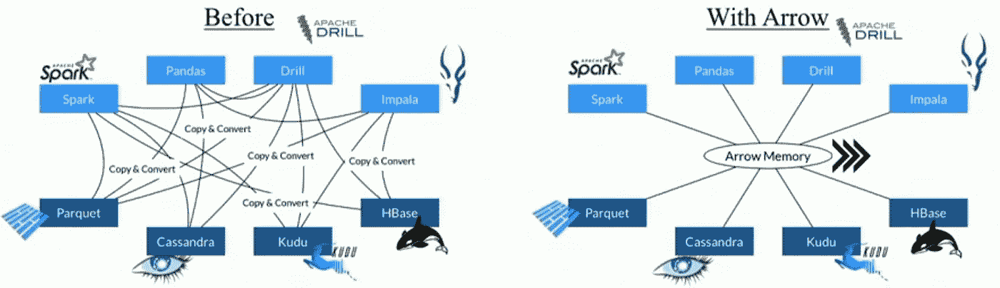
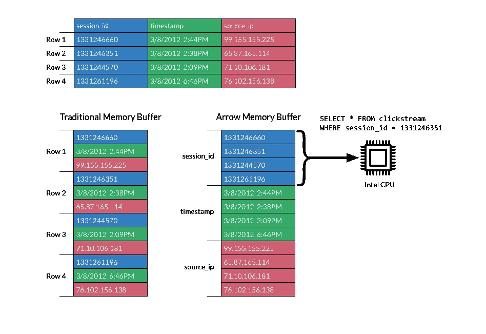
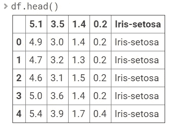
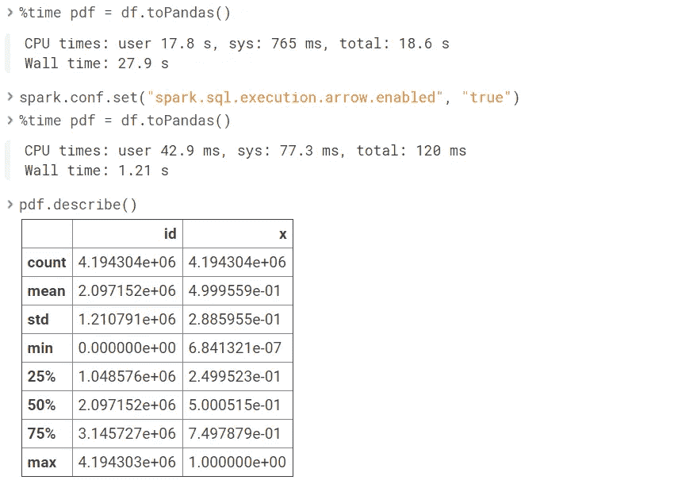
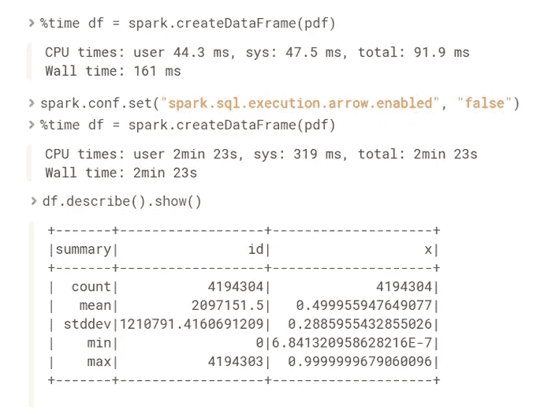

# 阿帕奇箭与阿帕奇火花和熊猫的温柔介绍

> 原文：<https://towardsdatascience.com/a-gentle-introduction-to-apache-arrow-with-apache-spark-and-pandas-bb19ffe0ddae?source=collection_archive---------1----------------------->

这一次我将尝试解释如何将 Apache Arrow 与 Apache Spark 和 Python 结合使用。首先，让我分享一些关于这个开源项目的基本概念。


[[Apache Arrow](https://arrow.apache.org/)]

> Apache Arrow 是内存数据的跨语言开发平台。它为平面和层次数据指定了一种标准化的独立于语言的列内存格式，为现代硬件上的高效分析操作而组织。[ [阿帕奇箭头页](https://arrow.apache.org/)

简而言之，它促进了许多组件之间的通信，例如，用 Python (pandas)读取 parquet 文件并转换为 Spark 数据帧、 [Falcon](https://github.com/uwdata/falcon) 数据可视化或 [Cassandra](http://cassandra.apache.org/) 而不用担心转换。



Overview Apache Arrow [[Julien Le Dem](https://databricks.com/speaker/julien-le-dem), Spark Summit 2017]

一个好问题是问数据在内存中是什么样子的？Apache Arrow 利用列缓冲区来减少 IO 并提高分析处理性能。



Columnar In-memory [[Apache Arrow page](https://arrow.apache.org/)]

在我们的例子中，我们将使用 [pyarrow](https://arrow.apache.org/docs/python/) 库来执行一些基本代码并检查一些特性。为了安装，我们有两个选项使用 conda 或 pip 命令*。

```
conda install -c conda-forge pyarrowpip install pyarrow
```

*建议在 Python 3 环境中使用 conda。

**Apache Arrow with Pandas(本地文件系统)**

**将 Pandas 数据帧转换为 Apache 箭头表**

```
import numpy as np
import pandas as pd
import pyarrow as pa
df = pd.DataFrame({'one': [20, np.nan, 2.5],'two': ['january', 'february', 'march'],'three': [True, False, True]},index=list('abc'))
table = pa.Table.from_pandas(df)
```

**Pyarrow 表到熊猫数据框**

```
df_new = table.to_pandas()
```

**读取 CSV**

```
from pyarrow import csv
fn = ‘data/demo.csv’
table = csv.read_csv(fn)
df = table.to_pandas()
```

**从 Apache 编写拼花文件箭头**

```
import pyarrow.parquet as pq
pq.write_table(table, 'example.parquet')
```

**阅读拼花文件**

```
table2 = pq.read_table(‘example.parquet’)
table2
```

**从拼花文件中读取一些列**

```
table2 = pq.read_table('example.parquet', columns=['one', 'three'])
```

**从分区数据集读取**

```
dataset = pq.ParquetDataset(‘dataset_name_directory/’)
table = dataset.read()
table
```

**将拼花文件转换成熊猫数据帧**

```
pdf = pq.read_pandas('example.parquet', columns=['two']).to_pandas()
pdf
```

**避开熊猫指数**

```
table = pa.Table.from_pandas(df, preserve_index=False)
pq.write_table(table, 'example_noindex.parquet')
t = pq.read_table('example_noindex.parquet')
t.to_pandas()
```

**检查元数据**

```
parquet_file = pq.ParquetFile(‘example.parquet’)
parquet_file.metadata
```

**参见数据模式**

```
parquet_file.schema
```

**时间戳**

记住熊猫使用纳秒，所以为了兼容你可以用毫秒截断。

```
pq.write_table(table, where, coerce_timestamps='ms')
pq.write_table(table, where, coerce_timestamps='ms', allow_truncated_timestamps=True)
```

**压缩**

默认情况下，Apache arrow 使用 snappy 压缩(不那么压缩，但更容易访问)，尽管也允许使用其他编解码器。

```
pq.write_table(table, where, compression='snappy')
pq.write_table(table, where, compression='gzip')
pq.write_table(table, where, compression='brotli')
pq.write_table(table, where, compression='none')
```

此外，可以在一个表中使用多种压缩

```
pq.write_table(table, ‘example_diffcompr.parquet’, compression={b’one’: ‘snappy’, b’two’: ‘gzip’})
```

**写一个分区拼花表**

```
df = pd.DataFrame({‘one’: [1, 2.5, 3],
                   ‘two’: [‘Peru’, ‘Brasil’, ‘Canada’],
                   ‘three’: [True, False, True]},
                   index=list(‘abc’))
table = pa.Table.from_pandas(df)
pq.write_to_dataset(table, root_path=’dataset_name’,partition_cols=[‘one’, ‘two’])
```

*   兼容性说明:如果您使用 pq.write_to_dataset 创建一个将由 HIVE 使用的表，则分区列值必须与您正在运行的 HIVE 版本的允许字符集兼容。

**带 HDFS(远程文件系统)的 Apache Arrow】**

Apache Arrow 附带了与 Hadoop 文件系统的基于 c++(T3)的接口的[绑定。这意味着我们可以从 HDFS 读取或下载所有文件，并直接用 Python 解释。](https://arrow.apache.org/docs/python/filesystems.html#hadoop-file-system-hdfs)

**连接**

主机是 namenode，端口通常是 RPC 或 WEBHDFS 更多的[参数](https://arrow.apache.org/docs/python/generated/pyarrow.hdfs.connect.html#pyarrow.hdfs.connect)像用户，kerberos 票证是允许的。强烈建议阅读所需的[环境变量](https://arrow.apache.org/docs/python/filesystems.html#hadoop-file-system-hdfs)。

```
import pyarrow as pa
host = '1970.x.x.x'
port = 8022
fs = pa.hdfs.connect(host, port)
```

*   可选，如果您的连接是在数据或边缘节点可能使用的前端

```
fs = pa.hdfs.connect()
```

**将拼花文件写入 HDFS**

```
pq.write_to_dataset(table, root_path=’dataset_name’, partition_cols=[‘one’, ‘two’], filesystem=fs)
```

**从 HDFS 读取 CSV**

```
import pandas as pd
from pyarrow import csv
import pyarrow as pa
fs = pa.hdfs.connect()
with fs.open(‘iris.csv’, ‘rb’) as f:
 df = pd.read_csv(f, nrows = 10)
df.head()
```



Reading CSV from HDFS

**从 HDFS 读取拼花文件**

从 HDFS 读取拼花文件有两种形式

使用熊猫和 Pyarrow 引擎

```
import pandas as pd
pdIris = pd.read_parquet(‘hdfs:///iris/part-00000–27c8e2d3-fcc9–47ff-8fd1–6ef0b079f30e-c000.snappy.parquet’, engine=’pyarrow’)
pdTrain.head()
```

Pyarrow .拼花地板

```
import pyarrow.parquet as pq
path = ‘hdfs:///iris/part-00000–71c8h2d3-fcc9–47ff-8fd1–6ef0b079f30e-c000.snappy.parquet’
table = pq.read_table(path)
table.schema
df = table.to_pandas()
df.head()
```

**其他文件扩展名**

因为我们可以存储任何类型的文件(SAS、STATA、Excel、JSON 或 objects)，所以大多数文件都很容易被 Python 解释。为了实现这一点，我们将使用 open 函数返回一个缓冲区对象，许多 pandas 函数如 [read_sas](https://pandas.pydata.org/pandas-docs/stable/reference/api/pandas.read_sas.html#pandas.read_sas) 、 [read_json](https://pandas.pydata.org/pandas-docs/stable/reference/api/pandas.read_json.html) 可以接收这个对象作为输入，而不是一个字符串 URL。

斯堪的纳维亚航空公司

```
import pandas as pd
import pyarrow as pa
fs = pa.hdfs.connect()
with fs.open(‘/datalake/airplane.sas7bdat’, ‘rb’) as f:
 sas_df = pd.read_sas(f, format='sas7bdat')
sas_df.head()
```

擅长

```
import pandas as pd
import pyarrow as pa
fs = pa.hdfs.connect()
with fs.open(‘/datalake/airplane.xlsx’, ‘rb’) as f:
 g.download('airplane.xlsx')
ex_df = pd.read_excel('airplane.xlsx')
```

JSON

```
import pandas as pd
import pyarrow as pa
fs = pa.hdfs.connect()
with fs.open(‘/datalake/airplane.json’, ‘rb’) as f:
 g.download('airplane.json')
js_df = pd.read_json('airplane.json')
```

**从 HDFS 下载文件**

如果我们只是需要下载文件，Pyarrow 为我们提供了下载功能，将文件保存在本地。

```
import pandas as pd
import pyarrow as pa
fs = pa.hdfs.connect()
with fs.open(‘/datalake/airplane.cs’, ‘rb’) as f:
 g.download('airplane.cs')
```

**上传文件到 HDFS**

如果我们只是需要下载文件，Pyarrow 为我们提供了下载功能，将文件保存在本地。

```
import pyarrow as pa
fs = pa.hdfs.connect()
with open(‘settings.xml’) as f:
 pa.hdfs.HadoopFileSystem.upload(fs, ‘/datalake/settings.xml’, f)
```

**阿帕奇箭带阿帕奇火花**

Apache Arrow 从版本 2.3 开始与 Spark 集成，存在关于优化时间、避免序列化和反序列化过程以及与其他库集成的良好演示，如来自 [Holden Karau](https://databricks.com/speaker/holden-karau) 的关于在 Spark 上加速 Tensorflow Apache Arrow 的演示。

还有其他有用的文章，比如由 [Brian Cutler](https://arrow.apache.org/blog/2017/07/26/spark-arrow/) 发表的文章，以及 Spark 的[官方文档](https://spark.apache.org/docs/2.4.0/sql-pyspark-pandas-with-arrow.html#apache-arrow-in-spark)中非常好的例子

Apache Arrow 的一些有趣用法是:

*   加速从 Pandas 数据帧到 Spark 数据帧的上转换
*   加速从 Spark 数据帧到 Pandas 数据帧的上转换
*   **使用熊猫 UDF(又名矢量化 UDF)**
*   [使用 Apache Spark 优化 R](https://arrow.apache.org/blog/2019/01/25/r-spark-improvements/)

第三项将是下一篇文章的一部分，因为这是一个非常有趣的话题，以便在不损失性能的情况下扩展 Pandas 和 Spark 之间的集成，对于第四项，我建议您阅读[文章](https://arrow.apache.org/blog/2019/01/25/r-spark-improvements/)(发表于 2019 年！)去了解更多。

让我们先测试熊猫和 Spark 之间的转换，不做任何修改，然后允许 Arrow。

```
from pyspark.sql import SparkSession
warehouseLocation = “/antonio”
spark = SparkSession\
.builder.appName(“demoMedium”)\
.config(“spark.sql.warehouse.dir”, warehouseLocation)\
.enableHiveSupport()\
.getOrCreate()#Create test Spark DataFrame
from pyspark.sql.functions import rand
df = spark.range(1 << 22).toDF(“id”).withColumn(“x”, rand())
df.printSchema()#Benchmark time
%time pdf = df.toPandas()
spark.conf.set(“spark.sql.execution.arrow.enabled”, “true”)
%time pdf = df.toPandas()
pdf.describe()
```

在结果中使用箭头来减少时间转换显然更方便。



Optimizing transformation from Spark Data Frame to Pandas

如果我们需要测试相反的情况(熊猫引发 df ),我们也能及时看到优化。

```
%time df = spark.createDataFrame(pdf)
spark.conf.set("spark.sql.execution.arrow.enabled", "false")
%time df = spark.createDataFrame(pdf)
df.describe().show()
```



**总之**

这篇文章的目的是发现和理解 Apache Arrow，以及它如何与 Apache Spark 和 Pandas 一起工作，我还建议你查看它的官方页面，以了解更多关于其他可能的集成，如 [CUDA](https://arrow.apache.org/docs/python/cuda.html) 或 C++，如果你想更深入地了解 Apache Spark，我认为 [Spark:权威指南](https://amzn.to/2NQxTmZ)是一本很好的书。

PS 如果你有任何问题，或者想要澄清一些事情，你可以在 [Twitter](https://twitter.com/thony_ac77) 和 [LinkedIn 找到我。](https://www.linkedin.com/in/antoniocachuan/)我最近发表了 [**一篇关于 Apache Druid**](/a-gentle-introduction-to-apache-druid-in-google-cloud-platform-c1e087c87bf1) 的温和介绍，这是一个新的 Apache 项目，非常适合分析数十亿行。

[](/a-gentle-introduction-to-apache-druid-in-google-cloud-platform-c1e087c87bf1) [## Google 云平台中 Apache Druid 的温和介绍

### 使得分析数十亿行变得容易

towardsdatascience.com](/a-gentle-introduction-to-apache-druid-in-google-cloud-platform-c1e087c87bf1)