# Google 云平台中 Apache Druid 的温和介绍

> 原文：<https://towardsdatascience.com/a-gentle-introduction-to-apache-druid-in-google-cloud-platform-c1e087c87bf1?source=collection_archive---------13----------------------->

使得分析数十亿行变得容易

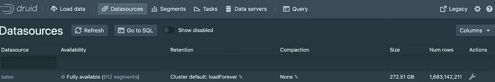

Druid UI

# 概念和目的

为了对阿帕奇德鲁伊有一个清晰的理解，我将参考官方文档中的内容:

*Apache Druid(孵化)是一个实时分析数据库，旨在对大型数据集进行快速切片分析(*[*【OLAP】*](http://en.wikipedia.org/wiki/Online_analytical_processing)*【查询】)。Druid 最常被用作支持实时接收、快速查询性能和高正常运行时间非常重要的用例的数据库。*


Druid Logo [[Meetup Group Photo Album](https://www.meetup.com/es/IL-Druid-Meetup/photos/28342551/466373110/?photoId=466373110&photoAlbumId=28342551)]

在我的 Druid 简历中，我们不仅可以批量分析数十亿行，还可以实时分析，因为它与不同的技术有许多集成，如 Kafka、云存储、S3、Hive、HDFS、DataSketches、Redis 等。

德鲁伊最有趣的[特征](https://druid.apache.org/docs/latest/design/)是:

*   云原生，轻松实现水平扩展
*   支持 SQL 分析数据
*   API REST 支持查询或上传数据

在 GCP 测试 Druid 的目的是需要一种工具，可以批量上传数百万行(面向事件),然后使用传统的数据可视化工具进行分析，如 Tableau 或 Qlik，将 Druid 作为主要的处理引擎，所以因为我不知道服务器的正确数量，所以必须使用灵活的环境，如 GCP，并从最简单的部署开始。

# 一般建筑

对于一个生产集群，Druid 主要由 6 个进程组成:协调器、霸王、代理、历史、中间管理器和路由器，其中[建议](https://druid.apache.org/docs/latest/design/architecture.html)组织成 3 种类型的服务器:主服务器、查询服务器和数据服务器。根据需要，这些服务器可能不止一台。

**主人**

由协调者和支配者组成。

> 管理数据接收和可用性:它负责启动新的接收作业，并协调“数据服务器”上数据的可用性

**查询**

由路由器和代理组成。

> 提供用户和客户端应用程序交互的端点，将查询路由到数据服务器或其他查询服务器[ [Druid 文档](https://druid.apache.org/docs/latest/design/processes.html)

**数据**

由中层管理者和历史管理者组成。

> 执行摄取作业并存储可查询的数据[ [Druid 文档](https://druid.apache.org/docs/latest/design/processes.html)

## 其他组件

除了三个服务器和六个服务之外，Druid 还需要一个元数据存储，深度存储对于理解 Druid 读取数据的来源以及负责与所有组件通信也很重要。

[**元数据存储**](https://druid.apache.org/docs/latest/dependencies/metadata-storage.html)

基本上用于存储关于系统的元数据(审计、数据源模式、任务等。).对于实验环境，建议使用 [Derby](https://db.apache.org/derby/) ，尽管对于生产目的，MySQL 或 PostgreSQL 是最佳选择。


Derby for a non-production cluster [[Apache Derby website](http://db.apache.org/derby/)]

[**深度存储**](https://druid.apache.org/docs/latest/dependencies/deep-storage.html)

Druid 为接收的数据使用单独的存储，这意味着该过程与存储分离，使其成为一种容错技术。一些[深度存储技术](https://druid.apache.org/docs/latest/development/extensions.html)有云存储、亚马逊 S3、HDFS、Redis 等。


Google Cloud Storage Logo [[DataKitchen](https://datakitchen.readme.io/docs/google-cloud-storage)]

[**数据摄取**](https://druid.apache.org/docs/latest/ingestion/index.html)

> Druid 中的所有数据都被组织成 ***段*、**，这些数据文件通常每个都有几百万行。**在 Druid 中加载数据被称为*摄取*或*索引*** ，包括从源系统读取数据并基于该数据创建数据段。[ [德鲁伊文献](https://druid.apache.org/docs/latest/design/processes.html) ]

德鲁伊完全支持批处理和流式摄取，支持的一些技术有 Apache Kafka、Kinesis、云存储和本地存储。


Druid support Streaming sources like Apache Kafka [[Kafka Website](https://kafka.apache.org/)]

[**动物园管理员**](https://druid.apache.org/docs/latest/dependencies/zookeeper.html)

德鲁伊使用 Zookeeper 来整合所有的服务。对于实验，你可以使用德鲁伊自带的 Zookeeper，而对于生产来说，必须单独安装它，一个好的做法是为 Zk 准备一个自己的服务器。


ZooKeeper is the coordinator for all the Druid services [[Wikipedia]](https://www.google.com/url?sa=i&source=images&cd=&cad=rja&uact=8&ved=2ahUKEwjEt5PH65_lAhURxVkKHSZfDvIQjhx6BAgBEAI&url=https%3A%2F%2Fen.wikipedia.org%2Fwiki%2FApache_ZooKeeper&psig=AOvVaw3xOBvlT-pc_uqvzY4_GKaP&ust=1571283024703968)

**初始图**

考虑到所有组件，我们可以创建一个代表生产集群 Google 云平台的架构图。

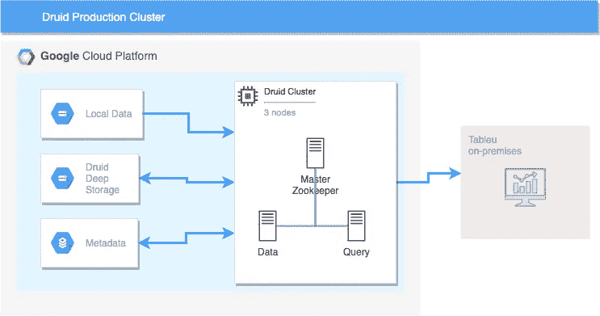

GCP Diagram

# 建立在 GCP 的基础上

对于本文，我将使用 Druid [独立服务器](http://druid.incubator.apache.org/docs/latest/tutorials/index.html)，Apache Derby 作为深度存储，云存储作为元数据服务器。虽然它包含了所有的特性，所以我们没有遗漏任何东西。

**德鲁伊单服务器**

我们将按照文档中的建议将 Druid 部署为 IAS，好的配置是 4CPU/16GB RAM。您可以使用 UI 或通过 Cloud Shell 提交来创建计算实例。

```
#Using Cloud Shellgcloud beta compute --project=[PROJECT-ID] instances create instance-druid --zone=us-central1-a --machine-type=n1-standard-4 --subnet=default --network-tier=PREMIUM --maintenance-policy=MIGRATE --service-account=[SERVICE-ACCOUNT] --scopes=https://www.googleapis.com/auth/devstorage.read_write,https://www.googleapis.com/auth/logging.write,https://www.googleapis.com/auth/monitoring.write,https://www.googleapis.com/auth/servicecontrol,https://www.googleapis.com/auth/service.management.readonly,https://www.googleapis.com/auth/trace.append --image=debian-9-stretch-v20191014 --image-project=debian-cloud --boot-disk-size=15GB --boot-disk-type=pd-standard --boot-disk-device-name=instance-druid --reservation-affinity=any
```

**重要**:默认情况下，您的[权限/范围](https://developers.google.com/identity/protocols/googlescopes)到`devstorage (google cloud storage)`是`read_only`您需要更改为`read_write`。

**安装德鲁伊**

我们使用 SSH 连接到实例，并遵循以下步骤:

*   下载的最新版本，在当时，是 0.16
*   解压缩文件

```
wget [https://www-eu.apache.org/dist/incubator/druid/0.16.0-incubating/apache-druid-0.16.0-incubating-bin.tar.gz](https://www-eu.apache.org/dist/incubator/druid/0.16.0-incubating/apache-druid-0.16.0-incubating-bin.tar.gz)
tar -xzf apache-druid-0.16.0-incubating-bin.tar.gz 
cd apache-druid-0.16.0-incubating
```

**注意:**有趣的是，我们下载了与安装生产集群的人相同的 Druid 版本和相同的文件，没有`version lite.`这意味着我们可以在以后将其作为主节点、数据节点或查询节点重用。

*   下载动物园管理员

```
curl https://archive.apache.org/dist/zookeeper/zookeeper-3.4.14/zookeeper-3.4.14.tar.gz -o zookeeper-3.4.14.tar.gz 
tar -xzf zookeeper-3.4.14.tar.gz 
mv zookeeper-3.4.14 zk
```

*   浏览文件

如果你这样做了`ls conf/druid/cluster`，你将会找到对应于数据服务器、主服务器和查询服务器的文件。在这种情况下，我们可以欣赏 Druid 的模块化，例如，如果您想将此安装用作数据服务器，您只需运行相应的`.sh`文件，不需要更改任何内容，这同样适用于 Query 和 Master。

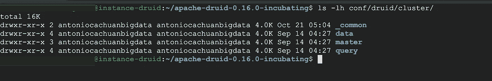

Production folders

在我们的例子中，我们将启动`micro-quickstart`

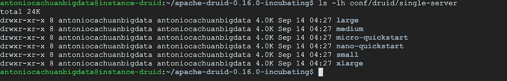

Differents size for Druid single-server

正如我们注意到的，这个微型快速入门提供了所有的服务

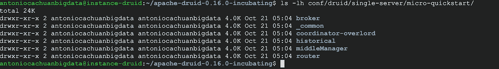

Druid services included in the single-server

*   安装 Java8 和 Perl

```
sudo apt-get install openjdk-8-jdk
sudo apt-get install libmodule-install-perl
```

*   创建一个 SSH 隧道:Druid 默认使用端口 8888，所以使用云 Shell 你可以[建立一个到它的隧道](https://cloud.google.com/dataproc/docs/concepts/accessing/cluster-web-interfaces#connect_to_the_cluster_interface)或者有可能建立一个[防火墙规则](https://cloud.google.com/vpc/docs/using-firewalls)来打开这个端口。

```
#${PROJECT} is your GCP project ID
#${ZONE} is the zone of your VMs in this case us-central1-a
gcloud compute ssh ${HOSTNAME} \
    --project=${PROJECT} --zone=${ZONE}  -- \
    -4 -N -L 8081:${HOSTNAME}:8888
```

*   快跑！(在另一个云壳里)

```
./bin/start-micro-quickstart
```

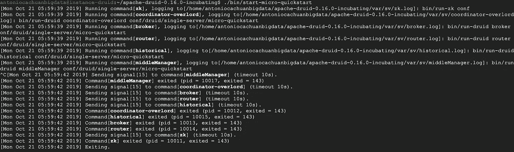

Druid running

*   德鲁伊界面工作！

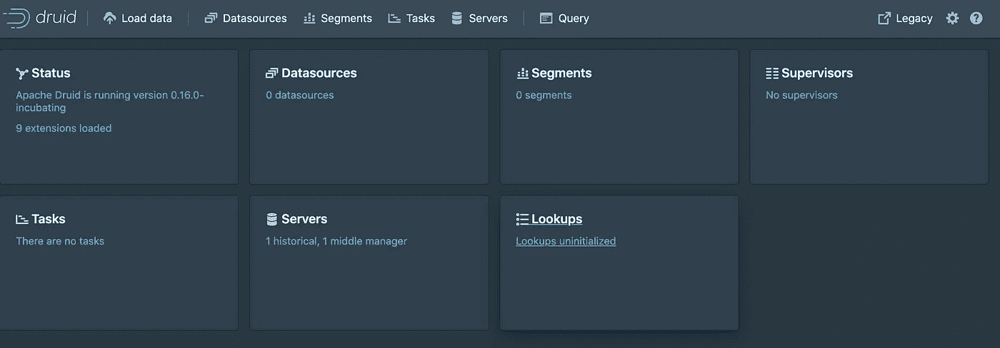

Druid landing page

**深度存储**

正如我提到的，默认情况下，深度存储是本地的，因此在这种情况下，我们将修改为指向[云存储](https://cloud.google.com/storage/)。

*   停止德鲁伊服务器(Ctrl+c)

_ _**common . runtime . properties** 这个文件非常重要它包含:

*   德鲁伊扩展

```
druid.extensions.loadList=["druid-google-extensions", “druid-hdfs-storage”, “druid-kafka-indexing-service”, “druid-datasketches”]
```

*   动物园管理员 ip

```
druid.zk.service.host=localhost
druid.zk.paths.base=/druid
```

*   元数据的引用

```
druid.metadata.storage.type=derby
druid.metadata.storage.connector.connectURI=jdbc:derby://localhost:1527/var/druid/metadata.db;create=true
druid.metadata.storage.connector.host=localhost
druid.metadata.storage.connector.port=1527
```

*   深层存储的引用。

```
druid.storage.type=local
druid.storage.storageDirectory=var/druid/segments
```

此外，您可以在生产中为所有类型的服务器找到相同的文件。

我们来修改一下:

```
vi conf/druid/single-server/micro-quickstart/_common/common.runtime.properties
```

添加德鲁伊扩展`druid-google-extensions`

注释引用本地，并添加对谷歌云存储的引用

```
# For Google Cloud Storage
druid.storage.type=goole
druid.google.bucket=[BUCKET-NAME]
druid.google.prefix=[FOLDER-PATH]
```

退出并保存`:wq`

**元数据**

Druid 在使用 MySQL 或 Postgres 时有更好的性能。在这个机会中，我们将启动一个[云 SQL](https://cloud.google.com/sql/docs/) 实例并连接到我们的服务器。

**注意**:在防火墙规则中允许 Druid IP 和 Cloud SQL IP 的入口/出口。

我们再修改一下:

```
vi conf/druid/single-server/micro-quickstart/_common/common.runtime.properties
```

*   注释所有对 Derby 的引用，并添加 MySQL 的凭证

```
druid.metadata.storage.type=mysql
druid.metadata.storage.connector.connectURI=jdbc:mysql://druiddb:3306/druid
druid.metadata.storage.connector.user=.[USER]
druid.metadata.storage.connector.password=[PASSWORD]
```

*   再次启动我们的服务器

```
./bin/start-micro-quickstart
```

# 基本摄入

Druid 允许 as 上传来自不同来源的数据，将这些数据组织成[段](https://druid.apache.org/docs/latest/tutorials/tutorial-batch.html)(保存在深层存储和 MySQL 的元数据中)，我们可以在那里查询并开始分析数据。[可以通过四种方式摄取数据](https://druid.apache.org/docs/latest/tutorials/tutorial-batch.html):

*   使用 Druid UI(数据加载器)

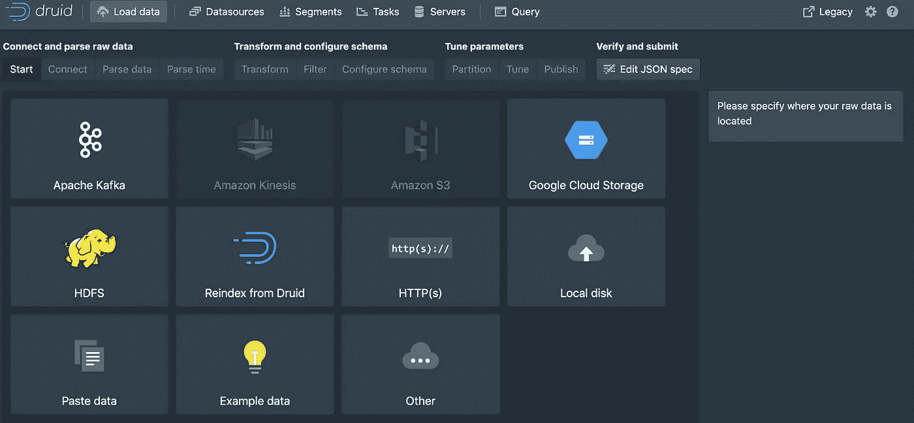

Data Loader

*   JSON 任务

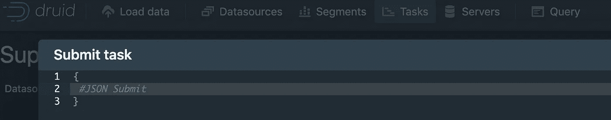

*   命令行
*   API Rest

出于我们的目的，我们可以从图形选项开始，并使用可用的快速入门数据。

*   选择加载数据，然后选择本地数据
*   相应地完成基本目录和文件过滤

```
quickstart/tutorial/
wikiticker-2015-09-12-sampled.json.gz
```

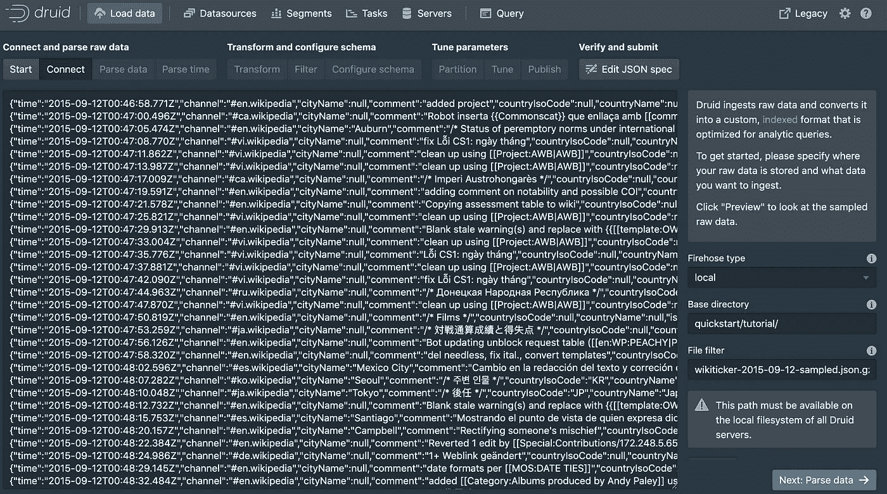

Uploading data using Druid UI

*   按下 next(建议仔细阅读)并在配置模式步骤中停止，这里我们可以看到在 Pase 时间步骤中添加的**_ _ 时间列**。这个列很重要，因为 Druid 有基于时间的分区。此外，我们可以观察用于[汇总](https://druid.apache.org/docs/latest/tutorials/tutorial-rollup.html)的查询粒度字段，保持不变。

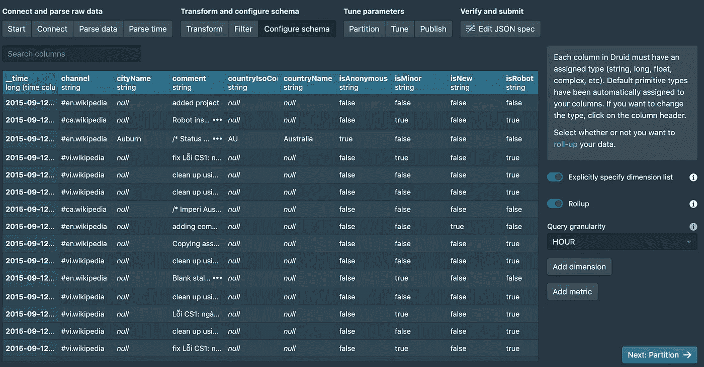

Query granularity

*   在最后一步，我们看到 JSON 已经完成了所有的配置，并准备好提交，这将生成一个[任务](https://druid.apache.org/docs/latest/ingestion/tasks.html)。

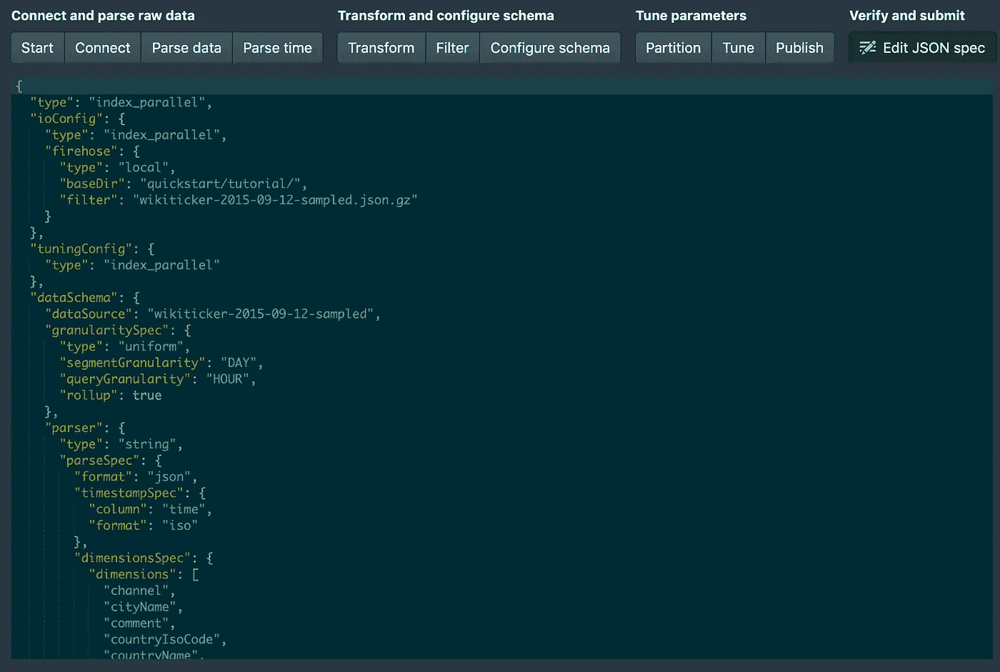

JSON with all the configurations

*   有可能看到运行任务生成

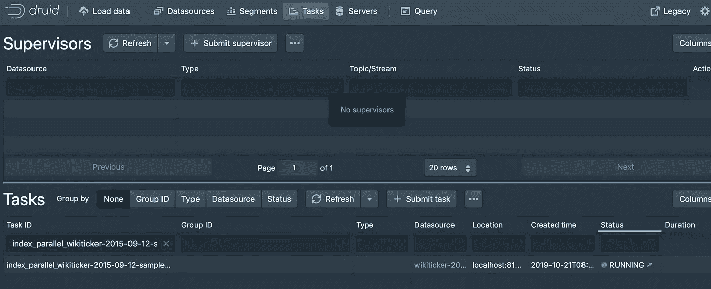

Task running

*   成功！

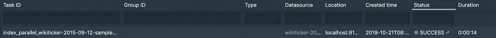

Success

# 查询数据

用户可以通过 [SQL](http://druid.incubator.apache.org/docs/latest/querying/sql) 处理数据，也可以使用 REST API。

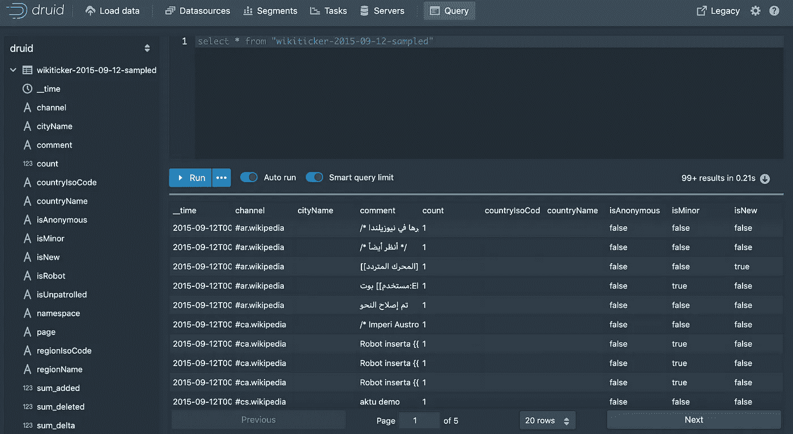

Querying data

# 推荐

*   For exploration 建议保留本文中描述的体系结构，因为以后可以将数据迁移到更大的集群中。
*   尝试测试所有的 SQL 函数并注意其优势，例如，再次运行相同的查询，您可以看到时间的显著减少，这是因为 [Druid 缓存](https://druid.apache.org/docs/latest/querying/caching.html)。
*   如果您有自己的数据，可以上传(CSV 或 JSON)到

```
apache-druid-0.16.0-incubating/quickstart/tutorial/
```

*   在上图中，您可以看到一些列，如“sum_added”、“sum_deleted”和“sum_delta”。这些列是在上传期间创建的，您可以省略或添加其他的[聚合列](https://druid.apache.org/docs/latest/querying/aggregations)。
*   如果您想要更好的性能，建议您在创建虚拟机时选择 SSD 存储。

# 后续步骤

在德鲁伊中存在许多需要测试的特性，我希望在下一篇文章中介绍。

*   用户管理(角色、身份验证和授权)
*   使用 REST API 上传和查询数据
*   [查找](https://druid.apache.org/docs/latest/querying/lookups.html)
*   连接到数据可视化工具
*   数据和查询服务器的水平扩展
*   上传大数据源的调优
*   查询和并发支持调优
*   其他扩展如 [Apache Data Sketchs](https://datasketches.apache.org/) 或 [Redis](https://druid.apache.org/docs/latest/development/extensions-contrib/redis-cache.html)
*   将数据和元数据迁移到另一个 Druid 集群
*   升级集群
*   摄取流数据

如果您想更进一步部署生产集群，请查看文章表单 [Jesús Méndez Galvez](https://medium.com/u/8f042b78edb6?source=post_page-----c1e087c87bf1--------------------------------) [此处](/deploying-a-production-druid-cluster-in-google-cloud-platform-43a7f1e15336)。

PS 如果你有任何问题，或者想要澄清一些事情，你可以在 [Twitter](https://twitter.com/thony_ac77) 和 [LinkedIn 上找到我。](https://www.linkedin.com/in/antoniocachuan/)如果你想了解阿帕奇 Arrow 和阿帕奇 Spark 我有一篇文章[**对阿帕奇 Arrow 与阿帕奇 Spark 和 Pandas**](/a-gentle-introduction-to-apache-arrow-with-apache-spark-and-pandas-bb19ffe0ddae) 有一些例子。

[](/a-gentle-introduction-to-apache-arrow-with-apache-spark-and-pandas-bb19ffe0ddae) [## 阿帕奇箭与阿帕奇火花和熊猫的温柔介绍

### 这一次我将尝试解释如何将 Apache Arrow 与 Apache Spark 和 Python 结合使用。首先…

towardsdatascience.com](/a-gentle-introduction-to-apache-arrow-with-apache-spark-and-pandas-bb19ffe0ddae)