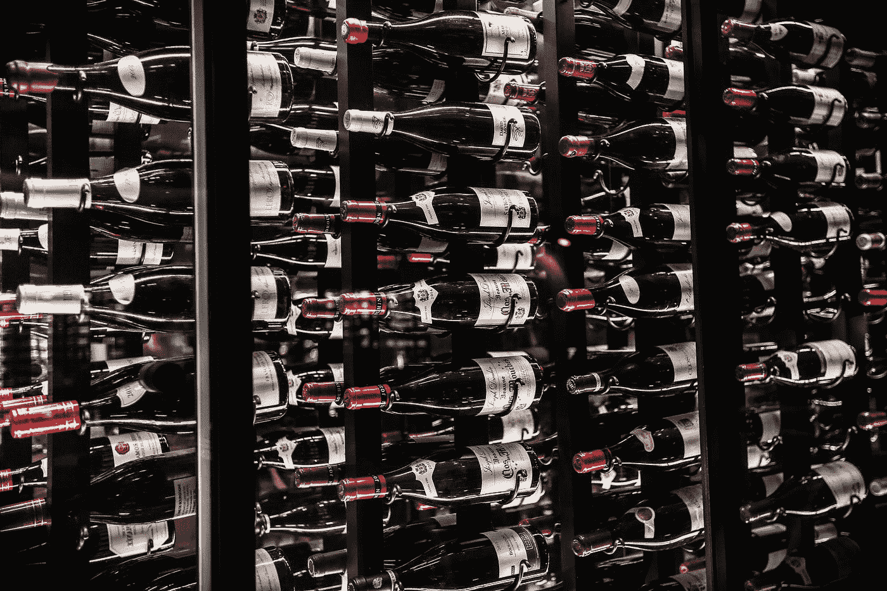
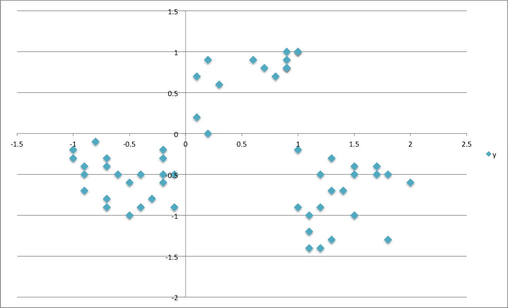
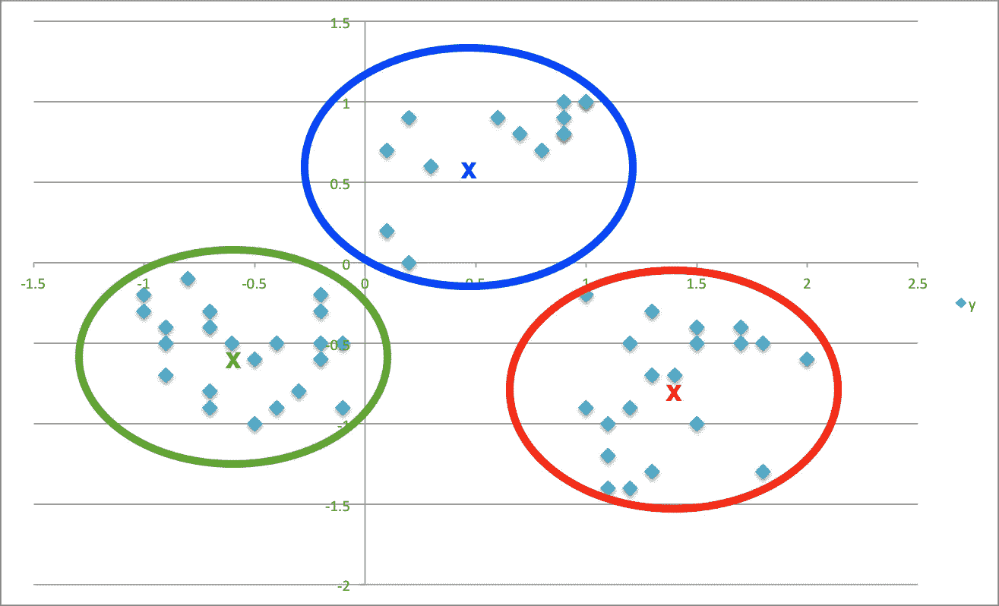
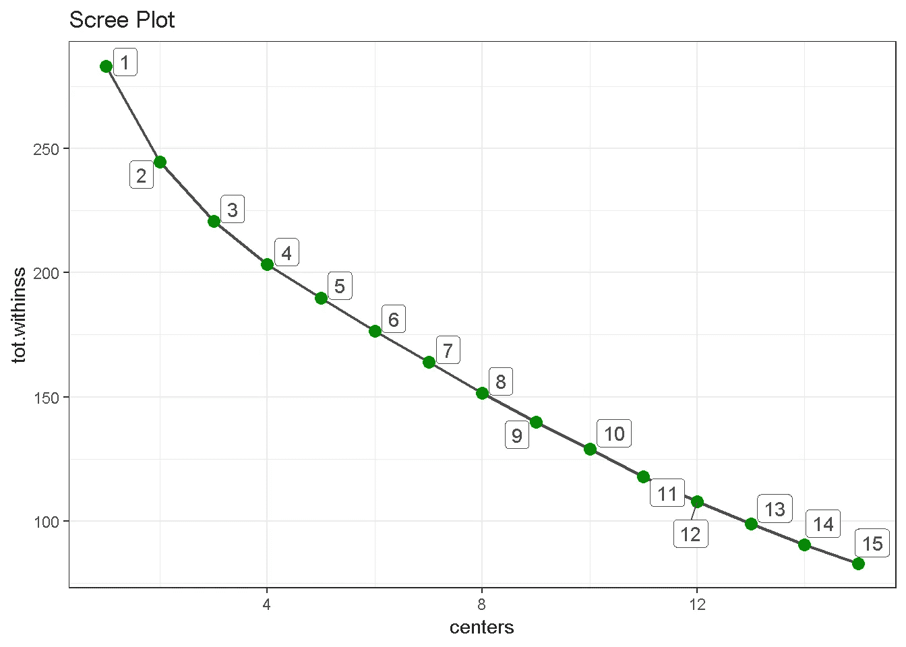
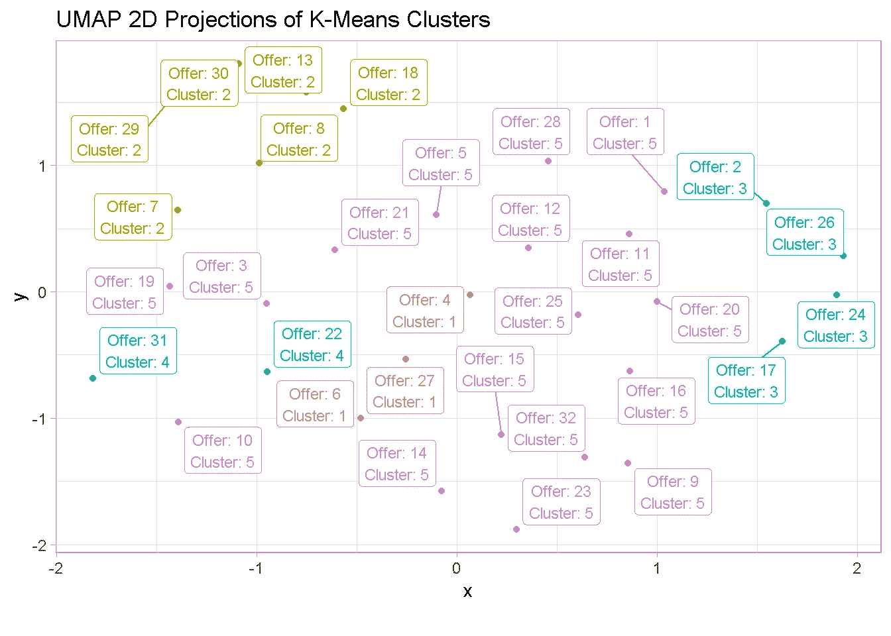

# 客户细分的简明介绍

> 原文：<https://towardsdatascience.com/a-gentle-introduction-to-customer-segmentation-375fb4346a33?source=collection_archive---------21----------------------->

## 使用 K-Means 聚类来理解营销响应



Photo by [Nick Karvounis](https://unsplash.com/@nickkarvounis?utm_source=medium&utm_medium=referral) on [Unsplash](https://unsplash.com?utm_source=medium&utm_medium=referral)

# 概观

我这篇文章的目的是要表明，你并不总是需要超级复杂和精密的机器学习模型来从你的数据中获得有意义的见解。

对于这个迷你项目，我使用流行的 [**K-Means 聚类**](https://en.wikipedia.org/wiki/K-means_clustering) 算法，根据客户对一系列**营销活动**的反应对他们进行细分。这种技术相对容易实现，但它允许我从我的数据中收集大量信息，并挖掘我的客户群中有趣的行为模式。

# 什么是市场细分？

[**市场细分**](https://en.wikipedia.org/wiki/Market_segmentation) 是指根据共同的属性、兴趣和行为将现有和/或潜在客户的消费市场划分为多个群体(或细分市场)的过程。

基本概念是，拥有共同特征的消费者更有可能以相似的方式对营销传播做出回应，这样公司就可以以更相关、更有效的方式接触每个群体。

# 什么是 K-Means 聚类？

**K-Means 聚类**是 [**无监督学习**](https://en.wikipedia.org/wiki/Unsupervised_learning) 建模家族的一部分，这是一套用于在尚未标记、分类或归类的数据中寻找模式的技术。由于这种方法不要求有一个聚类目标，它可以在客户细分的探索阶段有很大的帮助。

基本思想是，分配到一个组的客户尽可能相似，而属于不同组的客户尽可能不相似。每个聚类由其`centre`表示，对应于分配给该聚类的元素的平均值。

为了说明这个原理，假设你有一组像下图中那样的元素，并想把它们分成 **3 个簇**



K-Means 将为您做的是将它们分组在每个簇的中间或`centre`，这里用**“X”的**表示，以最小化每个元素到其`centre`的距离的方式



那么这如何帮助你**更好地了解你的客户**？嗯，在这种情况下，你可以利用他们的**行为**(具体来说，他们选择或不选择哪种优惠)作为一种方式，将他们与想法相似的客户分组。现在，您可以研究每一组，发掘趋势和模式，并用它们来塑造未来的产品。

**稍微技术性一点的说明**，重要的是要提到有许多 K-Means 算法可用( *Hartigan-Wong* 、 *Lloyd* 、 *MacQueen* 等等)，但它们都有相同的基本概念:每个元素都被分配到一个聚类中，从而使**到`centre`的欧几里德距离的平方和**最小化——这个过程也被称为使**总数最小化**

# 加载包

```
**library**(tidyverse)
**library**(lubridate)
**library**(knitr)
**library**(readxl)
**library**(broom)
**library**(umap)
**library**(ggrepel)
```

# 数据

[数据集](https://media.wiley.com/product_ancillary/6X/11186614/DOWNLOAD/ch02.zip)来自[约翰·福尔曼](http://www.john-foreman.com/blog)的书[数据智能](http://www.wiley.com/WileyCDA/WileyTitle/productCd-111866146X.html)。它包含**虚构葡萄酒零售商**的**促销**数据，包括 *32 次促销*的详细信息(包括葡萄酒品种、最低购买量、折扣百分比和原产国)以及 *100 名客户*及其响应的促销的列表。

```
offers_tbl <- **read_excel**('../00_data/WineKMC.xlsx', 
                           sheet = 'OfferInformation')offers_tbl <- offers_tbl %>% 
                 **set_names**(**c**('offer', 'campaign', 
                             'varietal', 'min_qty_kg',
                             'disc_pct','origin','past_peak')
                             )**head**(offers_tbl)## # A tibble: 6 x 7
##  offer campaign varietal min_qty_kg disc_pct origin  past_peak
##  <dbl> <chr>    <chr>       <dbl>   <dbl>    <chr>     <chr>    
## 1 1 January     Malbec        72     56      France     FALSE    
## 2 2 January     Pinot Noir    72     17      France     FALSE    
## 3 3 February    Espumante    144     32      Oregon     TRUE     
## 4 4 February    Champagne     72     48      France     TRUE     
## 5 5 February    Cabernet~    144     44      New Zeala~ TRUE     
## 6 6 March       Prosecco     144     86      Chile      FALSEtransac_tbl <- **read_excel**('../00_data/WineKMC.xlsx', 
                            sheet = 'Transactions')transac_tbl <- transac_tbl %>% 
                   **set_names**(**c**('customer', 'offer')
                               )**head**(transac_tbl)## # A tibble: 6 x 2
##   customer offer
##   <chr>    <dbl>
## 1 Smith        2
## 2 Smith       24
## 3 Johnson     17
## 4 Johnson     24
## 5 Johnson     26
## 6 Williams    18
```

数据需要被转换成一个`User-Item format`(又名*客户-产品矩阵*)，顶部是*客户*，下方是*报价*。单元格中填充了 **0 的**和 **1 的**，其中 **1 的**表示客户是否对特定报价做出了回应。

这种矩阵也被称为**二进制评级矩阵**和*不需要标准化*。

```
wine_tbl <- transac_tbl %>% 
    **left_join**(offers_tbl) %>% 
    **mutate**(value = 1) %>%
    **spread**(customer,value, fill = 0) **head**(wine_tbl)## # A tibble: 6 x 107
##  offer campaign varietal min_qty_kg disc_pct origin past_peak 
##  <dbl>  <chr>   <chr>      <dbl>      <dbl>    <chr>  <chr>     
## 1 1    January  Malbec       72       56      France   FALSE         
## 2 2    January  Pinot Noir   72       17      France   FALSE         
## 3 3    February Espumante   144       32      Oregon   TRUE          
## 4 4    February Champagne    72       48      France   TRUE          
## 5 5    February Cabernern~  144       44      New Zea~ TRUE          
## 6 6    March    Prosecco    144       86      Chile    FALSE         
## # ... with 100 more variables: Adams <dbl>, Allen <dbl>, Anderson <dbl>, Bailey <dbl>, Baker <dbl>, Barnes <dbl>, ...
```

# 对客户进行聚类

K-Means 算法附带了 **stats** 包，这是 R 中的**核心系统库**之一，使用起来相当简单。我只需要将几个参数传递给 **kmeans()** 函数。

```
user_item_tbl <- wine_tbl[,8:107]**set.seed**(196) 

kmeans_obj <- user_item_tbl %>%  
    **kmeans**(centers = 5,     # number of clusters 
           nstart = 100,    # number of random sets to be chosen
           iter.max = 50)   # max number of iterations allowed
```

我可以用`broom`包中的`glance()`快速检查模型，它提供了模型级统计数据的摘要

```
**glance**(kmeans_obj) %>% **glimpse**()## Observations: 1
## Variables: 4
## $ totss        <dbl> 283.1875
## $ tot.withinss <dbl> 189.7255
## $ betweenss    <dbl> 93.46201
## $ iter         <int> 3
```

真正需要关注的一个指标是**总的类内平方和**(或`tot.withinss`),因为类的最佳数量是最小化`tot.withinss`的数量。

所以我想为不同数量的集群拟合 k-means 模型，看看在哪里`tot.withinss`达到最小值。

首先，我为一定数量的`centers`(本例中为 4)构建一个函数，并检查它是否在`glance()`上工作。

```
kmeans_map <- **function**(centers = 4) {
    user_item_tbl %>%  
        **kmeans**(centers = centers, 
        nstart = 100, 
        iter.max = 50)
}4 %>% **kmeans_map**() %>%  **glance**()## # A tibble: 1 x 4
##   totss tot.withinss betweenss  iter
##   <dbl>        <dbl>     <dbl> <int>
## 1  283\.         203\.      80.0     2
```

然后，我创建了一个**嵌套 tibble** ，这是一种在数据框中“嵌套”列的方式。

嵌套数据框的伟大之处在于，您可以在其中放置任何您想要的东西:列表、模型、数据框、绘图等！

```
kmeans_map_tbl <- **tibble**(centers = 1:15) %>%  
                         # create column with centres           **mutate**(k_means = centers %>% 
                  **map**(kmeans_map)) %>%   
                         # iterate `kmeans_map` row-wise to 
                         # gather kmeans models for each centre **mutate**(glance = k_means %>%  
                  **map**(glance))            
                         # apply `glance()` row-wise to gather 
                         # each model’s summary metrics kmeans_map_tbl %>% **glimpse**()## Observations: 15
## Variables: 3
## $ centers <int>  1, 2, 3, 4, 5, 6, 7, 8, 9, 10, 11, 12, 13, ...
## $ k_means <list> [<1, 1, 1, 1, 1, 1, 1, 1, 1, 1, 1, 1, 1, ...
## $ glance  <list> [<tbl_df[1 x 4]>, <tbl_df[1 x 4]>, ...
```

最后，我可以构建一个`scree plot`,并在图上寻找“肘部”,即额外集群的数量趋于稳定的地方。在这种情况下， **5** 似乎是一个最佳数字，因为 6 的`tot.withinss`下降不如前一个明显。

```
kmeans_map_tbl %>% 
    **unnest**(glance) %>%           *# unnest the glance column*
    **select**(centers, 
             tot.withinss) %>%   *# select centers and tot.withinss*

    **ggplot**(**aes**(x = centers, y = tot.withinss)) + 
    **geom_line**(colour = 'grey30', size = .8) +
    **geom_point**(colour = 'green4', size = 3) +
    **geom_label_repel**(**aes**(label = centers), 
                     colour = 'grey30') +
    **theme_light**() +
    **labs**(title = 'Scree Plot')
```



# 将片段可视化

现在我已经确定了集群的最佳数量，我想把它们可视化。为此，我使用了[](https://umap-learn.readthedocs.io/en/latest/)**(*均匀流形逼近和投影*)，这是一种维度缩减技术，可以以类似于 [**主成分分析**](https://en.wikipedia.org/wiki/Principal_component_analysis) 和 [**t-SNE**](https://en.wikipedia.org/wiki/T-distributed_stochastic_neighbor_embedding) 的方式用于聚类可视化。**

**首先，我创建一个 umap 对象，取出`layout`参数(包含可用于可视化数据集的坐标)，将其格式更改为 tibble，并从`wine_tbl`中附加`offer`列。**

```
umap_obj <- user_item_tbl %>%  **umap**() 

umap_tbl <- umap_obj$layout %>% 
    **as_tibble**() %>%                       *# change to a tibble*
    **set_names**(**c**('x', 'y')) %>%            *# remane columns*
    **bind_cols**(wine_tbl %>% **select**(offer)) *# attach offer reference*
```

**然后，我从**嵌套表**中`pluck`出第 5 个 kmeans 模型，将 *cluster* 参数从`kmeans`函数附加到输出，并将 offer 和 cluster 加入 umap_tbl。**

```
umap_kmeans_5_tbl <- kmeans_map_tbl %>% 
    **pull**(k_means) %>%
    **pluck**(5) %>%                   *# pluck element 5* 
    broom::**augment**(wine_tbl) %>%   *# attach .cluster to the tibble* 
    **select**(offer, .cluster) %>% 
    **left_join**(umap_tbl, 
                 by = 'offer')     *# join umap_tbl by offer*
```

**最后，我可以看到星团的 UMAP 投影。`plotly`增加了一些很好的交互性，让图表变得栩栩如生！**

```
umap_kmeans_5_tbl %>% 
    **mutate**(label_text = **str_glue**('Offer: {offer}
                                  Cluster: {.cluster}')) %>%
    **ggplot**(**aes**(x,y, colour = .cluster)) +
    **geom_point**() +
    **geom_label_repel**(**aes**(label = label_text), size = 3) +
    **theme_light**() +
    **labs**(title    = 'UMAP 2D Projections of K-Means Clusters',
         caption  = "") +
    **theme**(legend.position = 'none')
```

****

# **评估集群**

**现在我们终于可以更仔细地观察单个聚类，看看 K-Means 识别出了什么。**

**但是，让我们首先将所有信息放在一个数据框中。**

```
cluster_trends_tbl <- wine_tbl %>%
    **left_join**(umap_kmeans_5_tbl) %>%
    **arrange**(.cluster) %>%
    **select**(.cluster, offer:past_peak)
```

# **群组 1 和 2**

****集群 1** 中的顾客购买**大量的起泡酒**(香槟和普罗塞克)，而**第二细分市场**中的顾客喜欢购买**不同品种的少量**。**

```
cluster_trends_tbl %>% 
    **filter**(.cluster ==1 | .cluster ==2) %>% 
    **count**(.cluster, varietal, origin, min_qty_kg, disc_pct) %>%
    **select**(-n)## # A tibble: 9 x 5
##   .cluster varietal     origin       min_qty_kg disc_pct
##   <fct>    <chr>        <chr>             <dbl>    <dbl>
## 1 1        Champagne    France               72       48
## 2 1        Champagne    New Zealand          72       88
## 3 1        Prosecco     Chile               144       86
## 4 2        Espumante    Oregon                6       50
## 5 2        Espumante    South Africa          6       45
## 6 2        Malbec       France                6       54
## 7 2        Merlot       Chile                 6       43
## 8 2        Pinot Grigio France                6       87
## 9 2        Prosecco     Australia             6       40
```

# **群组 3 和 4**

**当谈到葡萄酒时，这些群体中的顾客有非常特殊的口味:那些在第三部分的顾客偏爱黑皮诺，而第四组的顾客只购买大量的法国香槟。**

```
cluster_trends_tbl %>% 
    **filter**(.cluster ==3 | .cluster ==4 ) %>% 
    **group_by**() %>%
    **count**(.cluster, varietal, origin, min_qty_kg, disc_pct) %>%
    **select**(-n)## # A tibble: 6 x 5
##   .cluster varietal   origin    min_qty_kg disc_pct
##   <fct>    <chr>      <chr>          <dbl>    <dbl>
## 1 3        Pinot Noir Australia        144       83
## 2 3        Pinot Noir France            72       17
## 3 3        Pinot Noir Germany           12       47
## 4 3        Pinot Noir Italy              6       34
## 5 4        Champagne  France            72       63
## 6 4        Champagne  France            72       89
```

# **第 5 组**

****第五部分**更难分类，因为它包含许多不同的属性。唯一明显的趋势是，这一细分市场的顾客选择了所有可用的赤霞珠葡萄酒。**

```
cluster_trends_tbl %>% 
    **filter**(.cluster ==5 ) %>% 
    **count**(.cluster, varietal, origin, min_qty_kg, disc_pct) %>%
    **select**(-n)## # A tibble: 17 x 5
##    .cluster varietal           origin       min_qty_kg disc_pct
##    <fct>    <chr>              <chr>             <dbl>    <dbl>
##  1 5        Cabernet Sauvignon France               12       56
##  2 5        Cabernet Sauvignon Germany              72       45
##  3 5        Cabernet Sauvignon Italy                72       82
##  4 5        Cabernet Sauvignon Italy               144       19
##  5 5        Cabernet Sauvignon New Zealand         144       44
##  6 5        Cabernet Sauvignon Oregon               72       59
##  7 5        Champagne          California           12       50
##  8 5        Champagne          France               72       85
##  9 5        Champagne          Germany              12       66
## 10 5        Chardonnay         Chile               144       57
## 11 5        Chardonnay         South Africa        144       39
## 12 5        Espumante          Oregon              144       32
## 13 5        Malbec             France               72       56
## 14 5        Merlot             California           72       88
## 15 5        Merlot             Chile                72       64
## 16 5        Prosecco           Australia            72       83
## 17 5        Prosecco           California           72       52
```

# **最后的想法**

**虽然它不会给你所有的答案，**聚类**是一个强大的探索性练习，它可以帮助你揭示你的消费者群的模式，尤其是当你有一个全新的市场要探索，并且之前没有任何关于它的知识。**

**这很容易实现，甚至在像我在这里使用的小数据集上，你也可以在你的客户群中挖掘出有趣的行为模式。**

**我们不费吹灰之力就了解到，我们的一些顾客喜欢某些种类的葡萄酒，而另一些顾客则喜欢买高买低。这些信息可以用来针对那些更倾向于做出回应的客户，定制你的**定价策略**和**营销活动**。此外，客户细分允许更有效地分配营销资源，并最大限度地增加交叉销售和追加销售机会。**

**还可以通过叠加客户的**人口统计**(年龄、种族、宗教、性别、家庭规模、种族、收入、教育水平)**地理**(他们生活和工作的地方)**心理**(社会阶层、生活方式和个性特征)等信息来丰富细分，但这些都超出了这个小型项目的范围。**

# **代码库**

**完整的 R 代码可以在[我的 GitHub 档案](https://github.com/DiegoUsaiUK/Customer_Segmentation)中找到**

# **参考**

*   **有关[客户细分潜力的更广泛观点](https://medium.com/@kristenkehrer/how-to-use-customer-segmentation-to-learn-f49e82b9a959)**
*   **对于某些 [k-means 缺点的批判](https://www.datascience.com/blog/k-means-alternatives)**
*   **[贝恩&公司](https://www.bain.com/insights/management-tools-customer-segmentation)的客户细分**

***原载于 2019 年 5 月 25 日*[*https://diegousei . io*](https://diegousai.io/2019/05/a-gentle-introduction-to-customer-segmentation/)*。***