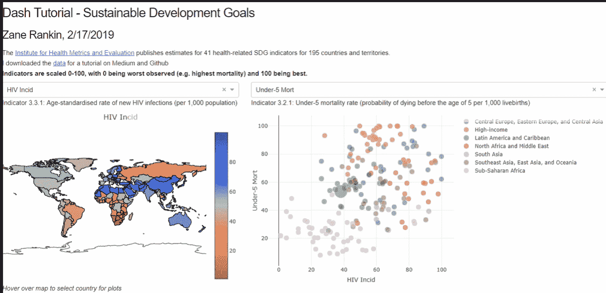
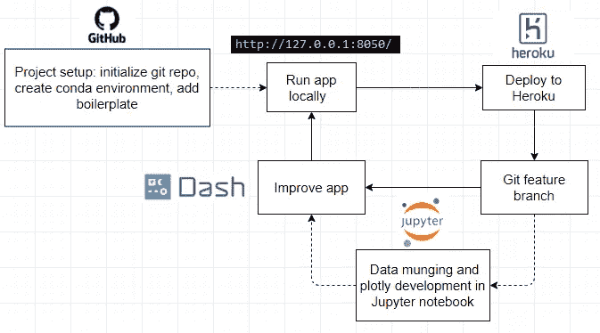
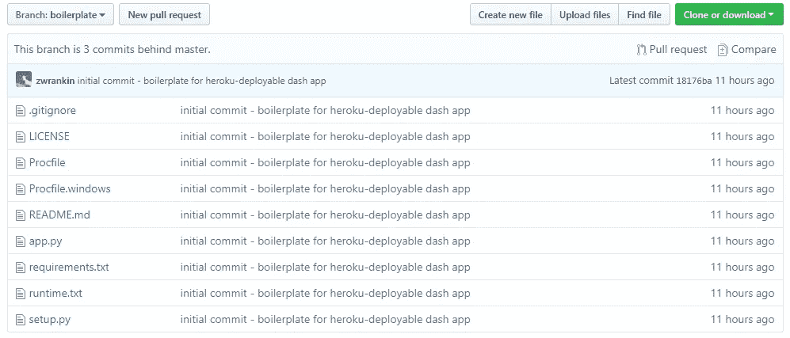
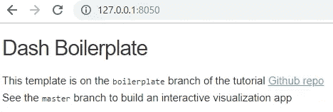
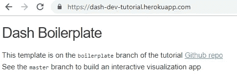
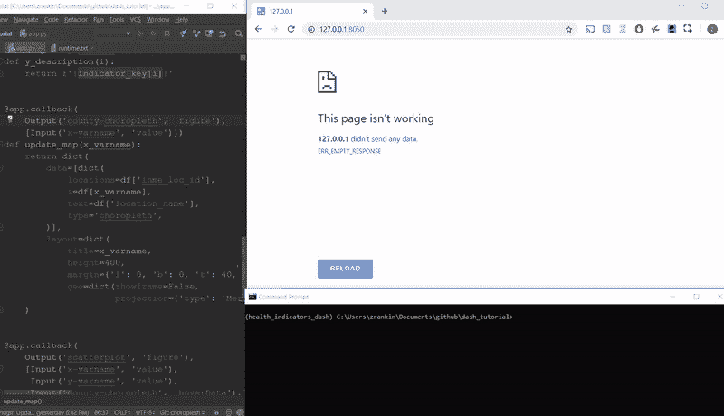
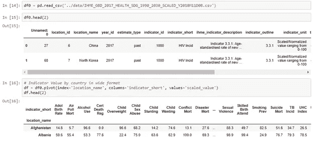
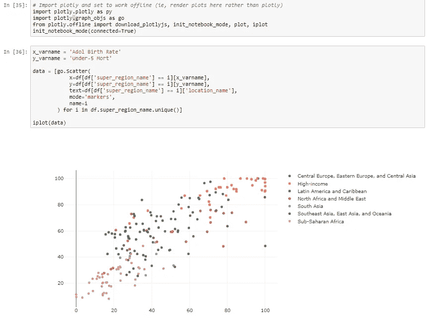

# Dash 开发的温和介绍

> 原文：<https://towardsdatascience.com/a-gentle-introduction-to-dash-development-and-deployment-f8b91990d3bd?source=collection_archive---------9----------------------->

## 构建交互式可视化并将其部署到 Heroku 的有效工作流

你是一个饱受 D3 羡慕的 Python 程序员吗？
第一步:垂涎于 [D3 画廊](https://d3js.org/)的性感&互动剧情
第二步:从 Javascript
的陡峭学习曲线上掉下来第三步:回到制作平庸的 seaborn 剧情

*有更好的办法！*

A Dash interactive visualization in <150 lines of Python code, [deployed to Heroku](https://dash-dev-tutorial.herokuapp.com/) from this [GitHub repo](https://github.com/zwrankin/dash_tutorial)

进入 [Dash](https://dash.plot.ly/) ，这是一个用纯 Python 构建交互式 web 可视化的简单而强大的框架。因为它是建立在 D3 之上的，所以你得到了你渴望的美感(这里有一些[社区的例子](https://medium.com/@plotlygraphs/7-new-dash-apps-made-by-the-dash-community-196998112ce3))。Dash 有一篇优秀的[介绍文章](https://medium.com/@plotlygraphs/introducing-dash-5ecf7191b503)，和一篇示范性的[教程](https://dash.plot.ly/)，它将教你在 1-2 小时内制作一个交互式可视化。我想澄清一下，我不是在写 Dash 的教程(说真的，他们的很棒)，也不是在争论 Dash 与 Altair 或 Bokeh 的优点(我会把这个留给专家和他们的机智决策树)。

那么我为什么要写 Dash 开发的教程呢？在用户指南的彻底性中丢失的是一个通用工作流的简明图片——构建和部署交互式可视化。如果你对 git 特性分支、Heroku 或虚拟环境有点模糊，很容易被本教程简单的可视化所迷惑。在您探测堆栈溢出的深度之前，这里有一个有效的工作流，它帮助我构建了多个仪表板([示例](https://sdg-3.herokuapp.com/))并避免了常见的陷阱。我使用以下工作流程开发了 [GitHub 教程](https://github.com/zwrankin/dash_tutorial)及以上 [Heroku app](https://dash-dev-tutorial.herokuapp.com/) 。

Sample workflow

## 项目设置

同样，本教程是关于构建*非平凡的* Dash 应用程序和*部署到 Heroku* ，所以我们必须使用版本控制和 GitHub。为了便于进入，我在教程 repo 中做了一个[样板分支](https://github.com/zwrankin/dash_tutorial/tree/boilerplate)。
*注:你可能熟悉*[*cookiecutter*](https://cookiecutter.readthedocs.io/en/latest/)*，一个项目设置的自动化工具。Plotly 提供了一个* [*dash 组件样板*](https://github.com/plotly/dash-component-boilerplate) *，并且至少有一个* [*dash app 样板*](https://github.com/jackdbd/cookiecutter-dash) *。我的是一个轻量级版本，对于本教程来说已经足够了。*

Github tutorial [boilerplate branch](https://github.com/zwrankin/dash_tutorial/tree/boilerplate)

除了琐碎的破折号`app`，我还包含了 Heroku 部署所需的文件。这些文件在 Heroku 的 [Python 快速入门](https://devcenter.heroku.com/articles/getting-started-with-python)中有很好的记录。简而言之，`Procfile`、`runtime`和`setup`告诉远程 Heroku 服务器如何运行你的应用，`requirements`列出了用于构建你的应用的虚拟环境的 Python 包(及其具体版本)。
**步骤 1:** 创建自己的 Git 资源库
**步骤 2** :克隆或下载教程的[样板文件分支](https://github.com/zwrankin/dash_tutorial/tree/boilerplate)，手动将这些文件添加到您的 Git 资源库中(这比分叉整个 Git 资源库要干净)。
**第三步**:创建你的虚拟环境。我使用的是一个由`pip`作为包管理器的`conda`环境。打开一个终端，运行`conda create -n dash_tutorial pip`。(将`pip`添加到您的环境中使得稍后通过`pip freeze`跟踪包变得更加容易)。注意我的`runtime`用的是 Python 3.7.2。
**第四步:**安装你的软件包。首先，确保您在您的环境中:对于 Windows，运行`activate dash_tutorial`。如果你只是按照教程来做，你可以通过运行
`(env_name) C:/path/to/dash_tutorial> pip install -r requirements.txt` 来复制我的环境(激活环境并在你的 git repo 中)【如果你正在为你自己的应用程序使用样板文件(而不是使用 cookiecutter 模板)，你需要一个包含最新版本包的环境。你可以`pip install`[最新的 Dash 库](https://dash.plot.ly/installation)，以及`pip install jupyter pandas`和任何其他你打算用于你的应用的库。在这一点上，你可能会感到沮丧，因为我答应了一个“温和的”介绍，然后让你承担环境管理的重担。然而，环境勤奋对于使 Heroku 部署顺利进行至关重要(实际上，对于任何重要的 Python 开发都是如此)。如果你真的愿意，你可以在处理 Heroku 部署之前构建完整的 Dash `app`,但是根据我的经验，Heroku 部署对于初学者来说很棘手，在你构建一个你无法部署的复杂应用之前，用一个玩具应用来调试部署更容易。

## 部署到 Heroku

**第五步**:本地运行 app。
`(env_name) C:/path/to/dash_tutorial> python app.py` 这将启动一个本地服务器，您可以通过浏览器导航到 [http://127.0.0.1:8050/](http://127.0.0.1:8050/) 来访问该服务器。您应该会看到类似这样的内容

Boilerplate app running on local server

**第六步:**创建你的 Heroku app
如果你没有 Heroku 账号，参考他们的 [Python 快速入门](https://devcenter.heroku.com/articles/getting-started-with-python)快速安装配置。否则，通过`heroku create my-app-name`
创建一个 Heroku 应用程序(注意，应用程序名称必须是唯一的，所以你不能使用例如`dash-tutorial` ) **步骤 7:** 部署到 Heroku
运行`git push heroku master`
如果你没有得到错误，访问你的应用程序，其 url 由[https://my-dash-name.herokuapp.com/](https://dash-dev-tutorial.herokuapp.com/)
组成如果一切顺利，你应该看到与你的本地服务器完全相同的输出。

Boilerplate app running on Heroku

## 开发您的 Dash 应用程序(有趣的部分)

至此，你已经有了一个坚实的应用程序开发框架。参考前面的工作流程图，您现在将使用以下步骤在 git 分支上开发应用程序特性(我用字母标记了这些步骤，以表示独立的循环流程)。我将展示来自教程 repo 的特性分支的例子:第一个创建了散点图，第二个添加了 choropleth 图。

创建一个 git 分支。
在回购教程中，我运行`git checkout -b scatterplot`创建一个分支，我将在其中添加第一个交互式散点图。
**B)添加特性** 常见的工作流程是在自己喜欢的文本编辑器或 IDE 中编写代码，然后启动本地服务器。下面是交互式散点图的精简代码，摘自第一个功能分支的`[app.py](https://github.com/zwrankin/dash_tutorial/blob/scatterplot/app.py)`(显示在上面的应用程序中)。我通常从简单的例子开始复制粘贴代码，比如 [Dash 教程的散点图](https://dash.plot.ly/getting-started-part-2)(它解释了`layout`和`callbacks`)。

对于小的调整，您可以使用 Dash 的自动加载器迭代地编写代码并查看更新。下面，我启动本地服务器，然后通过向 choropleth 地图添加`autocolorscale=False`参数来更改 colorscale，并立即看到更新后的地图。

Tweaking Plotly code and seeing autoreloader update local app

对于某些任务，比如数据管理，我发现在将代码添加到`app.py`之前，在 Jupyter 笔记本上写代码是值得的。

Data munging is easier in Jupyter than Dash’s autoreloader

我发现在 Jupyter 笔记本上开发 Plotly 代码并没有特别大的帮助。这需要一些额外的设置步骤，Dash autoreloader 为调试提供了不错的堆栈跟踪。如果你想在笔记本上运行 Plotly，你需要导入特殊的工具，如下:

A few extra steps to use Plotly in Jupyter notebook

**C)从功能分支** 推送至 Heroku 一旦您对运行在 [http://127.0.0.1:8050/](http://127.0.0.1:8050/) 上的应用版本感到满意，就该重新部署了。您可以将您的分支合并到 master，然后将 master 推送到 Heroku，但是我发现在将它合并到 master 之前从我的特性分支进行部署更令人欣慰。这是通过`git push heroku branchname:master`完成的。

**E)推送并合并您的特性分支** 如果您的部署进展顺利，推送您的分支:
`git push --set-upstream origin branchname`
转到 GitHub，创建一个 pull 请求(PR)，然后合并您的 PR。在合并 PR 之后，最好的做法可能是`git push heroku master`，但是如果你有干净的特性分支工作流，你可以从特性分支部署。

## 冲洗并重复

继续开发功能分支，并重新部署到 Heroku。

## 解决纷争

*我的应用可以在本地运行，但不能在 Heroku 上运行 1)仔细检查你的环境。确保您的`requirements.txt`是最新的(运行`pip freeze > requirements.txt`并确保提交任何更新)。
2) Heroku 有一些回购结构要求。例如，确保你的`[Procfile](https://devcenter.heroku.com/articles/procfile)`在你的应用程序的根目录下。有时候，你的本地设备和 Heroku 的操作系统之间的差异会产生严重的错误。比如我写了一个在 Windows 本地运行的 app，用`pd.read_csv('data.csv')`读取`data.CSV`。它成功地部署到 Heroku，但是不能在 Heroku 的 Unix 系统上运行，与`FileNotFoundError: 'data.csv' does not exist`中断。*

## 后续步骤

Dash 允许你用纯 Python 制作强大的可视化应用。除了 Heroku 部署所需的文件，本教程的`app.py`模块包括所有数据转换、绘图和应用布局代码。很可能这对你的目的来说已经足够了。随着你的应用程序的开发，你可能需要将你的代码重构为多个模块，例如:
-将数据转换、调色板等重构为独立的模块，这样你的`app.py`模块就可以专注于应用程序本身。
-用你自己的 CSS 设计你的应用
-用`React.js`编写你自己的组件