# 探索性数据分析的简明介绍

> 原文：<https://towardsdatascience.com/a-gentle-introduction-to-exploratory-data-analysis-f11d843b8184?source=collection_archive---------2----------------------->

## 包括:漂亮的图画，一个漫游卡格尔例子和许多挑战

粉色汗衫，染红头发，镀灰胡子，不穿鞋，约翰列侬眼镜。真是个人物。想象一下他会有怎样的故事。他停好车，走进咖啡馆。

这家咖啡馆是当地人的最爱。但是椅子不太舒服。所以我会尽量简短(剧透:我说的简短是指与你实际花在 EDA 上的时间相比的简短)。

当我第一次在 Max Kelsen 公司做机器学习工程师的时候，我从来没有听说过 EDA。有一堆我从来没听说过的缩写。

我后来知道 EDA 代表**探索性数据分析**。

这是你第一次遇到数据集时要做的事情。但这不是一次性的过程。

过去几周，我一直在做一个机器学习项目。一切都很顺利。我用少量数据训练了一个模型。结果相当不错。

是时候加快步伐，添加更多数据了。我照做了。然后就断了。

我填满了我正在使用的云计算机的内存。我又试了一次。同样的问题。

某处出现了内存泄漏。我错过了一些东西。什么变了？

更多数据。

也许我获取的下一个数据样本与第一个有所不同。确实如此。有一个异常值。一个样本的购买量是平均值的 68 倍(100)。

回到我的代码。它对异常值并不稳健。它将异常值应用于其余的样本，并用零填充它们。

不是有 1000 万个长度为 100 的样本，而是都有 6800 个长度。大部分数据都是零。

我改了密码。重新运行模型，开始训练。内存泄漏已被修补。

暂停。

穿粉色汗衫的人走了过来。他告诉我他的名字叫约翰尼。

他继续说道。

女孩们因我没打招呼而责骂我。

“你赢不了，”我说。

“太对了，”他说。

我们笑了。这里的女孩真的很好。常客会被取笑。约翰尼是常客。他告诉我他在家里有自己的农场。他的脚趾甲被涂成粉色和黄色，交替着，粉色，黄色，粉色，黄色。

强尼走了。

回去吧。

发生了什么事？为什么 EDA 的故事中断了？

除了向你介绍约翰尼的传奇，我想举一个例子来说明你是如何认为前方的路是清晰的，但实际上，有一个弯路。

EDA 是一个很大的弯路。没有真正结构化的方法来做这件事。这是一个反复的过程。

# EDA 为什么？

当我开始学习机器学习和数据科学时，大部分(全部)都是通过在线课程。我用它们创造了[我自己的人工智能硕士学位](http://bit.ly/AIMastersDegree)。他们都提供了优秀的课程和优秀的数据集。

这些数据集非常出色，因为它们可以立即与机器学习算法一起使用。

你可以下载数据，选择你的算法，调用`.fit()`函数，将数据传递给它，突然之间，损失值开始下降，你会得到一个精度指标。魔法。

这就是我大部分学习的过程。然后我找了一份机器学习工程师的工作。我想，终于，我可以把我学到的东西应用到现实世界的问题中了。

路障。

客户把数据发给了我们。我看了看。这是搞什么鬼？

单词、时间戳、更多单词、缺少数据的行、列、很多列。数字在哪里？

我该如何处理这些数据？我问 Athon。

他说，你必须做一些特征工程，对分类变量进行编码，我会给你一个链接。

我去找了我的数字导师。谷歌。什么是特征工程？

再次谷歌。什么是分类变量？

Athon 给[发了链接](https://github.com/dformoso/sklearn-classification/blob/master/Data%20Science%20Workbook%20-%20Census%20Income%20Dataset.ipynb)。我打开了。

就在那里。我必须穿过的下一座桥。埃达。

在运行机器学习模型之前，您需要进行探索性数据分析来了解更多信息。

你为数据创建自己的心理模型，这样当你运行机器学习模型进行预测时，你将能够识别它们是否是谎言。

我没有回答你所有关于 EDA 的问题，而是设计了这篇文章来激发你的好奇心。让你思考你可以问数据集的问题。

# 你从哪里开始？

你如何探索山脉？

你直接走到顶端吗？

沿着基地试着找到最佳路径怎么样？

这取决于你想要达到的目标。如果你想到达顶峰，最好尽快开始攀登。但花些时间寻找最佳路线也可能是好的。

探索数据也是一样。你想解决什么问题？或者更好，你想证明什么假设是错的？

你可以花一整天来讨论这些。但是最好从简单的开始，证明它是错的，并根据需要增加复杂性。

示例时间。

# 首次提交 Kaggle

你一直在网上学习数据科学和机器学习。你听说过卡格尔。你已经读过一些文章，说在他们的问题上练习你的技能是多么有价值。

路障。

尽管你听说过卡格尔的种种优点。您尚未提交。

你决定是时候参加自己的比赛了。

你在 Kaggle 网站上。您可以转到“从这里开始”部分。有一个包含泰坦尼克号乘客信息的数据集。你下载它并加载一个 Jupyter 笔记本。

你是做什么的？

你想解决什么问题？

我能根据其他乘客的数据预测泰坦尼克号上乘客的存活率吗？

这似乎是一个很好的指路明灯。

# EDA 清单

如果一份清单足够好，可供飞行员在每次飞行中使用，那么它也足够好，可供数据科学家在每个数据集上使用。

## EDA 清单

1.你试图解决什么问题(或证明什么问题是错的)？
2。你有什么样的数据，如何对待不同的类型？
3。数据中缺失了什么，如何处理？
4。离群值在哪里，为什么要关心它们？
5。如何添加、更改或删除功能以充分利用您的数据？

我们将逐一讲解。

```
**Response opportunity:** What would you add to the list?
```

# 你想解决什么问题？

我在副标题中加了一个 s。忽略它。从一个开始。不要担心，随着你的发展，会有更多的事情发生。

对于我们的泰坦尼克号数据集示例，它是:

> 我们能根据其他乘客的数据预测泰坦尼克号上的幸存者吗？

太多的问题会让你的思维空间变得混乱。人类不擅长同时计算多个事物。我们会把它留给机器。


Sometimes a model isn’t required to make a prediction.

```
Before we go further, if you’re reading this on a computer, I encourage you to [**open this Juypter Notebook**](http://bit.ly/yourfirstkagglesubmission) and try to connect the dots with topics in this post. If you’re reading on a phone, don’t fear, the notebook isn’t going away. I’ve written this article in a way you shouldn’t *need* the notebook but if you’re like me, you learn best seeing things in practice.
```

# 你有什么样的数据，如何看待不同类型？

您已经导入了泰坦尼克号训练数据集。

我们去看看。

```
training.head()
```

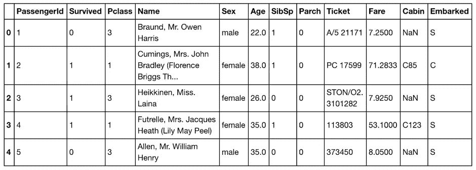

.head() shows the top five rows of a dataframe. The rows you’re seeing are from the [Kaggle Titanic Training Dataset](https://www.kaggle.com/c/titanic/data).

一列接一列，有:数字，数字，数字，单词，单词，数字，数字，数字，字母和数字，数字，字母和数字和 NaNs，字母。类似于强尼的脚趾甲。

让我们将特征(列)分成三个框，数字、分类和不确定。

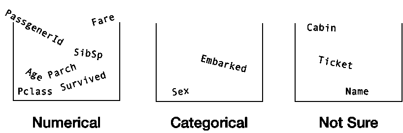

Columns of different information are often referred to as features. When you hear a data scientist talk about different features, they’re probably talking about different columns in a dataframe.

在数字桶中，我们有:`PassengerId`、`Survived`、`Pclass`、`Age`、`SibSp`、`Parch`和`Fare`。

分类桶包含`Sex`和`Embarked`。

而在不确定中我们有`Name`、`Ticket`和`Cabin`。

现在，我们已经将这些列分解到单独的桶中，让我们检查每一个。

## 数字桶

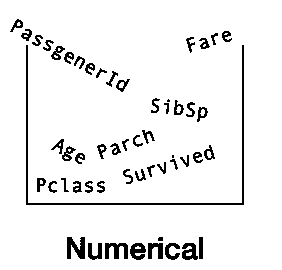

还记得我们的问题吗？

我们能根据其他乘客的数据预测泰坦尼克号上的幸存者吗？

由此，你能找出我们要预测的是哪一列吗？

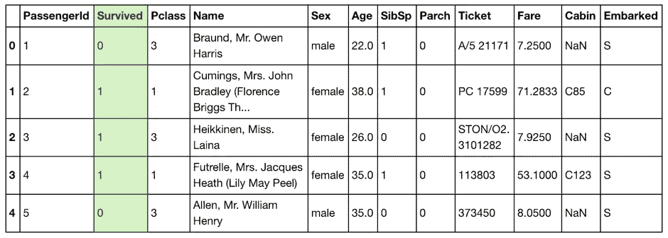

We’re trying to predict the green column using data from the other columns.

`Survived`栏。因为它是我们试图预测的列，我们将把它从数值桶中取出来，暂时不考虑它。

还剩下什么？

`PassengerId`、`Pclass`、`Age`、`SibSp`、`Parch`和`Fare`。

想一想。如果你试图预测泰坦尼克号上是否有人幸存，你认为他们独特的`PassengerId`真的会对你的事业有帮助吗？

大概不会。所以我们暂时也将这个专栏放在一边。EDA 并不总是必须用代码来完成，你可以从你的世界模型开始，然后用代码来看看它是否正确。

`Pclass`、`SibSp`、`Parch`怎么样？

这些都是数字，但它们有所不同。你能捡起来吗？

`Pclass`、`SibSp`和`Parch`到底是什么意思？也许我们应该在这么快建立模型之前多读些文档。

谷歌。Kaggle 泰坦尼克号数据集。

找到了。

`Pclass`是车票等级，1 =一等，2 =二等，3 =三等。`SibSp`是乘客在飞机上的兄弟姐妹的数量。并且`Parch`是某人在船上的父母的数量。

这些信息很容易找到。但是如果你有一个从未见过的数据集呢？如果一个房地产经纪人想要帮助预测他们城市的房价。你查看他们的数据，发现一堆你不理解的栏目。

你给客户发邮件。

`Tnum`是什么意思？

他们回应。`Tnum`是一个物业的卫生间数量。

很高兴知道。

当你处理一个新的数据集时，你并不总是像 Kaggle 提供的那样有关于它的可用信息。这是你想要寻求中小企业知识的地方。

另一个缩写。太好了。

SME 代表**主题专家**。如果您正在从事一个处理房地产数据的项目，EDA 的一部分可能涉及到与房地产经纪人交谈和向他们提问。这不仅可以节省您的时间，还会影响您将来对数据的提问。

既然泰坦尼克号上已经没有人活着了(安息吧，米莉维娜·迪恩，最后的幸存者)，我们将不得不成为我们自己的中小企业。

`Pclass`、`SibSp`和`Parch`还有一些独特之处。尽管它们都是数字，但它们也是类别。

为什么

这样想吧。如果你能在头脑中很容易地将数据组合在一起，那么它就有可能是一个类别的一部分。

`Pclass`列可以标记为第一、第二和第三列，其含义与 1、2 和 3 相同。

还记得机器学习算法有多喜欢数字吗？由于`Pclass`、`SibSp`和`Parch`都已经是数字形式，我们就让它们保持原样。`Age`也是如此。

唷。这并不难。

## 分类桶

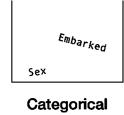

在我们的分类桶中，我们有`Sex`和`Embarked`。

这些是分类变量，因为你可以把女性乘客和男性乘客分开。或者说从 s 出发的人走上 C 的人。

为了训练机器学习模型，我们需要一种将这些转换成数字的方法。

你会怎么做？

还记得`Pclass`吗？第一次= 1，第二次= 2，第三次= 3。

对于`Sex`和`Embarked`，你会怎么做？

也许你可以为`Sex`做些类似的事情。女性= 1，男性= 2。

至于`Embarked`，S = 1，C = 2。

我们可以使用`sklearn`库中的`[.LabelEncoder()](https://scikit-learn.org/stable/modules/generated/sklearn.preprocessing.LabelEncoder.html)`函数来改变这些。

`training.embarked.apply(LabelEncoder().fit_transform)`

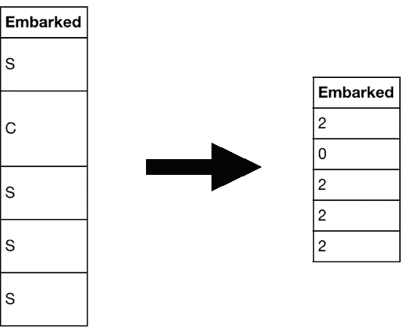

Wait? Why does C = 0 and S = 2 now? Where’s 1? Hint: There’s an extra category, Q, this takes the number 1\. See the [data description page](https://www.kaggle.com/c/titanic/data) on Kaggle for more.

我们在将分类数据转换成所有数字方面取得了一些进展，但是其他列呢？

```
**Challenge:** Now you know Pclass could easily be a categorical variable, how would you turn Age into a categorical variable?
```

## 不确定桶

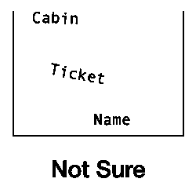

剩下`Name`、`Ticket`、`Cabin`。

如果你在泰坦尼克号上，你认为你的名字会影响你的生还几率吗？

不太可能。但是你还能从一个人的名字中提取出什么信息呢？

如果你给每个人一个数字，根据他们的头衔是先生，夫人还是小姐。？

您可以创建另一个名为 Title 的列。这一栏，先生= 1，太太= 2，小姐的。= 3.

您所做的是在现有特征的基础上创建一个新特征。这被称为**特征工程**。

将标题转换成数字是一个相对容易创建的特性。根据你所拥有的数据，特征工程可以变得任意奢侈。

这个新特性会对模型产生怎样的影响？这是你必须调查的事情。

现在，我们不会担心`Name`列做出预测。

那`Ticket`呢？

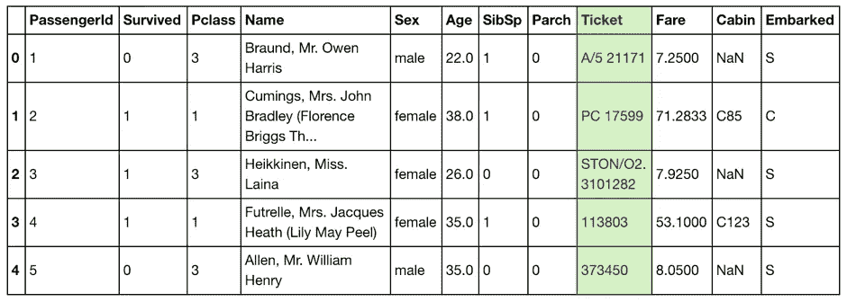

前几个例子看起来根本不太一致。还有什么？

`training.Ticket.head(15)`

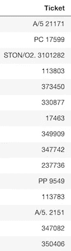

The first 15 entries of the Ticket column.

这些也不是很一致。但是再想想。你认为票号能提供更多关于某人是否幸存的信息吗？

也许如果票号与这个人乘坐的舱位等级有关，它会有影响，但是我们已经在`Pclass`中有了这个信息。

为了节省时间，我们暂时忽略`Ticket`列。

你第一次在数据集上进行 EDA 的目的不仅仅是提出更多关于数据的问题，而是用尽可能少的信息建立一个模型，这样你就有了一个工作的基线。

现在，我们拿小屋怎么办？

你知道，因为我已经看过数据了，我的蜘蛛感官告诉我这是下一部分的完美例子。

```
**Challenge:** I’ve only listed a couple examples of numerical and categorical data here. Are there any other types of data? How do they differ to these?
```

# 数据中缺失了什么，如何处理？

```
missingno.matrix(train, figsize = (30,10))
```

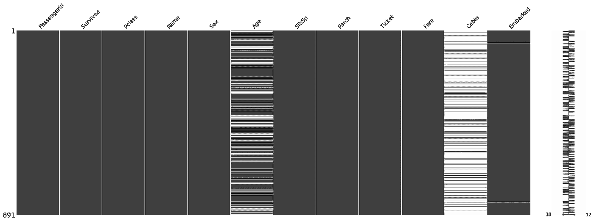

The [missingno library](https://github.com/ResidentMario/missingno) is a great quick way to quickly and visually check for holes in your data, it detects where NaN values (or no values) appear and highlights them. White lines indicate missing values.

`Cabin`栏看起来像约翰尼的鞋子。不在那里。`Age`中也有相当多的缺失值。

在没有数据的情况下，你如何预测呢？

我也不知道。

那么，在处理缺失数据时，我们有什么选择呢？

最快最简单的方法是删除每一行缺少的值。或者完全移除`Cabin`和`Age`柱。

但是这里有一个问题。机器学习模型喜欢更多的数据。删除大量数据可能会降低我们的模型预测乘客是否幸存的能力。

下一步是什么？

输入值。换句话说，用从其他数据计算出的值来填充缺失的数据。

您将如何为`Age`列执行此操作？

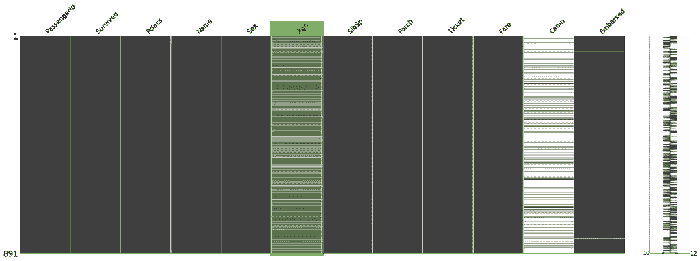

When we called .head() the Age column had no missing values. But when we look at the whole column, there are plenty of holes.

你能用平均年龄来填补缺失值吗？

这种价值填充是有缺点的。假设您总共有 1000 行，其中 500 行缺少值。您决定用平均年龄 36 来填充 500 个缺失的行。

会发生什么？

随着年龄的增长，你的数据变得堆积如山。这将如何影响对 36 岁人群的预测？或者其他年龄？

也许对于每个缺少年龄值的人，您可以在数据集中找到其他相似的人，并使用他们的年龄。但是这很耗时，也有缺点。

还有更高级的方法[来填充本文范围之外的缺失数据。应该注意的是，没有完美的方法来填充缺失值。](/how-to-handle-missing-data-8646b18db0d4)

如果`Age`栏中的缺失值是泄漏的排水管，则`Cabin`栏是破裂的堤坝。无可救药。对于你的第一个模型，`Cabin`是你应该忽略的一个特性。

```
**Challenge:** The Embarked column has a couple of missing values. How would you deal with these? Is the amount low enough to remove them?
```

# 异常值在哪里，为什么您应该关注它们？

“你查过发行情况了吗，”Athon 问。

我用了第一组数据，但没有用第二组数据……”

它击中了我。

就在那里。其余的数据被加工以匹配异常值。

如果您查看数据集中唯一值的出现次数，您会发现最常见的模式之一是[齐夫定律](https://en.wikipedia.org/wiki/Zipf%27s_law)。看起来是这样的。

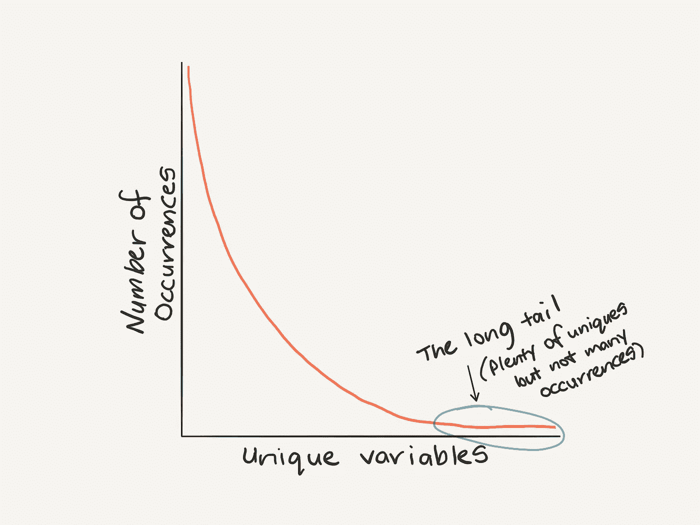

Zipf’s law: The highest occurring variable will have double the number of occurrences of the second highest occurring variable, triple the amount of the third and so on.

记住 Zipf 定律有助于思考异常值(不经常出现的接近尾部末端的值是潜在的异常值)。

对于每个数据集，异常值的定义是不同的。作为一个通用的经验法则，你可以认为任何偏离平均值超过 3 个标准差的数据都是异常值。

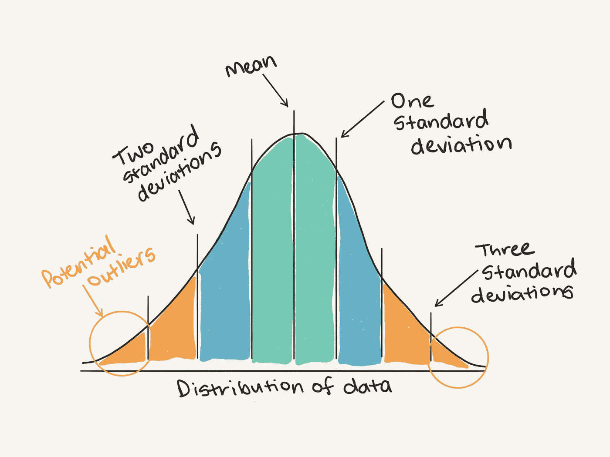

You could use a general rule to consider anything more than three standard deviations away from the mean as an outlier.

或者换个角度。

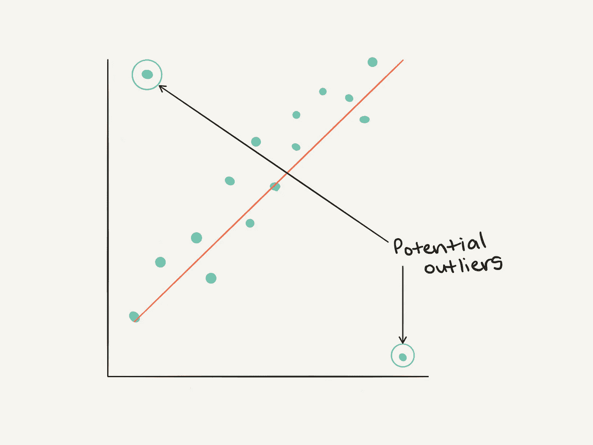

Outliers from the perspective of an (x, y) plot.

如何发现异常值？

分销。分销。分销。分销。四次就够了(我在这里努力提醒自己)。

在您第一次通过 EDA 时，您应该检查每个特性的分布情况。

分布图将有助于表示不同数据值的分布。更重要的是，有助于识别潜在的异常值。

`train.Age.plot.hist()`

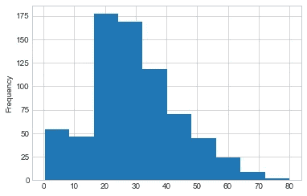

Histogram plot of the Age column in the training dataset. Are there any outliers here? Would you remove any age values or keep them all?

为什么要关心离群值呢？

在数据集中保留异常值可能会导致模型过度拟合(过于精确)。移除所有的异常值可能会导致你的模型过于一般化(它不会在任何异常的情况下做得很好)。和往常一样，最好反复试验，找到处理异常值的最佳方法。

```
**Challenge:** Other than figuring out outliers with the general rule of thumb above, are there any other ways you could identify outliers? If you’re confused about a certain data point, is there someone you could talk to? Hint: the acronym contains the letters M E S.
```

# 利用特征工程从数据中获取更多信息

泰坦尼克号数据集只有 10 个特征。但是如果你的数据集有数百个呢？还是几千？或者更多？这并不罕见。

在您的探索性数据分析过程中，一旦您开始形成一种理解，您对分布有了一个概念，您发现了一些异常值并处理了它们，下一个最大的时间块将花费在特征工程上。

特征工程可以分为三类:**添加、**删除和**更改。**

泰坦尼克号的数据集开始时状态很好。到目前为止，我们只需要改变一些特性就可以实现数值化。

然而，野外的数据是不同的。

假设您正在解决一个问题，试图预测一家大型连锁超市全年香蕉库存需求的变化。

您的数据集包含库存水平和以前采购订单的历史记录。你可以很好地对这些进行建模，但你会发现一年中有几次股票水平发生不合理的变化。通过您的研究，您发现在一年一度的全国庆祝活动“香蕉周”期间，香蕉的库存水平直线下降。这是有道理的。为了跟上庆祝活动，人们买更多的香蕉。

为了补偿香蕉周并帮助模型了解它何时发生，您可以向数据集中添加一个包含香蕉周或不包含香蕉周的列。

```
# We know Week 2 is a banana week so we can set it using np.where()df["Banana Week"] = np.where(df["Week Number"] == 2, 1, 0)
```

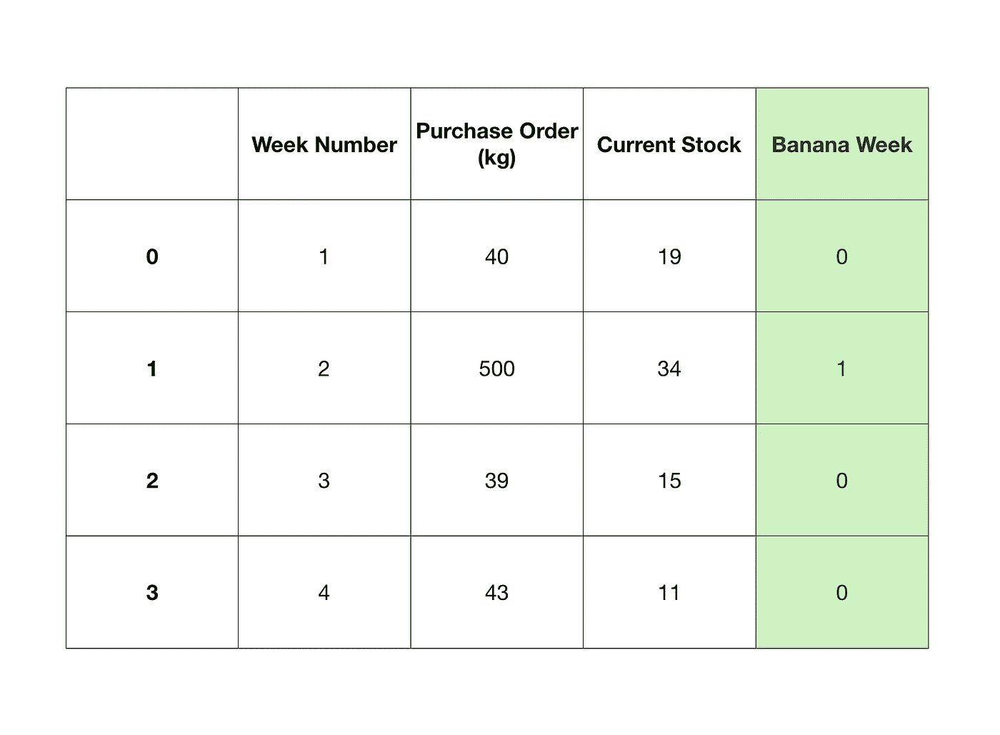

A simple example of adding a binary feature to dictate whether a week was banana week or not.

添加这样的功能可能并不简单。您可能会发现添加要素没有任何作用，因为您添加的信息已经隐藏在数据中。与过去几年一样，香蕉周期间的采购订单已经高于其他周。

移除功能怎么办？

我们在泰坦尼克号数据集上也做到了这一点。我们删除了`Cabin`列，因为在我们运行模型之前，它丢失了太多的值。

但是，如果您已经使用剩下的特性运行了一个模型，该怎么办呢？

这就是**功能贡献**的用武之地。特征贡献是一种计算每个特征对模型影响程度的方法。

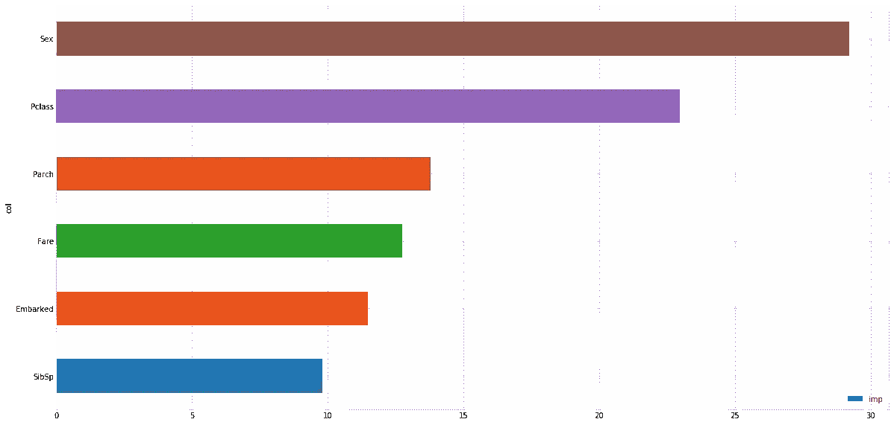

An example of a feature contribution graph using Sex, Pclass, Parch, Fare, Embarked and SibSp features to predict who would survive on the Titanic. If you’ve seen the movie, why does this graph make sense? If you haven’t, think about it anyway. Hint: ‘Save the women and children!’

为什么这些信息会有帮助？

知道一个特征对模型的贡献有多大可以给你指明下一步特征工程的方向。

在我们的泰坦尼克号例子中，我们可以看到`Sex`和`Pclass`的贡献是最高的。你认为这是为什么？

如果你有 10 个以上的功能会怎样？100 怎么样？你也可以做同样的事情。制作一个图表，显示 100 个不同特征的特征贡献。

“哦，我以前见过这个，”

齐夫定律又回来了。顶部特征比底部特征的贡献大得多。

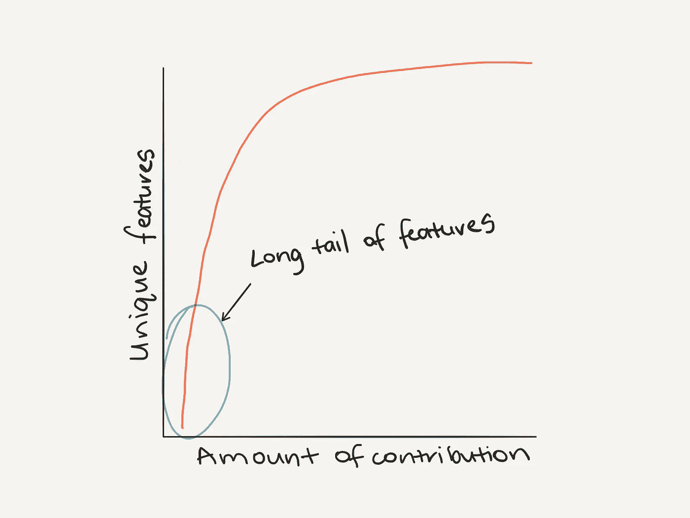

Zipf’s law at play with different features and their contribution to a model.

看到这一点，您可能会决定削减贡献较小的功能，改进贡献较大的功能。

你为什么要这么做？

移除要素会降低数据的维度。这意味着您的模型需要进行更少的连接来找出拟合数据的最佳方式。

您可能会发现移除要素意味着您的模型可以在更少的数据和更少的时间内获得相同(或更好)的结果。

就像 Johnny 是我所在咖啡馆的常客一样，特征工程是每个数据科学项目的常规部分。

```
**Challenge:** What are other methods of feature engineering? Can you combine two features? What are the benefits of this?
```

# 构建您的第一个模型

最后。我们已经完成了一系列步骤，为运行一些模型准备好数据。

如果你和我一样，当你开始学习数据科学时，这是你最先学习的部分。上面所有的东西都已经被别人做过了。你所要做的就是在上面放一个模型。

我们的泰坦尼克号数据集很小。因此，我们可以在它上面运行大量的模型，以找出哪一个是最好的。

注意我是怎么在副标题里放一个(s)的，你可以注意这一个。

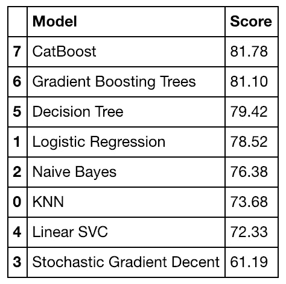

Cross-validation accuracy scores from a number of different models I tried using to predict whether a passenger would survive or not.

在我们的小型 Titanic 数据集上运行多个模型是没问题的。但是对于较大的数据集可能不是最好的。

一旦你对不同的数据集进行了一些实践，你就会开始发现什么样的模型通常效果最好。例如，大多数最近的 Kaggle 比赛都是通过不同梯度提升树算法的集合(组合)赢得的。

一旦你建立了几个模型并找出了最好的，你就可以开始通过**超参数调整**来优化最好的一个。把超参数调谐想象成在烹饪你最喜欢的菜肴时调节烤箱上的转盘。开箱后，烤箱上的预设设置工作得很好，但根据经验，你会发现降低温度和提高风扇速度会带来更美味的结果。

机器学习算法也是一样。他们中的许多人开箱即用。但是只要稍微调整一下它们的参数，它们就能工作得更好。

但无论如何，如果没有足够的数据准备，即使是最好的机器学习算法也不会产生一个伟大的模型。

EDA 和建模是一个重复的循环。

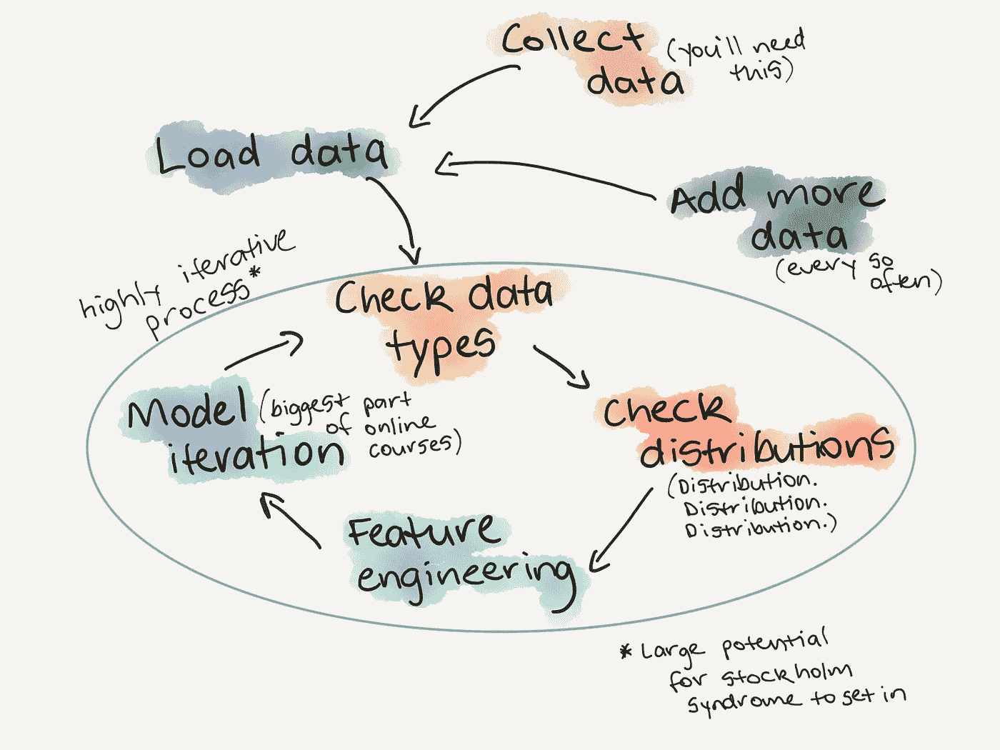

The EDA circle of life.

# 最后的挑战(和一些课外活动)

我离开了咖啡馆。我的屁股很痛。

在这篇文章的开始，我说过我会保持简短。你知道结果如何。它将与您的 EDA 迭代相同。当你认为你完成了。还有更多。

我们以 Titanic Kaggle 数据集为例，介绍了一个不完整的 ed a 清单。

## 1.你想解决什么问题(或者证明什么问题是错的)？

从最简单的假设开始。根据需要增加复杂性。

## 2.你有什么样的数据？

你的数据是数字的，分类的还是其他的？你如何处理每一种？

## 3.数据中缺失了什么，你如何处理？

为什么数据丢失了？丢失数据本身就是一个信号。你永远无法用和原来一样好的东西来代替它，但是你可以试试。

## 4.离群值在哪里，为什么要关注它们？

分销。分销。分销。总结三遍就够了。数据中的异常值在哪里？你需要它们吗？还是它们正在破坏你的模型？

## 5.如何添加、更改或删除功能以充分利用您的数据？

默认的经验法则是数据越多越好。遵循这一点通常会很有效。但是有什么东西你可以去掉得到同样的结果吗？从简单开始。少而精。

GitHub 上的[笔记本中有我们在这里讨论的所有内容的例子(以及更多)，YouTube 上有我一步一步浏览笔记本的视频(编码从 5:05 开始)。](http://bit.ly/yourfirstkagglesubmission)

```
**FINAL BOSS CHALLENGE:** If you’ve never entered a Kaggle competition before, and want to practice EDA, now’s your chance. Take the [notebook I’ve created](http://bit.ly/yourfirstkagglesubmission), rewrite it from top to bottom and improve on my result.**Extra-curriculum bonus:** [Daniel Formoso's notebook](https://github.com/dformoso/sklearn-classification/blob/master/Data%20Science%20Workbook%20-%20Census%20Income%20Dataset.ipynb) is one of the best resources you’ll find for an extensive look at EDA on a Census Income Dataset. After you’ve completed the Titanic EDA, this is a great next step to check out.
```

如果你认为这篇文章遗漏了什么，请在下面留言或者[给我发个短信](mailto:daniel@mrdbourke.com)。

不然你可以在 [Twitter](http://twitter.com/mrdbourke) 、 [LinkedIn](http://linkedin.com/in/mrdbourke) 和 [YouTube](http://bit.ly/DanielBourkeOnYouTube) 上找我。