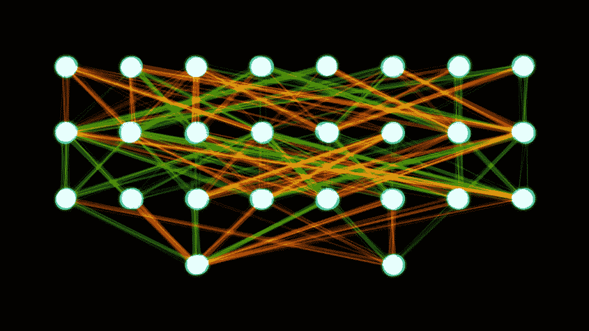
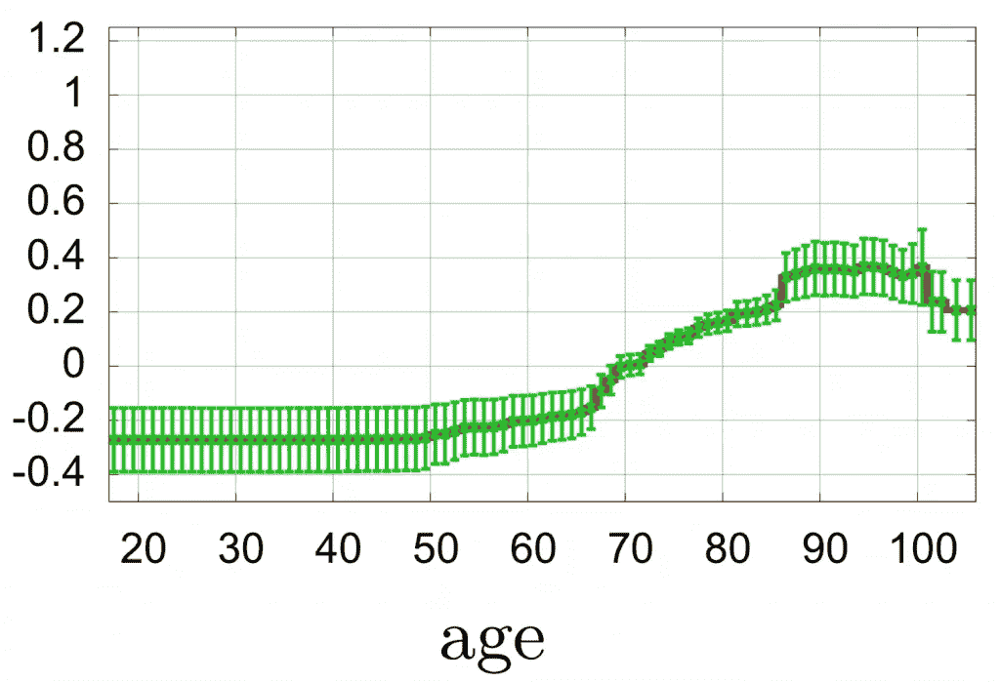
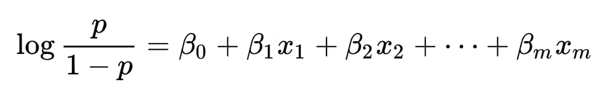
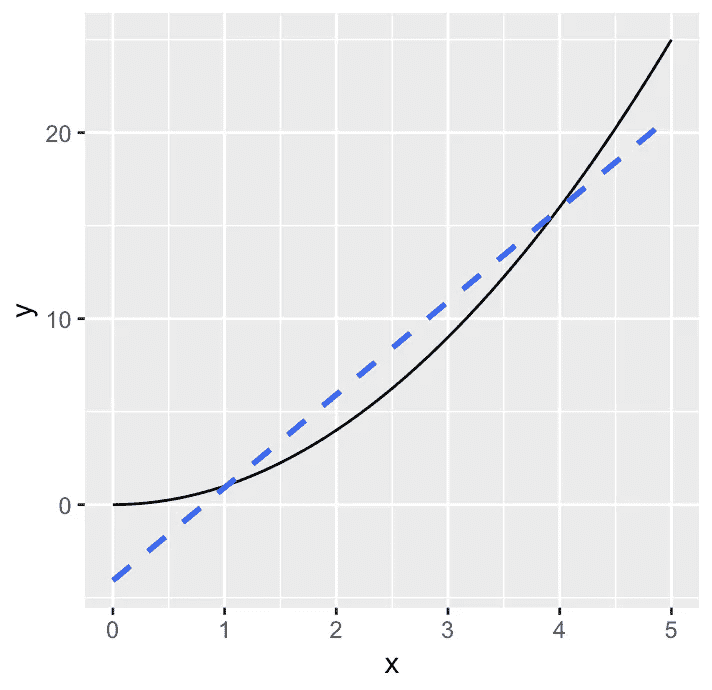
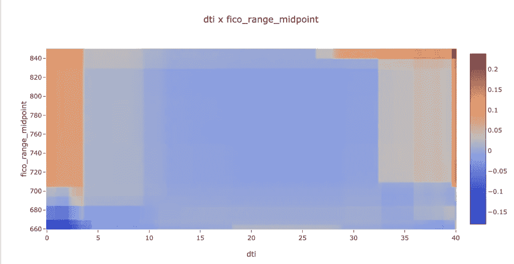
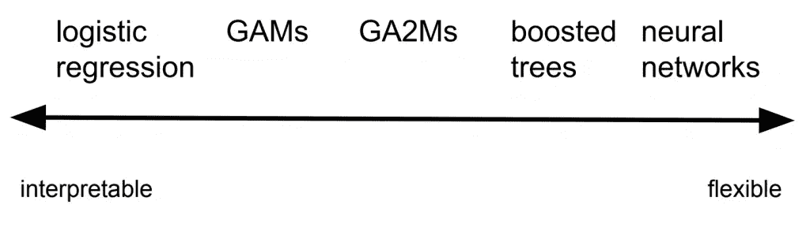

# GA2Ms 的温和介绍，白盒模型

> 原文：<https://towardsdatascience.com/a-gentle-introduction-to-ga2ms-a-white-box-model-d05d13c6ca00?source=collection_archive---------24----------------------->

这篇文章温和地介绍了一个叫做 GA2M 的白盒机器学习模型。

我们将走过:

*   什么是白盒模型，您为什么想要白盒模型？
*   一个经典的白盒模型:逻辑回归
*   什么是 GAM，你为什么想要 GAM？
*   GA2M 是什么，您为什么想要它？
*   什么时候应该选择 GAM，GA2M，还是别的？

所有这些机器学习模型的目的是对人类指定的目标做出预测。想一个模型，可以预测贷款违约，或在照片中出现某人的脸。

简而言之:广义加性模型(GAM)是一个白盒模型，比逻辑回归更灵活，但仍然可以解释。GA2M 是一个带有交互项的 GAM，这使得它更加灵活，但是解释更加复杂。gam 和 GA2Ms 是工具箱中一个有趣的附加物，以不适合每种数据为代价进行解释。一张图:

关于这一切意味着什么的更多信息，请继续阅读。

# 白盒模型

术语“[白盒](https://en.wikipedia.org/wiki/White_box_%28software_engineering%29)来自软件工程。它意味着你可以看到软件的内部结构，相比之下，它是一个“黑匣子”,你不能看到它的内部结构。根据这个定义，如果你能看到权重([图片来源](https://commons.wikimedia.org/wiki/File:Two-layer_feedforward_artificial_neural_network.png))，一个[神经网络](https://en.wikipedia.org/wiki/Artificial_neural_network)可以是一个白盒模型:

然而，人们所说的“白盒”实际上是指他们能够理解的东西。**白盒模型是一种人们可以看到其内部并对其进行推理的模型**。这是主观的，但大多数人会同意上面显示的权重没有给我们提供关于模型如何工作的信息，因为我们可以有效地描述它，或预测模型在未来会做什么。

将上面的图片与这张关于肺炎死亡风险的图片进行比较[1]:

这不是一个完整的模型。相反，它是一个特征(年龄)对风险分值的影响。绿线为误差线(100 轮[装袋](https://en.wikipedia.org/wiki/Bootstrap_aggregating)中的 1 个标准差)。它们中间的红线是最好的估计。在论文中，他们观察到:

1.  直到 50 岁左右，风险评分一直持平。这里的风险评分为负，意味着死亡风险低于数据集中的平均值。
2.  风险评分在 65 分急剧上升。这可能是因为退休。将来，收集关于退休的数据可能会很有趣。
3.  误差线在 66-85 岁之间最窄。也许这是数据最多的地方。
4.  风险评分再次上升至 85。误差线也再次变宽。也许这一跳不是真的。
5.  风险分值降至 100 以上。这可能是因为缺乏数据，或者其他原因。在论文中，他们提出，人们可能希望“修复”模型的这一区域，通过改变它来预测 85-100 岁的水平，而不是下降。这个修正是使用领域知识(“85 岁以后肺炎的风险可能不会下降”)来解决可能的模型工件。
6.  66 到 85 之间的风险得分相对较低。

所有这些都来自一个模型特征的一个图表。有一些事实，比如图表的形状，以及对图表为什么会那样的推测。这些事实有助于理解这些数据。这种推测无法通过任何工具来回答，但可能有助于建议进一步的行动，如收集新的特征(比如退休)或新的实例(比如年龄低于 50 岁或高于 100 岁的点)，或新的分析(比如仔细查看年龄在 85-86 岁左右的数据实例以找出差异)。

这些并不是模型会做的模拟。这些是模型本身的内部因素，所以图表准确地描述了年龄对风险评分的确切影响。这个模型还有 55 个其他组件，但是每个组件都可以被检查和推理。

这就是白盒模型的力量。

这个例子也说明了危险。通过看到一切，我们可能认为我们理解了一切，并胡乱猜测或不恰当地“修复”。一如既往，我们必须运用判断力来正确使用数据。

总之:制作一个白盒模型来

*   **了解你的模型**，不是从模拟或近似，而是实际的内部
*   **改善你的模型**，给你方向追求的想法
*   **“修复”你的模型**，即，让它与你的直觉或领域知识保持一致

最后一种可能性:法规规定您需要完整地描述您的模型。在这种情况下，有人类可读的内部参考可能是有用的。

以下是一些白盒和黑盒模型的示例:

白盒模型

*   逻辑回归
*   GAMs
*   GA2Ms
*   决策树(短树和少树)

黑盒模型

*   神经网络(包括深度学习)
*   助推树木和随机森林(许多树木)
*   支持向量机

现在，我们来看三种特定的白盒模型。

# 经典:逻辑回归

[逻辑回归](https://en.wikipedia.org/wiki/Logistic_regression#History)发展于 19 世纪初，20 世纪初重新普及。它已经存在很长时间了，原因有很多。它解决了一个常见的问题(预测事件的概率)，并且是可解释的。让我们探索一下这意味着什么。下面是定义该模型的逻辑方程式:

在这个模型方程中有三种类型的变量:

*   p 是我们预测的事件的概率。例如，拖欠贷款
*   x 是特征。例如，贷款金额。
*   𝛽's(贝塔)是我们用计算机拟合的系数。

betas 适合整个数据集一次。对于数据集中的每个实例，x 是不同的。p 表示数据集行为的集合:任何数据集实例要么发生了(1)，要么没有发生(0)，但是在集合中，我们希望右侧和左侧尽可能接近。

“log(p/(1-p))”是对数几率，也称为“概率的 logit”。几率是(事件发生的概率)/(事件不会发生的概率)，或者 p/(1-p)。然后，我们应用自然对数将取值范围为 0 到 1 的 p 转换为适用于线性模型的范围从-∞到+∞的量。

这个模型是线性的，但是对于对数概率来说。也就是说，右边是一个线性方程，但它适合于对数赔率，而不是事件的概率。

该模型可解释如下:**在𝛽i，xi 的单位增长是对数优势增长**。

例如，假设我们正在预测贷款违约的概率，我们的模型有一个贷款金额特征 x1 的特征系数𝛽1=0.15。这意味着在默认情况下，该特征的单位增加对应于 0.15 的对数赔率增加。我们可以取自然指数得到比值比，exp(0.15)=1.1618。这意味着:

*在这个模型中，在其他因素不变的情况下，贷款金额每增加一个单位(比如说 1000 美元),贷款违约的几率就会增加 16%。*

当人们说逻辑回归是可解释的时，这种说法就是他们的意思。

总结一下为什么逻辑回归是一个白盒模型:

*   输入响应项(𝛽i*xi 项)可以相互独立地解释
*   术语以可解释的单位表示:系数(β)以对数概率为单位。

那么，除了友好、古老的逻辑回归模型，我们为什么还要使用其他模型呢？

嗯，如果特征和对数概率没有线性关系，这个模型就不太适合。我总是想尝试用一条线来拟合一条抛物线:

No line fits a curve.

如果你有非线性数据(黑色抛物线)，线性拟合(蓝色虚线)永远不会很好。没有一条线符合这条曲线。

# 广义可加模型

[广义加性模型](https://en.wikipedia.org/wiki/Generalized_additive_model) (GAMs)由 Hastie 和 Tibshirani 于 20 世纪 90 年代开发。(参见他们的书第九章“[统计学习的要素](https://web.stanford.edu/~hastie/ElemStatLearn/)”。)下面是定义该模型的等式:

这个方程非常类似于逻辑回归。它具有相同的三种类型的元素:

*   E(Y)是数据集行为的集合，就像上面等式中的“p”。其实很可能是一个事件的概率，同 p。
*   g(。)是一个链接函数，就像上面的逻辑方程式中的 logit(或 log odds)。
*   fi(xi)是每个数据集实例特征 x1，…，xm 的术语。

最大的不同是，现在我们有一个函数 fi(xi ),而不是一个特征的线性项𝛽i*xi。在他们的书中，Hastie 和 Tibshirani 指定了一个像三次[样条](https://en.wikipedia.org/wiki/Spline_(mathematics))一样的“平滑”函数。Lou 等人[2]研究了 fi 的其他功能，他们称之为“形状功能”

GAM 还具有白盒特性:

*   输入响应项(f(xi)项)可以相互独立地解释
*   这些术语是以可解释的单位表示的。对于 logit 链接函数，这些是对数概率。

现在，一个项，而不是一个常数(β)，是一个函数，所以不是用数字来报告对数几率，我们用一个图表来形象化它。事实上，上图中按年龄划分的肺炎死亡风险是 GAM 中的一项(形状函数)。

那我们为什么要用 GAM 以外的东西呢？它已经是灵活的和可解释的了。和之前一样的原因:可能不够准确。特别是，我们已经假设每个特征响应可以用它自己的函数建模，与其他的无关。

但是如果特征之间有交互作用呢？一些黑盒模型(提升树、神经网络)可以对交互项进行建模。让我们通过一个白盒模型来看看:GA2Ms。

# 具有交互条款的 gam(GA2Ms)

Lou 等人在 2013 年对 GA2Ms 进行了研究[3]。作者用字母“gee ay two em”来发音，但在室内我们称它们为“互动游戏”，因为它更容易发音。下面是模型方程:

这个方程与上一节的 GAM 方程非常相似，只是它增加了可以同时考虑两个特征变量的函数，即相互作用项。

微软刚刚发布了一个用 python 实现 GA 2Ms 的库 [InterpretML](https://github.com/microsoft/interpret) 。在图书馆里，他们称之为“可解释的助推机器”

Lou 等人说，这些仍然是白盒模型，因为相互作用项的“形状函数”是热图。这两个特征是沿 X 和 Y 轴的，中间的颜色表示函数响应。下面是一个来自微软图书馆的例子，适合预测[的贷款违约，这个数据集来自 lending club](https://github.com/fiddler-labs/p2p-lending-data/) 的贷款表现:

对于此示例图:

*   右上角是最红的。这意味着，当 dti(债务收入比)和 FICO _ range _ midpoint(FICO 信用评分)都很高时，违约概率上升最多。
*   左边的条纹也是红色的，但在底部附近变成蓝色。这意味着非常低的 dti 通常是不好的，除非 fico_range_midpoint 也很低。

这个特殊的热图很难解释。这可能只是没有单一特征项的交互作用效应。因此，在高 dti 和高 fico 的情况下，整体违约概率可能并不更高，而只是高于他们自己预测的任何一种主要影响。为了进一步研究，我们可以看看边界附近的一些例子。但是，对于这篇博文，我们将跳过深潜。

在实践中，这个库适合所有的单特征函数，然后是 N 个交互项，其中你选择 N 个。选择 N 个并不容易。如果交互项增加了足够的准确性，值得花额外的复杂性盯着热图来解释它们，那么交互项是值得的。这是根据你的业务情况做出的判断。

# 什么时候应该用 GAMs 或者 GA2Ms？

要执行机器学习，首先[挑选一个目标](https://blog.fiddler.ai/2019/05/humans-choose-ai-does-not/)。然后选择一种最能利用您的数据来实现目标的技术。有成千上万本书和数百万篇论文是关于那个主题的。但是，考虑 GA2Ms 如何适应可能的模型技术，这里有一个大大简化的方法:它们在从可解释性到建模特性交互的范围内。

*   如果游戏足够精确，就使用游戏。它给出了白盒模型的优点:带有可解释单元的可分离项。
*   如果 GA2Ms 明显比 gam 更准确，就使用 GA2Ms，特别是如果您从您的领域知识中相信存在真实的功能交互，但它们并不太复杂。这也给出了白盒模型的优势，用更多的精力去解读。
*   如果您不太了解数据，可以尝试 boosted trees (xgboost 或 lightgbm ),因为它对数据中的异常非常健壮。这些是黑盒模型。
*   当特征彼此高度交互时，比如图像中的像素或音频中的上下文，你可能很需要神经网络或其他可以捕捉复杂交互的东西。这些都是深深的黑匣子。

在所有情况下，您可能都需要特定领域的数据预处理，比如对图像求平方，或者标准化特征(减去平均值并除以标准偏差)。那是另一天的话题。

现在希望我们开始的图表更有意义。

在 [Fiddler Labs](http://fiddler.ai) ，我们帮助你解释你的人工智能。请发邮件至 [info@fiddler.ai](mailto:info@fiddler.ai) 联系我们。

# 参考

1.  卡鲁阿纳、里奇、尹露、约翰内斯·盖尔克、保罗·科赫、马克·斯特姆和小糯米·艾尔哈达德。"医疗保健的可理解模型:预测肺炎风险和住院 30 天再入院."第 21 届 ACM SIGKDD 知识发现和数据挖掘国际会议论文集，1721–1730。KDD 15 年的。美国纽约州纽约市:美国计算机学会，2015 年。【https://doi.org/10.1145/2783258.2788613】T4。
2.  卢、尹、里奇·卡鲁阿纳和约翰内斯·戈尔克。"可理解的分类和回归模型."第 18 届 ACM SIGKDD 知识发现和数据挖掘国际会议论文集，150–158。12 年的 KDD。美国纽约州纽约市:美国计算机学会，2012 年。[https://doi.org/10.1145/2339530.2339556](https://doi.org/10.1145/2339530.2339556)。
3.  娄、尹、里奇·卡鲁阿纳、贾尔斯·胡克和约翰内斯·戈尔克。具有成对交互的精确可理解模型，2017。[https://www . Microsoft . com/en-us/research/publication/accurate-understand-models-pairwise-interactions/](https://www.microsoft.com/en-us/research/publication/accurate-intelligible-models-pairwise-interactions/)。

*原载于 2019 年 6 月 3 日*[*https://blog . fiddler . ai*](https://blog.fiddler.ai/2019/06/a-gentle-introduction-to-ga2ms-a-white-box-model/)*。*