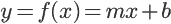

# 通过线性回归对梯度下降的温和介绍

> 原文：<https://towardsdatascience.com/a-gentle-introduction-to-gradient-descent-thru-linear-regression-fb0fc86482a3?source=collection_archive---------26----------------------->


Génesis | © Sebastião Salgado

为了对我们周围的现实的错综复杂的本质有所了解，为了理解事件或主题之间的潜在关系，或者甚至为了评估特定现象对任意事件的影响，我们必须将现实旋绕到信息维度中，试图利用我们人类的抽象来以某种方式把握我们周围实际事物的本质。

在本文中，我们将简要分析一个简单的统计工具，该工具允许我们根据一组**观察值、**评估我们如何利用一组**变量**来适当地生成一个模型，该模型将通过推断变量关系和相互影响来预测或预报行为。这个统计工具叫做**线性回归**。

为了帮助最小化与预测模型相关的误差，优化它以更好地代表现实，我们还将简要展示**梯度下降**优化算法的简单应用。

本文假设只有基本的代数和微积分知识，因为这两个主题都很简单，但却代表了现代统计学和机器学习的两个基础学科。

# 方案

让我们考虑一个简单的例子，从 StackOverflow 的[“2018 年开发者工资”](https://stackoverflow.blog/2018/09/05/developer-salaries-in-2018-updating-the-stack-overflow-salary-calculator/)文章中抽取一些值。下面我们可以看到一个代表平均工资点的小数字，以及随着开发人员经验的增加，德国的平均工资点是如何变化的:


Figure 1) Median yearly salaries for developers, in thousands of euros, by experience in Germany (2018)

基于上述数据点，我们希望开发一个简单的模型函数，使我们能够预测在任何给定的经验时间点工资如何演变。

## 线性回归

然后，线性函数可以由简单的表达式定义:



常数 *m* 代表函数线的斜率，常数 *b* 通常称为截距。下面的一些例子展示了 *(m，b)* 的不同值:


Figure 2) Three examples of slopes and intercepts for a linear function

在上面的例子中，我们可以看到，改变 *m* 会影响结果值的斜率，也会影响截距 *b* ，它会在穿过 *x = 0* 时修改函数值。

在我们当前的方案中，由于工资的变化实际上并不是由线性级数表示的，然而，查看图 1 中的数据形状，通过*在积分级数中拟合一条线*来近似预测的最终工资是可以接受的，其方式为:


最后，我们的模型将试图通过某种方式调整 *m* 和 *b* ，将自己表示为逼近我们的参数**薪水**和**经验**的演变的线，例如，它将允许我们获得类似如下的结果:


Figure 3) Possible linear model used to predict the median salaries

对于代表我们参数之间关系的基本模型的“线性”表示，我们可以称之为**线性回归**。

## 我们错误的代价

既然我们已经确定了我们将使用什么形状来生成我们的模型，那么我们必须试着弄清楚***【m，b】***的值是什么，它们将更好地描述我们的数据预测模型的发展。

但是我们如何选择 m 和 b 的值来生成我们要寻找的线呢？一种方法是计算我们的模型生成的值和我们现有的实际数据之间的误差。

仅用于表示目的的简单方法可以是:

*   我们知道，一个拥有大约**10 年左右经验*的开发人员挣得大约*****72K**欧元的年薪* (1)*****
*   ***从示例斜率和截距 *(m，b) = (3，35)* 开始***

***一个样本误差函数，对于这个 10 年经验的特定数据点 *(x=10)* ，我们的误差 **E** 为:***

******

***对于我们现有的所有样本数据点，我们可以计算误差，该误差考虑了我们的预测和真实值之间的所有误差之和，从而得到如下函数:***

******

***使用:***

*   ******n*** 是我们数据集的总样本***
*   ******y*** 为具体观察的实际薪资值***
*   ******x*** 是我们要为 ***y*** 预测的经验年数***

***对于每个观察值与其组均值之间的平方差之和，这将代表我们的**误差函数**(或**成本函数**，我们将每个观察值与其组均值之间的平方差之和*命名为* : **平方差之和(SSE)。在统计学中，这个均方差对于评估我们的预测值相对于真实观测值的“质量”非常有用。*****

***但是我们如何继续寻找 m 和 b 的合适值呢？一种直观的方法可能是，因为我们现在能够计算一个**误差函数**，找到最小化该函数的一对 *(m，b)* 。如果是这样的话，我们就可以清楚地表明，我们的预测产生的误差最小，因此更接近现实。***

***然后，让我们为 *(m，b)* 选择两个随机值，计算成本函数，然后改变这些值，以试图找到我们的误差函数的最小值。让我们首先考虑(m，b) = (3，0)，我们的数据点来自图 1，我们得到下面的图形结果:***

******

***Figure 4) Initial prediction and errors for (m, b) = (3, 0)***

***从上图我们可以看出:***

*   ***绿点代表我们的**工资观察数据值*****
*   ***蓝线是我们的**预测模型** ( *y = 3 *年经验+ 0* )***
*   ***红色虚线表示当前参数 *(m，b)* 的**错误*****

***对于这组特定的截距和斜率，现在让我们计算现有观测值的累积成本:***

************

***现在让我们将斜率值固定为 3，但是将截距增加到 20， *(m，b) = (3，20)* 。我们将获得以下表示:***

******

***Figure 5) Prediction iteration 1, and errors for (m, b) = (3, 20)***

***与 ***相关的成本 E = 232.5*** 。我们可以清楚地看到，通过更新我们的截距，我们已经改善了我们的预测，因为误差大幅下降。现在让我们针对不同的截距值绘制多种场景:***

******

***Figure 6) Computing the errors by varying the value of the intercept***

***从上图可以看出，随着截距值 *b* 的增加，我们还可以观察到成本函数的变化。在这个具体的例子中，用 *(m，b) = (3，30)* 确定粉红色线是我们观察值的更准确预测，因为它也具有更低的成本值。***

***通过绘制通过改变*截距*值获得的误差成本函数的变化，我们得到了下图:***

******

***Figure 7) Evolution of the cost function when changing the intercept value***

***我们可以清楚地看到，当改变 *b* 的值时，考虑到我们的误差函数是凸的，我们能够找到一个局部最小值，它将代表我们的预测模型的最小误差。在上面这个简单的演示中，可以清楚地说明使我们的误差最小的截距 *b* 在【30，40】之间。不幸的是，用预先定义的步骤简单地迭代，以找到这个最小值是非常昂贵和耗时的。***

***但是我们怎样才能更巧妙的计算出我们的成本函数的最小值呢？然后我们将使用**梯度下降**算法。***

## ***梯度下降***

***梯度下降是一种迭代优化算法，允许我们找到特定函数的局部最小值。***

***解释这种算法背后的逻辑的一个很好的例子，也是文献中反复出现的，是**盲人登山家**的例子。让我们想象一下，一个盲人登山运动员想用最少的步骤爬到山顶:***

******

***Figure 9) Sequence of steps a smart blind alpinist would take to climb a mountain***

***由于登山运动员是盲人，他将评估他当前位置的倾向，以便选择他下一步应该采取的幅度:***

*   ***如果他当前位置的山(坡)的倾斜度很高，他可以安全地迈出一大步*(例如我们可以注意到从第一步到第二步的过渡)****
*   ***当坡度越来越小时，当他到达山顶时，他知道他需要迈更小的步子，以便接近精确的最高点(*当登山运动员越来越接近山顶时，从第 6 步到第 7 步，他更加小心如何增加他的位置)****
*   ***对于正坡，他需要继续向上到达顶部***
*   ***对于负斜率，他正在下降，所以他需要回到顶部***

***给定点处“山”的斜率则由该函数在特定点处的导数给出:***

******

***Figure 10) Slope of the function at a given point***

***因此，通过计算我们的“山函数”在某一点的导数，我们就可以推断出为了适当地达到我们的局部最小值，我们将需要的步骤的性质。通过达到接近 0 的斜率(顶部的黄色斜率，与山起点的蓝色斜率值相比)。***

***通过将登山挑战从到达山顶切换到实际到达谷底，理解对于该函数的凸形版本同样有效也是微不足道的:***

******

***Figure 11) Iterative finding of our local minimum for a convex function (or a valley in this alpine example)***

***回到我们的研究案例，考虑到我们想要正确估计使成本最小化的斜率和截距的值，我们可以使用这个概念来最小化凸函数，它实际上是我们的成本函数。***

***为了简单起见，让我们首先通过保持斜率固定在 *m = 3* 来预测截距的实际值。我们的成本函数是:***

******

***现在我们知道了这条曲线的方程，我们可以对它求导，并确定它在*截距*的任意值处的斜率。***

***现在让我们使用链式法则，根据截距计算成本函数的导数:***

******

***现在我们已经正确地计算了导数，我们现在可以使用梯度下降来寻找我们的成本函数在哪里有它的局部最小值。***

***通过找到导数(斜率)为 ***dE(b)/db = 0*** 的位置来计算这个特定的最小值确实是微不足道的。然而，这在许多计算问题中是不可能的。因此，我们将应用梯度下降，从最初的猜测开始，了解这个最小值的性质。当我们无法计算导数时，这种多功能性实际上使得这种优化算法在许多情况下如此有用，例如现代机器学习问题。***

## ***学习正确的价值观***

***现在我们有了导数函数，让我们首先计算截距 ***b*** 的随机值的斜率，例如:***

******

***由此我们知道，当截距为 0 时，在我们的成本函数上，该点切线的斜率为 **-69** 。一旦我们接近函数的最小值，这个斜率也将接近 0。***

***从我们在阿尔卑斯山的例子中，我们明白了我们应该采取的步骤的大小应该在某种程度上与给定点的斜率有关。这具有**的目标，即当斜率较高且我们远离最小值时给出“较大”的步长，而当我们越来越接近零斜率时给出“较小”的步长**。***

***当我们迭代地进行这个过程时，只需要我们采用上面描述的具有实际所需步长的图像，并在每次迭代中调整它们。我们将使用这个常数来实际调整步长，我们称之为**学习速率**。考虑到这一点，我们可以定义以下表达式，以在每次迭代中生成和调整我们的步长:***

******

***假设**学习率**为 0.2，我们将获得以下步长:***

******

***考虑到我们的新步长，我们可以安全地将下一次迭代*截距*计算为实际步长:***

******

***因此，对于我们的第一次迭代，我们有:***

******

***对于这个新的截距值，我们可以看到误差函数的斜率由下式给出:***

******

***随着斜率越来越接近 0，我们就可以理解，仅仅通过进行第一次迭代，我们实际上就越来越接近最佳值。通过重新查看图 6，我们确实可以推断，通过将截距从 0 增加到更大的值，我们确实可以减少估计值和实际观测值之间的残余误差。***

***通过几次迭代，我们得到:***

```
*****Step Size(2)** = -41.4 * 0.2 = -8.28
**b(2)** = 13.8 - (-8.28) = 22.08
**dE(22.08)/db** = -24.8**Step Size(3)** = -24.8 * 0.2 = -4.96
**b(3)** = 22.08 - (-4.96) = 27.04
**dE(27.04)/db** = -14.8**Step Size(4)** = -14.8 * 0.2 = -2.96
**b(4)/db** = 27.04 - (-2.96)= 30
**dE(30)/db** = -9***
```

***我们可以从这 3 次迭代中验证以下内容:***

*   ***每走一步，我们都在接近一个更小的绝对斜率***
*   ***当我们接近 0°斜率时，我们通过保持相同的学习速率来做更小的步骤***

***从视觉上我们可以看到，每一次迭代，我们都离数据集的预测线越来越近，实际上步长越来越小:***

******

***Figure 13) Applying the iteration values from the gradient descent for the intercept***

***为了适当地停止迭代，对于某个可接受的值，应该:***

*   ***决定每次迭代的最小步长，例如，如果步长小于 0.001，则停止***
*   ***当我们达到一定的迭代次数时停止***

***通过应用这些规则，我们可以验证算法在几次迭代后停止:***

```
*****[+] Iteration 5:****Step Size** = -0.592
**b =** 30.592
**dE/db** = -7.8160000000000025**[+] Iteration 6:****Step Size** = -0.1184
**b = ** 30.7104
**dE/db** = -7.579200000000007*(...)***[+] Iteration 9:****Step Size** = -0.0009472000000000001
**b =** 30.7397632
**dE/db** = -7.5204736000000025***
```

***以截距 ***b = 30.7397632*** 稳定。当绘制时，我们得到:***

******

***Figure 14) Using the stabilized predicted value given for a fixed slope to our intercept***

***通过这种方法，我们可以验证，通过渐进迭代(以基于学习洞穴的适应步长的速度)，我们确实可以接近误差成本函数的最小化，如所绘制的，获得进化的非常接近的模型表示。这是通过简单地预测一个参数，截距来实现的。在接下来的部分，我们将试图理解这两个变量的模型的演变。***

## ***进入新的维度***

***既然我们已经了解了如何为我们的模型估计截距值，现在让我们向一维之外移动一步，并将梯度下降应用于**截距**和**斜率**。***

***首先，如前一节所述，我们将使用链式法则，根据**截距**，计算成本函数的导数:***

******

***现在，我们可以根据斜率继续寻找误差函数的偏导数:***

******

***对于偏导数的集合，对于这个函数的所有维度，我们称之为**梯度:*****

******

***然后，我们将使用这个梯度，如在前面的部分，然后找到我们的误差函数的局部最小值。这就是称这个算法为**梯度下降**的原因。***

***为了做到这一点，我们需要推断我们在上一节中为 intersect 所做的事情，以实际预测这两个值，并调整它们自己的相互依赖性。就这样暴露出来:***

*   ***当我们现在接近两个变量时，这个问题可能再次类似于爬山，但是具有额外的复杂性。你需要调整双脚在墙上运动的速度，但也需要调整一个独特的手握动作的速度。因此，保持**相同的学习速率**，我们需要调整两个步长，一个用于斜率，另一个用于交点:***

******

*   ***使用新的步长，我们可以在每次迭代 *n* 中获得两个变量的当前预测:***

******

*   ***然后，我们将再次计算梯度(即两个变量的导数，带有更新的值):***

******

*   ***重复整个过程，直到我们达到迭代过程的选定极限。我们将继续使用步长限制。***

***为了实现这个小算法，我们还需要调整所有的初始值。还应该确定一个适当的停止值限制。以我们的例子为例，让我们决定:***

*   ***初始**相交**为**b = 30*******
*   ****初始**斜率**为 ***m = 3*******
*   ****我们的**学习率**将会是 ***0.001*******
*   ****当学习率达到 **0.00001** 时，我们将停止****

****这可以用这个简单的 python 脚本来表示:****

****运行这个简单的脚本，我们获得以下输出:****

****然后获得我们两个变量的下列预测值:****

*   ******坡度(米)= 2.5101******
*   ******相交(b) = 40.5478******

****将这些值应用于包含误差传播的先前图，我们得到以下结果:****

********

****Figure 15) Using the stabilized predicted value, based on the computed slope and intercept, compared with the initial value****

****从上图中我们可以看到，我们的(线性)预测现在更接近于预测模型数据，然后我们可以使用我们的新模型来实际推断这两个参数之间的关系。****

# ****结论****

****我们可以通过使用**线性回归**来尝试对一组参数的自然关系做出初步预测，甚至获得一个简单的进化模型。在本文中，我们尝试使用这种简单的数值方法来清楚地展示**梯度下降**算法的基本功能，以及我们**如何通过尝试最小化收敛误差函数**来实现预测的迭代优化。****

****尽管它所拥有的概念可能会在概念和数学上表现得非常简单，但它们是深度学习和神经网络的基础之一。****