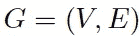

# 图形神经网络的简单介绍(基础、深走和 GraphSage)

> 原文：<https://towardsdatascience.com/a-gentle-introduction-to-graph-neural-network-basics-deepwalk-and-graphsage-db5d540d50b3?source=collection_archive---------0----------------------->

Image from Pexels

最近，图神经网络(GNN)在各个领域越来越受欢迎，包括社会网络、知识图、推荐系统，甚至生命科学。GNN 在建模图中节点之间的依赖性方面的能力使得与图分析相关的研究领域取得突破。本文旨在介绍图神经网络的基础知识和两个更高级的算法，DeepWalk 和 GraphSage。

# 图表

在我们进入 GNN 之前，让我们先了解一下什么是*图*。在计算机科学中，图是由顶点和边两部分组成的数据结构。一个图 *G* 可以由它包含的顶点 *V* 和边 *E* 的集合很好地描述。

边可以是有向的，也可以是无向的，这取决于顶点之间是否存在方向依赖。

A Directed Graph (wiki)

顶点通常被称为节点。在本文中，这两个术语可以互换。

# 图形神经网络

图形神经网络是一种直接作用于图形结构的神经网络。GNN 的一个典型应用是节点分类。本质上，图中的每个节点都与一个标签相关联，我们希望在没有事实的情况下预测节点的标签。本节将举例说明论文中[所描述的算法，它是 GNN 的第一个提议，因而通常被视为 GNN 的原创。](http://citeseerx.ist.psu.edu/viewdoc/download?doi=10.1.1.1015.7227&rep=rep1&type=pdf)

在节点分类问题设置中，每个节点 *v* 通过其特征 *x_v* 来表征，并且与地面事实标签 *t_v.* 相关联。给定部分标记的图 *G* ，目标是利用这些标记的节点来预测未标记的标签。它学习用包含其邻域信息的 *d* 维向量(状态) *h_v* 来表示每个节点。具体来说，

[https://arxiv.org/pdf/1812.08434](https://arxiv.org/pdf/1812.08434)

其中 *x_co[v]* 表示与 *v 连接的边的特征，h_ne[v]* 表示 *v* 的相邻节点的嵌入， *x_ne[v]* 表示*v*的相邻节点的特征，函数 *f* 是将这些输入投影到 d 维空间的转移函数。由于我们正在寻找 h_v 的唯一解，我们可以应用 Banach [不动点定理](https://en.wikipedia.org/wiki/Fixed-point_theorem)并将上述方程重写为迭代更新过程。这种操作通常被称为**消息传递**或**邻域聚合**。

[https://arxiv.org/pdf/1812.08434](https://arxiv.org/pdf/1812.08434)

h 和 X 分别表示所有 h 和 X 的连接。

通过将状态 *h_v* 以及特征 *x_v* 传递给输出函数 g 来计算 GNN 的输出

[https://arxiv.org/pdf/1812.08434](https://arxiv.org/pdf/1812.08434)

这里的 f 和 g 都可以解释为前馈全连接神经网络。L1 损耗可以直接用公式表示如下:

[https://arxiv.org/pdf/1812.08434](https://arxiv.org/pdf/1812.08434)

这可以通过梯度下降来优化。

然而，[本文](https://arxiv.org/pdf/1812.08434.pdf)指出 GNN 的这一原始提案有三个主要局限性:

1.  如果放松“不动点”的假设，就有可能利用多层感知器来学习更稳定的表示，并消除迭代更新过程。这是因为，在最初的提议中，不同的迭代使用转移函数 f 的相同参数，而 MLP 的不同层中的不同参数允许分层特征提取。
2.  它不能处理边信息(例如，知识图中的不同边可以指示节点之间的不同关系)
3.  不动点会阻碍节点分布的多样化，因此可能不适合学习表示节点。

已经提出了 GNN 的几种变体来解决上述问题。然而，他们没有被涵盖，因为他们不是这篇文章的重点。

# 深度行走

DeepWalk 是第一个提出以无监督方式学习的节点嵌入的算法。就训练过程而言，它非常类似于单词嵌入。其动机是图中节点和语料库中单词的分布都遵循如下图所示的幂定律:

[http://www.perozzi.net/publications/14_kdd_deepwalk.pdf](http://www.perozzi.net/publications/14_kdd_deepwalk.pdf)

该算法包含两个步骤:

1.  对图中的节点执行随机行走以生成节点序列
2.  运行 skip-gram，根据步骤 1 中生成的节点序列学习每个节点的嵌入

在随机游走的每个时间步，从前一个节点的邻居均匀地采样下一个节点。然后，每个序列被截断成长度为 *2|w| + 1* 的子序列，其中 w 表示跳跃图中的窗口大小。如果你不熟悉 skip-gram，[我之前的博客文章](/word-embedding-with-word2vec-and-fasttext-a209c1d3e12c)将向你简要介绍它是如何工作的。

本文采用层次化的 softmax 来解决 softmax 由于节点数量巨大而导致的计算量大的问题。为了计算每个单独输出元素的 softmax 值，我们必须计算所有元素 k 的所有 e^xk

The definition of Softmax

因此，对于原始的 softmax，计算时间是 *O(|V|)* ，其中 *V* 表示图中的顶点集。

分层 softmax 利用二叉树来处理这个问题。在这个二叉树中，所有的叶子(上图中的 v1，v2，… v8)都是图中的顶点。在每个内部节点中，有一个二元分类器来决定选择哪条路径。为了计算给定顶点 *v_k* 的概率，简单地计算沿着从根节点到叶子 *v_k* 的路径的每个子路径的概率。由于每个节点的子节点的概率总和为 1，所以所有顶点的概率总和等于 1 的性质在分层 softmax 中仍然成立。元素的计算时间现在减少到了 *O(log|V|)* ，因为二叉树的最长路径由 *O(log(n))* 限定，其中 *n* 是叶子的数量。

Hierarchical Softmax ([http://www.perozzi.net/publications/14_kdd_deepwalk.pdf](http://www.perozzi.net/publications/14_kdd_deepwalk.pdf))

在对 DeepWalk GNN 进行训练之后，该模型已经学习了每个节点的良好表示，如下图所示。不同的颜色表示输入图中不同的标签。我们可以看到，在输出图(二维嵌入)中，具有相同标签的节点聚集在一起，而大多数具有不同标签的节点被适当分离。

[http://www.perozzi.net/publications/14_kdd_deepwalk.pdf](http://www.perozzi.net/publications/14_kdd_deepwalk.pdf)

然而，DeepWalk 的主要问题是它缺乏泛化能力。每当一个新的节点进来，它必须重新训练模型，以便表示这个节点(**转导**)。因此，这种 GNN 不适用于图中节点不断变化的动态图。

# 图表法

GraphSage 提供了一个解决上述问题的方案，以一种**归纳**的方式学习每个节点的嵌入。具体来说，每个节点由其邻域的聚合来表示。因此，即使一个在训练期间看不见的新节点出现在图中，它仍然可以由它的相邻节点适当地表示。下面显示了 GraphSage 的算法。

[https://www-cs-faculty.stanford.edu/people/jure/pubs/graphsage-nips17.pdf](https://www-cs-faculty.stanford.edu/people/jure/pubs/graphsage-nips17.pdf)

外环表示更新迭代的次数，而 *h^k_v* 表示在更新迭代 *k* 时节点 *v* 的潜在向量。在每次更新迭代中， *h^k_v* 基于聚合函数、前一次迭代中 *v* 和 *v* 的邻域的潜在向量以及权重矩阵 *W^k* 进行更新。论文提出了三个聚合函数:

**1。平均聚合器:**

均值聚合器取一个节点及其所有邻域的潜在向量的平均值。

[https://www-cs-faculty.stanford.edu/people/jure/pubs/graphsage-nips17.pdf](https://www-cs-faculty.stanford.edu/people/jure/pubs/graphsage-nips17.pdf)

与原来的等式相比，它删除了上面伪代码中第 5 行的串联操作。这种操作可以被看作是一种“跳过连接”，这在本文的后面部分被证明可以极大地提高模型的性能。

**2。LSTM 聚合器:**

由于图中的节点没有任何顺序，它们通过置换这些节点来随机分配顺序。

**3。汇集聚合器:**

该操作符对相邻集执行元素池功能。下面显示了最大池的一个示例:

[https://www-cs-faculty.stanford.edu/people/jure/pubs/graphsage-nips17.pdf](https://www-cs-faculty.stanford.edu/people/jure/pubs/graphsage-nips17.pdf)

，可以用均值池或任何其他对称池函数来代替。指出池式聚合器性能最好，而平均池式和最大池式聚合器性能相近。本文使用 max-pooling 作为默认的聚合函数。

损失函数定义如下:

[https://www-cs-faculty.stanford.edu/people/jure/pubs/graphsage-nips17.pdf](https://www-cs-faculty.stanford.edu/people/jure/pubs/graphsage-nips17.pdf)

其中 *u* 和 *v* 在定长随机游走中同现，而 *v_n* 为不与 *u* 同现的负样本。这种损失函数鼓励距离较近的节点具有相似的嵌入，而距离较远的节点在投影空间中被分离。通过这种方法，节点将获得越来越多的关于其邻居的信息。

GraphSage 允许通过聚集其附近的节点来为看不见的节点生成可表示的嵌入。它允许将节点嵌入应用于涉及动态图的领域，其中图的结构是不断变化的。例如，Pinterest 采用了 GraphSage 的扩展版本 [PinSage](https://arxiv.org/pdf/1806.01973) ，作为其内容发现系统的核心。

# 结论

您已经学习了图形神经网络、DeepWalk 和 GraphSage 的基础知识。GNN 在建模复杂图形结构方面的能力确实令人惊讶。鉴于其有效性，我相信，在不久的将来，GNN 将在人工智能的发展中发挥重要作用。如果你喜欢我的文章，别忘了在 [Medium](https://medium.com/@huangkh19951228) 和 [Twitter](https://twitter.com/steeve__huang) 上关注我，在那里我经常分享 AI、ML 和 DL 的最先进的发展。