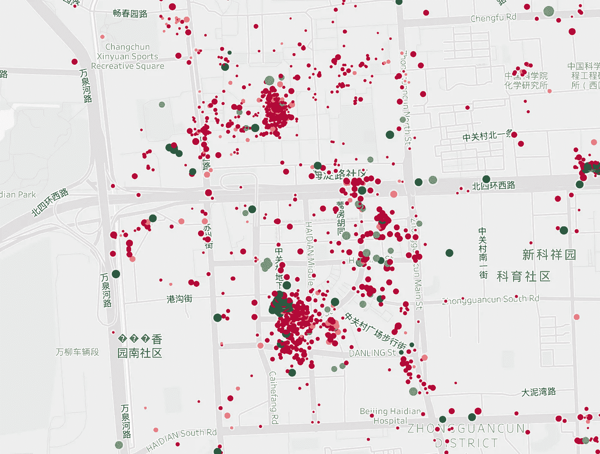
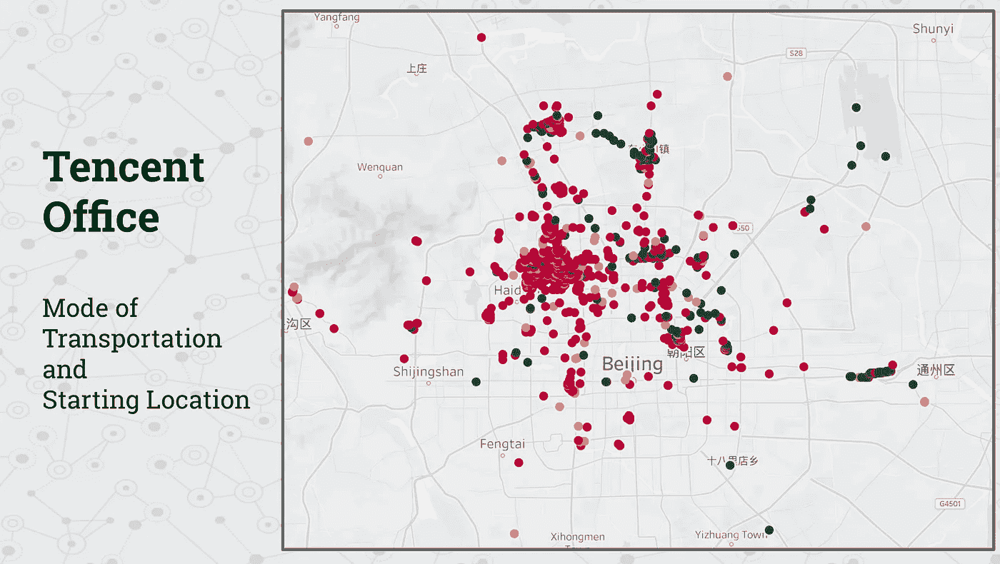

# 物联网/GPS 轨迹聚类和地理空间聚类简介

> 原文：<https://towardsdatascience.com/a-gentle-introduction-to-iot-gps-trajectory-clustering-and-geospatial-clustering-daba8da8c41e?source=collection_archive---------13----------------------->

当谈到开发增值主张时，物联网、互联设备和地理空间数据都是热门话题。在这篇文章中，我将温和地介绍应用于 GPS 轨迹的无监督学习技术。

数据来自[微软亚洲研究院](https://www.microsoft.com/en-us/download/details.aspx?id=52367&from=https%3A%2F%2Fresearch.microsoft.com%2Fen-us%2Fdownloads%2Fb16d359d-d164-469e-9fd4-daa38f2b2e13%2F)，包含 2007 年 4 月至 2012 年 8 月间 182 名用户和 17621 次旅行的数据。数据大多是密集的，每 1 到 5 秒记录一次经度和纬度。

# 数据准备和清理

现在让我们来看看数据文件本身。嗯。plt '格式，一个我没见过的格式，不过还是用文本编辑打开吧。


好极了，看起来熊猫 read_csv 函数可以很好地与。plt 文件格式，附带的关于数据结构的文档看起来很准确。

```
import pandas as pdcolnames = ['lat','long', 'null', 'alt' ,'DateTime','Date','Time']df = pd.read_csv('20090724005608.plt', skiprows=6, names = colnames)
```


将时间序列放在一个数据框中很好，但是我们需要将每个数据框转换成具有多个特征的单个观察值。这样做将格式化数据，以便加载到聚类分析算法中。让我们合计速度、加速度和加加速度的第 10、25、50、75、90 和平均值。为此，我们将编写几个 python 函数来应用于每个文件。

```
def add_feat(df_input):
    """
    This function takes in raw lat long time series from the microsoft geolife data.Preprocessing notes: skip the first six lines before doing pandas read csv , expecting columns in ['lat','long', 'null', 'alt' ,'DateTime','Date','Time']Requres: pandas imported as pd
             from vincenty import vincenty

    Adds:
        speed
        acceleration
        jerk
        bearing rate
        distance travelled
    """
    df = df_input
    # add some initial shifts
    df['lat_shift'] = df.lat.shift(-1)
    df['long_shift'] = df.long.shift(-1)
    df['time_shift'] = df.DateTime.shift(-1)
    # add speed
    def speed(x):
        try:
            s = vincenty((x[-3],x[-2]),(x[0],x[1]), miles = True) / ((x[-1]-x[4]) * 24)
        except:
            s= np.nan
        return s
    df['speed_mph'] = df.apply(speed,axis =1)
    df['speed_shift'] = df.speed_mph.shift(-1)
    # add acceleration
    def accel(x):
        try:
            a = (x[-1] - x[-2]) / ((x[9] - x[4]) *24*60*60)
        except:
            a = np.nan
        return a
    df['acceleration'] = df.apply(accel, axis =1)
    df['acceleration_shift'] = df.acceleration.shift(-1)
    # add jerk
    def jerk(x):
        try:
            j = (x[-1] - x[-2]) / ((x[9] - x[4]) *24*60*60)
        except:
            j = np.nan
        return a
    df['jerk'] = df.apply(accel, axis =1)
    df['jerk_shift'] = df.jerk.shift(-1)
    # add y for bearing calculator
    def y(x):
        try:
            yy = np.sin((x[8] - x[0]) * np.pi/180) *np.cos( x[7]* np.pi/180)
        except:
            yy= np.nan
        return yy
    df['y'] = df.apply(y, axis =1)
    # add x for bearing calculator 
    def x(x):
        try:
            xx = np.cos(x[0] * np.pi/180) *np.sin(x[7]* np.pi/180) - np.sin(x[0]* np.pi/180) * np.cos(x[7]* np.pi/180)*np.cos((x[8]-x[1])* np.pi/180)
        except:
            xx = np.nan
        return xx
    df['x'] = df.apply(x,axis =1)
    # calculate bearing
    def bearing(x):
        try:
            b = np.arctan2(x[-2],x[-1])*180/np.pi
        except:
            b = np.nan
        return b
    df['bearing'] = df.apply(bearing,axis=1)df['brearing_shift'] = df.bearing.shift(-1)
    # calculate bearing rate (rate of change of direction)
    def bearing_rate(x):
        try:
            br = abs(x[-1]-x[-2])
        except:
            br = np.nan
        return br
    df['bearing_rate'] = df.apply(bearing_rate,axis=1)
    # calculate distance travelled
    def distance(x):
        try:
            dist = vincenty((x[7],x[8]),(x[0],x[1]), miles = True)
        except:
            dist= np.nan
        return dist
    df['distance'] = df.apply(distance,axis = 1)

    df.drop(df.tail(4).index,inplace=True)
    return dfdef list_df_summary(input_df):
    '''
    Converts output from add_feat function into an observation for machine learning
    '''
    names = ['speed_10','speed_25','speed_50','speed_75','speed_90','speed_ave',
            'accel_10','accel_25','accel_50','accel_75','accel_90','accel_ave',
            'jerk_10','jerk_25','jerk_50','jerk_75','jerk_90','jerk_ave',
            'bearingRate_10','bearingRate_25','bearingRate_50','bearingRate_75','bearingRate_90','bearingRate_ave',
            'distance_traveled','time_traveled' ,'last_lat','last_long','start_lat','start_long'

            ]
    values = list()
    #speed
    values.append(input_df.quantile(.10)[8])
    values.append(input_df.quantile(.25)[8])
    values.append(input_df.quantile(.50)[8])
    values.append(input_df.quantile(.75)[8])
    values.append(input_df.quantile(.90)[8])
    values.append(input_df.mean()[8])
    #accel
    values.append(input_df.quantile(.10)[10])
    values.append(input_df.quantile(.25)[10])
    values.append(input_df.quantile(.50)[10])
    values.append(input_df.quantile(.75)[10])
    values.append(input_df.quantile(.90)[10])
    values.append(input_df.mean()[10])
    #jerk
    values.append(input_df.quantile(.10)[12])
    values.append(input_df.quantile(.25)[12])
    values.append(input_df.quantile(.50)[12])
    values.append(input_df.quantile(.75)[12])
    values.append(input_df.quantile(.90)[12])
    values.append(input_df.mean()[12])
    #bearing
    values.append(input_df.quantile(.10)[18])
    values.append(input_df.quantile(.25)[18])
    values.append(input_df.quantile(.50)[18])
    values.append(input_df.quantile(.75)[18])
    values.append(input_df.quantile(.90)[18])
    values.append(input_df.mean()[18])
    #distance travelled
    values.append(input_df.distance.sum())
    #time travelled
    values.append((input_df.iloc[-1,4] - input_df.iloc[0,4])*24*60)
    #lat long
    values.append(input_df.iloc[-1,0])
    values.append(input_df.iloc[-1,1])
    values.append(input_df.iloc[0,0])
    values.append(input_df.iloc[0,1])

    return pd.DataFrame([values],columns=names)
```

为了遍历文件目录，我使用了一个名为 glob 的包。下面的代码完成了为每个。GeoLife 目录中的 plt 文件。然后通过运行 for 循环。plt 列出并应用前面的函数让我们为机器学习做好准备！

```
plts = []
for folder in glob('Geolife Trajectories 1.3/Data/*/Trajectory'):
    for file in glob(folder +'/*.plt'):
        plts.append(file)large_df = []
for i, file in enumerate(plts):
    print( int(i*100 / len(plts)))
    try:
        large_df.append(list_df_summary(add_feat(pd.read_csv(file, skiprows=6,names=colnames))))
    except:
        print('error at: ' + file)
df = pd.concat(large_df)
```

对于我的例子，我将使用 modeling_df 特性的一个子集来创建集群。不是每个特征都有有用的信息([阅读更多关于维度的诅咒](https://en.wikipedia.org/wiki/Curse_of_dimensionality))。这是一个迭代的过程，你可以尝试不同的子集来开发不同的集群。最初，我查看每个特征的分布，猜测它是否对无监督学习算法有价值。

# GPS 轨迹聚类

```
from sklearn.cluster import KMeans
from sklearn.preprocessing import StandardScaler
import seaborn as sns
from collections import Counter## Remove longer trips
df_local_all_feat=df[(df.time_traveled < 300) & (df.distance_traveled < 100)& (df.speed_90<75)]## Select Features with unique distributions
df_local = df_local_all_feat[['speed_90','speed_ave','accel_75','speed_50','accel_ave','distance_traveled','time_traveled']]## Scale Data for KMeans
X = StandardScaler()
X = X.fit_transform(df_local)#################################
### PERFORM KMeans CLUSTERING ###
#################################Sum_of_squared_distances = []
scores = []
cluster_count = []
K= range(2,15,1)
for i in K:
    km = KMeans(n_clusters=i)
    km.fit(X)
    pred =km.predict(X)
    Sum_of_squared_distances.append(km.inertia_)
    scores.append(silhouette_score(X, pred))
    cluster_count.append(i)
    print(Counter(pred))
    print(str(silhouette_score(X, pred)) + ' clusters:' +str(i))
    print('------')########################################
### Elbow plot with silhouette score ###
########################################sns.set_context('talk')
sns.lineplot(cluster_count,scores)
plt.xlabel('Cluster Count')
plt.ylabel('Silhouette Score')
plt.title('Elbow Method For Optimal Cluster Count')
plt.show()
```


The elbow plot is telling us to investigate either 6 or 7 clusters.

```
df_local_all_feat['cluster'] = KMeans(n_clusters=7).fit_predict(X)
```


Trajectory Clusters

聚类 4，5 包含很少数量的观察值，因此不包括在此分析中。

让我们看看最终目的地和轨迹簇。


Tsinghua University, Trajectory Cluster

看看清华大学，我们可以看到大量的集群 0 和 1。


Tencent Office, Trajectory Cluster

看看腾讯的办公室，我们可以开始看到更多的地铁乘坐，集群 5 和 6。



看一下当地的购物区，地铁/火车出行较少，但火车出行通常距离更长(大小是行驶的总距离)。

# 目标地理空间聚类

上面部分的放大图可以在下面找到。我们已经确定了 3 个一般的兴趣点，现在是时候将它们聚集在一起了。


Tsinghua University on top, shopping center on lower left, and Tencent on lower right

看起来我们需要一种算法，既能结合距离和接近度，又能排除噪音。听起来 DB 扫描将是这个应用程序的算法。

```
from sklearn.cluster import DBSCAN# pull out the only the location metrics
df_cluster = df_local_all_feat[['Last Lat', 'Last Long']]X = StandardScaler()
X = X.fit_transform(df_cluster)scores = []
EP =[]
number =[]
eps= [.08,.10,.15,.20,.25,.30,.40,.50,.60]
size= [200,250,300]
for ep in eps:
    for siz in size:
        db = DBSCAN(eps=ep, min_samples=siz)   
        pred = db.fit_predict(X)

        print('ep:'+ str(ep) + ' size:'+ str(siz))
        print(Counter(pred))
        try:
            scores.append(silhouette_score(X, pred))
        except:
            scores.append(np.nan)
        EP.append(ep)
        number.append(siz)
```

变量 eps 和 size 将允许您为您的应用网格搜索适当的超参数。最后，我选择了下面的价值观。

```
db = DBSCAN(eps= 0.37, min_samples = 250)
```


# 结合两种聚类算法

通过结合两种聚类算法，我们可以基于兴趣点过滤特定的行程，以确定人们来自哪里以及到达所述兴趣点所使用的交通方式。


对于清华大学，我们可以看到人们通常从附近短途旅行。


对于购物区，我们可以看到人们的出行距离更远，并且大多使用交通模式 0。



对于腾讯办公室来说，人们从最远的地方出发。然而，从附近通勤的人通常选择交通模式 0，而从更远通勤的人选择交通模式 6。

# 结论

使用各种无监督学习算法，我们能够确定人们如何前往特定位置，如何限制兴趣点，以及人们来自哪里。

通过调整，在数据收集架构中，根据出行距离和交通方式等因素来确定人们在一个地点的居住方式将会很有意义。