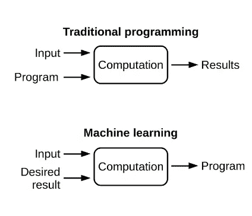
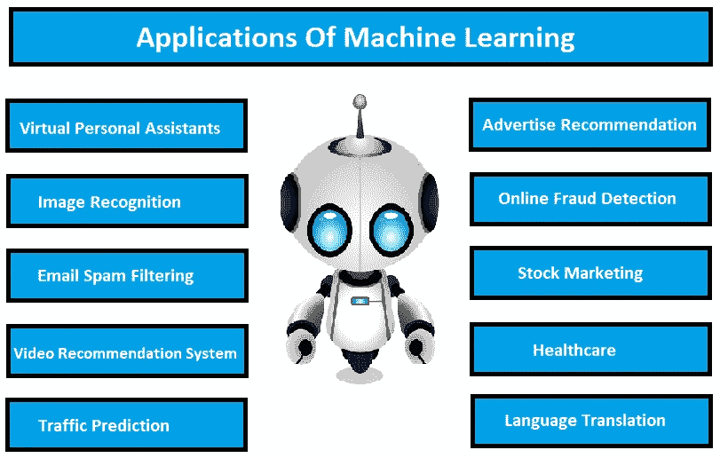
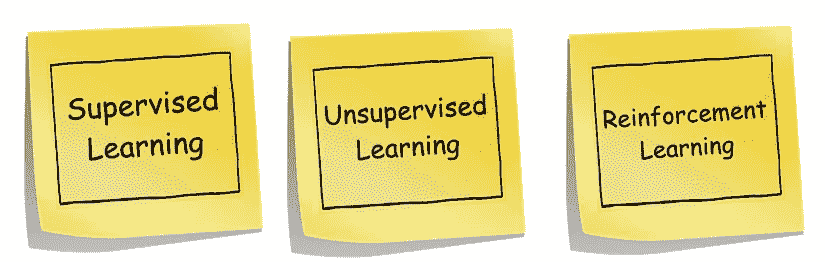
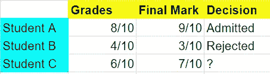
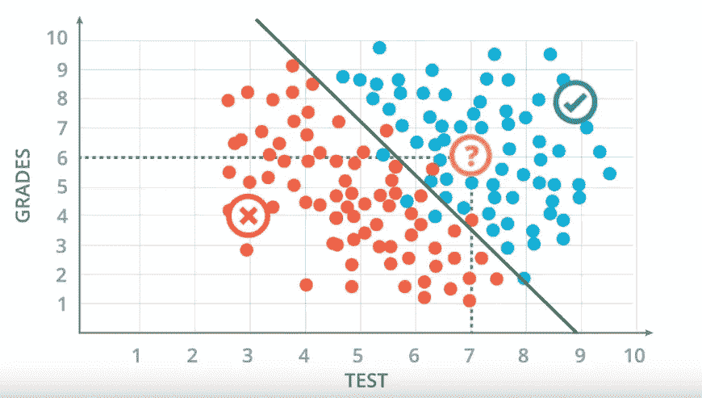
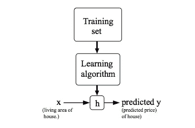
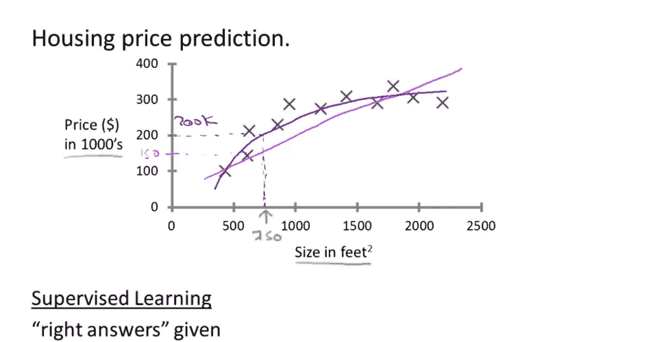

# 机器学习的简明介绍

> 原文：<https://towardsdatascience.com/a-gentle-introduction-to-machine-learning-599210ec34ad?source=collection_archive---------19----------------------->

## [内部 AI](https://medium.com/towards-data-science/inside-ai/home)

## 任何足够先进的技术都和魔法没什么区别

欢迎光临！这篇文章是我第一次尝试稍微深入一点像机器学习这样的高级主题。我写这篇文章有两个原因。首先，我发现这个主题非常有趣，如果你对机器学习感兴趣，但不知道从哪里开始，那么这篇文章是给你的。其次，这篇文章是我综合我的学习并与机器学习爱好者分享我的知识的一种方式。

我希望你有一些“概率论”的基础知识，以便跟上。由于机器学习是一个非常广泛的话题，我希望您喜欢阅读，因此本文将主要关注:

*   揭秘什么是机器学习？
*   学习方法
*   监督和非监督学习
*   回归、分类和聚类概述
*   数据集的两个实例。
*   免费资源，了解更多信息

# So、什么是机器学习&我们为什么需要它？

> 任何足够先进的技术都和魔法没什么区别
> 
> *—亚瑟·C·克拉克*

我们知道人类从过去的经验中学习，机器遵循人类给出的指令。

> W 如果人类可以从过去的数据中训练机器，做人类能做的事情，会怎么样？

好吧，那就是机器学习，我们来深究一下。

这个世界充满了数据，大量的数据——图片、音乐、文本、视频、电子表格。机器学习是人工智能的科学和分支，其中**计算机根据数据**进行训练以执行特定任务，而不是通过显式编程。

# **传统软件开发 VS 机器学习**

在传统的软件开发方法中，输入和算法是已知的，你编写一个函数来产生一个输出。

*   输入数据
*   通过对算法应用逻辑来设计算法
*   产生输出

然而，在**机器学习方法**中，你知道输入和期望输出，但不知道给出输出的算法。

*   给出一组输入数据
*   给出一组期望的输出数据
*   通过**神经网络** *(将在另一篇文章中介绍)*你得到预测期望输出的算法。

# **机器学习的一些应用**

公司使用机器学习算法来优化他们产品的结果。

1.  当你在网飞的时候，你怎么知道你想看哪部电影？网飞**使用机器学习提出建议**。
2.  当你使用信用卡进行购买时，上面有**欺诈保护**，这就是机器学习。
3.  机器学习的其他应用包括语音识别、语言翻译、自动驾驶汽车和许多其他应用。

# **学习是如何发生的？**

> 在机器学习的大多数应用:重点不在于建立模型(“理解底层过程”)，而在于预测。

就像人类从经验中学习一样，机器学习也是一样，你给他们大量的例子(数据)，他们就开始弄明白发生了什么。我们人类进行**归纳推理**而不是**演绎推理。让我们回顾一下这两个概念，因为它们在机器学习中非常重要。**

**归纳(具体→一般)**是根据我们有限的经验，从具体的例子中归纳出结论，这里的结论可能并不总是 100%准确。

*   我们每天都观察日出。
*   所以我们预测太阳明天也会升起。
*   因此，我们预测明天太阳还会升起。

**演绎(一般→具体)**是从一般陈述中得出具体结论的过程。这里的结论是事实。

*   所有的人都会死。
*   威廉是个男人。
*   因此，威廉是凡人。

重要的是要记住，任何学习的系统都有“归纳偏差”或先验知识，机器学习旨在自动化“归纳推理”的过程。机器学习这种多样性的一个显著例子就是**监督学习**和**非监督学习的分离，**这里我就不说强化学习了。

## **监督学习**

在监督学习中，考虑到输入和输出之间存在某种关系，我们得到了一个带标签的数据集，并且已经知道我们的正确输出应该是什么样子。自动驾驶汽车就是监督学习的一个例子。监督问题分为“回归”和“分类”问题。

在一个“**回归**”问题中，我们试图预测具有*连续*结果的事物。例如，给定一个人的照片，我们必须根据给定的照片来预测他们的年龄。

在“**分类**问题中，我们试图预测具有*离散*输出的结果。例如，给定一个患有肿瘤的患者，我们必须预测肿瘤是恶性的还是良性的。

## **机器学习的 5 个步骤**

为了设计机器学习算法，需要遵循以下 5 个主要步骤:

1.  输入，又称*功能* : **x**
2.  输出，也称为*标签* : **y**
3.  目标函数: **f: x → y** (未知)
4.  采集数据 *(x1，y1)，(x2，y2)，…。，(xn，yn)*
5.  假设: **h: x → y**

让我们看两个既有分类又有回归的监督学习的例子，以便更深入地理解。

## **例 1:分类**

假设我们在大学的招生办公室工作，我们的工作是接受或拒绝一个学生。为了做出决定，我们需要一些学生的意见，对吗？让我们看看:他们的成绩和最后一年的考试分数。

我们在尝试根据以往收集的数据来预测，学生 C 是否会被录取？为了形象化，我们可以把它画在图上。

Udacity’s course “Intro to Deep Learning with PyTorch”

在上图中，我们首先用一条线将好的和坏的数据分开。这条线将成为我们的模型。蓝点代表被录取的学生的数据点，红点代表根据他们的考试分数和成绩被拒绝的学生的数据点。看这个图表，我们可以看到，线上的学生被录取，而线下的学生被拒绝。你可能会想，线上有几个红点，线下有几个蓝点，是的，你是对的，模型犯了几个错误，这就是为什么它是概率而不是 100%确定的。所以可以肯定的是，如果一个分数超过了分数线，那么这个学生就被录取了。成绩(6)和考试分数(7)的学生 C 在分数线以上，因此我们可以有把握地认为学生 C 最有可能被录取。这是一个分类问题，因为输出是离散的(接受，拒绝)。

## **示例 2:回归(小高级)**

我们举一个 ***房价预测的例子。*** 你的朋友拥有一栋 750 平方英尺的房子，他想卖掉房子，想知道能卖多少钱。你知道机器学习，因此你可以用你的机器学习知识和技能帮助他预测价格。我们来看看怎么做。

我们的目标是，给定一个训练集，学习一个函数 **h: X → Y** ，使得 h(x)是 Y 的相应值的“良好”预测器。出于历史原因，这个函数 **h** 被称为假设。假设接受输入并给出一个估计值，所以它从 x → y 映射。

我们可以使用一条“**线性**线(下方图片中的*粉色线)来拟合数据集，基于此，看起来他可能可以以 15 万美元的价格出售它。然而，可能有比线性更好的学习算法。除了将直线拟合到数据中，我们也许可以尝试将“**二次**”拟合到这个函数中(下图中的*蓝线)。然后，通过对它进行预测，看起来他可能可以以 20 万美元的价格出售它。现在的问题是选择我们应该使用哪一个？挑选中没有公平可言，哪个给我们的朋友的价格最好。这是一个回归问题，因为答案可以是连续的。**

Andrew Ng’s Machine Learning course on Coursera

## **无监督学习**

在无监督学习中，我们很少或根本不知道我们的结果应该是什么样的。因此，目的是发现数据中隐藏的结构。理解无监督学习的核心思想是“**聚类**”。

**聚类**:取 50 个不同的人集合，想办法自动把这些人分组。也许你想把他们分成男性和女性，因此你可以决定如何去做。你也许可以根据面部毛发、肤色、衣着等来划分他们。最后，你可以说你是 27 个男性和 23 个女性。

## **关键术语**

*   **特性:**模型的输入
*   **示例:**用于训练的输入/输出对
*   **标签:**模型的输出
*   **层:**神经网络中连接在一起的节点的集合
*   **模型:**你的神经网络的表示

## **总结**

1.  任何学习的系统都有“归纳偏差”或“先验知识”。
2.  机器学习旨在自动化“归纳推理”的过程
3.  我们需要知道我们在寻找什么(归纳偏差)
4.  由于机器学习是一种归纳参考的形式，我们永远无法对结果充满信心。
5.  在机器学习的大部分应用中，重点与其说是建立模型，不如说是预测。

这篇文章只是对机器学习领域的浅尝辄止，还有更多的内容，并且有大量的在线资源可以用来增强你的知识。下面我提供了 5 个我个人认为非常有用的资源。

## **一些免费的有用资源，了解更多:**

1.  [谷歌的人工智能冒险](https://www.youtube.com/watch?v=nKW8Ndu7Mjw&list=PLIivdWyY5sqJxnwJhe3etaK7utrBiPBQ2&index=34&t=0s)
2.  [Udacity 的机器学习课程](https://www.udacity.com/course/machine-learning--ud262)
3.  [机器学习变得有趣&有趣](https://www.youtube.com/playlist?list=PLblh5JKOoLUICTaGLRoHQDuF_7q2GfuJF)
4.  [加州理工学院的机器学习课程](https://www.youtube.com/watch?v=mbyG85GZ0PI&list=PLD63A284B7615313A)
5.  [吴恩达 Coursera 课程](https://www.coursera.org/learn/machine-learning)

这篇文章是我第一次尝试深入像机器学习这样的复杂话题。我会写更多的文章来讨论机器学习背后的数学。我希望我做了一个体面的解释工作，你觉得这篇文章很有见地。

保持好奇和不断学习:)