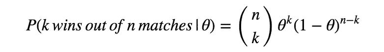
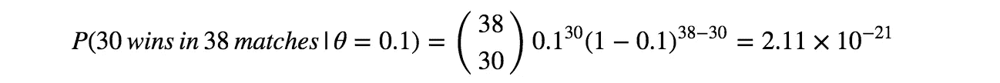
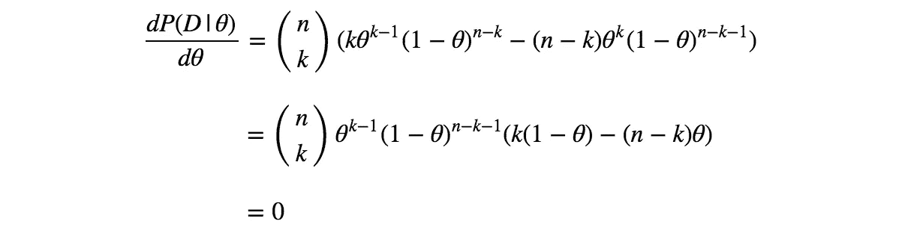
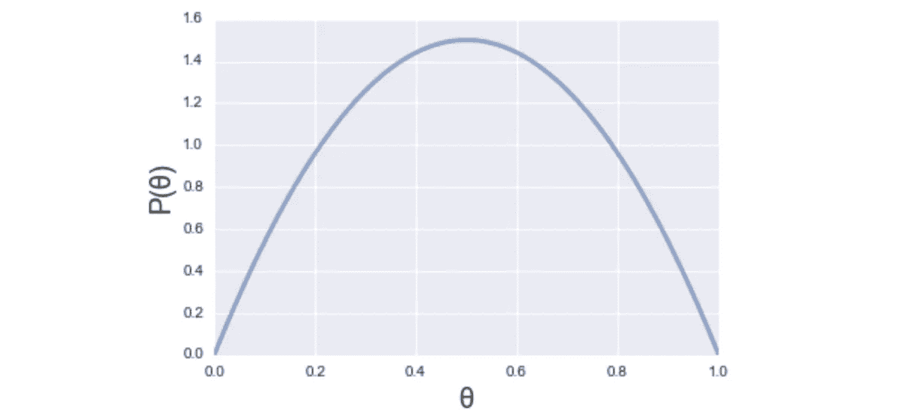
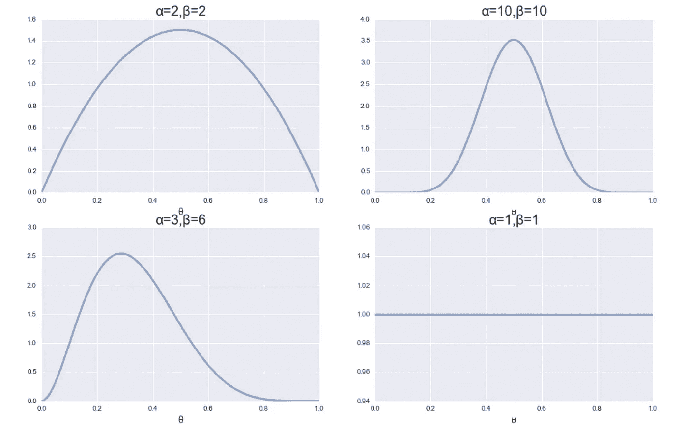
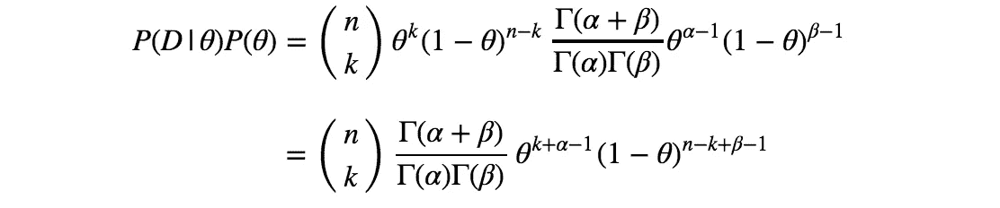
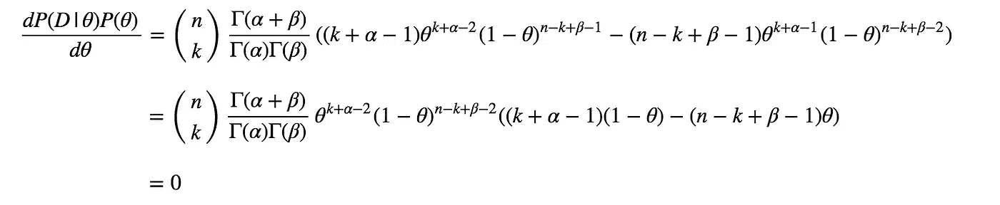

# 最大似然估计和最大后验估计简介

> 原文：<https://towardsdatascience.com/a-gentle-introduction-to-maximum-likelihood-estimation-and-maximum-a-posteriori-estimation-d7c318f9d22d?source=collection_archive---------1----------------------->

## 以足球为例获得最大似然法和地图的直觉

Photo by [Mitch Rosen](https://unsplash.com/@focusmitch?utm_source=medium&utm_medium=referral) on [Unsplash](https://unsplash.com?utm_source=medium&utm_medium=referral)

最大似然估计(MLE)和最大后验估计(MAP)是估计统计模型参数的方法。

尽管这些方法背后有一点高等数学，但 MLE 和 MAP 的思想非常简单，直观易懂。在这篇文章中，我将解释什么是 MLE 和 MAP，重点是方法的直觉以及背后的数学。

## 例子:利物浦足球俱乐部在下个赛季赢得比赛的概率

2018-19 赛季，利物浦 FC 在英超 38 场比赛中赢了 30 场。有了这些数据，我们想猜测下赛季利物浦赢得比赛的概率。

这里最简单的猜测是 *30/38 = 79%* ，这是基于数据的最佳猜测。这实际上是用 **MLE** 方法估计的。

然后，假设我们知道利物浦在过去几个赛季的胜率在 50%左右。你认为我们最好的猜测还是 79%吗？考虑到先前的知识以及本赛季的数据，我认为 50%到 79%之间的某个值会更现实。这是用**图**法估算的。

我相信上面的想法很简单。但是为了更精确的理解，我将在下面的部分中阐述 MLE 和 MAP 的数学细节。

## 模型和参数

在讨论每种方法之前，让我先澄清一下这个例子中的模型和参数，因为 MLE 和 MAP 是估计统计模型的**参数的方法。**

在这个例子中，我们简化为利物浦在所有赛季的所有比赛中只有一个获胜概率(姑且称之为 *θ* )，而不考虑每场比赛的独特性和真实足球比赛的任何复杂因素。换句话说，我们假设利物浦的每场比赛都是伯努利试验，获胜概率为 *θ* 。

有了这个假设，我们就可以描述对于任意给定数量的 *k* 和 *n* ( *k≤n* )，利物浦在 *n* 场比赛中赢 *k* 次的概率。更准确的说，我们假设利物浦的胜数服从参数为 *θ* 的**二项分布**。给定获胜概率 *θ* ，利物浦在 *n* 场比赛中赢 *k* 次的概率公式如下。

这种简化(仅使用单个参数 *θ* 来描述概率，而不考虑现实世界的复杂性)是该示例的统计建模，并且 *θ* 是待估计的参数。

从下一节开始，我们用 MLE 和 MAP 来估计这个 *θ* 。

## 最大似然估计

在上一节中，我们得到了对于给定的 *θ* ，利物浦在 *n* 场比赛中赢 *k* 次的概率公式。
由于我们有本赛季的观测数据，即*38 场比赛中的 30 场胜利*(姑且称此数据为 *D* )，我们可以计算出*P(D |θ)——*对于给定的 *θ* ，观测到此数据 *D* 的概率。让我们以 *θ=0.1* 和 *θ=0.7* 为例计算 *P(D|θ)* 。

当利物浦获胜概率 *θ = 0.1* 时，观察到这个数据*D*(*38 场比赛 30 胜*)的概率如下。

*P(D |θ)= 0.000000000000000000211*。所以，如果利物浦的获胜概率 *θ* 实际上是 *0.1* ，这个数据*D*(*38 场比赛 30 胜*)是极不可能被观测到的。那如果 *θ = 0.7 呢？*

远高于之前的。所以如果利物浦的获胜概率 *θ* 为 0.7，这个数据 *D* 比 *θ = 0.1* 时更容易被观察到。

基于这种比较，考虑到实际观测数据 *D* ，我们可以说 *θ* 更有可能是 *0.7* 而不是 *0.1* 。
这里，我们一直在计算对于每个 *θ* 观察到 *D* 的概率，但同时，我们也可以说，我们一直在根据观察到的数据检查 *θ* 的每个值的可能性。正因为如此， *P(D|θ)* 也被认为是 *θ* 的**可能性**。这里的下一个问题是，最大化可能性 *P(D|θ)* 的 *θ* 的精确值是什么？没错，这就是最大似然估计！

最大化似然性的 *θ* 的值可以通过使似然函数对 *θ* 求导并将其设置为零来获得。

解决这个， *θ = 0，1 或者 k/n* 。由于当 *θ= 0 或 1* 时似然性为零，因此 *θ* 的值使似然性最大化为 *k/n* 。

本例中，用 MLE 估计时， *θ* 的估计值为 *30/38 = 78.9%* 。

## 最大后验估计

当你有足够的数据时，MLE 是强大的。然而，当观察到的数据量很小时，这种方法效果不好。例如，如果利物浦只有 2 场比赛，他们赢了这 2 场比赛，那么 MLE 估计的 *θ* 的值是 *2/2 = 1* 。意思是估计说利物浦赢 *100%* ，这是不切实际的估计。地图可以帮助处理这个问题。

假设我们事先知道利物浦过去几个赛季的胜率在 50%左右。
然后，没有这个赛季的数据，我们已经对 *θ* 的潜在价值有了一些概念。(仅)基于先验知识， *θ* 的值最有可能是 *0.5* ，不太可能是 *0 或 1* 。换句话说， *θ=0.5* 的概率高于 *θ=0 或 1* 。称之为**先验概率** *P(θ)，*如果我们将它形象化，它将如下。

Figure 1\. A visualisation of P(*θ*) expressing the example prior knowledge

然后，有了本赛季的观察数据*D(38 场比赛中 30 胜)*，我们可以更新这个仅基于先验知识的 *P(θ)* 。给定 *D* 的 *θ* 的更新概率表示为 *P(θ|D)* ，称为**后验概率**。
现在，考虑到我们的先验知识和观测数据，我们想知道 *θ* 的最佳猜测。这意味着最大化 *P(θ|D)* 并且这是 MAP 估计。

这里的问题是，如何计算 *P(θ|D)* ？到目前为止，在本文中，我们检查了计算 *P(D|θ)* 的方法，但还没有看到计算 *P(θ|D)* 的方法。为此，我们需要使用下面的贝叶斯定理。

本文不深入讨论贝叶斯定理，但有了这个定理，我们可以利用似然 *P(D|θ)* 和先验概率 *P(θ)* 计算后验概率 *P(θ|D)* 。

等式中有 *P(D)* ，但 *P(D)* 与 *θ* 的值无关。由于我们只对寻找最大化 *P(θ|D)* 的 *θ* 感兴趣，我们可以在最大化中忽略 *P(D)* 。

上面的等式意味着关于 *θ* 的后验概率 *P(θ|D)* 的最大化等于关于 *θ* 的似然 *P(D|θ)* 和先验概率 *P(θ)* 的乘积的最大化。

我们在本节的前面讨论了 *P(θ)* 的含义，但是我们还没有进入公式。本质上，我们可以用任何一个将概率分布描述为 *P(θ)* 的公式来很好地表达我们的先验知识。然而，为了计算的简单性，使用对应于可能性的概率分布的特定概率分布。叫做**共轭先验分布**。

在这个例子中，可能性 *P(D|θ)* 遵循二项式分布。由于二项分布的共轭先验是贝塔分布，所以我们这里用贝塔分布来表示 *P(θ)* 。贝塔分布描述如下。

其中， *α* 和 *β* 称为**超参数**，无法通过数据确定。相反，我们主观地设置它们是为了更好地表达我们的先验知识。例如，下图是不同值的 *α* 和 *β* 的贝塔分布的可视化。你可以看到左上角的图是我们在上面的例子中使用的图(表示 *θ=0.5* 是基于先验知识的最可能的值)，右上角的图也表示相同的先验知识，但这是为相信过去几个赛季的结果很好地反映了利物浦的真实能力的人准备的。

Figure 2\. Visualisations of Beta distribution with different values of *α* and *β*

这里有一个关于右下图的说明:当 *α=1* 和 *β=1* 时，意味着我们对 *θ* 没有任何先验知识。在这种情况下，估计将与 MLE 的估计完全相同。

所以，现在我们有了所有的组件来计算 *P(D|θ)P(θ)* 以使其最大化。

与 MLE 一样，我们可以通过对这个函数求关于 *θ* 的导数，并将其设置为零，从而使 *θ* 最大化。

通过解决这个问题，我们得到以下结果。

在这个例子中，假设我们用 *α=10* 和 *β=10* ，那么*θ=(30+10–1)/(38+10+10–2)= 39/56 = 69.6%*

## 结论

从上面的例子可以看出，MLE 和 MAP 复杂的数学方程背后的思想出奇的简单。我在本文中使用了二项分布作为例子，但是 MLE 和 MAP 也适用于其他统计模型。希望这篇文章能帮助你理解 MLE 和 MAP。