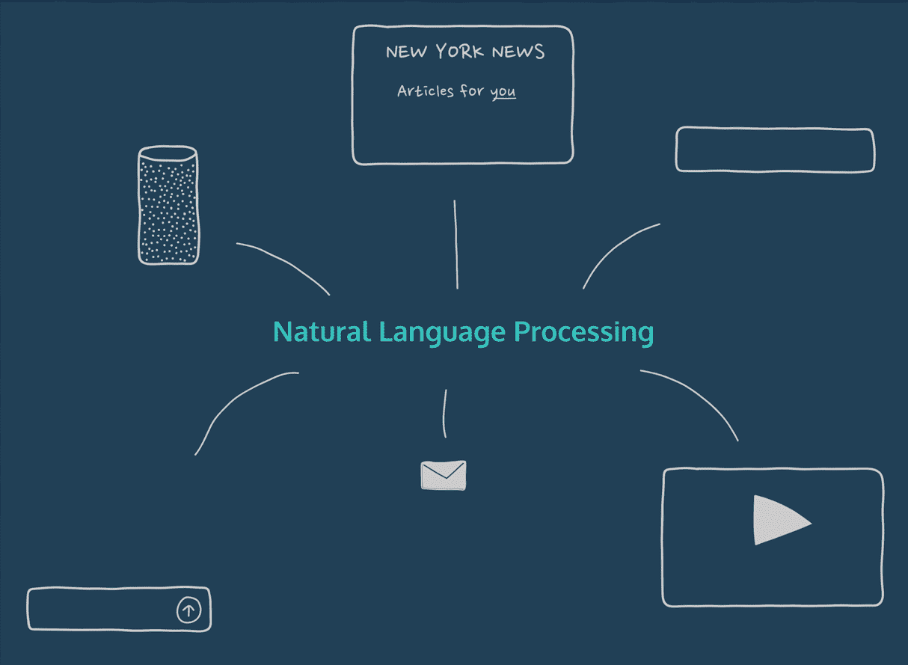
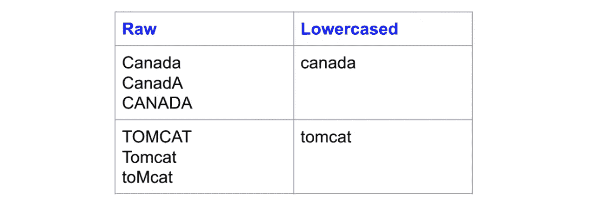
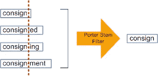
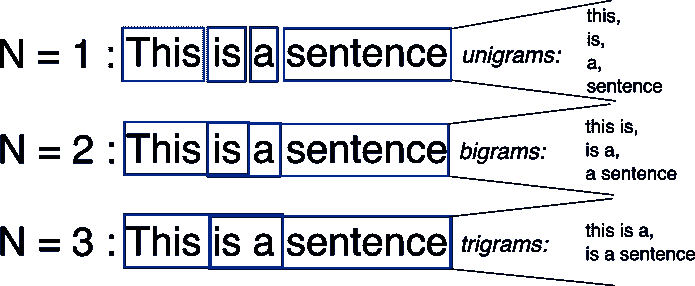
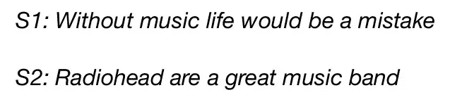
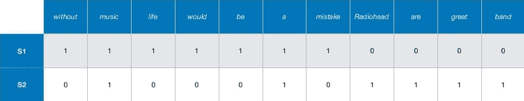
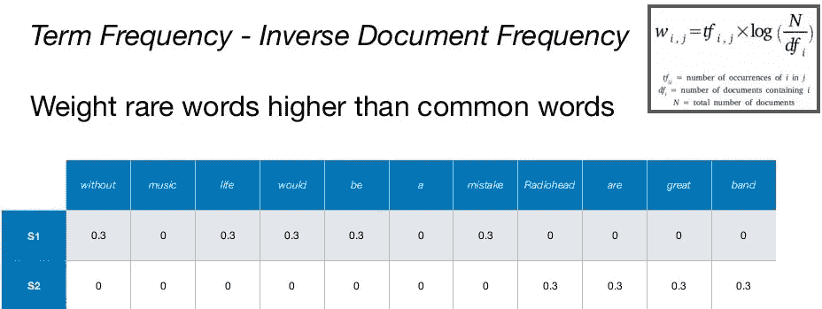

# 自然语言处理入门

> 原文：<https://towardsdatascience.com/a-gentle-introduction-to-natural-language-processing-e716ed3c0863?source=collection_archive---------4----------------------->

## 介绍自然语言处理和对文本数据的情感分析。



Image [Source](https://s3.amazonaws.com/codecademy-content/courses/NLP/Natural_Language_Processing_Overview.gif)

人类通过某种形式的语言进行交流，无论是文本还是语音。现在要让计算机和人类互动，计算机需要理解人类使用的自然语言。自然语言处理就是让计算机学习、处理和操作自然语言。

在这篇博客中，我们将看看在自然语言处理任务中使用的一些常见做法。并且在电影评论上建立简单的情感分析模型，以预测给定评论是正面的还是负面的。

# 什么是自然语言处理(NLP)？

NLP 是人工智能的一个分支，它处理分析、理解和生成人类自然使用的语言，以便使用自然人类语言而不是计算机语言在书面和口头上下文中与计算机交互。

# 自然语言处理的应用

*   机器翻译(谷歌翻译)
*   自然语言生成
*   网络搜索
*   垃圾邮件过滤器
*   情感分析
*   聊天机器人

…以及更多

# 数据清理:

在数据清理过程中，我们从原始数据中移除特殊字符、符号、标点符号、HTML 标签<>等，这些数据不包含模型要学习的信息，这些只是我们数据中的噪声。

这个过程还取决于问题陈述，比如从原始文本中删除什么。例如，如果问题包含来自经济或商业世界的文本，那么像$或其他货币符号这样的符号可能包含一些我们不想丢失的隐藏信息。但大多数情况下我们会移除它们。

# 数据预处理:

> 数据预处理是一种数据挖掘技术，包括将原始数据转换成可理解的格式。

## 小写:

让所有文本都变成小写是最简单也是最有效的文本预处理形式之一。



Image [Source](https://www.kdnuggets.com/2019/04/text-preprocessing-nlp-machine-learning.html)

## 符号化:

记号化是将文本文档分解成称为记号的单个单词的过程。

如上所述，句子被分解成单词(记号)。自然语言工具包(NLTK)是一个流行的开源库，广泛用于 NLP 任务。对于这个博客，我们将使用 nltk 进行所有的文本预处理步骤。

> 您可以使用 pip 下载 nltk 库:

```
*!pip install nltk*
```

## 停止单词删除:

停用词是在文本文档中不提供太多信息的常用词。像‘the’，‘is’，‘a’这样的词价值较小，会给文本数据增加干扰。

NLTK 中有一个内置的停用词列表，我们可以用它从文本文档中删除停用词。然而，这不是每个问题的标准停用词表，我们也可以根据领域定义自己的停用词表。

NLTK 有一个预定义的停用词列表。我们可以从这个列表中添加或删除停用词，或者根据具体任务来使用它们。

## 词干:

词干化是将一个单词缩减为其词干/词根的过程。它将单词(如“help”、“helping”、“helped”、“helped”)的词形变化减少到词根形式(如“help”)。它从单词中去掉词缀，只留下词干。



Image [Source](https://www.thinkinfi.com/2018/09/difference-between-stemming-and.html)

词干可能是也可能不是语言中的有效词。例如，movi 是 movie 的词根，emot 是 emotion 的词根。

## 词汇化:

词汇化与词干化的作用相同，将单词转换为其词根形式，但有一点不同，即在这种情况下，词根属于语言中的有效单词。例如，在词干的情况下，单词 caring 将映射到“care”而不是“car”。

WordNet 是英语中有效单词的数据库。NLTK 的 WordNetLemmatizer()使用来自 WordNet 的有效单词。

## N-grams:



Image [Source](https://stackoverflow.com/questions/18193253/what-exactly-is-an-n-gram)

N-grams 是多个单词一起使用的组合，N=1 的 N-grams 称为 unigrams。类似地，也可以使用二元模型(N=2)、三元模型(N=3)等等。

当我们希望保留文档中的序列信息时，可以使用 n 元语法，比如给定的单词后面可能跟什么单词。单字不包含任何序列信息，因为每个单词都是独立的。

# 文本数据矢量化:

> 将文本转换为数字的过程称为文本数据矢量化。现在，在文本预处理之后，我们需要用数字表示文本数据，也就是说，用数字对数据进行编码，以便算法进一步使用。

## 包话(鞠躬):

这是最简单的文本矢量化技术之一。BOW 背后的直觉是，如果两个句子包含一组相似的单词，就说它们是相似的。

考虑这两句话:



Image [Source](https://www.slideshare.net/ds_mi/50-shades-of-text-leveraging-natural-language-processing-nlp-alessandro-panebianco)

> 在 NLP 任务中，每个文本句子被称为一个文档，这些文档的集合被称为文本语料库。

BOW 在语料库(数据中所有标记的集合)中构建了一个包含 d 个唯一单词的字典。例如，上图中的语料库由 S1 和 S2 的单词组合而成。

现在，我们可以想象创建一个表，其中的列是语料库中唯一的单词集，每行对应一个句子(文档)。如果这个单词出现在句子中，我们把它的值设置为 1，否则我们把它设置为 0。



Image [Source](https://www.slideshare.net/ds_mi/50-shades-of-text-leveraging-natural-language-processing-nlp-alessandro-panebianco)

这将创建一个矩阵 **dxn** ，其中 **d** 是语料库中唯一标记的总数，而 **n** 等于文档的数量。在上面的例子中，矩阵的形状为 **11x2。**

## TF-IDF:



Image [Source](https://www.slideshare.net/ds_mi/50-shades-of-text-leveraging-natural-language-processing-nlp-alessandro-panebianco)

它代表词频(TF)-逆文档频率。

**词频:**

词频定义了在文档中找到某个单词的概率。现在假设我们想找出在文档 **dj** 中找到单词 **wi** 的概率是多少。

> 词频( **wi** ， **dj** ) =
> 
> **wi** 出现在 **dj 中的次数/** 在 **dj 中的总字数**

**逆文档频率:**

IDF 背后的直觉是，如果一个单词出现在所有文档中，它就没有多大用处。它定义了单词在整个语料库中的独特性。

> IDF(wi，Dc) = log(N/ni)

这里， **Dc** =语料库中的所有文档，

**N** =文件总数，

**ni** =包含 word ( **wi** )的文档。

> 如果 **wi** 在语料库中更频繁，则 IDF 值减少。
> 
> 如果 **wi** 不频繁，这意味着 **ni** 减少，因此 IDF 值增加。

> TF( **作业指导书**、**DJ**)*****IDF(**作业指导书**、 **Dc** )

TF-IDF 是 TF 和 IDF 值的乘积。它给予在文档中出现较多而在语料库中出现较少的单词更大的权重。

# 情感分析:IMDB 电影评论


Image [Source](https://en.wikipedia.org/wiki/IMDb)

## 关于

该数据集包含来自 IMDB 网站的 50，000 条评论，正面和负面评论的数量相等。任务是预测给定评论(文本)的极性(积极或消极)。

我使用 [**Deepnote**](https://deepnote.com/) 在 IMDB 数据集上做数据分析，它的设置简单快捷，并且提供了很好的协作工具。我最喜欢的是从多个数据源即插即用的能力。如果你是新手，正在开始你的数据科学之旅，我强烈建议你去看看。这里是这个项目的[笔记本](https://deepnote.com/@ronakv/Sentiment-Analysis-9cb468b0-9200-400f-9896-e4e9d46dbc48)。

## 1.数据的加载和浏览

IMDB 数据集可以从[这里](http://ai.stanford.edu/~amaas/data/sentiment/aclImdb_v1.tar.gz)下载。

**数据集概述:**

正面评价标为 1，负面标为 0。

**样本正面评论:**

**样品差评:**

## 2.数据预处理

这里，我们在一个方法中完成了数据清理和预处理的所有步骤，如上所述。我们使用词干化而不是词干化，因为在测试两者的结果时，词干化给出的结果比词干化稍好。

词干化或词干化或两者的使用取决于问题，所以我们应该尝试看看哪种方法对给定的任务最有效。

通过对所有评论应用 data_preprocessing()，在 dataframe 中添加一个新列 preprocessed _ review。

## 3.向量化文本(评论)

**将数据集分为训练和测试(70–30):**

我们正在使用 sklearn 的 train_test_split 将数据拆分为训练和测试。这里我们使用参数分层，在训练和测试中有相等比例的类。

**低头**

这里我们使用了 min _ df = 10*T5，因为我们只需要那些在整个语料库中出现至少 10 次的单词。*

**TF-IDF**

## 4.构建 ML 分类器

**带评论 BOW 编码的朴素贝叶斯**

带 BOW 的朴素贝叶斯给出了 84.6%的准确率。用 TF-IDF 试试吧。

**带有 TF-IDF 编码评论的朴素贝叶斯**

TF-IDF 给出了比 BOW 稍好的结果(85.3%)。现在让我们用一个简单的线性模型，逻辑回归，来试试 TF-IDF。

**对 TF-IDF 编码的评论进行逻辑回归**

使用 TFIDF 编码的评论的逻辑回归给出了比朴素贝叶斯更好的结果，准确率为 88.0%。

绘制混淆矩阵为我们提供了关于有多少数据点被模型正确和错误分类的信息。

在 7500 个负面评论中，6515 个被正确分类为负面，985 个被错误分类为正面。在 7500 个正面评论中，6696 个被正确分类为正面，804 个被错误分类为负面。

# 摘要

我们已经学习了一些基本的 NLP 任务，并为电影评论的情感分析建立了简单的 ML 模型。通过深度学习模型尝试单词嵌入，可以实现进一步的改进。

感谢您的阅读。完整的代码可以在[这里](https://github.com/ronakvijay/IMDB_Sentiment_Analysis/blob/master/Sentiment_Analysis.ipynb)找到。

# 参考资料:

[](https://www.analyticsvidhya.com/blog/2018/02/the-different-methods-deal-text-data-predictive-python/) [## 处理文本数据(使用 Python)的终极指南——面向数据科学家和工程师

### 引言实现任何水平的人工智能所需的最大突破之一是拥有…

www.analyticsvidhya.com](https://www.analyticsvidhya.com/blog/2018/02/the-different-methods-deal-text-data-predictive-python/) [](https://www.kdnuggets.com/2019/04/text-preprocessing-nlp-machine-learning.html) [## 关于自然语言处理和机器学习的文本预处理

### 数据科学家卡维塔·加内桑。根据最近的一些谈话，我意识到文本预处理是一个严重的…

www.kdnuggets.com](https://www.kdnuggets.com/2019/04/text-preprocessing-nlp-machine-learning.html)