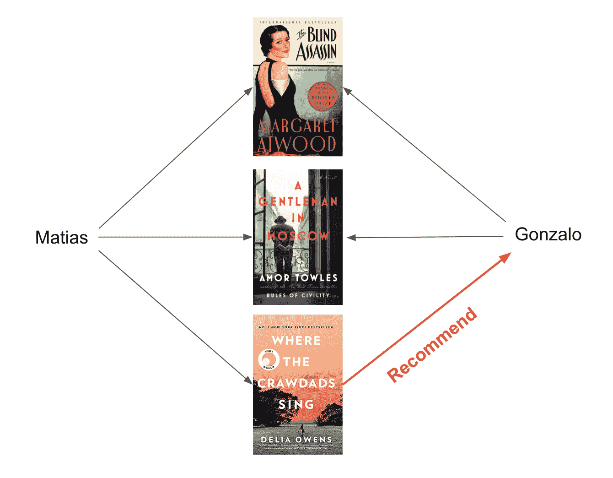
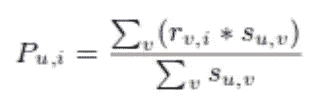
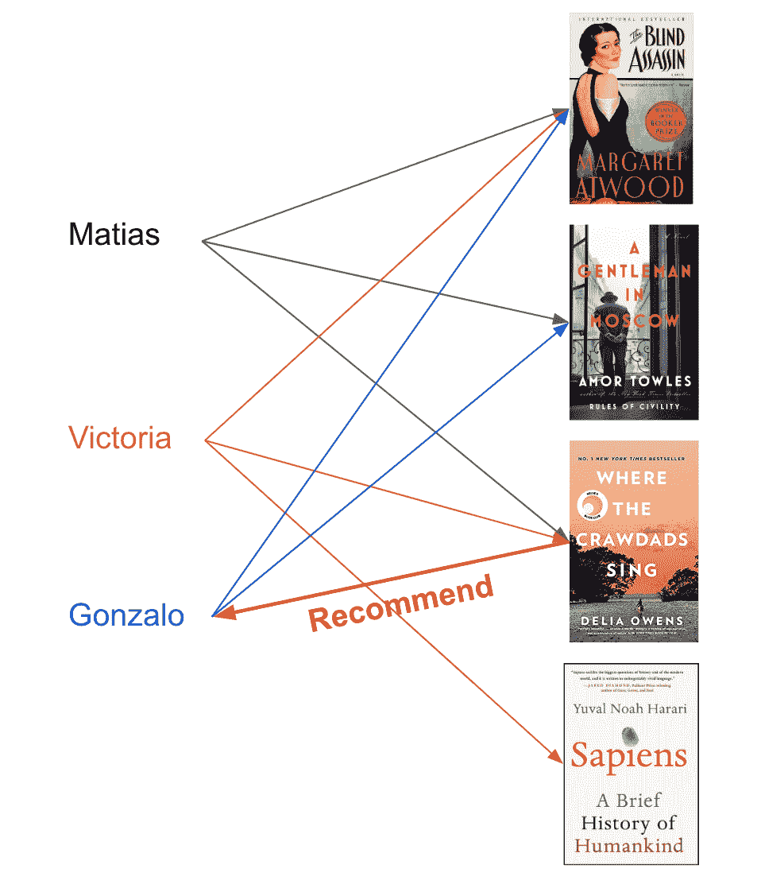

# 推荐系统简介

> 原文：<https://towardsdatascience.com/a-gentle-introduction-to-recommendation-systems-eaddcbde07ce?source=collection_archive---------16----------------------->


## 基于内容的过滤、协同过滤及实际应用

# 推荐系统简介

如果你正在阅读关于推荐系统的文章，你肯定已经知道我们将要讨论的内容，所以也许你可以跳过这一章。但是如果你是被封面图片所吸引，或者如果你想知道更多关于推荐系统在过去几年是如何出现和成长的，那么请继续关注这篇文章的这一部分。

让我们回到过去，试着想象一下:这是周五晚上，你想租一盘你最近的大片的录像带。你和你的女朋友去那里，已经在讨论你要租哪部电影了。也许是喜剧？或者一部动作片？一场雷雨即将来临，这给恐怖电影或惊悚片带来了完美的气氛。


当你在思考的时候，你的女朋友告诉你:“你在网上搜索过什么好的推荐吗？”。不幸的是，在你工作的时候，互联网一整天都是关闭的，不管怎样，你仍然试图让自己在万维网上到处都是那些晦涩难懂的东西。

你终于到了，但是经过近一个小时的考虑，你还是不知道该选什么。你已经看过所有受欢迎的电影，商店的首要部分全是废话。你不想吹毛求疵，但就是没什么好的。你的女朋友问桌子后面的大片伙伴，但他对电影的了解似乎比你爷爷少，而且他真的不喜欢孩子。天色已晚，你筋疲力尽，长话短说，你决定租一部你已经看过的老电影。保持它的健全和安全比你周五晚上的计划要好得多。

这个例子似乎很老了，但是在生活的很多方面，人们都在以相似的方式做决定。我可以向你保证，我爷爷想给自己买书的时候不会用谷歌。然而，对年轻人来说幸运的是，今天的决策在许多情况下更安全(我不知道我是否敢说更容易，或更快)，因为在谷歌上简单的搜索会给我们几十甚至几百条评论。然而，在线零售商想让你呆在他们的网站里。他们不希望你走出他们的网页，搜索一些评论，这些评论可能会引导你去另一家零售商那里购买你正在寻找的小玩意。甚至，因为无法解决或找到您想要的东西而暂停购买。

在这种背景下，推荐系统作为一种维护网站或应用程序内部受众的方式出现了。因此，首先，重要的是要明白，它是厌倦了失去客户的商家的工具。当然，这样做的结果是，商家试图用好的推荐来让他们的客户满意，否则，这个工具根本不会起作用。所以最终，对零售商和顾客来说，这是一个双赢的局面。

通常，推荐系统会利用我们之前的活动为我们提出具体的建议。现在，如果我们是第一次访问电子商务，它不会知道我们的任何事情，那么它怎么能给出合理的建议呢？最基本的解决方案是推荐最畅销的产品，一些最新版本，如果我们谈论的是电影或书籍，可能是经典系列，或者我们甚至可以推荐能给企业带来最大利润的产品。然而，构建智能推荐系统有可能提高销售和业务绩效，因此公司正在超越这些经典技术，构建更好、更强大的推荐系统。

# 构建推荐系统时的挑战

当我们试图向用户推荐商品时，我们面临着一些根本性的挑战:

*   **数据稀疏性**:有很多产品可以推荐给很多用户，而且一个用户不太可能试用很大一部分产品。相反，许多用户可能只需要几样东西，但很多人只需要几样。
*   **冷启动**:我们需要能够向那些我们只有很少数据(如果有的话)的用户提供建议。
*   **准确但多样的预测**:我们希望给出有用的推荐，即它们符合用户的偏好，但也希望推荐对用户来说包含一些新奇的东西。
*   **评估:**评估很困难，可能因算法而异。
*   **可扩展性**:即使有数百万的用户和项目需要我们仔细分析，我们也需要能够当场给出建议。
*   **用户界面:**用户想知道为什么会收到特别的推荐。
*   **易受攻击性**:我们不希望我们的推荐系统被滥用于推广或禁止特定项目。
*   **时间分辨力**:品味和喜好不会随时间保持不变。

面对这一切，我们会定期谈论用户和物品。在大多数情况下，我们会为每一对可能的用户和项目预测一个特定的评级。如果用户已经给出了一些评分，我们可以将其与我们的预测进行比较:


# 设计我们的推荐系统

基本上有两种方法:

*   **基于内容的过滤**

这个替代方案推荐类似于每个特定用户过去已经喜欢的产品。就拿推荐一本书来说，如果用户喜欢《哈利·波特与魔法石》这本书，但没有给《哈利·波特与被诅咒的孩子》排名，我们可以推荐后者。

基于内容的过滤使用特定的相似性度量。相似性度量仅仅是获得用户或项目的向量之间的距离的度量。它本身是一个非常广泛的数学概念，所以我们不打算在本文中更多地讨论它(不过我可能会在将来写更多关于它的内容，所以请保持关注)。但是，例如，我们可以使用余弦相似性来度量项目向量之间的距离，按降序排列它们，然后使用以下方法之一向任何给定用户推荐项目:

*   **Top-n 方法:**推荐前 n 部电影的地方。在这种情况下，该数字通常由企业定义
*   **分级方法:**设定一个阈值，将高于该阈值的所有电影推荐给用户

这种技术的最大问题是，它将总是限于用户过去购买或排序的相同类型的项目。因此，以我们的书籍为例，如果用户以前从未购买过与商业相关的书籍，它就不会推荐这一类别的书籍。

*   **协同过滤**

文章的这一部分主要基于来自 [Analytics Vidhya](https://www.analyticsvidhya.com) 的内容，因为那里几乎所有的内容都得到了完美的解释，我不想重新发明轮子:)

说到这里，为了理解这个算法，让我们继续我们关于书籍的例子:假设我喜欢以下书籍:《盲人刺客》和《莫斯科的绅士》。我的朋友马蒂亚斯也喜欢《盲人刺客》和《莫斯科绅士》，但也喜欢《小龙虾歌唱的地方》。似乎马蒂亚斯和我有相同的兴趣。所以你可能会肯定我也喜欢《小龙虾歌唱的地方》,尽管我没有读过。这正是协同过滤背后的逻辑，唯一的例外是你可以在他们之间比较用户，或者比较项目。让我们看看每种方法是如何工作的:

*   **用户-用户协同过滤**

这个例子和我们刚才提到的例子一模一样。如果用户 A 喜欢或购买与用户 B 相同的物品，那么我们可以推荐用户 A 喜欢但用户 B 还不喜欢的物品。反之亦然。我们将通过使用相似性度量来比较两个用户对所有排序/购买/喜欢的项目的向量，从而找到它们之间的相似性:



预测 Pu，I 由下式给出:



其中:

*   Pu，I 是一个项的预测
*   Rv，I 是用户 v 对电影 I 的评价
*   苏，v 是用户之间的相似度

在我们的图书例子中，这似乎很容易，但是现在想象一下，你和你的亚马逊有成千上万的用户和评级。思考计算问题？嗯，你说得对:这种情况下这个算法很重。为了解决这个问题，公司使用邻居逻辑，只选择固定数量的用户进行预测，而不是使用所有的用户。我们可以通过几种方式做到这一点:

然而，该算法相当耗时，因为它涉及计算每个用户的相似性，然后计算每个相似性得分的预测。处理这个问题的一种方式是仅选择几个用户(邻居)而不是所有用户来进行预测，即，不是对所有相似性值进行预测，而是仅选择几个相似性值。有几种选择邻居的方法:

*   选择一个阈值相似性，并选择高于该值的所有用户
*   随机选择用户
*   安排 desc 的邻居。排序他们的相似性值并选择前 N 个用户
*   使用聚类选择邻居

在选择查看 k 个最相似用户的情况下，预测等式将被转换成如下:


这里𝑁𝑘𝑖(𝑢)表示与评价项目𝑖.的用户𝑢最相似的𝑘用户

作为一个例子，让我们以用户相似性(例如相关相似性)为例，我们将考虑用户 1 的两个最近邻居:


*   **项目-项目协同过滤**

在该算法中，我们计算每对项目之间的相似性:



在这种情况下，算法会再次向我推荐《小龙虾歌唱的地方》，但这只是因为马蒂亚斯、维多利亚和我，我们三个人都喜欢《盲刺客》，而《小龙虾歌唱的地方》是马蒂亚斯和维多利亚都喜欢的唯一一本书。因此，在这种情况下，我们不采用“用户-邻居”评级的加权和，而是采用“项目-邻居”评级的加权和。预测结果由下式给出:


# 使用协作过滤器

最后，为了应用我们刚刚看到的一些概念，我们将重新访问非常受欢迎的 movielens 数据集(在我的 [GitHub 帐户](https://github.com/gonzaferreiro)中可用)，应用来自 [Analytics Vidhya](https://www.analyticsvidhya.com) 的技术和来自我的[大会沉浸式课程](https://generalassemb.ly/education/data-science-immersive/london)的一些其他技术，使用相同的数据集:

movielens 数据集包含不同的表:

*   用户表:包含年龄、性别、职业和邮政编码等信息
*   项目表:包含电影标题、上映日期、类型、IMBd URL 等等
*   评级表:这是我们将要使用的。

让我们看看最后一个:


现在我们知道了所有这些，让我们一步一步来得到我们的预测:

首先，我们需要创建一个用户-项目矩阵，用于计算用户和项目之间的相似性:

```
n_users = ratings.user_id.unique().shape[0]
n_items = ratings.movie_id.unique().shape[0]
```

现在，我们将创建一个充满零的矩阵，然后我们将遍历评级中的每一行，用评级填充用户行和电影列:

```
data_matrix = np.zeros((n_users, n_items))
**for** line **in** ratings.itertuples():
    data_matrix[line[1]-1, line[2]-1] = line[3]
```

现在，我们将计算相似度。根据定义，规则余弦相似性反映了方向的差异，而不是位置的差异。因此，它没有考虑用户评分的差异。经调整的余弦相似性通过减去平均评级来抵消这一缺点。因此，我们将创建一个函数来查找调整后的余弦相似度:

```
**from** **scipy** **import** spatial**def** adjusted_cos_distance_matrix(size, matrix, row_column):
    distances = np.zeros((size,size))
    **if** row_column == 0:
        M_u = matrix.mean(axis=1)
        m_sub = matrix - M_u[:,**None**]
    **if** row_column == 1:
        M_u = matrix.T.mean(axis=1)
        m_sub = matrix.T - M_u[:,**None**]
    **for** first **in** range(0,size):
        **for** sec **in** range(0,size):
            distance = spatial.distance.cosine(m_sub[first],m_sub[sec])
            distances[first,sec] = distance
    **return** distances
```

现在，让我们找出用户和项目的相似性:

```
user_similarity = adjusted_cos_distance_matrix(n_users,data_matrix,0)
item_similarity = adjusted_cos_distance_matrix(n_items,data_matrix,1)
```

最后，让我们做个预测:

```
def predict(ratings, similarity, type='user'):
    if type == 'user':
        mean_user_rating = ratings.mean(axis=1)
        ratings_diff = (ratings - mean_user_rating[:, np.newaxis])
        pred = mean_user_rating[:, np.newaxis] + similarity.dot(ratings_diff) / np.array([np.abs(similarity).sum(axis=1)]).T
    elif type == 'item':
        pred = ratings.dot(similarity) / np.array([np.abs(similarity).sum(axis=1)])
    return pred
```

如您所见，我们使用了 np.newaxis，因此 mean_user_rating 与 ratings 具有相同的格式。点击了解更多关于 np.newaxis [的信息。](https://stackoverflow.com/questions/29241056/how-does-numpy-newaxis-work-and-when-to-use-it)

```
user_prediction = predict(data_matrix, user_similarity, type='user')
item_prediction = predict(data_matrix, item_similarity, type='item')
```

让我们检查一下预测矩阵的形状:


最后，除了创建推荐系统之外，让我们使用之前创建的预测创建一个函数。它会找到用户没有评级的电影(因此没有看过)，并根据我们的预测给我们排名前 5 的电影。

```
**def** finding_movies_for_user(user, ratings, preds):
    recos = {'movie_id': [],'rating': []}
    user_array = preds[user]
    orig_rat = ratings[user]
    **for** each **in** range(0,len(orig_rat)):
        **if** orig_rat[each] == 0:
            recos['movie_id'].append(each+1)
            recos['rating'].append(user_array[each])
    recos_df = pd.DataFrame(recos)
    final_recos_df = pd.merge(recos_df, items[['movie_id','movie_title']],
                              how='left', on='movie_id')
    **return** final_recos_df.sort_values(by='rating',ascending=**False**).head(5)
```

让我们用一个随机用户来测试一下。


哇，太神奇了！我们已经设法为任何给定的用户获得了我们的第一批推荐。当然，推荐系统是一个非常广泛的话题，我们还可以谈论更多:相似性度量、性能评估、更复杂的获取推荐的技术等等！我可能会在未来写更多关于这方面的内容，但同时，请随意查看我的 [GitHub 账户](https://github.com/gonzaferreiro)，那里有一些不错的项目，包括带有 movielens 数据集的完整推荐系统项目:)

顺便说一句，如果你对推荐系统感兴趣，可以看看我上一篇关于[使用奇异值分解](/singular-value-decomposition-for-non-mathematicians-c79e70419a3e)改进你的推荐系统的文章，以及我的[作者简介](https://towardsdatascience.com/@g.ferreiro.volpi)中的更多内容。如果你喜欢这篇文章，别忘了关注我，**如果你想直接在你的电子邮件上收到我的最新文章，只需订阅我的时事通讯:)**

[](https://gmail.us3.list-manage.com/subscribe?u=8190cded0d5e26657d9bc54d7&id=3e942158a2)

干杯。