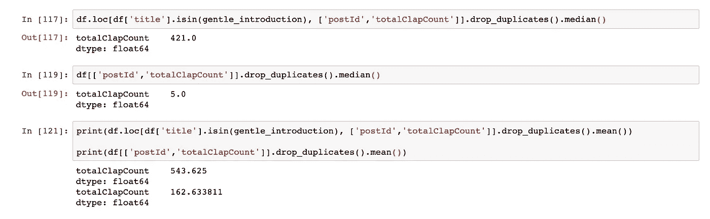
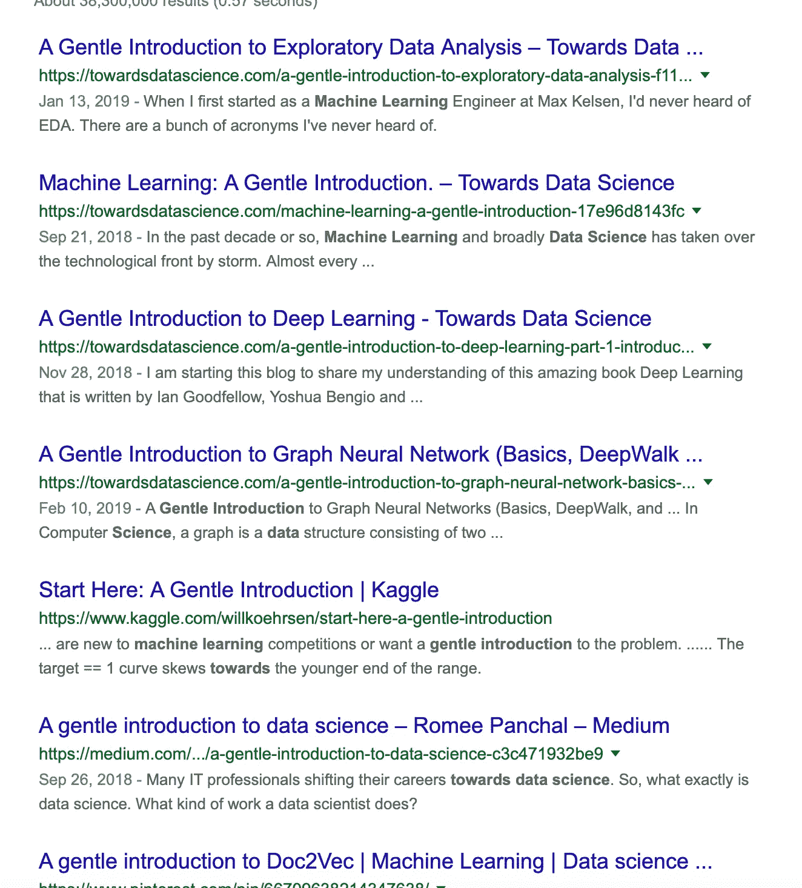

# 写委婉介绍的委婉介绍

> 原文：<https://towardsdatascience.com/a-gentle-introduction-to-writing-gentle-introductions-d87c69268362?source=collection_archive---------29----------------------->

[Source](http://wesmd.com/be-gentle/)

## 如果你给你的文章起了别的标题，人们怎么知道你写的是关于数学的呢？

你是谁？你，对一些听起来很可怕的事情很了解，却想让人们知道这个事情！你的动机当然不是想让人们知道你知道这件事——当然不是。你的动机肯定不是展示那些软技能，那些你在 LinkedIn 网络上认可的沟通技能。不。你希望世界有一个容易获得的资源来学习[中心极限定理](https://machinelearningmastery.com/a-gentle-introduction-to-the-central-limit-theorem-for-machine-learning/)，或者[稀疏矩阵](https://machinelearningmastery.com/sparse-matrices-for-machine-learning/)，或者[神经网络](/a-gentle-introduction-to-neural-networks-14e5c02bafe)，或者[神经网络](https://www.codementor.io/james_aka_yale/a-gentle-introduction-to-neural-networks-for-machine-learning-hkijvz7lp)，或者[神经网络](https://machinelearningmastery.com/convolutional-layers-for-deep-learning-neural-networks/)，甚至[神经网络](https://clevertap.com/blog/neural-networks/)！

[Source](https://www.lifesitenews.com/news/quebec-begins-mandatory-sex-ed-teaching-5-year-olds-about-masturbation-geni)

你必须强调这个概念是如何可接近的，不要介意这个概念的完整推导是某人花了五年时间写博士论文的主题。不，作为一个受人尊敬的媒介传播者，你可以将这个想法提炼为一段估计为“6 分钟阅读”的文字。亲爱的作家，不要担心，如果你的主题对于一篇六分钟的中型文章来说确实太复杂了。这就是范围和背景假设的辉煌写作手段发挥作用的地方。例如，如果你试图通过梯度下降来解释反向传播，这是一个完全公平的假设，即阅读你的帖子的机器学习爱好者具有足够好的多变量微积分背景，能够通过将链规则应用于你的网络的权重、偏差和激活的梯度来理解你在做什么，因为它们与你的通用示例损失函数相关。如果他们没有这方面的背景，那么这就“超出了”你的文章的范围——不需要再想了！

哦，有帮助的、知识渊博的作家，不要担心在这一点上你的数学密集、充满隐喻的文章不再是“温和的介绍”。更改你的标题不符合任何人的利益，所以你对支持向量机松弛变量的温和介绍将经受住中等出版物编辑的严格编辑。想想看:你的标题对技术和非技术读者有广泛的吸引力，你的材料符合出版物的使命，增加的流量同样遵循出版物的使命。“流量增加了！”你暗自思忖，对宣传你的作品的潜在点击诱饵的指控感到震惊，“这个骗子如何证明这是真正的点击诱饵？”亲爱的有用的作者，使用下面关于机器学习和数据科学的中型文章的调查，我们可以看到明确的证据，一旦短语“温和的介绍”出现在你的标题中，鼓掌的中位数和平均数都会飙升。

Some Examination of Clap Totals in “Gentle Introductions” vs All Other Medium Data Science Posts [DATA](https://www.kaggle.com/aiswaryaramachandran/medium-articles-with-content)

记住所有这些，不要考虑改变你的标题，当然不要偏离成功的媒体文章公式，无论你做什么，**不要**试图将你自己从众多知识渊博的数据科学作家中区分出来，旨在帮助所有“有抱负的数据科学家”。你的工作太重要了，以前肯定没有人写过。

