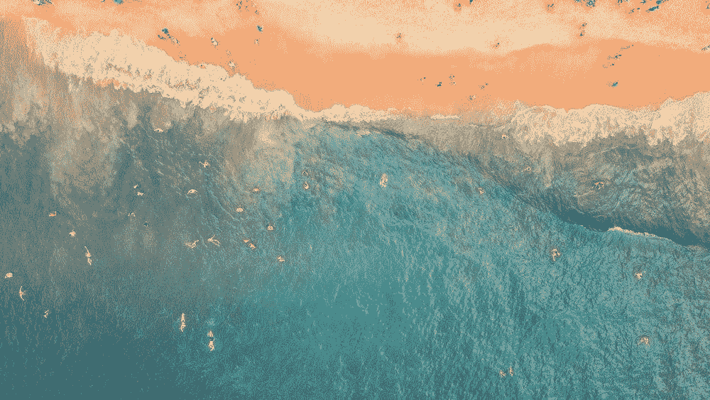
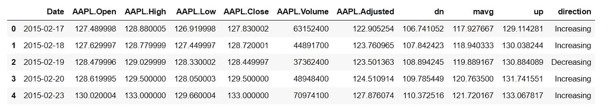
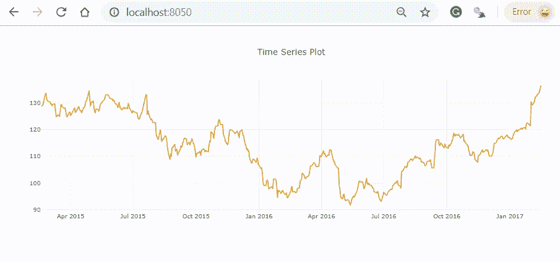
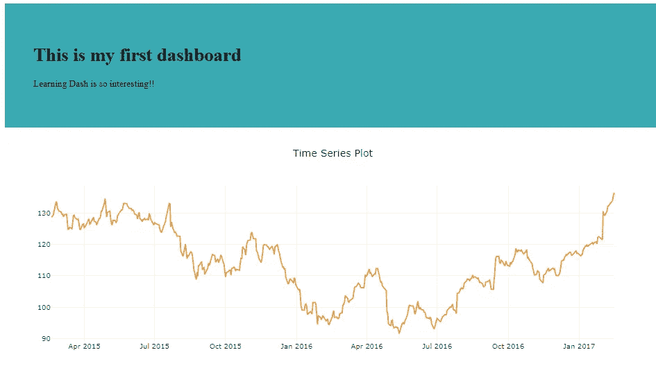
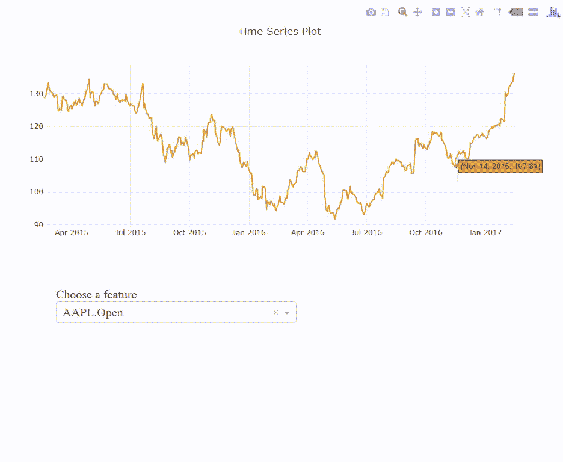
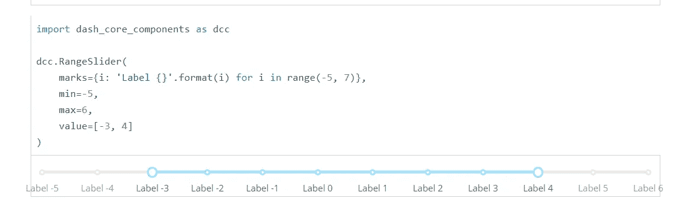
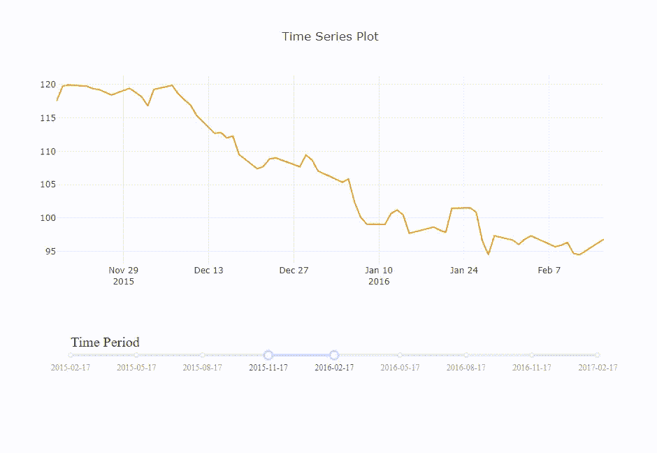

# 可视化的另一个阶段:对 Dash 做出反应

> 原文：<https://towardsdatascience.com/a-gentle-invitation-to-interactive-visualization-with-dash-a200427ccce9?source=collection_archive---------7----------------------->

## 一个温柔的邀请



Dash 是一个开源的 python 库，它使我们能够用 Plotly 创建 web 应用程序。使用简单的反应式装饰器，如下拉菜单、滑动条和降价文本数据，可以很容易地构建交互式可视化。我们甚至可以使用回调函数根据输入数据更新图表，所有这些功能都可以直接使用，不需要 Javascript 或 HTML。Plotly 是一个非常强大的工具，它使我们能够以一种方便的方式制作一个信息丰富且有效的情节，Dash 可以被视为展示令人敬畏的可视化的舞台。

今天我将向你展示如何用 Plotly 创建一个仪表板。我们将制作一个时间序列线图，并添加一个下拉菜单和一个与该图交互的滑动条。有关于如何使用这个库的很好的文档，但是我发现一开始可能很难阅读示例代码并使用它们。因此，这可能是一个善良的桥梁，让你了解如何使用破折号与 Plotly。

# 装置

要构建一个仪表板，我们需要安装如下一些包。

```
pip install plotly==2.5.1
pip install dash==0.21.0
pip install dash-core-components==0.22.1
pip install dash-html-components==0.10.0
pip install dash-renderer==0.12.1
```

正如我上面所说，`dash-core-components`不仅允许我们构建图形，还允许我们构建下拉列表和文本框，这样我们就可以相应地更新组件。`dash-html-components`使我们能够在 Python 中使用 HTML & CSS。它帮助我们在仪表板上放置 HTML 组件，如 Div、H1 和 H2。

如果这是你第一次使用破折号和 HTML 语法，它可能有点复杂和难以阅读。因此，我建议您将以下脚本作为 Dash 的基本指南。从现在开始，我们要做的是一步一步地填写这个。

首先，我们导入库。您可以根据需要添加其他库。然后我们通过调用 Dash 类来初始化 Dash。这就像在我们的桌子上放一块空白的白板，我们所做的就是在这块板上构建更多的应用程序。

```
**# Step 1\. Launch the application**
app = dash.Dash()**# Step 2\. Import the dataset**
df = pd.read_csv('finance-charts-apple.csv')
```

现在让我们从*熊猫*的 CSV 文件中提取一些材料。我们要使用的数据集是苹果公司的股票价格数据，这里的[](https://raw.githubusercontent.com/plotly/datasets/master/finance-charts-apple.csv)**。**

****

# **仪表板上的简单散点图**

**关于 Plotly 本身的细节我就不多说了，但是如果有必要的话你可以从这个视频[](https://www.youtube.com/watch?v=yBU3uPzyQOg&index=2&list=PLE50-dh6JzC4onX-qkv9H3HtPbBVA8M94)****中找到一个关于 Plotly 的很好的教程。在这一系列的视频中，你还可以学习如何制作 3D 绘图或 Choropleth 地图。这里我们将绘制一个显示股票价格波动的线图。******

```
******# Step 3\. Create a plotly figure**
trace_1 = go.Scatter(x = st.Date, y = st['AAPL.High'],
                    name = 'AAPL HIGH',
                    line = dict(width = 2,
                                color = 'rgb(229, 151, 50)'))layout = go.Layout(title = 'Time Series Plot',
                   hovermode = 'closest')fig = go.Figure(data = [trace_1], layout = layout)****
```

******现在，该是`dash-html-components`出场的时候了。我们先放一个除法，然后把图形放进去。`id`正在给这个组件命名，这样我们就可以用它的名字来称呼它。以后你就明白这是干什么用的了。然后，我们在步骤 6 中创建一个运行的服务器。如果我们设置调试模式等于真，我们可以很容易地改变和更新应用程序，而服务器正在运行。******

```
******# Step 4\. Create a Dash layout**
app.layout = html.Div([
               ** dcc.Graph(id = 'plot', figure = fig)**
                      ])**# Step 6\. Add the server clause**
if __name__ == '__main__':
    app.run_server(debug = True)****
```

******我们用 ***app.py*** 的名字保存这个脚本，在终端上导入(或者 anaconda 提示)。请注意，工作目录应该与您保存文件的位置相同。******

```
**C:\Users\jjone\Dash> **python app.py****
```

****如果没有打字错误或语法错误，您将看到本地主机地址。你可以复制并粘贴它，也可以在一个新的网页标签上输入 **localhost:8050** 。****

********

# ****添加页眉和段落****

****我们也可以有额外的组件，如把文本数据就像 HTML。你可以在 这里找到 [**有哪些元素。让我们在页面上放一个简单的标题和一段文字。**](https://dash.plot.ly/dash-html-components)****

```
****# Step 4\. Create a Dash layout**
app.layout = html.Div([
       **    # adding a header and a paragraph
                html.Div([
                    html.H1("This is my first dashboard"),
                    html.P("Learning Dash is so interesting!!")
                         ], 
                  **  style = {'padding' : '50px' , 
                             'backgroundColor' : '#3aaab2'}),# adding a plot        
                dcc.Graph(id = 'plot', figure = fig)
                   ])**
```

****在图表的顶部，我将再添加一个部分，并在其中添加一个标题和一个段落。我们有两个主要组件，`html.Div`里面的`html.Div`和`dcc.Graph.`，还有两个附加组件，头(`html.H1`)和段(`html.P`)。我们可以用`style`属性改变组件的边距或背景色。它应该以支持 CSS 属性的字典格式来指定。****

****请特别注意括号的开始和结束位置。理解每个部分的段落范围是很重要的。由于有太多的括号和方括号，一开始可能会令人困惑。而且很容易犯语法错误。****

****将步骤 4 中的代码放入我们的模板中，看看结果。如果服务器没有关闭，我们可以通过按 F5 来检查结果。****

********

****现在，我希望您了解什么是 dash 组件和 HTML 组件。如何将多个组件放在一起，以及如何将它们放在一起。****

# ****下拉式****

****这次让我们试着在仪表板上做一个下拉菜单。我们要做另一个图，根据给定的选项改变它的 y 轴。通过 [**仪表板组件**](https://dash.plot.ly/dash-core-components) 的文档，我们可以把`Dropdown`整理如下。****

********

****如您所见，这些选项应该是字典格式的。在我们的例子中，选项将是只有连续变量的列，从第 2 列到第 10 列。有了列表理解，我们可以只用一行就做出选项字典。****

```
**features = st.columns[1:-1]
opts = [{'label' : i, 'value' : i} for i in features]**
```

****现在，我们将下拉组件放在绘图的底部，而不是 HTML 组件。先看一下粗体字，因为其他的只是为了修饰两大应用。`value`是下拉列表的默认值。****

```
****# Step 4\. Create a Dash layout**
app.layout = html.Div([
                # adding a plot
                dcc.Graph(id = 'plot', figure = fig), **# dropdown**
        **html.P([
                    html.Label("Choose a feature"),
                    dcc.Dropdown(id = 'opt', 
                                 options = opts,
                                 value = opts[0])
                        ],** style = {'width': '400px',
                                    'fontSize' : '20px',
                                    'padding-left' : '100px',
                                    'display': 'inline-block'}**)**
                      ])**
```

****正如我们之前所做的，我们可以在模板的第 4 步替换这段代码，并检查结果。****

# ****使用回调连接到图形****

****为了根据下拉列表的选择更新图表，我们需要在输入数据(下拉列表)和输出数据(图表)之间建立一个连接。这将通过在步骤 5 中添加一个回调函数来完成。****

```
****# Step 5\. Add callback functions**
[**@app**](http://twitter.com/app)**.callback(**Output('plot', 'figure'),
             [Input('opt', 'value')]**)****
```

****你记得我们给每个组件赋予了什么`id`吗？ ***剧情*** 和 ***opt。*** 因此我们可以如上图用它们的名字来称呼它们。我们从名为 ***opt*** 的选项中获取输入数据，并将输出给名为 ***plot*** 的线图。****

```
****def** update_figure(**X**):
    trace_2 = go.Scatter(x = st.Date, **y = st[X],**
                       ** name = X,**
                        line = dict(width = 2,
                                    color = 'rgb(106, 181, 135)'))
    fig = go.Figure(data = **[trace_1, trace_2]**, layout = layout)
    **return** fig**
```

****因此，我们获取输入数据，然后通过创建更新函数返回我们想要的输出。这里我们的输入数据是什么？这是从下拉列表中选择的特征变量的名称，我们将它作为第二个线图的 y 轴。由于`trace_1`没有什么可改变的，我们可以简单地将`trace_2` 添加到数据表中。现在，如果我们将这段代码放到第 5 步，并重新运行 **app.py** ，结果将如下所示。****

********

****在我们进入下一部分之前，我想简单谈一下回调。因为这是编写任何应用程序时最常用的函数之一。简单来说， [***一个回调***](https://en.wikipedia.org/wiki/Callback_(computer_programming))*是一个在得到真正的执行命令之后再执行的函数，通常是为了更新。回调函数在得到命令后不能正常工作。这些人都是那种*。它们将在其他命令行被执行后执行它们的工作，我们 ***调用*** 它们 ***返回*** 再次执行真正的命令。******

******看看我们的`update_figure()`是怎么运作的。这个函数不是在我们导入这个应用程序之后，而是当我们通过“回调”给它实际的输入信号时，才开始工作这就是回调函数。你在不理解的情况下使用它是完全没问题的，但是我希望你在这里得到粗略的想法。你还可以从 [**这篇文章**](https://codeburst.io/javascript-what-the-heck-is-a-callback-aba4da2deced) 中找到更多细节。******

# ******范围滑块******

******最后，让我们尝试一个范围滑块。我们将在图中添加一个年范围滑块，它非常类似于下拉菜单。让我们先查看一下 dash 组件的文档。******

************

******我想这时候你很容易就明白了。这里的重点是如何做一个标记字典。由于日期周期从(2015 年 2 月 17 日 *)* 开始到(2017 年 2 月 17 日)*，*我想在周期之间添加 7 个标记，如下所示。******

```
****st['Date'] = pd.to_datetime(st.Date)
dates = ['2015-02-17', '2015-05-17', '2015-08-17', '2015-11-17',
         '2016-02-17', '2016-05-17', '2016-08-17', '2016-11-17',  
         '2017-02-17']date_mark = {i : dates[i] for i in range(0, 9)}****
```

******现在，我们可以简单地将范围滑块放在下拉位置。这次我把它命名为 ***滑块*** 。`min`和`max`是滑块的最小值和最大值，`value`是滑块的默认设置。同样，所有其他部分都在设计 CSS 样式的 HTML 组件。******

```
******# Step 4\. Create a Dash layout**
app.layout = html.Div([
                # adding a plot
                dcc.Graph(id = 'plot', figure = fig), **# range slider
                html.P([
                    html.Label("Time Period"),
                    dcc.RangeSlider(id = 'slider',
                                    marks = date_mark,
                                    min = 0,
                                    max = 8,
                                    value = [3, 4]) 
                        ],** style = {'width' : '80%',
                                    'fontSize' : '20px',
                                    'padding-left' : '100px',
                                    'display': 'inline-block'}**)**
                      ])****
```

******做好滑块后，下一步会做什么？把它和剧情联系起来！我们将再次从 ***滑块*** 获取输入数据，并将输出返回到 ***图*** 。但是这一次，这里有个小技巧。您是否注意到滑块的默认值是一个包含两个值的列表？请再次检查上面的代码框。`**value = [3, 4]**`与下拉组件不同，范围滑块在一个列表中接受两个值。因此，当我们从滑块中获取输入数据时，会有两个值，即起始值和结束值(`**X[0]**`、`**X[1]**`)******

```
******# Step 5\. Add callback functions**
[@app](http://twitter.com/app).callback(Output('plot', 'figure'),
             [Input('slider', 'value')])
**def** update_figure**(X):**
    **st2 = st[(st.Date > dates[X[0]]) & (st.Date < dates[X[1]])]**
    trace_1 = go.Scatter(x = st2.Date, y = st2['AAPL.High'],
                        name = 'AAPL HIGH',
                        line = dict(width = 2,
                                    color = 'rgb(229, 151, 50)'))
    fig = go.Figure(data = [trace_1], layout = layout)
   ** return** fig****
```

******现在我们将过滤数据，并用给定的周期更新图形。如果你再次重新加载网页，你会看到与我相同的结果。******

************

# ******把这些都集中起来！******

******我想到目前为止我们已经谈了很多了。从放图到添加回调。现在我们为什么不把它们都放在一起？我建议你一步一步地阅读下面的脚本。您可以在第 4 步中组合图形、下拉菜单和滑块的所有组件，就像替换和更改模块一样。******

******你准备好看看我们的第一个仪表板是什么样子了吗？😃😃🙌🙌嘣！！******

************

******干得好！你喜欢制作仪表板吗？我希望现在您能够轻松阅读和理解其他 Dash 代码示例。Dash 提供了[**这样一个不错的指南**](https://dash.plot.ly/) 所以你可以随意探索自己的网站。你也可以通过 Plotly 查看 Dash 中的其他内容。******

******[](https://medium.com/@plotlygraphs/introducing-dash-5ecf7191b503) [## 🌟引入破折号🌟

### 用纯 Python 创建反应式 Web 应用程序

medium.com](https://medium.com/@plotlygraphs/introducing-dash-5ecf7191b503) 

# 部署

到目前为止，我们的应用程序本地托管在您的机器上。为了让其他人也能使用它，我们需要将它部署在 web 上。有两个选择可以选择，App 授权和部署到 Heroku。第一种要求我们安装`[dash-auth](https://github.com/plotly/dash-auth)`包，有两种不同类型的认证，HTTP Basic Auth 或 Plotly OAuth。可以按照 [**这个教程**](https://dash.plot.ly/authentication) 。

另一种方式是通过使用 Heroku、AWS、Google 云平台等托管平台。Heroku 是最简单的部署方式，你可以按照这个教程[](https://dash.plot.ly/deployment)**。其他平台和 Heroku 一样。**

**除了下拉菜单，我们还可以添加其他组件，如文本区或上传数据。我建议你去了解一下有什么样的仪表板部件。您还可以添加任意数量的 HTML 组件，并使用 CSS 属性以更奇特的方式设计您的电路板。如果你需要学习一些 HTML & CSS 的基础知识，可以从 [**这个视频**](https://www.youtube.com/playlist?list=PLB5jA40tNf3vh75MBwUb4oqiXFOZ5pYyX) 中找到很棒的教程。**

**感谢您的阅读，希望您对这篇文章感兴趣。如果有什么需要改正的地方，请和我们分享你的见解。我总是乐于交谈，所以请在下面留下评论，分享你的想法。我还在 [LinkedIn](https://www.linkedin.com/in/jiwon-jeong/) 上分享有趣和有用的资源，所以请随时关注并联系我。下次我会带着另一个有趣的故事回来的！********