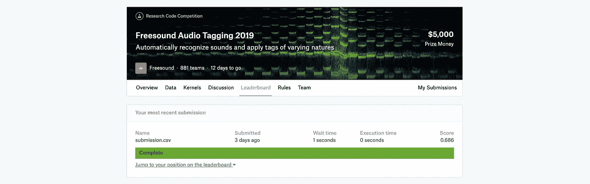
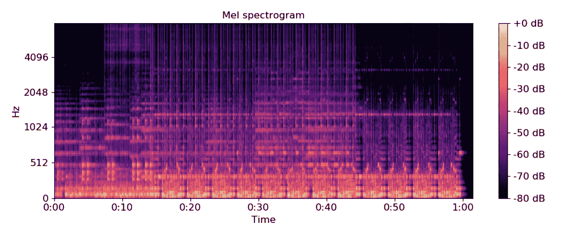
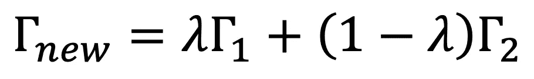
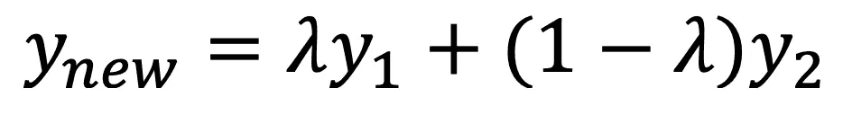
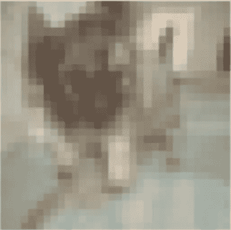
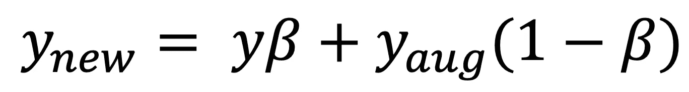
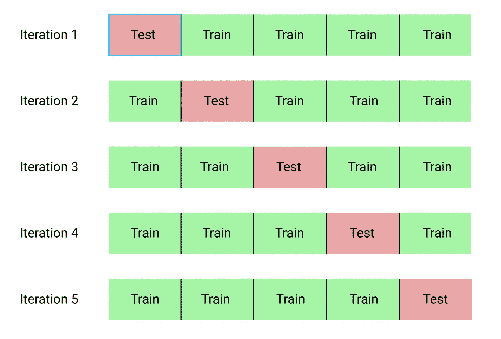
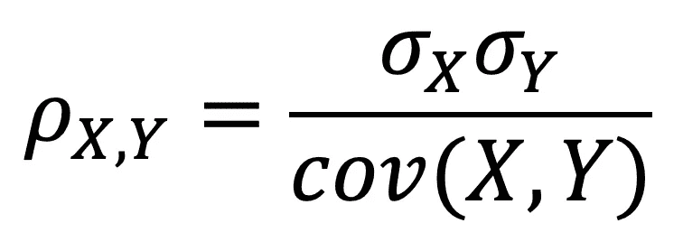

# 竞争数据科学一瞥:计算机视觉的最佳实践

> 原文：<https://towardsdatascience.com/a-glance-into-competitive-data-science-the-best-practices-for-computer-vision-2c77c5d98d19?source=collection_archive---------16----------------------->

## 几种技术如何显著提高计算机视觉模型的性能…

# **简介**

S 由于 2019 年 Freesound Audio Tagging 比赛即将结束，我决定写一篇关于构建健壮的计算机视觉模型的最佳实践和技术的文章，这是我在第一次研究比赛中学到的。此外，这是我把我的想法写在纸上的一种方式，以便对我所使用的技术有一个结构化和清晰的概述:那些工作良好的技术，以及那些没有在我的测试分数中产生显著提高的技术。

作为 Fast.ai 课程的学生，我仍然处于学习旅程的最开始，因此一些评论或技术对于最有经验的人来说可能是显而易见的。

像往常一样，我强烈鼓励你纠正我，如果你不明白或者不清楚，可以问我关于某一点的精确信息，并在评论区添加一些评论！

> 我从这场比赛中得到的最重要的教训是，建立稳健的模型是一个经验过程。竞争有助于培养直觉，知道什么可行，什么不可行。

给你一点背景，比赛是关于标记(分类)声音(猫，瀑布，乐器…)。我们得到了两个数据集:一个是有清晰可闻声音的精选数据集(4970 个条目)，另一个是有声音和一些背景噪音的嘈杂数据集(20000 多个条目)。请注意，每个数据条目都有多个标签。两个数据集都被标记了。竞赛的主要挑战(由绝大多数参与者确定)是正确使用有噪声的数据集来提高精选数据的性能。

我们根据一个定制的指标进行评估:标签加权的标签排名平均精度也缩写为 *lwlrap* 。为了给出一个尺度，前 1%的人获得了 0.76 的 lwlrap 分数，而铜牌(大约前 12%)以 0.695 或更高的分数被授予。我在第一阶段的最终分数是 0.686，这使我进入了前 15%。

# 快速傅立叶变换和 melspectrograms:如何将声音输入 CNN？

从文章开始，你可能会觉得我同时谈论计算机视觉和声音很奇怪。事实上，声音是由多个样本组成的基于时间的信号。起初，我们可能认为可以通过应用 1D 卷积将声音输入到 CNN 或 LSTM 的模型中。然而，这两种技术都没有产生令人信服的结果，可能是由于将原始信号输入到模型中导致了信息的丢失。馈送原始信号会导致信息(即频率、相位、幅度)的显著损失。经过一些实验，两个模型都没有产生超过 0.5 的 lwlrap。相当失望…

作为音频分类的经验法则，我们通常将声音转换成更全面的 2D 表示(图像),然后输入 CNN。这种表示可以是 MFCC、色度、CQT 变换，但通常是梅尔频谱图。

Mel-spectogram of a signal plotted with Matplotlib

为了理解 mel 谱图是如何产生的，我们首先需要理解傅立叶变换对信号的影响。快速傅立叶变换(具有比原始版本 *o(n2)* 更低复杂度 *o(nlogn)* 的修改算法)将声音信号从其原始时域转换成频域中的表示。

然后我们应用一系列变换，最终得到 mel 谱图表示。

为了执行这一系列的计算，你可以直接使用 *librosa* 库，该库具有各种功能来执行音频特征分析。

**附加阅读**:

*   如何在 Python 中把声音转换成图像(Daisukelab 的一个内核):[https://www . ka ggle . com/Daisukelab/creating-fat 2019-预处理-数据](https://www.kaggle.com/daisukelab/creating-fat2019-preprocessed-data)
*   一套用于音频特征分析的笔记本:[https://musicinformationretrieval.com/](https://musicinformationretrieval.com/)
*   Python 中的 *librosa* 库介绍:[https://towardsdatascience . com/audio-classification-using-fastai-and-on-the-fly-frequency-transforms-4 dbe1 b 540 f 89](/audio-classification-using-fastai-and-on-the-fly-frequency-transforms-4dbe1b540f89)

# Mixup:在计算机视觉中实现艺术效果的必备工具

简单地说，Mixup 是一种数据扩充技术，它根据两个现有数据条目之间的线性关系创建新的数据条目。我们可以用这个公式来总结。γ是代表图像的张量，而λ是权重。

相同的变换应用于目标:

它只不过是两个现有数据样本的加权平均值。例如，我们可以选择λ = 0.7。如果γ1 代表狗，γ2 代表猫，new 将代表介于狗和猫之间的东西，比猫离狗更近。如果你查看与 new 相关的图像，它可能对你没有太大意义，但对计算机来说，它显然看到了一只狗，因此增加了狗的图像数据集。

Representation of a new data sample using Mixup (credits: Fast.ai)

如您所见，通过从其他现有数据创建新数据，它可以作为一种强大的数据扩充技术。当你不得不处理阶级不平衡时，这是特别有用的。在这次比赛中就是这种情况(有些品牌出现的次数很少，而其他品牌出现的次数很多)。这个技巧帮助我打破了 0.6 lwlrap 的障碍，在排行榜上从 0.57 上升到 0.65(结合下面列出的其他技巧)。

**附加阅读**:

*   Mixup 原创研究论文:【https://arxiv.org/abs/1710.09412 
*   关于 Mixup 的 Fast.ai 文档:【https://docs.fast.ai/callbacks.mixup.html 

# 训练时间增加(TTA):在排行榜中排名

训练时间增强(TTA)是一种在推理过程中使用的数据增强技术。TTA 的结果是通过计算标准预测和应用数据扩充技术后对数据集所做预测的加权平均值而获得的。不出所料，这个等式看起来与 Mixup 非常相似:

默认情况下，在 fast.ai 中，beta 系数设置为 0.4。

注意，在 Fast.ai 中，TTA 计算对数概率(因此是负数)。要从对数概率转换到“标准”概率(介于 0 和 1 之间)，只需计算概率的指数。

您可能面临的唯一问题是模型计算预测需要多长时间。特别是如果您的模型的执行有严格的时间限制，TTA 可能不是一个好的选择。

至于比赛，它让我从排行榜上的 0.57 跳到了 0.65。

# 迁移、半监督学习和伪标记

迁移学习包括用数据集预先训练你的模型，然后用最接近你想要预测的数据集训练它。这是一种允许更快训练和更稳定地收敛到损失最优值的技术。无论是计算机视觉还是基于 ULMFiT 模型和 BERT 的 NLP，它现在都是业界的标准。

对于这场比赛，我选择首先在嘈杂的数据集上预先训练我的模型，最终在精选的数据集上训练我的模型。在我的本地机器上，我的 lwlrap 从 0.81 跳到 0.83。让我们回想一下，比赛不允许预先训练的模型。

我尝试的第二种技术是半监督学习。如果您有大量未标记的数据，这将非常有用。它有助于模型映射数据分布，并允许更快的收敛。

> 你最好花一周时间来标记额外的数据，而不是试图创建一个模型来完美地利用未标记的数据。

我选择了一种特殊类型的半监督学习:伪标记噪声数据。在这个比赛中，我们有大量的噪音数据。我没有使用现有的标签，而是在精选的数据上训练了一个模型，然后使用这个模型来标记我的噪音数据。最终，通过将筛选的数据与新标记的噪声数据相结合，我重新训练了我的模型。尽管由于精确的数据分布和有噪声的数据分布之间的太大差异，它没有显著地提高性能，但是在集合模型中，性能提高了。

我可能会总结说，你最好花一周的时间来标记额外的数据，而不是试图创建一个模型来完美地利用未标记的数据。当你有大量的备用数据时，半监督学习技术通常是合适的。

**补充阅读**:

*   伪标签综合讲解:[https://www . analyticsvidhya . com/blog/2017/09/pseudo-labeling-semi-supervised-learning-technique/](https://www.analyticsvidhya.com/blog/2017/09/pseudo-labelling-semi-supervised-learning-technique/)

# K-Fold 交叉验证和 bootstrap 聚集:在推理过程中获得更稳定的结果

由于 K-Fold CV 在 fast.ai 课程中并没有特别突出，虽然是业界标配，但我并没有真正用过。让我快速回忆一下 K 折叠验证的定义:这是一种技术，通过这种技术，数据集被分成 K 个折叠，模型在 K-1 个折叠上被训练，并在剩余的折叠上被验证。显然，由于每个模型都有不同的验证集，所以会生成 K 个模型。这导致更准确和一致的性能评估。

A 5-fold cross-validation scheme

但是除了作为一种验证技术之外，K-Fold CV 还可以在一个集合模型中使用(对它的花哨说法是 *bootstrap aggregating* )。这个词隐藏了相当直接和简单的技术，例如，你计算你的 K 倍所有预测的平均值。这种集成技术通常会产生更好的性能，因为整个模型的方差大大减少了。

# 集合技术:进入前 5%的关键

我的上一段介绍了竞争数据科学的一个关键概念，广义地说是创建更精确的模型的概念:集成的概念。简而言之，集成是一种将几个模型放在一起以获得预测稳定性和精确度的技术。

为了实现一个高性能的集合模型，你需要检查所有模型之间的相关性。相关性越低越好。为此，您需要计算皮尔逊相关系数:

其中 *σ* 是统计数列的标准差， *cov(X，Y)* 是统计数列 X 和 Y 的协方差。

> 通过结合一个简单的基线模型和一个迁移学习模型以及一个伪标签模型，我获得了排行榜上的最高分:0.686。

说清楚一点，统计数列 X 和 Y 是你的模型的预测。对于您创建的每个模型，您可以计算彼此之间的皮尔逊相关系数，并丢弃高度相关的模型。

在这个竞赛中，X 和 Y 将是包含属于每个数据样本的 80 个类别之一的概率的矩阵。

至于比赛，组合技术显然给了我接近铜牌的机会。通过结合一个简单的基线模型和一个迁移学习模型以及一个伪标签模型，我获得了排行榜上的最高分:0.686。

**补充阅读**:

*   集成技术综合指南，从平均到叠加概括:**[https://mlwave.com/kaggle-ensembling-guide/](https://mlwave.com/kaggle-ensembling-guide/)**

# **从这里去哪里？**

**现在是时候对我的表现采取批评的观点了。因为我没有赢得奖牌，所以有很多事情我可以改进。我会强迫自己去思考那些我本可以用不同的方式去做的事情，或者除了我已经做的事情之外。**

## ***了解你的数据***

**可能我最严重的错误在于太急于建立一个模型，而不是首先试图理解数据分布和噪声数据集中的噪声种类。它会让我更好地理解预测标签的难度，并阅读更多相关的研究论文，以消除或减弱轨道上的噪声。**

## ***阅读研究论文***

**这是一个提醒，而不是一个真正的批评家。我发现资本阅读研究论文是如何应用技术，导致最先进的结果。随着人工智能的民主化，得益于 fast.ai 课程等 MOOC(再次感谢杰瑞米·霍华德、雷切尔·托马斯和项目背后的出色团队)，越来越多的人可以获得强大的机器学习工具，使他们更接近最先进的结果。阅读研究论文并能够实现所描述的一些技术是一种无价的额外津贴，因为它使你从竞争中脱颖而出。很少有人愿意花时间去阅读它，更少有人去实现一种技术。**

**我为自己设定的一个主要目标是对 Fast.ai 及其底层框架 PyTorch 足够熟悉，以实现并将我自己的代码片段集成到库中。例如，我偶然发现了这篇研究论文[https://arxiv.org/abs/1905.02249](https://arxiv.org/abs/1905.02249)，它看起来非常有效，因为据说 MixMatch 可以将错误率降低 4 倍。然而，经过多次尝试，我还不能实现它。**

## ***使用更多数据通道？***

**我们之前已经讨论过 mel 光谱图以及它们是如何产生的。但是可以创建其他音频表示，即色度、梅尔频率倒谱系数(MFCC)、常数 Q 变换等等。所有这些表示强调音频信号的不同方面:一个可能探索振幅，而另一个可能探索相位或频率。例如，我无法建立一个足够准确的模型来从阶段中学习。我坚信这是比赛的关键，因为它给光谱模型增加了更多的信息。**

## **更复杂的集成技术:加权平均、堆叠概括？**

**当使用集合技术时，我没有以复杂的方式组合我的模型。我只是计算了我所有预测的平均值。我本可以通过选择适当的权重来微调我的模型，从而为我的预测创建一个加权平均值。**

**我甚至可以尝试使用一个神经网络，它将来自不同模型的所有预测作为输入，并试图检测不同预测之间的非线性模式。一个挑战是数据限制。我们在精选的数据集中只有 4970 个数据样本，删除 1000 个数据样本会适得其反，因为 4970 已经是一个很低的数字了。**

**我没有尝试在嘈杂的数据集上训练我的模型，因为这个分布离测试集太远了。**

# **结论**

**因为文章已经很长了，所以我的结论会很简短(如果你还在的话，恭喜你，谢谢你)。我从这场比赛中得到的最重要的教训是，建立稳健的模型是一个经验过程。你尝试，你失败，你思考，你改正。为了变得擅长，你必须尝试很多事情。竞争有助于培养直觉，知道什么可行，什么不可行。**

**我希望你喜欢这篇文章。同样，如果我在某些方面有错，请不要犹豫地纠正我，或者在评论区分享你对比赛的想法。**

**看看我的另一篇博文:[https://medium . com/@ pabtennis/how-to-create-a-neural-network-from-scratch-in-python-math-code-FD 874168 e955](https://medium.com/@PABTennnis/how-to-create-a-neural-network-from-scratch-in-python-math-code-fd874168e955)**

**https://www.kaggle.com/rftexas**