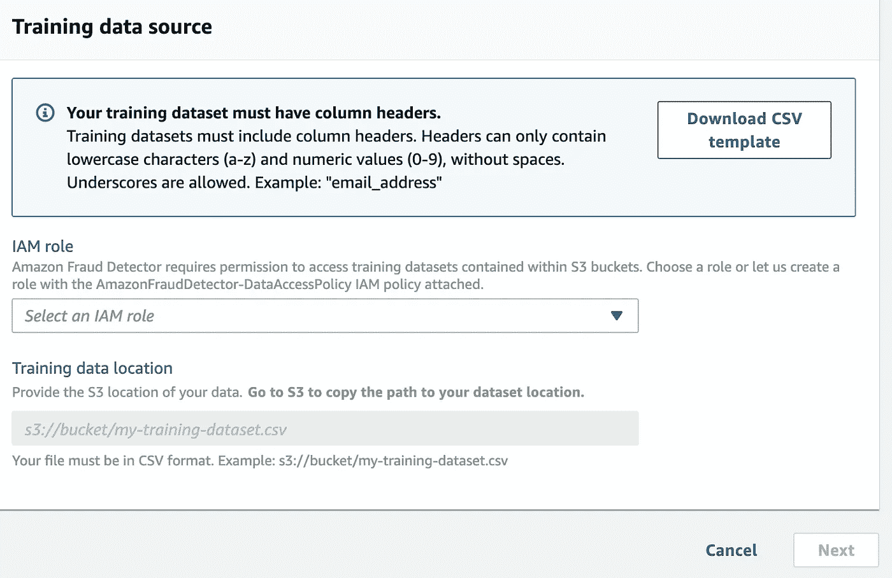
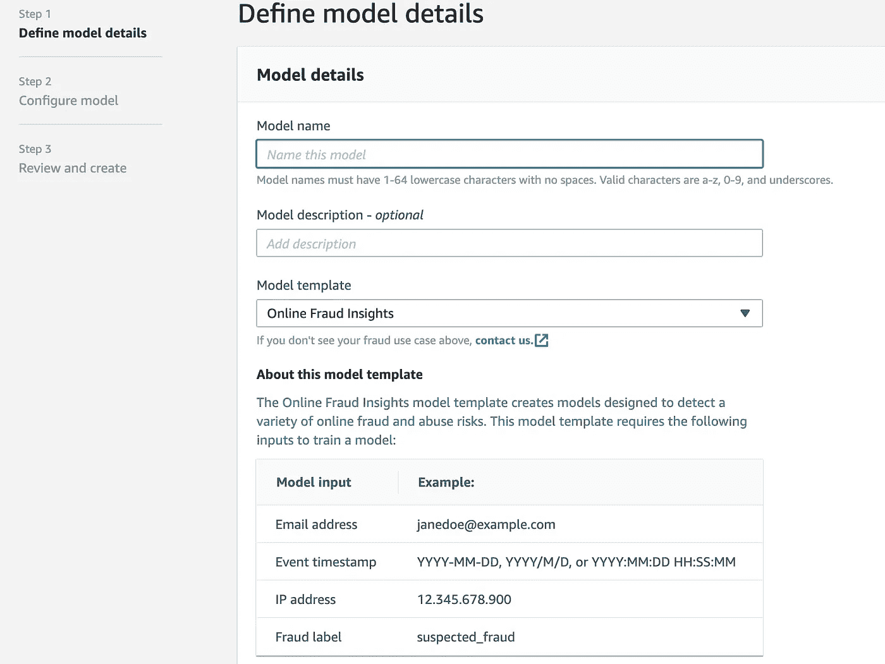
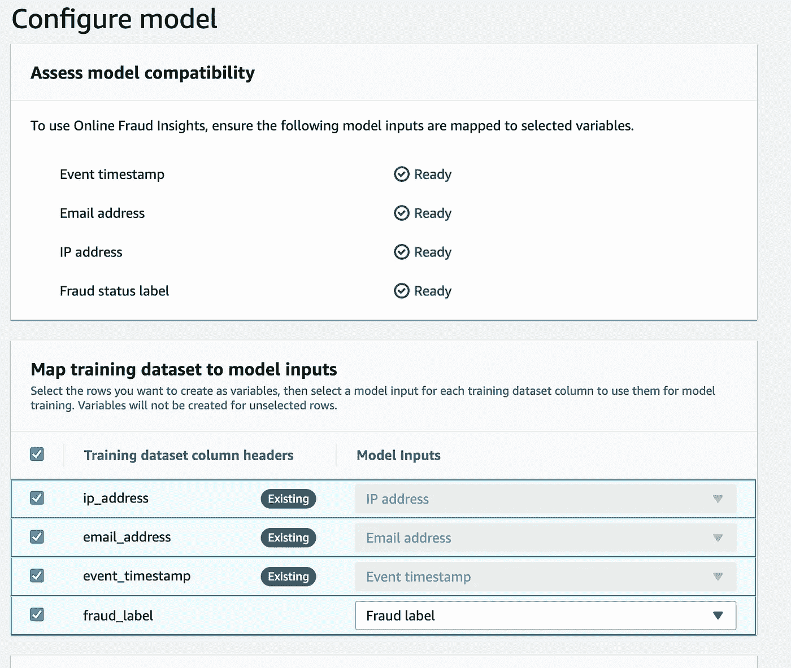
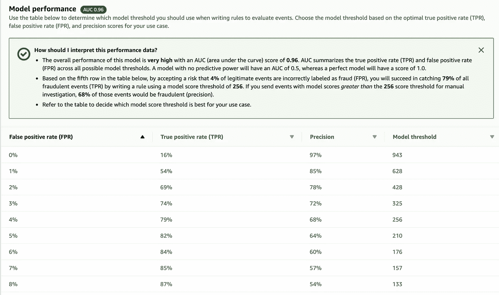
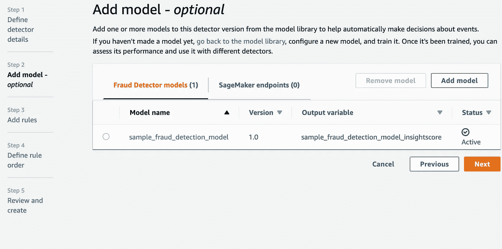
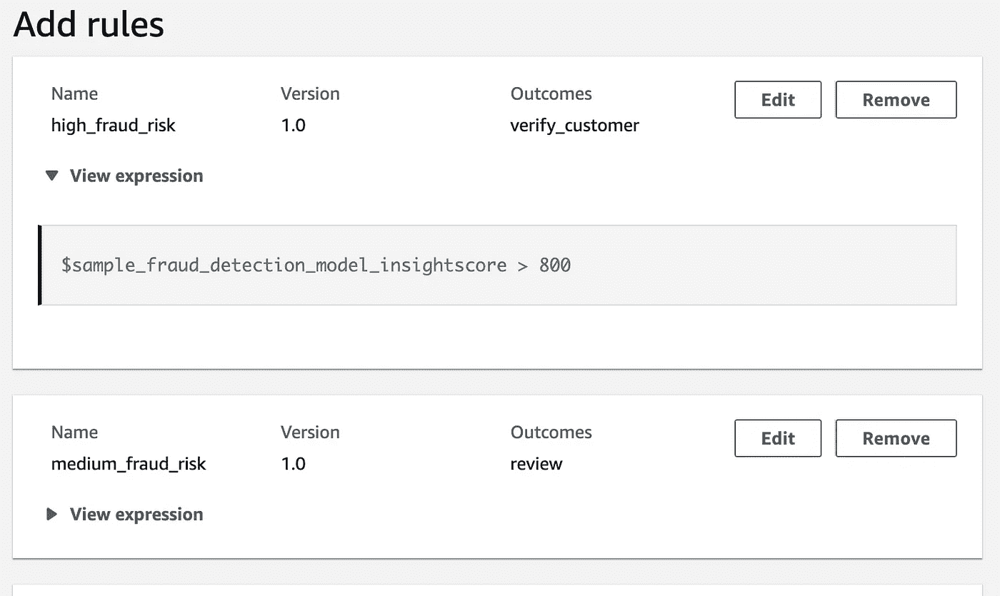
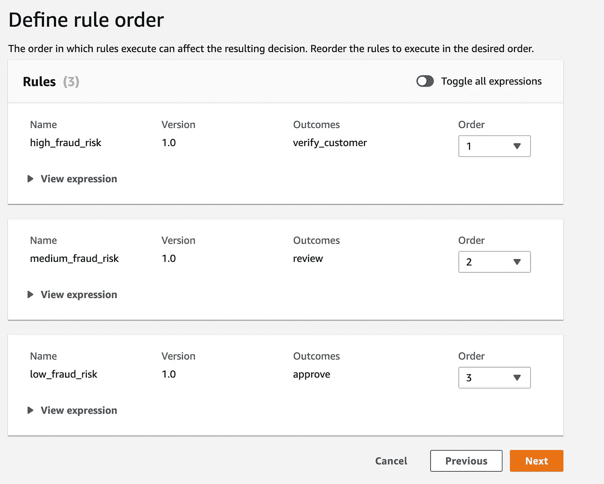
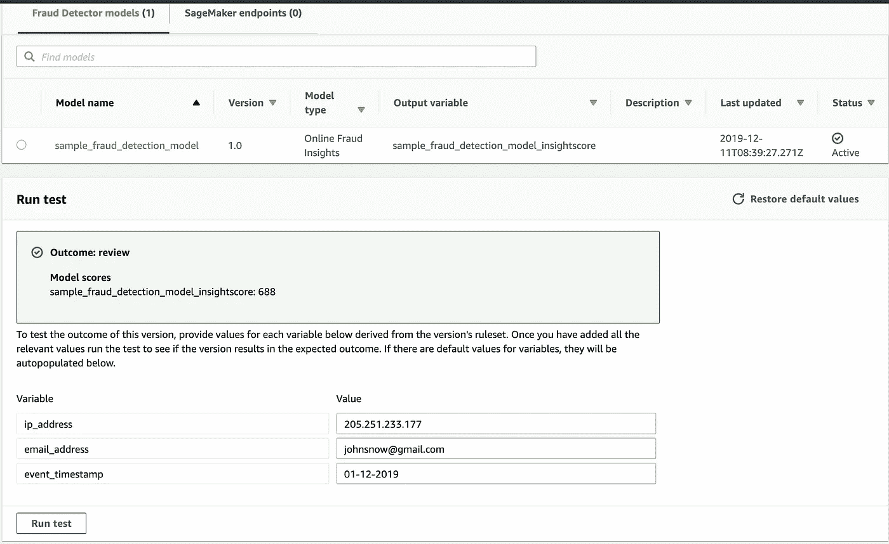

# 一瞥新披露的亚马逊欺诈探测器

> 原文：<https://towardsdatascience.com/a-glimpse-of-newly-revealed-amazon-fraud-detector-c8c989501a5d?source=collection_archive---------19----------------------->

几天前，在亚马逊网络服务(AWS) re:Invent 2019 上，亚马逊宣布了其检测交易异常的完全托管服务亚马逊欺诈检测器(Amazon Fraud Detector)。这项服务目前处于预览阶段，当我的预览应用程序被批准后，我迫不及待地尝试了一些欺诈检测样本。

> *亚马逊欺诈检测器最棒的一点是，你不需要任何人工智能专业知识来构建欺诈检测模型。只需获取一些历史数据，亚马逊欺诈检测器就会使用这些数据来自动训练、测试和部署定制的欺诈检测模型。*

要开始，我总是推荐官方文档，这是一个很好的起点。您可以通过本文末尾提供的参考链接来了解更多关于 Amazon Fraud Detector 的信息。

对于那些仍在急切等待预览的人来说，本文将简要介绍该服务，并介绍构建欺诈检测模型和运行欺诈预测测试的步骤。

我使用了一些从 https://mockaroo.com/[生成的假数据，这是一个很好的生成真实数据的工具。还可以使用开源的 faker . js(](https://mockaroo.com/)[https://github.com/marak/Faker.js/](https://github.com/marak/Faker.js/))库，在 Node.js 和浏览器中生成海量的虚假数据。

准备好数据集后，将 csv 文件上传到 S3 存储桶，控制台将为您提供创建或选择现有 IAM 角色来访问培训数据集的选项。

Defining data location

亚马逊欺诈检测器模型模板提供了三种模板选项，其中“在线欺诈洞察”模型目前可用。其他两个模型模板，即用于识别受损账户的账户接管和用于捕获欺诈交易的交易欺诈，正在未来发布的路线图中。

在线欺诈洞察模型模板需要下图所示的输入来创建模型。我们需要确保我们的数据集包括电子邮件、时间戳、IP 和欺诈标签字段。

下一步，我们需要配置我们的模型，以确保输入正确地映射到选定的变量。

第三步，也是最后一步，允许我们查看模型细节，最后单击以创建和训练我们的模型。该模型在部署之前需要一些时间来训练。在这种情况下，为具有 20，000 行的数据集定型大约需要 20 分钟。

一旦培训成功，我们就可以部署这一特定版本的模型来配合我们的检测机使用。在下图中，我们看到了模型性能和一个表格表示，以帮助我们确定在编写评估事件的规则时应该使用哪个模型阈值。

一旦我们成功部署了欺诈检测模型，我们将在本次动手演示的第二部分创建一个检测器。创建检测器有五个简单的步骤，首先是为我们的检测器定义一个名称。

在第二步，添加我们在本演示的第一部分中创建的模型。

在此之后，我们可以添加规则来解释我们的亚马逊欺诈检测器模型的分数。这里，我们将需要提供规则表达式和一个结果，该结果将是欺诈预测的结果，如果在评估期间规则匹配，则返回该结果。

我们可以在下图中看到一个样本规则表达式。

一旦我们创建了规则，我们就可以定义执行规则的顺序，这些规则将影响最终的欺诈预测结果。在这种情况下，我们将“高欺诈风险”规则移到了第一个位置。

在最后一步，我们可以查看规则，最后，继续创建检测器。

一旦我们的检测器被创建，我们可以使用一些样本事件数据来测试我们的检测器的逻辑。正如我们在下图中看到的，测试的结果是“审查”,模型得分为 688。因此，我们的模型现在已经准备好了，我们可以将其用于实时欺诈检测。

**结论**

凭借 AWS 和 Amazon.com 20 年的欺诈检测专业知识，在数毫秒内自动识别潜在的欺诈活动，亚马逊欺诈检测器抽象出了复杂的机器学习，以提供一个简单易用的界面，供每个人使用。目前，虽然此服务仅限于少数模型模板，并且仅在 AWS 美国东部(N. Virginia)地区提供，但我们可以预计，随着欺诈管理需求的不断增长，此服务将会增长。

参考

https://aws.amazon.com/fraud-detector/

[https://docs . AWS . Amazon . com/fraud detector/latest/ug/what-is-fraud detector . html](https://docs.aws.amazon.com/frauddetector/latest/ug/what-is-frauddetector.html)