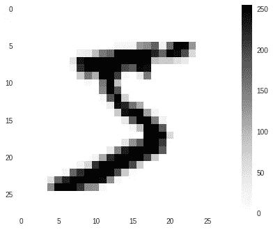

# 张量流一瞥

> 原文：<https://towardsdatascience.com/a-glimpse-of-tensorflow-bd9c6c06ab73?source=collection_archive---------18----------------------->

TensorFlow 是 Google 的一个流行的开源软件库。最初它是由谷歌大脑团队开发的，供谷歌内部使用。随着 AI 研究社区变得越来越协作，TensorFlow 在 Apache 2.0 开源许可下发布。

张量流的详细研究可能需要几个月的时间。但是对它的力量的一瞥提供了一个很好的动力去钻研它。考虑到这一点，这篇博客着眼于分类模型的实现。

分类是我们在人工智能工作中经常遇到的问题之一。通常，我们有一组输入，这些输入必须分类到不同的类别中。我们可以使用 TensorFlow 为这项任务训练一个模型。下面，我们将逐步介绍一个这样的实现的每个步骤。

# 导入模块

重要的事情先来！TensorFlow 是一个外部库，需要导入到脚本中，我们才能使用它。

除了 TensorFlow，我们通常还会导入一些其他的库，让我们的生活更加简单。Keras 是 TensorFlow 的一部分。它帮助我们非常容易地开发高阶模型。我们可以单独使用 TensorFlow 来创建模型。然而，Keras 简化了我们的工作。

NumPy 是任何机器学习任务中的默认导入。没有它我们无法生存。几乎所有的数据操作都需要 NumPy。

另一个重要的模块是 matplotlib。这是非常重要的，我们可视化的可用数据，以获得隐藏在其中的感觉。任何数量的算法分析都不能给我们仅仅通过图形形式查看数据所得到的东西。

TensorFlow 在版本上经历了一些变化。概念没有变，但是一些方法变了。检查我们使用的版本是一个很好的做法。如果我们有问题，我们可以查看特定版本的帮助。由于版本冲突，许多开发人员都面临这个问题，所以在论坛上搜索特定版本的问题要简单得多。

以下代码基于版本 1.12.0

# MNIST 数据集

为了分享基本思想的简要介绍，我们可以研究一个简单问题的实现。MINST(改进的国家标准和技术研究所)给出了从 0 到 9 的手写数字的良好数据集。我们可以利用这一点来训练神经网络，并建立一个可以读取和解码手写数字的模型。

这个问题通常被称为深度学习的“Hello World”。当然，我们需要更多来开发“真正的”应用程序。这很好的给你介绍了题目。当然，TensorFlow 还有更多的功能。如果你对详细的研究感兴趣，你可以参加在线课程。

# 加载数据

第一步是加载可用数据。TensorFlow 为我们提供了一套很好的测试数据集，可以用来学习和测试。MINST 数据集也在这些数据库中提供。因此，在这种情况下，获取训练和测试数据的工作非常简单。在现实生活问题中，积累、清理和加载这样的数据是工作的主要部分。这里我们只用一行代码就完成了。

这给了我们四个张量——train _ images、train_labels、test_images 和 test_labels。load_data()方法本身负责将可用数据分成训练集和测试集。在现实生活问题中，我们必须自己解决这个问题。但是，对于示例代码，我们可以使用 TensorFlow 数据集的可用方法。

# 检查数据

作为一种最佳实践，应该总是看一眼可用的数据。

我们知道我们正在解决一个图像分类问题。所以让我们试着看看这些图像是什么样子的。

在这个阶段，我们可以做很多事情。但是对于像这样已经清理过的数据来说，这没有什么意义。

# 数据净化

下一步是改变可用数据，使其更适合训练模型。

图像数据自然是二维的。这对于查看图形来说可能非常好。但是，为了训练神经网络，我们需要一维记录。这需要“扁平化”数据。Keras 为我们提供了简化模型中数据的简单方法。但是对于一般的预处理，最好是立即将其展平。TensorFlow 也提供了这一功能。

我们的标签是用数字 0-9 来表示的。但是，作为神经网络的输出，这些值没有数字序列。也就是 1 小于 9。但是当我们阅读图像时，这种关系一点也不重要。这些输出之间的数字关系只是偶然的。对于应用程序，它们只是 10 个不同的标签。它们是分类输出。

为此，我们需要将这些标签映射到 10 个不同的由 1 和 0 组成的独立数组中。我们需要将每个标签映射到一个由 10 个二进制数组成的数组中——0 代表所有的值，1 代表特定的值。例如，1 将被映射到[0，1，0，0，0，0，0，0，0，0]；8 会映射到[0，0，0，0，0，0，0，0，1，0]等等。这就是所谓的“分类”输出。

另一个非常重要的任务是将数据标准化。激活函数— relu 或 sigmoid 或 tanh..当这些数字小于 1 时，它们都可以最佳地工作。这在任何神经网络中都是重要的一步。错过这一步对模型效率有非常不好的影响。

这是训练神经网络中非常简单但重要的一步。同样，如果是一些原始数据，我们将需要更多的清理工作。但是这个已经被 Keras 消毒了。

# 数据扩充

我们拥有的资源总是少于我们所需要的。数据也不例外。为了取得越来越好的结果，我们需要比我们现有的更多的东西。我们可以从现有的资源中生成更多的数据——利用我们对数据的了解。例如，我们知道，如果整个图像向两边移动一个像素，数字不会改变。

因此，输入集合中的每个图像可以通过在每一侧移动一个像素来生成另外四个图像。这些图像在我们看来几乎没有变化。但是对于神经网络模型来说，它是一个新的输入集。这个简单的信息可以给我们 5 倍的数据。就这么办吧。

如果你不能理解上面的代码，不要担心。有关使用 NumPy 数组的详细信息，请参考 NumPy 博客。

本质上，这段代码只是删除了图像一侧的单元格，并在另一侧插入了 0。它从训练数据中每个图像的所有四个边进行计算，然后将其附加到名为 augmented_images 的新数组中。除此之外，它还构建了 augmented_lables 数组。

现在，我们可以使用 augmented_images 和 augmented_labels 代替 train_images 和 train_labels 来训练我们的模型。但是，等一下。如果我们仔细想想，数据就不再是随机的了。我们有一个巨大的数据块，图像在中心，后面是一个巨大的数据块，图像在每个方向上移动。这样的数据并不能创造出好的模型。我们需要通过很好地重组数据来改善这一点。

但这并不那么简单。现在，我们有一组图像和一组标签。我们必须洗牌。但是，通信不应该丢失。洗牌后，5 的图像应该指向标签 5！

NumPy 确实为我们提供了一种优雅的方式。

本质上，我们将两者结合成一个单一的实体，然后以图像和标签一起移动的方式对其进行洗牌。

# 训练模型

一切就绪后，我们现在可以开始训练模型了。我们从创建一个 Keras 序列模型开始。我们可以在下面的博客中查看不同类型模型的详细信息。让我们给这个模型添加三层。Keras 允许我们添加许多层。但是对于这样的问题，3 层就足够了。

784 的输入形状由输入数据中每个实体的大小定义。我们每个人有 784 张照片。这就是我们开始的地方。输出大小必须是 10，因为我们有 10 种可能的结果。典型的网络在最后一层具有 softmax 激活，在内部隐藏层具有 relu。

每层的大小只是基于判断的估计。我们可以通过实践、经验和对神经网络工作原理的理解来发展这种判断。您可以尝试使用这些工具，看看它们对模型效率的影响。

接下来，我们使用可用的数据来编译和训练模型。

编译器的参数——loss = " categorial _ cross entropy "和 optimizer = TF . train . adamoptimizer()可能看起来模糊不清。你可以查看一下[深度学习](http://www.solegaonkar.com/ai/index.php)上的博客，以便更好地理解它们。

方法 model.fit()使用我们拥有的数据完成训练模型的实际工作。

这会生成一个输出:

我们可以看到，随着每次迭代，损耗减少，精度提高。请注意，输出可能不总是精确匹配，这是因为随机播放和训练的随机性。但趋势应该差不多。

# 评估模型

现在我们有了一个训练好的模型，我们需要评估它有多好。第一个简单的步骤是使用 TensorFlow 自己的评估方法进行检查。

那很好。考虑到我们拥有的数据量，这是一个很好的精确度。但是，这个测试是不够的。非常高的精度也意味着过度拟合。所以一定要用测试数据来核对。

人们可以注意到，测试数据的准确性稍低。这意味着轻微的过度拟合。但这还不算太糟。所以我们暂时可以接受。在真实的例子中，根据需要，可以尝试调整模型形状和其他超参数以获得更好的结果。

## 抽样

这可能不会给我们所需要的所有信心。我们可以手动检查一些样本，看看我们的模型表现如何。

首先，为所有测试图像创建预测。现在，预测是一个包含测试集中所有图像输出的数组。

我们可以看到，这个集合中的每个元素都是一个 10 个元素的数组，它显示了输入图像属于给定标签的概率。当我们检查预测集中的第 0 个元素时，我们可以看到除了元素 7 之外，所有元素的概率都很低，几乎为 1。因此，对于图像 0，人们会预测 7。

现在让我们看看测试图像是什么样子的。在此之前，我们需要重塑图像数组(还记得我们为构建模型制作了一个一维数组吗？现在让我们检查第 0 个元素

这确实是 7！

只有一个正确答案肯定不足以验证模型的准确性。但是，此时我们可以检查的一点是预测[0]数组中的值。元素 7 中的值远远大于其他值。这意味着，模型对结果是绝对确定的。毫无疑问是因为两个类似的结果。这是一个好模型的重要特征。