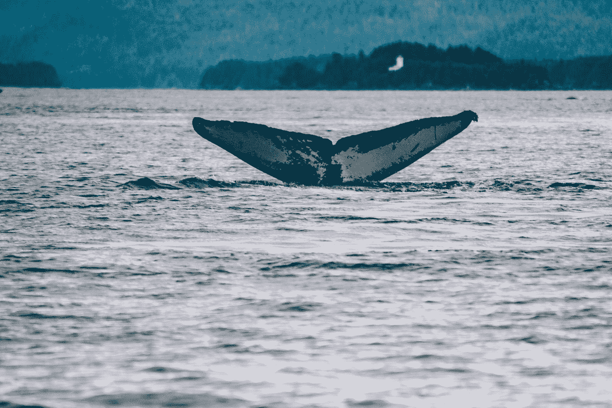
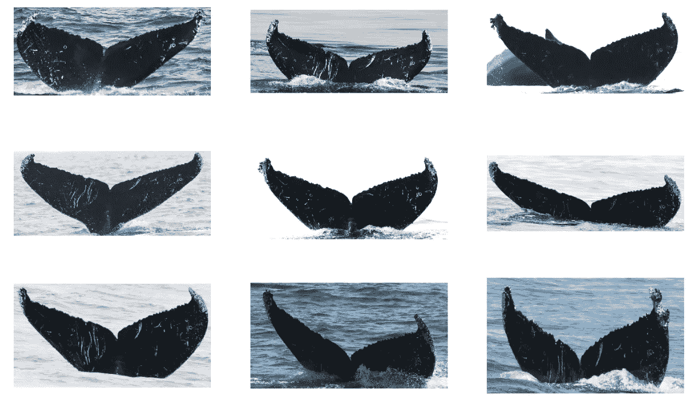
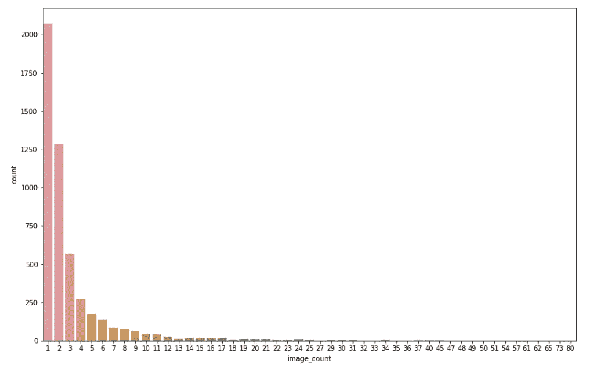
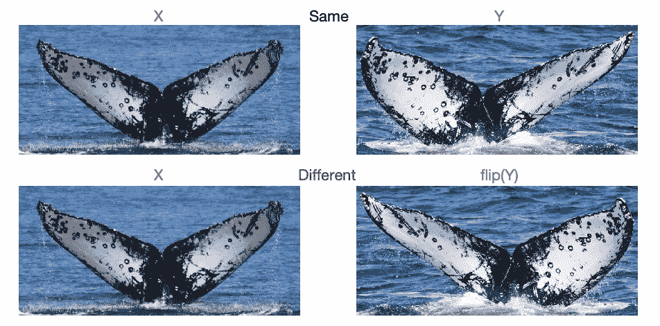
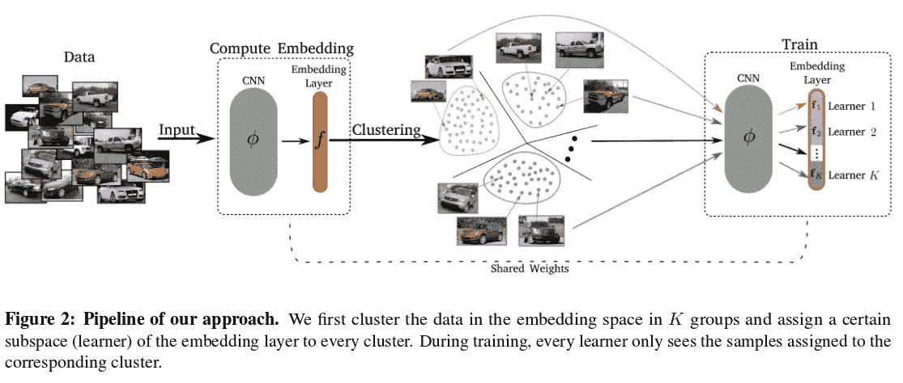
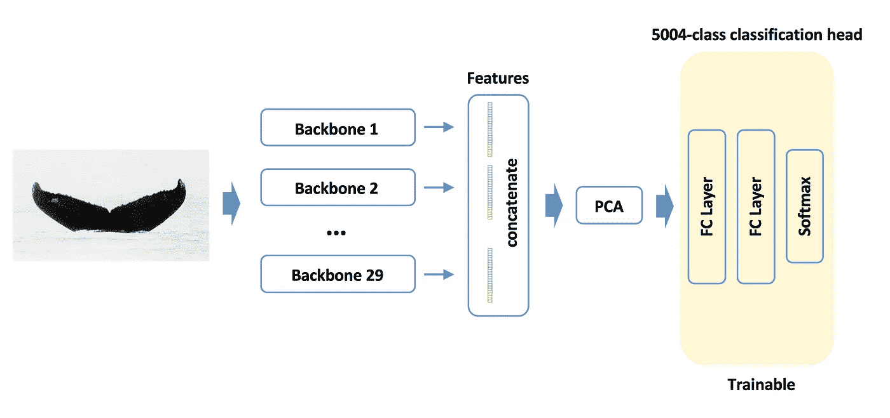
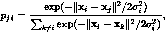
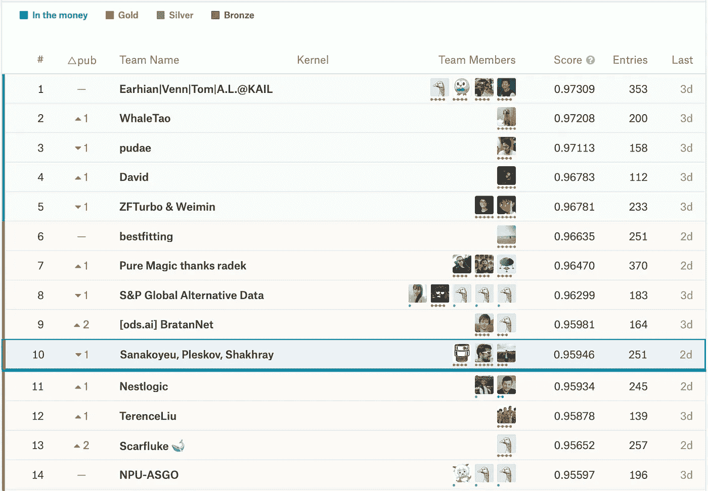

# Kaggle 座头鲸识别挑战的金牌解决方案综述

> 原文：<https://towardsdatascience.com/a-gold-winning-solution-review-of-kaggle-humpback-whale-identification-challenge-53b0e3ba1e84?source=collection_archive---------14----------------------->

## 对最引人注目的方法的广泛而简单的回顾

Photo by [Sandra Seitamaa](https://unsplash.com/@seitamaaphotography?utm_source=medium&utm_medium=referral) on [Unsplash](https://unsplash.com?utm_source=medium&utm_medium=referral)

最近，我的团队参加了在 Kaggle 举办的[座头鲸识别挑战赛](https://www.kaggle.com/c/humpback-whale-identification/leaderboard)。我们赢得了一枚金牌，并在排行榜上(在 2131 支队伍中)名列第十。

在这篇博文中，我将总结我们解决方案的主要思想，并简要概述其他团队使用的有趣且吸引人的方法。

# 问题描述

主要目标是确定，给定的这张鲸侥幸的照片是属于 5004 种已知鲸鱼个体中的一种，还是一种以前从未观察到的*新鲸鱼*。

Example of 9 photos of the same whale from the training data

这场竞赛令人困惑的一面是巨大的阶级不平衡。对于 2000 多个班级，只有一个训练样本**，这使得很难使用开箱即用的分类方法。更重要的是，对鲸鱼是否是新品种进行分类是比赛的重要组成部分，这被证明是相当重要的。**

Class Imbalance, from kernel by
[Tomasz Bartczak](https://www.kaggle.com/kretes)

比赛的衡量标准是 [mAP@5](https://medium.com/@jonathan_hui/map-mean-average-precision-for-object-detection-45c121a31173) (平均精度为 5)，这允许我们为每张测试图像提交多达 5 个预测。我们在私有测试集上的最高成绩是 **0.959** mAP@5。

# 萨纳科耶乌，普莱斯科夫，沙克雷💪

该团队由海德堡大学博士生[弗拉迪斯拉夫·沙克雷](https://www.linkedin.com/in/vladislav-shakhray-74b98315b/)(我)[阿奇奥姆·萨纳科耶乌](https://asanakoy.github.io)和 Kaggle Top-5 特级大师[帕维尔·普莱斯科夫](https://www.linkedin.com/in/ppleskov/)组成。

为了加快实验速度，我们在比赛中途加入了 Artsiom，Pavel 在团队合并截止日期前一周加入了我们。

# 验证和初始设置

在这场比赛的几个月前，同一场比赛的[游乐场版本](https://www.kaggle.com/c/whale-categorization-playground)在 Kaggle 上举办，但是，正如比赛主办方[提到的](https://www.kaggle.com/c/humpback-whale-identification/discussion/73208)，真实(非游乐场)版本的特点是更多的数据和更干净的标签。我们决定以多种方式利用之前比赛的知识和数据:

1.  利用之前比赛的数据，我们使用[图像哈希](https://jenssegers.com/61/perceptual-image-hashes)收集了【2000 多个验证样本。后来，当我们验证我们的套装时，这被证明是至关重要的。
2.  我们从训练数据集中删除了 *new_whale* 类，因为它的元素之间不共享任何逻辑图像特性。
3.  有些图像根本没有对齐。幸运的是，有一个公开可用的预先训练的**边界框**模型，用于操场竞赛的获胜解决方案。我们用它来检测鲸鱼爪周围的精确边界框，并相应地裁剪图像。
4.  由于图像的颜色不同，所有数据在训练前都被转换为**灰度**。

# 方法 1:连体网络(Vladislav)

我们的第一个架构是一个暹罗网络，有许多分支架构和客户损耗，由许多卷积层和密集层组成。我们使用的分支架构包括:

*   ResNet-18，ResNet-34，Resnet-50
*   SE-ResNeXt-50
*   马丁·皮奥特公开分享的类 ResNet[自定义分支](https://www.kaggle.com/martinpiotte/whale-recognition-model-with-score-0-78563)

我们使用**硬负**以及**硬正**挖掘，通过每 4 个时期对分数矩阵求解线性分配问题。为了简化训练过程，在矩阵中加入了少量的随机化。

**采用渐进式学习**，分辨率策略 229 x229->384 x384->512 x512。也就是说，我们首先在 229x229 图像上训练我们的网络，几乎没有正则化，学习率更大。收敛后，我们重置学习率并增加正则化，从而在更高分辨率(例如 384x484)的图像上再次训练网络。

此外，由于数据的性质，使用了大量的增强，包括随机亮度、高斯噪声、随机裁剪和随机模糊。

此外，我们追求智能翻转增强策略，这大大有助于创建更多的训练数据。具体来说，对于属于**同一**鲸鱼`X, Y`的每对训练图像，我们多创建了一对训练图像`flip(X), flip(Y)`。另一方面，对于每一对**不同的**鲸鱼，我们又创造了三个例子`flip(X), Y`、`Y, flip(X)`和`flip(X), flip(Y)`。

An example showing that random flips strategy does not work with a pair of same-whale photos. Notice how the lower photos become different when we flip one of the images since we care about fluke orientation.

使用 Adam optimizer 对模型进行优化，初始学习率为 1e-4，在平稳状态下减少了 5 倍。批量大小被设置为 64。

模型的来源写在 [Keras](https://keras.io) 上。在单个 2080Ti 上训练约 400-600 个历元的模型需要 2-3 天(取决于图像分辨率)。

拥有 ResNet-50 的表现最好的单一模型得分 **0.929 磅。**

# 方法 2:度量学习(Artsiom)

我们使用的另一种方法是利用[利润损失](https://arxiv.org/abs/1706.07567)的度量学习。我们使用了许多 ImageNet 预训练的主干架构，包括:

*   ResNet-50，ResNet-101，ResNet-152
*   DenseNet-121、DenseNet-169

网络主要使用 448×448-> 672×672 策略逐步训练。

我们使用 Adam 优化器，在 100 个时期后将学习率降低 10 倍。我们还在整个培训中使用了 96 的批量大小。

最有趣的部分是什么让我们立即获得了 2%的提升。这是一种度量学习方法，由 Sanakoyeu，Tschernezki 等人开发，并在 2019 年 CVPR 上发表。它所做的是每隔`n`个时期就将训练数据和嵌入层分成`k`个簇。在建立了训练组块和学习者之间的双射之后，该模型在累积分支网络的梯度的同时单独训练它们。你可以在这篇论文发表的时候在[这里](https://github.com/CompVis/metric-learning-divide-and-conquer)查看它和代码。

> “分而治之，嵌入度量学习空间”，Artsiom Sanakoyeu，Vadim Tschernezki，Uta Büchler，bjrn Ommer，CVPR，2019 年

由于巨大的阶级不平衡，大量的**增强**被使用，其中包括随机翻转，旋转，缩放，模糊，照明，对比度，饱和度变化。在推断期间，计算查询特征向量和训练图库特征向量之间的点积，并且选择具有最高点积值的类作为前 1 个预测。另一个有助于解决类别不平衡的技巧是对属于相同鲸鱼 id 的训练图像的特征向量进行平均。

这些模型是使用 [PyTorch](https://pytorch.org) 实现的，在一台 Titan Xp 上训练需要 2-4 天(取决于图像分辨率)。值得一提的是，采用 DenseNet-169 主干的性能最佳的单一型号的得分为 **0.931 磅。**

# 方法 3:特征分类(Artsiom)

当我和 Artsiom 联手时，我们做的第一件事就是使用从我们所有模型中提取的特征训练分类模型，并连接在一起(当然是在应用 PCA 之后)。

分类头由两个致密层组成，中间有脱落物。该模型训练非常快，因为我们使用预先计算的特征。

这种方法让我们获得了 0.924 磅，并带来了更多的整体多样性。

# 方法 4:新的鲸鱼分类(Pavel)

这场比赛最复杂的部分之一是正确地对新鲸鱼进行分类(因为大约 30%的图像属于*新鲸鱼*类)。

处理这个问题的流行策略是使用一个简单的阈值。也就是说，如果给定图像 X 属于某个已知的鲸类的最大概率小于阈值，则它被分类为*新鲸类*。然而，我们认为可能有更好的办法来解决这个问题。

对于每个表现最好的模型和集合，我们取其前 4 个预测，按降序排列。然后，对于*每隔一个*模型，我们取它们在所选的 4 个类别中的概率。目的是根据这些特征来预测鲸鱼是否是新的。

Pavel 创建了一个非常强大的对数回归、SVM、几个 k-NN 模型和 LightGBM 的混合体。在交叉验证中，所有数据的组合为我们提供了 0.9655 的 ROC-AUC，并增加了 2%的 LB 分数。

# 组装

从我们的模型中构建整体绝对不是一件容易的事。事实是，我的模型的输出是一个非标准化概率矩阵(从 0 到 1)，而 Artsiom 提供的输出矩阵由欧几里德距离组成(因此范围从 0 到无穷大)。

我们尝试了多种方法将 Artsiom 的矩阵转换为概率，其中包括:

*   类 t-SNE 变换:

*   Softmax
*   通过应用功能`1 / (1 + distances)`简单地反转范围
*   许多其他函数来反转矩阵的范围

不幸的是，前两种方法根本不起作用，虽然大多数情况下使用任意函数将范围裁剪为[0，1]，但结果大致相同。我们最终选择了这个函数，在验证集上选择了一个具有最高 mAP@5 的函数。

令人惊讶的是，最好的一个是`1 / (1 + log(1 + log(1 + distances)))`。

# 其他团队使用的方法

## 基于 SIFT 的

我想概述一个解决方案，在我看来，它是最漂亮的解决方案之一，同时也是不寻常的。

现在是 Kaggle 特级大师(排名 12)的 David 在私人 LB 排名第四，并在 Kaggle 讨论论坛上以[帖子](https://www.kaggle.com/c/humpback-whale-identification/discussion/82356)的形式分享了他的解决方案。

他处理全分辨率图像，使用传统的**关键点匹配**技术，利用 SIFT 和 ROOTSIFT。为了处理假阳性，大卫训练了一个 U-Net 从背景中分割出鲸鱼。有趣的是，他使用 smart **后处理**给只有一个训练示例的类更多的机会进入前 1 预测。

我们也想过尝试基于 SIFT 的方法，但我们确信它的性能肯定比顶级的神经网络差。

在我看来，我们永远不应该被深度学习的力量所蒙蔽，低估传统方法的能力。

## 纯分类

由 [Dmytro Mishkin](https://medium.com/@ducha.aiki) 、 [Anastasiia Mishchuk](https://medium.com/@anastasiya.mishchuk) 和 [Igor Krashenyi](https://www.linkedin.com/in/igor-krashenyi-38b89b98/) 组成的团队 *Pure Magic thanks radek* (第 7 名)采用了一种结合了度量学习(三重缺失)和分类的方法，正如 Dmytro 在他的[帖子](https://medium.com/@ducha.aiki/thanks-radek-7th-place-solution-to-hwi-2019-competition-738624e4c885)中所描述的那样。

在长时间训练分类模型时，他们尝试使用[中心损失](https://ydwen.github.io/papers/WenECCV16.pdf)来减少过拟合，并在应用 softmax 之前使用[温度缩放](https://arxiv.org/pdf/1706.04599.pdf)。在使用的众多主干架构中，最好的是 SE-ResNeXt-50，它能够达到 **0.955 LB。**

他们的解决方案远不止这些，我强烈建议你参考最初的[帖子](https://medium.com/@ducha.aiki/thanks-radek-7th-place-solution-to-hwi-2019-competition-738624e4c885)。

## 圆脸，圆脸

正如 [Ivan Sosin](https://www.kaggle.com/sawseen) 在[帖子](https://www.kaggle.com/c/humpback-whale-identification/discussion/82427)中提到的(他的团队 *BratanNet* 在这次比赛中获得第 9 名)，他们使用了 [CosFace](https://arxiv.org/abs/1801.09414) 和 [ArcFace](https://arxiv.org/abs/1801.07698) 方法。来自原帖:

> 其中，Cosface 和 Arcface 作为新发现的人脸识别任务的 SOTA 脱颖而出。主要思想是在余弦相似性空间中使相同类的例子彼此靠近，并拉开不同的类。用 cosface 或 arcface 训练一般是分类，所以最后损失的是交叉熵。

当使用像 InceptionV3 或 SE-ResNeXt-50 这样的较大主干时，他们注意到过度拟合，因此他们转向像 ResNet-34、BN-Inception 和 DenseNet-121 这样的较轻网络。

该团队还使用了精心挑选的增强功能和众多网络修改技术，如 [CoordConv](https://arxiv.org/abs/1807.03247) 和 [GapNet](https://openreview.net/forum?id=ryl5khRcKm) 。

他们的方法中特别有趣的是他们处理*new _ whale*s . From the original post 的方式:

> 从一开始，我们就意识到有必要对新的鲸鱼做些什么，以便将它们纳入训练过程。简单的解决方法是给每条新鲸鱼分配一个概率，每类概率等于 1/5004。在加权抽样技术的帮助下，它给了我们一些帮助。但后来我们意识到，我们可以使用 softmax 预测来自训练集合的新鲸鱼。所以我们想出了**蒸馏**。我们选择蒸馏而不是伪标签，因为新鲸被认为具有与火车标签不同的标签。尽管这可能不是真的。
> 
> 为了进一步提高模型能力，我们将带有伪标签的测试图像添加到训练数据集中。最终，我们的单个模型可以通过快照组装达到 **0.958** 。不幸的是，以这种方式训练的 ensembling 并没有带来任何分数的提高。也许是因为伪标签和蒸馏导致的品种减少。

# 最后的想法

Final Standings

令人惊讶的是，尽管私有测试集贡献了所有测试数据集的近 80%,但最终几乎没有任何改变。我相信竞赛主持人很好地提供了一个非常有趣的问题，以及干净和经过处理的数据。

这是我参加的第一次 Kaggle 比赛，它确实证明了 Kaggle 比赛是多么有趣、吸引人、激励和教育人。我想祝贺那些由于这次比赛而成为专家、大师和特级大师的人们。我还要感谢 [ODS.ai](http://ods.ai) 社区令人惊叹的讨论和支持。

最后，我想再次特别感谢我的团队成员 [Artsiom Sanakoyeu](https://asanakoy.github.io) 和 [Pavel Pleskov](https://www.linkedin.com/in/ppleskov/) 给了我一次难忘的 Kaggle 比赛经历。