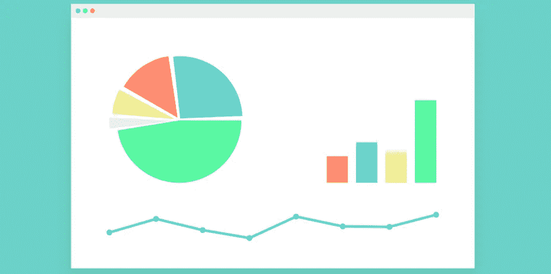

# 一个研究生对统计学的看法

> 原文：<https://towardsdatascience.com/a-graduate-students-perspective-on-statistics-5cb6ca643689?source=collection_archive---------21----------------------->

## 为什么统计学是一个普遍令人困惑的领域？

当我遇见一个新的人，不可避免的问题被问到，“那么，你是做什么的？”，我回答说我是一名统计学的博士生，对此的回答大多是这样的:

***“统计？！我在大学时有一门必修的统计学课，它非常令人困惑。”***

仅仅是这种事件的发生频率就让我开始思考为什么统计数据如此普遍地令人困惑。对我来说，答案很复杂，根源在于将确定性事件(如我们所见)转化为随机过程(如统计学所见)的实现。我试图在下面解开这些复杂性。

**从点跳到云**

在微积分之前，数学教育的标准轨迹通常会终止，我们生活在一个由点、线、曲线等组成的世界里。—数量通过确定性关系交织在一起的形状。我知道速度=距离/时间，所以如果我们需要在 45 分钟内到达 60 公里外的某个地方，那么我知道我必须以 80 公里/小时的速度行驶，这些函数关系是确定性的。

但是一上统计学课，我们就步入了一个随机的世界。我们不再在一组已知的关系中工作，而是在推断产生我们所看到的观察的未知机制。

例如，我们等一辆公共汽车，考虑到它过去的可靠性，我们试图预测它今天是否会准时到达。随机性有很多来源——交通灯的同步、路上其他司机的礼貌、天气状况——这些因素导致不同的到达时间。

因此，统计学隐含地处理*概率* *云*、而不是点数。紧密概率云(“公共汽车每 10 1 分钟来一次”)表示我们非常确定公共汽车几乎总是接近其预定时间。分散的云(“公共汽车每 10 分钟来一趟”)表示到达时间的广泛可变性。如果我们只是没有观察到足够的信息来确定其长期模式(也许我们只等了两次公交车)，或者我们的观察非常分散(有时会早 10 分钟，但有时会晚 20 分钟)，这种情况就可能发生。

实际上，从来没有人明确告诉我，我正在离开一个由线条组成的世界，走向一个由云组成的世界，但我相信这是进入统计世界的一个基本困难。一个主要的结果是我们不再处理等效值(例如，y = x+3)，而是处理范围和概率(例如，玫瑰是红色的，紫罗兰是蓝色的……但是我有玫瑰还是紫罗兰呢？

通常，统计问题集会提出一个问题，问题的开头是:

“假设 X 是分布的…”

在这些情况下，随机变量 X 的理论行为被告知我们，我们得出关于我们可能观察到的其实现的结论，这些实现用小写字母 X 表示。给定关于 X 的不同假设集，我们可以得出关于其行为的不同属性，如下所示:

考虑到这一点，你可能会认为统计学中的一个重要工具是一个“排序帽”，给定一组经验数据，测试它们是否最接近正态、泊松等。这样，我们就知道从我们的数据中可以得到哪组属性。

然而这样的工具相当稀少！有一个 [Kolmogorov-Smirnov 测试](https://en.wikipedia.org/wiki/Kolmogorov%E2%80%93Smirnov_test)，它测试两个分布的相似性，但只是在我的一堂本科统计学课上顺便提到过。 [QQ 图](https://en.wikipedia.org/wiki/Q%E2%80%93Q_plot)作为两个重叠直方图的改进形式，直观地比较经验分布的分位数与其假定的理论分布是否匹配。直到研究生院，我才知道像[核密度估计](https://en.wikipedia.org/wiki/Kernel_density_estimation)这样的方法可以用来估计非标准密度函数。

致力于将观察到的数据集与其潜在属性联系起来的统计推断领域，倾向于假设数据的分布，并简单地提供估计其参数的方法。精确的发行版本身对结果属性的影响是否像缺少工具所暗示的那样小？

自我反驳的一个尝试在于中心极限定理。我们经常对手段的行为感兴趣(*平均*，公交车会准时来吗？)，中心极限定理说独立随机变量之和趋于正态分布。由于均值包含一个和，那么所有关于正态分布的导数都可以应用于独立随机变量实现的均值。

另一个回答是，人们越来越重视半参数和非参数方法，这种方法很少(或没有)作出分布假设。然而，正如应该合理预期的，这些方法的灵活性和适用性的增加可能是以降低功率为代价的。

**那么数据科学家呢？**

当我们意识到数据科学家必须做出确定性决策时，担心我们的随机性模型的准确性可能显得没有意义。正因为如此，简单地比较两个数字的大小，或者并排绘制直方图，可能就足以确定获胜的决策。统计学在一个不确定的世界中运作，但数据科学家在一个必须以二元方式做出决策的世界中运作。是或不是。

实际上，随机性——通常以 p 值的形式——只是告诉我们如何*确定*我们的决定，但永远不会改变我们决定的方向。考虑到这一点，不确定性程度的精确量化真的重要吗？如果我们选择将我们的数据建模为一种分布而不是另一种分布，那实际上会改变什么吗？

**我对统计的保留意见**

你经常听到人们把追求博士描述为“越来越了解越来越少”。但这不是我迄今为止对我的博士工作的评价——我当然会继续学习统计学的基础知识(比如[斯坦的悖论](http://statweb.stanford.edu/~ckirby/brad/other/Article1977.pdf)！).

鉴于上述讨论，我更关心的是:

(1)如何将我们对理论统计的理解贯彻到现实世界中。这样做似乎需要一种能力来验证假设的程度，这是一个似乎还不发达的统计学领域。

(2)在一个确定性的世界里，如此谨慎地对待随机性的有用性。如果使用统计学来对公共政策、药物、网站设计等做出具体的选择。，随机性在哪些方面发挥了重要作用？

我的想法一直在发展，我衷心欢迎下面的评论、不同意见或反馈。

**致谢**

非常感谢高子冲、菲利普·莫里茨、阿维·费勒、特里萨·格伯特和佐伊·弗农与我一起阅读和提炼这些观点。

Much thanks to Zi Chong Kao, Philipp Moritz, Avi Feller, Theresa Gebert, and Zoe Vernon for reading and refining these ideas with me.